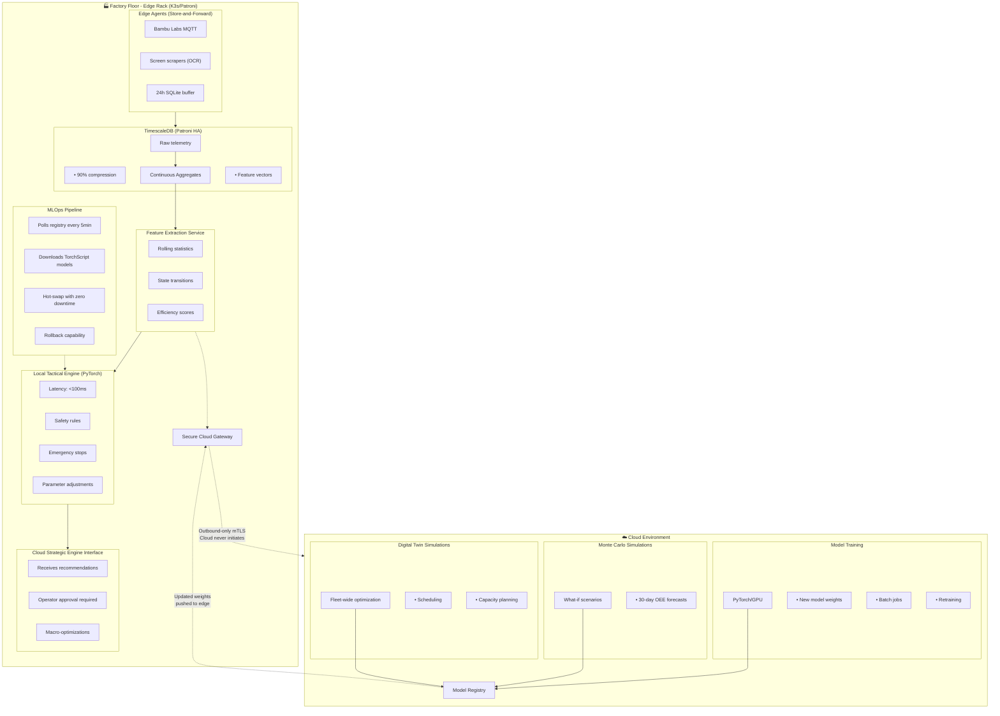

# OmniusGrid Gold Standard Architecture
## Edge Inference + Cloud Training/Simulation

## Architecture Overview

OmniusGrid implements the industry gold standard for Industrial IoT AI: **Edge Inference for real-time control** combined with **Cloud Training/Simulation for strategic optimization**.



## Key Architectural Decisions

### 1. Egress Data Thinning
**Challenge:** Streaming 1000+ raw telemetry points/sec would saturate internet connection and incur massive cloud ingress costs.

**Solution:** 
- TimescaleDB Continuous Aggregates compute rolling statistics locally
- Only **Feature Vectors** (cleaned, structured inputs) sent to cloud
- **Discrete Events** (state changes, alarms) sent immediately
- 90% bandwidth reduction vs raw telemetry streaming

### 2. Secure Cloud Gateway (Outbound-Only)
**Challenge:** Cloud connecting directly to factory creates security vulnerability.

**Solution:**
- Local rack initiates **outbound-only mTLS connection**
- Cloud subscribes to outbound stream, never connects inbound
- MQTT Bridge with mutual certificate authentication
- Zero open inbound ports on factory firewall

### 3. Two-Speed Brain Architecture

| Aspect | Local Tactical Engine | Cloud Strategic Engine |
|--------|----------------------|----------------------|
| **Latency** | < 100ms | Seconds to minutes |
| **Decisions** | Immediate adjustments | Macro-optimizations |
| **Examples** | Reduce feed rate, emergency stop | Scheduling, infill pattern changes |
| **Control** | Automatic execution | Requires approval |
| **Model** | PyTorch TorchScript | Full PyTorch/GPU |
| **Safety** | Hard thresholds override ML | Simulation-based recommendations |

### 4. MLOps Return Trip
**Challenge:** How to get new model knowledge from cloud to factory floor?

**Solution:**
- Cloud trains → converts to **TorchScript/ONNX** → pushes to registry
- Edge polls registry every 5 minutes
- Downloads → validates → hot-swaps with **zero downtime**
- Rollback to previous version if issues detected

## API Endpoints

### Tactical Engine (Local Inference)
```
GET  /api/v1/engines/tactical/status
POST /api/v1/engines/tactical/infer
```

### Strategic Engine (Cloud Recommendations)
```
GET  /api/v1/engines/strategic/recommendations
POST /api/v1/engines/strategic/recommendations/{id}/approve
POST /api/v1/engines/strategic/recommendations/{id}/reject
```

### MLOps Pipeline
```
GET  /api/v1/engines/mlops/status
POST /api/v1/engines/mlops/deploy/{version}
POST /api/v1/engines/mlops/rollback
```

### Cloud Gateway
```
GET  /api/v1/engines/cloud/status
POST /api/v1/engines/cloud/flush
```

## Files Created

```
backend/app/services/
├── feature_extraction.py      # Egress data thinning
├── cloud_gateway.py           # mTLS outbound bridge
├── tactical_engine.py         # Local <100ms inference
├── strategic_engine.py        # Cloud recommendation interface
└── mlops_pipeline.py          # Model sync & hot-swap

backend/app/api/
└── engines.py                 # REST API routes

database/migrations/
└── 002_continuous_aggregates.sql  # Feature vector materialized views

infra/k8s/
├── timescaledb-patroni.yml   # 3-node HA database
├── backend-deployment.yml    # API with health probes
└── ingestion-deployment.yml  # Auto-scaling workers
```

## Configuration

Environment variables in `backend/app/core/config.py`:

```python
# Cloud Gateway
CLOUD_MQTT_HOST: str = "cloud.opsgrid.io"
CLOUD_MQTT_PORT: int = 8883
CLOUD_TOPIC_PREFIX: str = "opsgrid/factories/dev"

# mTLS
MTLS_CLIENT_CERT_PATH: str = "/certs/edge-client.crt"
MTLS_CLIENT_KEY_PATH: str = "/certs/edge-client.key"
MTLS_CA_CERT_PATH: str = "/certs/cloud-ca.crt"

# MLOps
MODEL_REGISTRY_URL: str = "https://models.opsgrid.io"
MODEL_POLL_INTERVAL: int = 300  # 5 minutes
TACTICAL_MODEL_PATH: str = "/models/tactical_v1.pt"
LOCAL_MODEL_DIR: str = "/models"
```

## Data Flow

1. **Edge agents** collect from printers (MQTT/OCR) → SQLite buffer
2. **Ingestion workers** consume from Redpanda → TimescaleDB
3. **Feature extraction** queries DB → builds feature vectors
4. **Egress scheduler** queues vectors → **Cloud gateway** → Cloud
5. **Tactical engine** runs inference on feature vectors locally
6. **Decisions** executed immediately if confidence > threshold
7. **MLOps pipeline** polls registry → downloads new models → hot-swap

## Security Model

- **Purdue Model:** Manufacturing zone isolated from cloud
- **mTLS:** Mutual certificate authentication for cloud connection
- **Outbound-only:** Factory never accepts inbound connections
- **Maintenance Mode:** Blocks automated commands for manual operations
- **Safety Rules:** Hard thresholds override ML decisions

## Next Steps

1. **Deploy:**
   ```bash
   docker-compose up -d
   # or
   kubectl apply -f infra/k8s/
   ```

2. **Configure mTLS:**
   Place certificates in `/certs/`:
   - `edge-client.crt` / `edge-client.key`
   - `cloud-ca.crt`

3. **Initialize models:**
   ```bash
   # Place initial TorchScript model
   mkdir -p /models
   cp tactical_v1.pt /models/
   ```

4. **Verify endpoints:**
   - Tactical status: `GET /api/v1/engines/tactical/status`
   - Cloud connection: `GET /api/v1/engines/cloud/status`
   - MLOps status: `GET /api/v1/engines/mlops/status`

This architecture achieves sub-second real-time control while maintaining cloud-scale training capabilities, with complete security isolation between factory floor and cloud environment.
