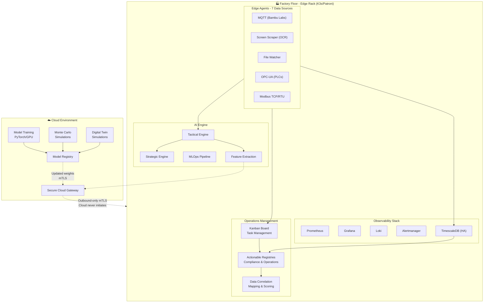

# OmniusGrid

<p align="center">
  <strong>Universal Manufacturing Data Feed Dashboard</strong><br>
  Production-grade IIoT platform with edge AI inference, cloud training, and comprehensive observability
</p>

<p align="center">
  
  
  
  
  
</p>

---

## Overview

OmniusGrid is a resilient manufacturing operations platform designed for Industry 4.0. It unifies data collection from diverse industrial equipment, provides real-time edge AI inference, and maintains secure cloud connectivity for model training and fleet-wide optimization.

### Key Capabilities

| Domain | Features |
|--------|----------|
| **Data Collection** | 7 industrial protocols (MQTT, OPC-UA, Modbus, Screen Scraping/OCR, File Watching) |
| **Real-time Pipeline** | WebSocket broadcasting, subscription management, live telemetry/state/alarms |
| **Command Executor** | Queued commands with retries, timeouts, cancellation, emergency stop |
| **OEE Automation** | Automated OEE calculation from PackML states and telemetry part counting |
| **Edge AI** | <100ms inference loops, TorchScript models, automated model lifecycle |
| **Observability** | Prometheus metrics, Loki logs, Grafana dashboards, TimescaleDB |
| **Security** | mTLS device authentication, certificate generation, zero-trust networking, audit trails |
| **DevOps** | GitHub Actions CI/CD, Kubernetes manifests (staging/production), auto-scaling |
| **Operations** | K3s-orchestrated, Patroni HA, automatic disaster recovery |
| **Logistics** | YMS/TMS with GeoTab telematics, detention billing, HOS compliance, dock-production sync |
| **Task Management** | Kanban board with task grouping, assignment, approval workflows |
| **Compliance** | Actionable registries (OSHA, ISO, internal), data correlation mapping, scoring |

---

## Architecture



---

## Quick Start

### Prerequisites

- Docker 24.0+ and Docker Compose
- 8GB RAM minimum (16GB recommended)
- 50GB available disk space

### Installation

```bash
# Clone repository
git clone https://github.com/SoundSafe-ai/Omnius-Grid.git
cd OmniusGrid

# Start all services
docker-compose up -d

# Verify service health
docker-compose ps

# Initialize database schema
docker-compose exec timescaledb psql -U omniusgrid -d omniusgrid \
  -f /docker-entrypoint-initdb.d/001_init.sql
docker-compose exec timescaledb psql -U omniusgrid -d omniusgrid \
  -f /docker-entrypoint-initdb.d/002_continuous_aggregates.sql
```

### Service Endpoints

| Service | URL | Credentials |
|---------|-----|-------------|
| Dashboard | http://localhost:9999 | - |
| API | http://localhost:8002 | Bearer token |
| API Docs | http://localhost:8002/docs | - |
| Grafana | http://localhost:3001 | `admin` / `omniusgrid_admin` |
| Prometheus | http://localhost:9090 | - |
| Alertmanager | http://localhost:9093 | - |
| Redpanda Console | http://localhost:9644 | - |

### Demo Data & Mock API

The frontend includes a comprehensive mock API system for demonstration and development:

- **Machine-Specific Telemetry**: Each asset type provides realistic telemetry data
  - 3D Printers: Nozzle/bed temperature, print speed, progress, filament usage
  - Conveyor Systems: Speed, load, temperature, vibration, power consumption  
  - CNC Machines: Spindle RPM, feed rate, cutting force, position coordinates
- **Dynamic Data**: Values include realistic variation to simulate real-time monitoring
- **Asset Management**: 5 demo assets with different types and PackML states
- **Historical Data**: Machine-specific historical telemetry with proper variance patterns

To use mock data, the frontend API clients are configured with `USE_MOCK = true` in the respective API files.

---

## Project Structure

```
OmniusGrid/
├── backend/                 # FastAPI application
│   └── app/
│       ├── api/            # REST endpoints
│       ├── services/       # Business logic (AI engines, MLOps)
│       ├── core/           # Configuration & security
│       ├── db/             # Database models
│       └── workers/        # Ingestion workers
├── edge-agent/            # Edge collector SDK
│   └── opsgrid_agent/
│       ├── collectors/     # Protocol implementations
│       └── buffer/         # SQLite store-and-forward
├── frontend/              # React 18 + TypeScript dashboard
│   └── src/
│       ├── api/            # API clients (axios, WebSocket)
│       │   ├── auth.ts
│       │   ├── assets.ts
│       │   ├── alarms.ts
│       │   ├── telemetry.ts
│       │   ├── engines.ts
│       │   └── websocket.ts
│       ├── components/     # React components
│       │   ├── ui/         # Reusable UI primitives
│       │   │   ├── Button.tsx
│       │   │   ├── Card.tsx
│       │   │   ├── Input.tsx
│       │   │   ├── Select.tsx
│       │   │   ├── Badge.tsx
│       │   │   ├── Table.tsx
│       │   │   ├── Skeleton.tsx
│       │   │   └── ChartContainer.tsx
│       │   ├── common/     # Domain-specific components
│       │   │   ├── PackMLBadge.tsx
│       │   │   ├── SeverityBadge.tsx
│       │   │   ├── StatusIndicator.tsx
│       │   │   └── TimeAgo.tsx
│       │   ├── charts/     # Data visualization
│       │   │   └── RealtimeTelemetryChart.tsx
│       │   ├── commands/   # Command UI
│       │   │   └── CommandPanel.tsx
│       │   ├── kanban/     # Task management
│       │   │   ├── KanbanBoard.tsx
│       │   │   ├── KanbanColumn.tsx
│       │   │   ├── KanbanCard.tsx
│       │   │   ├── TaskDetailModal.tsx
│       │   │   └── CreateTaskModal.tsx
│       │   ├── fleet/      # Fleet tracking
│       │   │   ├── FleetTrackerMap.tsx
│       │   │   ├── GeoTabIntegration.tsx
│       │   │   ├── GeofencingPanel.tsx
│       │   │   ├── HealthSecurityPanel.tsx
│       │   │   ├── MaintenancePanel.tsx
│       │   │   └── PerformancePanel.tsx
│       │   └── layout/     # Layout components
│       │       ├── Layout.tsx
│       │       ├── Sidebar.tsx
│       │       ├── Header.tsx
│       │       └── ProtectedRoute.tsx
│       ├── hooks/          # Custom React hooks
│       │   ├── useAuth.ts
│       │   ├── useWebSocket.ts
│       │   ├── useTelemetry.ts
│       │   ├── useAlarms.ts
│       │   └── useAssets.ts
│       ├── pages/          # Page components
│       │   ├── auth/       # Login page
│       │   ├── dashboard/  # Dashboard
│       │   ├── assets/     # Asset management
│       │   ├── alarms/     # Alarm management
│       │   ├── oee/        # OEE analytics
│       │   ├── kanban/     # Kanban task management
│       │   │   └── Kanban.tsx
│       │   ├── registries/ # Actionable registries
│       │   │   └── Registries.tsx
│       │   ├── engines/    # AI Engine dashboards
│       │   │   ├── TacticalEngine.tsx
│       │   │   ├── StrategicEngine.tsx
│       │   │   ├── MLOpsPipeline.tsx
│       │   │   └── CloudGateway.tsx
│       │   ├── analytics/  # Operational analytics
│       │   ├── fleet/      # Fleet management
│       │   └── admin/      # Administration
│       ├── stores/         # Zustand state management
│       │   ├── authStore.ts
│       │   ├── kanbanStore.ts
│       │   ├── uiStore.ts
│       │   └── realtimeStore.ts
│       ├── types/          # TypeScript types
│       └── utils/          # Utilities
│           ├── formatters.ts
│           ├── constants.ts
│           └── helpers.ts
├── database/              # Schema migrations
├── infrastructure/        # Deployment configs
│   ├── k8s/              # Kubernetes manifests
│   │   ├── base/         # Base Kustomize layer
│   │   │   ├── namespace.yaml
│   │   │   ├── backend-deployment.yaml
│   │   │   ├── backend-service.yaml
│   │   │   ├── frontend-deployment.yaml
│   │   │   ├── timescaledb-statefulset.yaml
│   │   │   ├── redpanda-statefulset.yaml
│   │   │   ├── ingress.yaml
│   │   │   └── kustomization.yaml
│   │   └── overlays/     # Environment overlays
│   │       ├── production/
│   │       │   ├── kustomization.yaml
│   │       │   ├── backend-resources.yaml
│   │       │   ├── frontend-resources.yaml
│   │       │   └── hpa.yaml
│   │       └── staging/
│   │           ├── kustomization.yaml
│   │           └── backend-resources.yaml
│   ├── tls/              # Certificate configs
│   ├── prometheus/       # Alerting rules
│   ├── grafana/          # Dashboards
│   └── systemd/          # Service definitions
├── scripts/              # Utility scripts
│   └── generate-certs.sh # mTLS certificate generation
├── .github/              # GitHub Actions
│   └── workflows/
│       └── ci-cd.yml     # CI/CD pipeline
└── docs/                  # Architecture documentation
```

---

## API Reference

### Core Endpoints

| Method | Endpoint | Description |
|--------|----------|-------------|
| GET | `/api/v1/assets/` | List all manufacturing assets |
| GET | `/api/v1/assets/{id}` | Get asset details |
| GET | `/api/v1/telemetry/latest/{id}` | Latest telemetry data |
| POST | `/api/v1/alarms/{id}/acknowledge` | Acknowledge alarm |
| GET | `/api/v1/dashboard/oee` | Fleet OEE metrics |

### AI Engine Endpoints

| Method | Endpoint | Description |
|--------|----------|-------------|
| GET | `/api/v1/engines/tactical/status` | Edge inference status |
| POST | `/api/v1/engines/tactical/infer` | Run inference |
| GET | `/api/v1/engines/strategic/recommendations` | Optimization recommendations |
| POST | `/api/v1/engines/mlops/deploy/{version}` | Deploy model version |
| POST | `/api/v1/engines/mlops/rollback` | Rollback to previous model |

### Admin Endpoints

| Method | Endpoint | Description |
|--------|----------|-------------|
| GET | `/api/v1/auth/users` | Get organization users (paginated) |
| POST | `/admin/collectors/{id}/restart` | Restart collector |
| POST | `/admin/assets/{id}/maintenance` | Set maintenance mode |
| GET | `/admin/system/status` | System health status |

### Yard Management (YMS)

| Method | Endpoint | Description |
|--------|----------|-------------|
| POST | `/api/v1/yard/trailers/checkin` | Trailer yard entry |
| POST | `/api/v1/yard/trailers/{id}/checkout` | Trailer check-out with detention calc |
| GET | `/api/v1/yard/trailers` | Current yard inventory |
| POST | `/api/v1/yard/dock/doors/{id}/assign/{trailer_id}` | Assign trailer to dock |
| POST | `/api/v1/yard/dock/appointments` | Schedule dock appointment |
| GET | `/api/v1/yard/dwell-times` | Dwell time analytics |
| POST | `/api/v1/yard/moves` | Record yard jockey move |

### Transportation Management (TMS)

| Method | Endpoint | Description |
|--------|----------|-------------|
| POST | `/api/v1/transportation/carriers` | Create carrier profile |
| GET | `/api/v1/transportation/carriers/{id}/compliance` | DOT/CTPAT compliance summary |
| POST | `/api/v1/transportation/drivers` | Create driver with HOS tracking |
| GET | `/api/v1/transportation/drivers/{id}/hos` | Driver HOS compliance status |
| POST | `/api/v1/transportation/shipments` | Create shipment |
| POST | `/api/v1/transportation/shipments/{id}/dispatch` | Dispatch with compliance check |
| GET | `/api/v1/transportation/shipments/{id}/costs` | Calculate freight costs |
| POST | `/api/v1/transportation/routes` | Create optimized route |
| POST | `/api/v1/transportation/load-plans` | Create load plan |

### Logistics Correlation

| Method | Endpoint | Description |
|--------|----------|-------------|
| GET | `/api/v1/logistics/correlation-dashboard` | Cross-domain metrics |
| POST | `/api/v1/logistics/predict-detention` | ML detention risk prediction |
| GET | `/api/v1/logistics/dock-production-sync` | Production-dock alignment |
| POST | `/api/v1/logistics/load-quality` | Log defect with root cause |
| GET | `/api/v1/logistics/delivery-efficiency` | On-time delivery analytics |
| GET | `/api/v1/logistics/compliance/summary` | Logistics compliance summary |
| GET | `/api/v1/logistics/liability/costs` | Total liability tracking |

### GeoTab Integration

| Method | Endpoint | Description |
|--------|----------|-------------|
| GET | `/api/v1/geotab/devices` | List all GeoTab devices |
| GET | `/api/v1/geotab/devices/{id}/location` | Real-time GPS location |
| GET | `/api/v1/geotab/devices/{id}/trips` | Trip history |
| GET | `/api/v1/geotab/devices/{id}/diagnostics` | Vehicle diagnostics (DTC codes) |
| GET | `/api/v1/geotab/exceptions` | Rule violations (speeding, harsh braking) |
| GET | `/api/v1/geotab/fleet/summary` | Fleet-wide status overview |
| POST | `/api/v1/geotab/webhook` | Real-time GeoTab event webhook |

### Correlation AI Engine

| Method | Endpoint | Description |
|--------|----------|-------------|
| POST | `/api/v1/engines/correlation/analyze` | Run AI correlation analysis on scenario |
| GET | `/api/v1/engines/correlation/scenarios` | List generated correlation scenarios |
| POST | `/api/v1/engines/correlation/generate` | Generate synthetic scenarios for training |

### Synthetic Data Generation

The correlation AI model uses a synthetic data generation pipeline to create training datasets:

```bash
# Generate 10,000 scenarios with mock data
cd backend
python scripts/generate_dataset.py 10000 dataset/training_data.jsonl

# Generate scenarios with LLM (Gemini Pro) for more realistic data
python scripts/generate_dataset.py 10000 dataset/training_data.jsonl --use-llm --api-key YOUR_API_KEY

# Or set API key as environment variable
export GOOGLE_API_KEY=your_api_key
python scripts/generate_dataset.py 10000 dataset/training_data.jsonl --use-llm
```

**State Space Files:**
- `backend/state_space/assets.json` - Industrial assets (printers, PLCs, chillers, GeoTab devices)
- `backend/state_space/errors.json` - Error codes (Modbus, DTC, PackML states, alarm codes)
- `backend/state_space/logistics.json` - Logistics entities (trailers, carriers, drivers, shipments)
- `backend/state_space/compliance.json` - Compliance standards (ISO, OSHA, DOT, CTPAT)

**Output Format:**
- JSONL format with system prompts, user inputs (DATA INGEST), and model outputs
- Ready for Gemma 4 fine-tuning
- Includes cross-domain correlation scenarios across 5 operational domains

### Kanban Task Management

| Method | Endpoint | Description |
|--------|----------|-------------|
| GET | `/api/v1/kanban/boards` | List all Kanban boards |
| POST | `/api/v1/kanban/boards` | Create new board |
| GET | `/api/v1/kanban/boards/{id}` | Get board details with columns and tasks |
| POST | `/api/v1/kanban/boards/{id}/tasks` | Create task on board |
| PUT | `/api/v1/kanban/tasks/{id}` | Update task details |
| PUT | `/api/v1/kanban/tasks/{id}/move` | Move task to different column |
| POST | `/api/v1/kanban/tasks/{id}/approve` | Approve task for execution |
| POST | `/api/v1/kanban/tasks/{id}/start` | Start task execution |
| POST | `/api/v1/kanban/tasks/{id}/complete` | Mark task as completed |
| DELETE | `/api/v1/kanban/tasks/{id}` | Delete task |
| GET | `/api/v1/auth/users` | Get organization users for assignment |

### Actionable Registries & Compliance

| Method | Endpoint | Description |
|--------|----------|-------------|
| GET | `/api/v1/registries` | List all actionable registries |
| POST | `/api/v1/registries` | Create new registry |
| GET | `/api/v1/registries/{id}` | Get registry details |
| PUT | `/api/v1/registries/{id}` | Update registry |
| DELETE | `/api/v1/registries/{id}` | Delete registry |
| GET | `/api/v1/registries/{id}/items` | List registry items |
| POST | `/api/v1/registries/{id}/items` | Create registry item |
| PUT | `/api/v1/registries/items/{id}` | Update registry item |
| DELETE | `/api/v1/registries/items/{id}` | Delete registry item |
| GET | `/api/v1/registries/{id}/compliance-score` | Calculate compliance score |
| GET | `/api/v1/registries/{id}/risk-score` | Calculate risk score |
| GET | `/api/v1/correlations` | List data correlations |
| POST | `/api/v1/correlations` | Create data correlation |
| GET | `/api/v1/correlations/{id}` | Get correlation details |
| PUT | `/api/v1/correlations/{id}` | Update correlation |
| DELETE | `/api/v1/correlations/{id}` | Delete correlation |

### Command Executor

| Method | Endpoint | Description |
|--------|----------|-------------|
| POST | `/api/v1/commands/submit` | Submit command to asset |
| GET | `/api/v1/commands/{command_id}/status` | Check command status |
| POST | `/api/v1/commands/{command_id}/cancel` | Cancel pending command |
| GET | `/api/v1/commands/asset/{asset_id}/history` | Asset command history |
| POST | `/api/v1/commands/asset/{asset_id}/emergency-stop` | Emergency stop asset |

### OEE (Overall Equipment Effectiveness)

| Method | Endpoint | Description |
|--------|----------|-------------|
| GET | `/api/v1/oee/current/{asset_id}` | Current OEE metrics (availability, performance, quality) |
| GET | `/api/v1/oee/historical/{asset_id}` | Historical OEE data with aggregation |
| GET | `/api/v1/oee/dashboard/summary` | Organization-wide OEE summary |
| GET | `/api/v1/oee/losses/{asset_id}` | OEE loss breakdown analysis |

### WebSocket Real-time API

| Event | Direction | Description |
|-------|-----------|-------------|
| `subscribe` | Client → Server | Subscribe to asset/org messages |
| `unsubscribe` | Client → Server | Unsubscribe from messages |
| `telemetry` | Server → Client | Real-time telemetry updates |
| `state_change` | Server → Client | PackML state transitions |
| `alarm` | Server → Client | Alarm notifications |
| `command_status` | Server → Client | Command execution updates |
| `ping/pong` | Bidirectional | Connection keepalive |

### Frontend Dashboard Routes

| Route | Description |
|-------|-------------|
| `/` | Main Dashboard |
| `/assets` | Asset Management |
| `/alarms` | Alarm Management |
| `/oee` | OEE Analytics |
| `/kanban` | **Kanban Board** - Task management with grouping, assignment, approval workflows |
| `/logistics/yard` | **Yard Management (YMS)** - Trailer tracking, dock doors, appointments |
| `/logistics/transportation` | **Transportation Management (TMS)** - Fleet, drivers, shipments, GeoTab |
| `/registries` | **Actionable Registries** - Compliance (OSHA, ISO), operational registries, data correlation |

---

## Features

### Data Collection

- **MQTT**: TLS-authenticated Bambu Labs printer integration
- **Screen Scraping**: OpenCV + Tesseract OCR for QIDI/SOVOL displays
- **File System**: ORCA Slicer G-code output monitoring
- **OPC-UA**: Industrial PLC communication
- **Modbus TCP/RTU**: VFD and legacy sensor integration
- **Store-and-Forward**: 24-hour local buffering for offline resilience

### AI/ML Pipeline

- **Edge Inference**: PyTorch TorchScript models for <100ms control loops
- **Cloud Training**: GPU-based training and Monte Carlo simulation
- **Data Thinning**: Feature vectors (not raw telemetry) transmitted to cloud
- **MLOps**: Automated model download, validation, hot-swap, and rollback
- **Two-Speed Architecture**: Tactical (real-time) + Strategic (macro-optimization)
- **Correlation AI Engine**: Cross-domain correlation analysis using Gemma 4 fine-tuned model
  - **Domain Interaction Component**: Pydantic-based schema validation for 5 operational domains (EDGE_AI_TELEMETRY, PRODUCTION_OEE, LOGISTICS_FLEET, COMPLIANCE_REGISTRIES, SYSTEM_INFRASTRUCTURE)
  - **Synthetic Data Generation**: LLM-powered scenario generation using Google Gemini Pro for realistic training data
  - **Fine-Tuning Dataset**: JSONL format with system prompts, user inputs (DATA INGEST), and model outputs
  - **Runtime Inference**: Real-time correlation analysis with root cause identification, risk scoring, and actionable recommendations

### Operations Modes

- **Human-in-the-Loop**: Grafana dashboards, manual overrides, maintenance scheduling
- **Lights Out**: Automated health probes, HA failover, systemd watchdogs
- **Observability**: Prometheus metrics, Loki centralized logging, Alertmanager routing

### Frontend Dashboard

- **Authentication**: JWT-based auth with role-based access control (RBAC)
- **Real-time Updates**: WebSocket integration for live telemetry and alarms
- **Responsive Design**: Mobile-first layout with collapsible sidebar
- **AI Engine Dashboards**:
  - Tactical Engine: Monitor <100ms edge inference with safety controls
  - Strategic Engine: Approve/reject cloud optimization recommendations
  - MLOps Pipeline: Model deployment, rollback, and version management
  - Cloud Gateway: Monitor cloud sync status and data egress
- **Operational Analytics**:
  - Asset Health: Predictive maintenance and health scoring
  - Telemetry Charts: Historical data visualization
  - Predictive Maintenance: Scheduling and planning tools
- **Fleet Management**:
  - Multi-site overview with OEE metrics
  - Organization hierarchy navigation
- **Logistics Management**:
  - **YMS (Yard Management)**: Trailer tracking, dock scheduling, detention/demurrage billing
  - **TMS (Transportation Management)**: Carrier management, shipment tracking, HOS compliance monitoring
  - **GeoTab Integration**: Real-time GPS tracking, vehicle diagnostics, driver behavior monitoring, trip history
  - **Dock-Production Sync**: Align truck arrivals with production readiness
  - **Load Quality Correlation**: Link shipping defects to manufacturing root causes
  - **Detention Risk Prediction**: ML-based prediction of detention events
  - **Fleet Telematics**: Live vehicle status, fuel monitoring, exception reporting (speeding, harsh braking)
- **Administration**:
  - User management with role assignment
  - Collector configuration and restart controls
  - System health monitoring
  - Application settings and preferences
- **Task Management**:
  - **Kanban Board**: Drag-and-drop task management with multiple columns (Backlog, Triage, In Progress, Review, Done, Rejected)
  - **Task Grouping**: Tasks grouped by type (Production, Maintenance, Quality, Safety, Alarm, Command, Material, Changeover) with collapsible headers
  - **Task Assignment**: Dropdown to assign tasks to organization workers/teams with user avatars
  - **Approval Workflows**: Task approval/rejection with reason tracking
  - **Task Types**: Support for YMS, TMS, logistics, production, maintenance, safety, alarms, commands, materials, and changeovers
  - **Progress Tracking**: Progress bars, checklists, time logging, and due date management
- **Compliance & Registries**:
  - **Actionable Registries**: Compliance registries (OSHA, ISO) and internal operational registries
  - **Registry Items**: Individual compliance items with severity levels, completion criteria, and verification methods
  - **Data Correlation**: Mapping and scoring relationships between tasks, assets, and registry items
  - **Compliance Scoring**: Automated compliance score calculation based on item completion
  - **Risk Scoring**: Risk assessment for registry items and correlations
  - **Frequency Tracking**: Periodic compliance requirements with due date management

### Enterprise Features

- **Schema Evolution**: Strict Pydantic contracts with Dead Letter Queue
- **Zero-Trust Security**: mTLS device provisioning with certificate revocation
- **Immutable Audit Trail**: Tamper-evident logging with cryptographic hash chaining
- **Disaster Recovery**: pgBackRest WAL archiving to S3 with point-in-time recovery

---

## Security Model

| Layer | Implementation |
|-------|----------------|
| Network | Purdue Model - Manufacturing zone isolated from enterprise/cloud |
| Device | mTLS mutual certificate authentication per device |
| Identity | Unique cryptographic identity per device |
| API | JWT Bearer token authentication |
| Audit | Hash-chained tamper-evident command logging |

---

## Documentation

- [Hybrid Architecture](docs/HYBRID_ARCHITECTURE.md) - Human-in-the-Loop + Lights Out modes
- [Gold Standard Architecture](docs/GOLD_STANDARD_ARCHITECTURE.md) - Edge AI + Cloud Training
- [Implementation Summary](docs/IMPLEMENTATION_SUMMARY.md) - Complete feature inventory

---

## License

Proprietary License - All rights reserved. Unauthorized use, reproduction, or distribution is prohibited.
