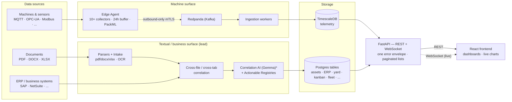
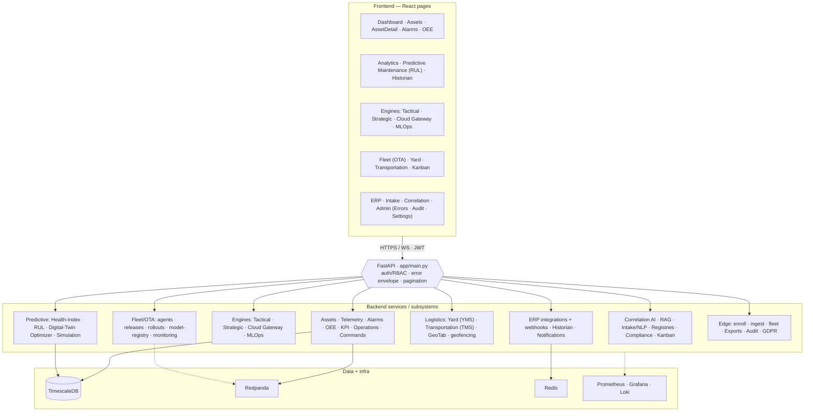
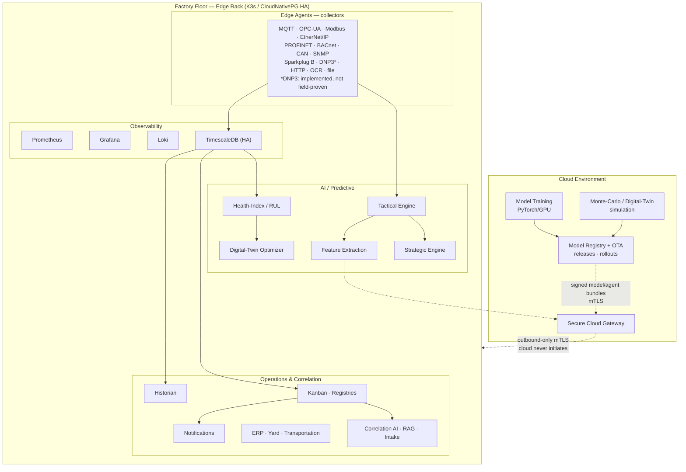

<p align="center">
  <picture>
    <source media="(prefers-color-scheme: dark)" srcset="docs/assets/brand/omniusgrid-lockup-dark.png">
    <source media="(prefers-color-scheme: light)" srcset="docs/assets/brand/omniusgrid-lockup-light.png">
    
  </picture>
</p>

<p align="center">
  <strong>Data Correlation for Industry 4.0</strong><br>
  Production-grade IIoT platform with edge AI inference, cloud training, and comprehensive observability
</p>

<p align="center">
  
  
  
  
  
</p>

## Contents

| Section | What it answers |
|---|---|
| [Quickstart](#quickstart) | Start the stack, log in, seed demo data |
| [Running the suites](#running-the-suites) | The commands CI runs, and what each proves |
| [Overview](#overview) | What this platform is and what it does |
| [Active development](#active-development--team-progress) | Whose lane is what — **read before starting work** |
| [ERP integrations](#erp-integrations--8-connectors-and-how-to-work-on-them) | The eight connectors, and working on them without credentials |
| [Architecture](#architecture) | Data flow, subsystem map, deployment topology |
| [FAQ](#faq) | Deployment model, vendor mapping, tenant isolation |
| [Project structure](#project-structure) | Where things live |
| [API reference](#api-reference) | The endpoints worth knowing, by area — 113 rows of 550 operations, and **every row is checked to exist** |
| [Features](#features) | Capability detail per subsystem |
| [Security model](#security-model) | Auth, tenancy, secrets |
| [Documentation](#documentation) | The rest of `docs/` |

**Engineering method.** The sweeps and guards in this repository follow a set of numbered
rules, each written after a defect that a weaker check had missed. Rules 21–254 are recorded in
`docs/engineering/defect-class-sweeps.md`, with the reasoning for each; the short list at the
top of that file is what most people read.

**A number in this repository is a claim, and claims here are asserted.** Four figures in the
documentation were wrong in a single week — an unfillable-registry count of 41 that was 38, a
heading reading "the forty-seven classes" while the document numbered to 60, a class count in
this README derived from the highest heading rather than the numbering, and a rule range of
21–78 beside an index that stopped at 75. Three were caught by a test; the one that was not
sat wrong for weeks in the first heading a reader meets.

So the counts you see here are checked against the thing they describe:
`test_method_rules_are_indexed.py` pairs this file with the sweeps document, and
`test_open_decisions_numbers_are_true.py` pairs the open-decisions register with the ratchets
it cites. **Two documents that must agree are a pair, and a pair needs a guard** — otherwise
a register gets read once, found wrong, and then discounted, including the entries that were
right.

**Where the programme stands.** Four ratchets are at zero and stay there by assertion —
per-type unfed fields, adapter-unset fields, capped lists that cannot signal truncation, and
declared frontend fields with no producer. The open-decisions register is empty.

They reached zero by different routes, which is more useful than the tally: some by building
the missing half, one by deleting something that should not have existed, and one by
discovering the question had no answer. `git log -S` has the peaks — the unfed-field
allowance was first written at 38 and the phantom-field one at 57.

`test_the_ratchets_that_reached_zero_stay_there.py` asserts the four, because a ratchet at
zero is the easiest kind of number to raise back: there is no allowance left to lower and no
failing test to argue with until someone adds one.

**A first draft of this paragraph named five peak figures and three were wrong** — it gave an
adapter-unset allowance that was introduced at zero and never had slack, and it quoted the
final pre-zero values for two others as though they were the starting ones. That is the fifth
wrong figure in this documentation, and the lesson has stopped being about carelessness: a
number written in prose from memory is wrong often enough that the ones worth keeping are the
ones a test derives.

**Longer material lives in `docs/` rather than here:**
[delivery log](docs/DELIVERY-LOG.md) ·
[ERP architecture](docs/erp/ARCHITECTURE.md) ·
[correlation dataset](docs/CORRELATION-DATASET.md) ·
[demo walkthrough](docs/DEMO.md) ·
[defect-class sweeps](docs/engineering/defect-class-sweeps.md) ·
[open decisions](docs/engineering/open-decisions.md) — **no items open; all five closed 2026-08-05, with what each cost** ·
[sprint plans](docs/planning/)

---

## Quickstart

```bash
# 1. Create local env files from the templates
make env            # copies .env.example -> .env for root/backend/frontend/edge-agent

# 2. Start the stack (Redpanda, TimescaleDB, backend, frontend, observability)
make up             # docker-compose up -d;  add tracing with `make tracing`

# 3. Run the test suites
make test           # backend + edge (pytest) + frontend (vitest)
make e2e            # frontend Playwright smoke

# Other handy targets
make sdk            # regenerate the typed TS API client from the OpenAPI schema
make help           # list all targets
```

Migrations: `python backend/scripts/migrate.py` (Postgres; `--status`,
`--baseline`, `--rebaseline-drifted` for adopting existing databases).
Production deploys: see [docs/deployment/DEPLOYMENT.md](docs/deployment/DEPLOYMENT.md)
(compose-prod, Kubernetes, bare-metal edge, broker TLS).

Backend: http://localhost:8000 (`/docs` for the API). Frontend: http://localhost:9999.
Jaeger (with `make tracing`): http://localhost:16686. Copy and edit the `.env`
files for real credentials — never commit them.

---

The longer form — prerequisites, service URLs, dev-mode auth and demo data — follows.


### Prerequisites

- Docker 24.0+ and Docker Compose
- 8GB RAM minimum (16GB recommended)
- 50GB available disk space

### Installation

```bash
# Clone repository
git clone https://github.com/SoundSafe-ai/Omnius-Grid.git
cd Omnius-Grid

# Start backend services (recommended)
./start.sh

# This script:
# - Starts Redpanda, TimescaleDB, and Backend API
# - Waits for services to be healthy
# - Ensures backend is ready before frontend starts

# Then start the frontend
cd frontend && npm run dev
```

**Alternative: Start all services with Docker Compose**

```bash
# Start all services (including frontend in Docker)
docker-compose up -d

# Verify service health
docker-compose ps

# Initialize database schema (if needed)
docker-compose exec timescaledb psql -U omniusgrid -d omniusgrid \
  -f /docker-entrypoint-initdb.d/001_init.sql
docker-compose exec timescaledb psql -U omniusgrid -d omniusgrid \
  -f /docker-entrypoint-initdb.d/002_continuous_aggregates.sql
```

### Service Endpoints

| Service | URL | Credentials |
|---------|-----|-------------|
| Dashboard | http://localhost:9999 | Login with `dev` / any password (dev mode) |
| API | http://localhost:8000 | Bearer token (auto-generated in dev mode) |
| API Docs | http://localhost:8000/docs | - |
| Grafana | http://localhost:3001 | `admin` / `omniusgrid_admin` |
| Prometheus | http://localhost:9090 | - |
| Alertmanager | http://localhost:9093 | - |
| Redpanda Console | http://localhost:9644 | - |

### Development Mode Authentication

Development builds include an auth bypass, gated on BOTH sides:

- **Backend**: accepts `dev-token` as an admin Bearer token only while
  `ALLOW_DEV_TOKEN=true` (the dev default). Production startup **fails fast**
  if the flag is left on — the token is never valid in production.
- **Frontend**: logging in with username `dev` (any password) uses the bypass
  only in a dev build **and** with `VITE_DEV_MODE=true` set (see
  `frontend/.env.example`). Production bundles can never enable it.

For real-mode logins, register a user (dev only: `POST /api/v1/auth/register`,
gated by `ALLOW_OPEN_REGISTRATION`) or seed demo data (`make seed-demo`).

### Local Development Setup

For local development, the frontend should be run directly (not via Docker) to avoid native module issues:

```bash
# Start backend services only
docker-compose up -d timescaledb backend

# Start frontend separately
cd frontend
npm install
npm run dev -- --port 9999
```

**Important Configuration Notes:**
- Frontend runs on port 9999, backend on port 8000
- All API clients configured to use `http://localhost:8000` (see `frontend/src/api/client.ts`)
- WebSocket connections use `ws://localhost:8000/ws`
- CORS is configured to allow all origins for development
- Database models use String(36) for UUID columns to ensure PostgreSQL compatibility

### Demo Data & Mock API

The frontend includes a comprehensive mock API system for demonstration and development:

- **Machine-Specific Telemetry**: Each asset type provides realistic telemetry data
  - 3D Printers: Nozzle/bed temperature, print speed, progress, filament usage
  - Conveyor Systems: Speed, load, temperature, vibration, power consumption  
  - CNC Machines: Spindle RPM, feed rate, cutting force, position coordinates
- **Dynamic Data**: Values include realistic variation to simulate real-time monitoring
- **Asset Management**: 5 demo assets with different types and PackML states
- **Historical Data**: Machine-specific historical telemetry with proper variance patterns

To use mock data, the frontend API clients are configured with `USE_MOCK = true` in the respective API files.

### Demo Kanban Tasks

For development and demo purposes, the system includes a seed script to populate the Kanban board with realistic task cards. This should be run after initial database setup to ensure the Kanban board displays demo data until client/site integration.

**Run the demo task seed script:**

```bash
cd backend
python scripts/seed_demo_kanban.py
```

**Demo Tasks Include:**
- **In Progress**: Conveyor belt jam investigation, Hydraulic Press temperature alarm response
- **Triage**: CNC Machine preventive maintenance, Steel sheets material request
- **Backlog**: Quality inspections, safety checks, OEE analysis, firmware updates, operator training
- **Review**: Changeover tasks, vibration investigations
- **Done**: Load cell calibration

**Important:** This seed script should be run during initial setup and after any database reset. The demo tasks provide a realistic starting point for demonstrations and development until actual client/site data integration is implemented.

---

---

## Running the suites

```bash
cd backend && pytest          # 4,800+ pass, ~100 skip. Docker is OPTIONAL: the real-DB
                              # tests skip without it, the rest run anyway
cd frontend && npx vitest run  # 1,150+ across 135+ files
cd frontend && npx tsc --noEmit
```

Counts are approximate on purpose — the exact figures were written down once and were a
thousand short within weeks. `test_readme_test_count_is_not_stale.py` asserts the floor
stated further down is still true, and that it has not drifted so far below reality that it
stops meaning anything.

### What the suites actually verify

Worth knowing before you trust a green run, because each of these was a gap that shipped a
defect before it was closed:

| Question | Where it is answered |
|---|---|
| Does an endpoint 5xx against a production-shaped database? | `test_realdb_endpoint_smoke.py` (Docker) |
| Does a write **survive the round trip** — created, read back, and not blanked by a partial update? | `test_writes_round_trip.py` (no Docker; in-memory SQLite) |
| Does a POST with rubbish answer 422 rather than 5xx? | `test_write_endpoints_reject_cleanly_realdb.py` |
| Does the frontend declare a field no backend source produces? | `test_frontend_fields_exist_on_the_wire.py` — five quadrants: read, unread, passthrough return types, interfaces beside their client, and the reverse direction in `test_qualifiers_reach_the_frontend.py` |
| Does a declared `response_model` drop a key the handler returns? | `test_response_models_match_their_returns.py` (follows helper-built returns) |
| Does a declared media type match what the handler sends? | `test_declared_media_types_are_honest.py` |
| Does a naive timestamp crash a verdict it decides? | `test_naive_timestamps_do_not_crash_verdicts.py` |
| Is a failure being rendered as an empty state? | `failureIsNotEmptiness.test.ts` (frontend) |

**The distinction that keeps recurring**: a route that answers 200 is not a feature that
works. Validation is not function — an endpoint can reject rubbish correctly and silently
drop a good write. A 200 with an empty body is not a working feature. A rendered page is not
a rendered *value*: React renders `undefined` as nothing, so a dead figure looks like a
deliberate empty state. Each of those sentences is a defect this repository shipped.

Most of the backend suite runs against a **real TimescaleDB**, not a mock, so Docker has to be
up. If containers fail to start with `input/output error` from containerd, the VM is out of
disk rather than broken — `make lean` frees ~1.5 GB by dropping `backend/dataset` from your
working tree, and `make unlean` puts it back. See
[docs/engineering/large-assets.md](docs/engineering/large-assets.md).

The **API contract gate** is separate and opt-in, because it stands the app up under
uvicorn and drives all 550 documented operations with generated input (~8 min):

```bash
cd backend
RUN_CONTRACT_TESTS=1 pytest tests/test_api_contract.py -q --junitxml=contract-report.xml || true
python scripts/contract_ratchet.py contract-report.xml   # conformance may rise, never fall
```

It needs a **migrated** database owned by the `omniusgrid` role — the migration chain
`GRANT`s to that name and rolls back without it. The job blocks on a **ratchet** rather than
demanding green, and the floor only ever rises. Measured 2026-08-14 against a freshly
migrated database: **447 of 546 operations conform with no broker, 449 with one**, so the two
floors are **438** and **440** — each measurement less a 9-operation spread for generation
variance. (The no-broker figure was 445 until FS-724/725 fixed two of the eight operations
answering a bare `internal server error`; a re-run measured the gain rather than assuming it.) (The broker is worth four operations, not the "~20" this gate's own documentation
had claimed since before the surface grew; the two floors stay separate because the
distinction is real, but the headroom it buys is small.)

Of the 101 that do not conform: 72 answer a 5xx under generated input, 18 return a status
code their own schema does not declare, and 2 violate the response schema. **None of them is
on the correlation-evidence or operations-assistant routes** the last merge added.

**That run only happened because the suite stopped hanging.** `case.call_and_validate()`
carried no request timeout, so a single unresponsive operation stopped the whole job — no
report, no count, and the ratchet step then reading "collected 1 operations" and blaming the
schema. An attempt sat for over an hour having used one minute of CPU in the last ten. With a
30-second per-request timeout the same 546 operations finish in **14:41**. A gate that can
hang reports nothing at all, which is strictly worse than a gate that fails.

**The denominator was 452 and the schema now documents 546** — the correlation-engine merge
added about ninety operations. That is more than the ratchet's own 10% drift tolerance, so
until it was re-baselined on 2026-08-14 the gate failed outright with *"check that the schema
still loads and the server started"*, which is the opposite of what had happened: nothing
collapsed, the API grew by a fifth and the number it was compared against stayed still. The
drift check is right to exist — it stops a collapsed collection from passing as a green
ratchet — and a denominator nobody re-measures turns it into a tripwire on ordinary growth.
The floors were NOT moved with it: they count passing operations and are raised only by a
run that measures more. The non-conformers are enumerated in
[docs/engineering/api-contract-gate.md](docs/engineering/api-contract-gate.md) — including
the ~20 `503`s that are the job's own missing Redis and broker rather than API defects.

**CI excludes nothing, and the register that would hold an exclusion is empty.** Every
`--ignore`/`--deselect` flag in
`ci-cd.yml` must have an entry in [`backend/tests/test_quarantine.py`](backend/tests/test_quarantine.py)
carrying an owner, a real diagnosis and an expiry date. That suite fails when a window lapses,
when a quarantined test starts *passing* (CI skipping working coverage is worse than a known
failure), and when the register and the workflow drift apart in either direction — so an
exclusion cannot become permanent by nobody noticing.

Currently quarantined: **nothing**, since 2026-08-04. The last entry —
`test_map_section_to_domain_table_content` — was the only one that ever needed a judgement
rather than a rewrite, and the register stated the choice honestly: *either table-content
mapping has a gap, or the expectation was never right.* It was the gap. `git log` showed the
test was added in the same commit as the mapper against a byte-identical keyword map, so it
had **never passed**, and the keyword map contained no asset word and no failure word
anywhere — in a platform whose central noun is an asset. The red test was not the cost:
`document_scenario_builder` does `if domain is None: continue`, so a table keyed on
`asset_id` produced no correlation scenario while the page still reported as processed. Four
other entries were released on 2026-07-30; both stories, and the rule they earned — *check
whether the code under a quarantined test is actually running* — are in
[docs/engineering/test-quarantine.md](docs/engineering/test-quarantine.md).

---

## Overview

OmniusGrid is a resilient manufacturing operations platform designed for Industry 4.0. It correlates data from across the entire operation, unstructured business documents (spreadsheets, PDFs, images via the intake pipeline), ERP systems (8 connectors), industrial equipment on the factory floor (17 registered collector types, 11 of them industrial protocols), audio/video sensors, fleet telematics (GeoTab), and yard and transportation logistics, into one queryable, cross-correlated picture. On top of that substrate it provides real-time edge AI inference, an NLP correlation assistant, compliance registries with RAG-backed document search, and secure cloud connectivity for model training and fleet-wide optimization.

**How we land and grow.** We start with a low-friction pilot — typically the intake pipeline, correlating a customer's existing spreadsheets, PDFs, and ERP records into a single queryable picture, so they see cross-correlated insight without touching a single machine. Once that proves value, we move into refinement and deployment, tuning the correlation to their operation and rolling it into production. From there the account expands beyond textual data intake onto the full data surface — factory-floor equipment (11 industrial protocols, 17 collector types in all), audio/video sensors, fleet telematics, and real-time edge AI inference — turning a document-correlation pilot into the operation's central nervous system.

### Key Capabilities

| Domain | Features |
|--------|----------|
| **Data Collection** | 10 industrial protocol collectors (MQTT, OPC-UA, Modbus TCP/RTU, EtherNet/IP, PROFINET, BACnet, CAN bus, HTTP/REST, Screen Scraping/OCR, File Watching) |
| **Real-time Pipeline** | WebSocket broadcasting, subscription management, live telemetry/state/alarms |
| **Command Executor** | Queued commands with retries, timeouts, cancellation, emergency stop, Redpanda integration |
| **OEE Automation** | Automated OEE calculation from PackML states and telemetry part counting |
| **Shop-floor events** | Part issues, the labour clock, quality events and downtime, each fanned out to the systems of record it affects (inventory / purchasing / accounting / production / quality / scheduling / maintenance). **One ledger row per (event, target system)**, so "reached inventory" and "still waiting on purchasing" stay separate facts. A posting cannot be `posted` without the identifier the far system returned — enforced by a CHECK, not by the service — and a target with no integration becomes `manual_required` carrying the sentence to read out to a person |
| **Insight activation** | A correlation-AI recommendation can be activated directly from the analysis session: it becomes a Kanban task **and** postings to every system its domain implies. Confirmation is refused, with named blockers, until the task is finished and every posting carries evidence; confirming writes the snapshot it was granted on |
| **Systems-of-record drain** | Runs on a timer (5 min, per organisation, batched) and on demand via `POST /shop-floor/postings/drain`. It attempts every queued posting against its ERP. `ERPConnectorBase.post_event` follows the `subscribe_to_events` precedent in that file — **declare the truth rather than invent an endpoint** — so a connector with no verified write path refuses, and the posting becomes `manual_required` carrying the reason. That conversion is the point: it turns "queued behind an integration that will never take it" into "somebody has to enter this, and here is what to tell them". Without it, `pending` was a dead end and an integrated target could never be confirmed |
| **Edge AI** | <100ms inference loops, TorchScript models, automated model lifecycle, graceful fallback |
| **Observability** | Prometheus metrics, Loki logs, Grafana dashboards, TimescaleDB |
| **Security** | Agent enrollment with CA pinning, mTLS + proof-of-possession request signing, Redpanda broker mTLS, route-walk auth enforcement test, tamper-evident audit trails |
| **DevOps** | GitHub Actions CI/CD with **31 blocking jobs and 1 advisory** across `quality-gates.yml` and `ci-cd.yml`, counted by `test_ci_gate_count_is_accurate.py` so this number cannot go stale (tsc/eslint/vitest/Playwright, the full backend suite against a real TimescaleDB, migration-chain hygiene, an API contract ratchet over all 550 documented operations, a k6 smoke load test against a real running app, supply-chain: pip-audit/npm-audit/Trivy, and four Kubernetes gates: manifest validation, NetworkPolicy simulation, kind smoke test, Calico policy-enforcement test), kustomize deploys with operator-gated platform stacks, Kubernetes base incl. workers + Redis + db-migrate Job, checksum-tracked SQL migration runner |
| **Operations** | K3s-orchestrated, CloudNativePG HA manifests (auto-failover + PITR) applied where the operator's CRDs are present — **PITR is not operational today; what runs is a nightly `pg_dump` with an RPO up to 24 h**, see [Maturity](#maturity--what-is-proven-what-is-implemented-what-is-aspirational). KEDA lag-based worker autoscaling, automatic disaster recovery. The deploy applies the monitoring/autoscaling/HA-DB stacks itself, each gated on its operator's CRDs being present |
| **Logistics** | YMS/TMS with GeoTab telematics, detention billing, HOS compliance, dock-production sync, webhook processing |
| **Task Management** | Kanban board with task grouping, assignment, approval workflows |
| **Compliance** | Actionable registries (OSHA, ISO, internal), data correlation mapping, scoring. **Compliance Assistant** — grounded Q&A over the policy corpus (SOPs, OSHA, collective agreements) with inline citations, presigned links to the source documents, and the forms an answer implies you must file |
| **Analytics** | Recharts integration with temperature trends, vibration analysis, OEE metrics, asset health distribution |

### Maturity — what is proven, what is implemented, what is aspirational

The table above is a capability list. This is the same platform graded by evidence, because
"implemented" and "field-proven" are different claims and the difference is what a technical
reviewer is actually looking for. Each row is measured, each has a guard that fails the build
if it drifts, and each is stated here rather than left to be discovered.

| Area | Status | The measured position |
|---|---|---|
| **DNP3** | Implemented, hardened, **not field-proven** | The collector is written and swept by the same guards as every other collector — one shared `ReconnectPolicy` for backoff and circuit-breaking, aware-UTC timestamps, counted failures — and tested against a fake master. It has never spoken to a real outstation. `dnp3_python` publishes **cp38–cp310 linux wheels only**, so its pin carries `python_version < "3.11"` and the agent image is `python:3.11-slim`: **the driver is absent from every image we build.** Live DNP3 sites: **zero**, by construction. This is a supply gap in an upstream package, not a protocol problem, and it clears when a maintained py3.11 DNP3 driver exists or we vendor a `libopendnp3` binding. The other 10 industrial protocols are unaffected |
| **Point-in-time recovery** | **Not operational** | What runs is a nightly logical backup — `pg_dump -Fc` to S3 via the `db-backup` CronJob — with a restore drill in the blocking CI gate. **RPO is therefore up to 24 hours, not ≈0.** The CloudNativePG manifest with continuous WAL archiving does describe real PITR, and it is applied only where the CNPG operator CRDs are present, which no current environment has; the `legacy-patroni/` pgBackRest CronJob is in no kustomization and applied nowhere. Treat every pgBackRest instruction in the DR runbooks as **aspirational**. The deployed image ships no `pgbackrest` binary and sets no `archive_mode` |
| **API contract conformance** | Measured, ratcheted, improving | **466 of 546** operations conform under generated input in the configuration CI runs (measured 2026-08-17, before the four MFA routes were added — the schema now declares 550, and the gate will re-measure against that; the figure is left as it was taken rather than rescaled, because 466/550 is not a number anybody ran). Of the 80 that do not, **8 return a 500** — that is the real defect count, each one diagnosed by operation in the gate document. A further 14 return a *declared* 503 because the dependency genuinely was not running; Schemathesis counts any 5xx, so an honest 503 is charged to the API, and separating the two is why this row can be specific. The rest: 34 accepting input their own schema forbids, 22 answering an undocumented status to an unsupported method, 3 others. Published rather than buried, because the instrument is the story: a Schemathesis ratchet over **all 550 operations blocks CI** at a floor that only moves up. It moved twice this week — the tenancy work in FS-736/737 turned cross-tenant 500s into declared 404s with nobody targeting the gate, and the floors rose 438/440 → 445 |

Nothing above is a surprise waiting in a scanner report. If a diligence review runs
Schemathesis, it will reproduce the third row's numbers; the ratchet, its floors and the named
flapping operations are documented in
[`docs/engineering/api-contract-gate.md`](docs/engineering/api-contract-gate.md).

---

## Active Development & Team Progress

> **Snapshot: July 30, 2026.** Both remotes (`origin` = SoundSafe-ai, `backup` = SoundSafe-Dev)
> are in sync, and `origin` now carries `alex` (89 commits that had lived only on the mirror).
> **`main` was promoted from `hamad/converged-pre-main` on 2026-07-17**; the
> FS-141+ work described below has since landed on `hamad/converged-pre-main` and is **ahead of
> `main`**, so start new work from `hamad/converged-pre-main` until the next promotion.
> Reinstall deps after pulling (`pip install -r backend/requirements.txt` — `scipy` is new and
> `testcontainers` moved to `requirements-dev.txt`; `npm install` in `frontend/`). This maps
> in-flight work to owners so contributors can coordinate and avoid overlap. Branch tips move —
> treat this as a directory, not a record of exact commits.
>
> **`frontend/node_modules` is no longer tracked in git.** It was committed before `.gitignore`
> listed it, which made the ignore rule inert and every `npm install` produce thousands of
> spurious diffs. If `git status` still shows it after pulling, run `npm ci` in `frontend/`.

### Hridyansh's six branches are already merged — do NOT merge them again

Checked 2026-07-27, because the branch list makes it look like there is unmerged work.
There is not, and merging them would be destructive. Recorded here so nobody redoes this
analysis or acts on the appearance.

| Branch | Unmerged commits (apparent) |
|---|---|
| `hridyansh/integration` | 112 |
| `hridyansh/edge-command-dispatch` | 109 |
| `hridyansh/integration-erp` | 110 |
| `hridyansh/edge-agent-retry-logic` | 66 |
| `hridyansh/tenant-isolation-middleware` | 65 |
| `hridyansh/package-renaming-fix` | 45 |

**Those counts are an artifact of rewritten history, not missing work.** The branches
were force-pushed onto a different root at some point, so they now share **no common
ancestor** with `converged-pre-main` — `git merge-base` returns nothing, and a merge
would need `--allow-unrelated-histories`. The earlier `337c9329 Merge
hridyansh/integration into converged-pre-main` merged a parent (`f27d5322`) that is no
longer on the branch.

**The content is all here.** Every file touched by the five most recent substantive
commits on `integration` is present in `converged-pre-main`, identical or evolved
further. Of the 82 files that exist only on his side, 67 are `__pycache__`/`.DS_Store`
artifacts and the remaining 15 are superseded paths:

| On his branch | In `converged-pre-main` |
|---|---|
| `backend/app/api/keycloak_auth.py` | `app/api/sso.py` + `app/services/keycloak_service.py` |
| `backend/app/services/audit_trail.py` | `app/services/audit.py` + `app/api/audit.py` + `app/middleware/audit.py` |
| `docs/deployment/runbooks/*` (4 files) | `docs/runbooks/*` — all four present |
| `infra/k8s/timescaledb-patroni.yml` | `infrastructure/k8s/database-ha/` (CloudNativePG) + `legacy-patroni/` |
| `infra/k8s/pgbackrest-backup.yml` | `infrastructure/k8s/legacy-patroni/pgbackrest-backup.yml` |
| `frontend/.../RealtimeStreamChart.tsx` | absent — but referenced by nothing on his branch either |

**What merging would actually do:** re-add **19,048 tracked `node_modules` files** (his
branches predate that removal), restore `HAMAD_IDE.pem` — the leaked key FS-200 is still
waiting to rotate — plus 57 `.pyc` and 10 `.DS_Store` files, and resurrect the superseded
`infra/` and `docs/deployment/` trees alongside the current ones.

**The four local stashes on his branches are also spent.** Two contain only artifacts;
`stash@{2}`'s Sidebar tagline is already applied (`Sidebar.tsx:251`), and `stash@{0}` only
drops the anonymous `node_modules` volume from `docker-compose.yml` — a local dev
workaround, not a fix. They can be dropped whenever Hridyansh confirms.

**If a future branch of his does need merging**, rebase or cherry-pick onto
`converged-pre-main` rather than merging unrelated histories, and confirm
`git ls-tree -r --name-only <ref> | grep -c node_modules/` is `0` first.

### Convergence branch — `hamad/converged-pre-main` (merge candidate)

The integration branch for the next `main`: it merges every workstream
(Hridyansh's OTA + tenant/RBAC hardening, Harsh's correlation-AI + MLOps +
mobile/kanban, the RAG compliance-doc pipeline, Alex's spreadsheet intake) and
carries the **hardening program**, now at **FS-01..721** — each slice recorded in
the delivery log with what it cost to learn. It was **promoted to `main` on
2026-07-17** (main's tree equalled this branch then); new work continues to land
here and is promoted periodically. It is currently **348 commits ahead of
`main`**, so treat `main` as a release marker rather than as current.

A merge onto this branch reliably produces GUARD failures rather than conflicts —
the correlation-engine merge went from 0 failing to 16, and every one was a guard
reading new code. Two of the worst defects it carried survived all sixteen and were
found only by driving the routes over HTTP: an operations assistant that answered
404 for the caller's own uploads, and an asynchronous job path where every job
failed, both from a session that had no tenant bound. See FS-718..721 in the
delivery log before merging a large surface. Highlights:

- **Real mode is the default** — the frontend mock layer is opt-in
  (`VITE_USE_MOCK=true`); every API client has a real backend path, bridged by
  one prefix-gated snake↔camel transform seam instead of per-call converters.
  **Three guards watch that seam**, because `src/test/setup.ts` forces
  `VITE_USE_MOCK='true'` and so no frontend test ever executes the real branch:
  `test_frontend_calls_real_endpoints` (the path and method exist),
  `test_frontend_query_params_are_declared` (the query keys are declared, since
  FastAPI ignores unknown ones and returns the *unfiltered* set), and
  `test_frontend_body_fields_are_declared` (the body keys are declared, since
  Pydantic drops unknown ones silently and the write returns 200 with the field
  missing). The third found `POST /transportation/shipments/{id}/dispatch`
  returning 422 on every call since the day it was written — the ids were
  declared as bare parameters, which FastAPI reads as query parameters.
- **Auth actually enforced** — all routers gated; a route-walking test fails CI
  by name on any route that answers anonymously; websocket auth rides
  `Sec-WebSocket-Protocol` (tokens out of query strings/access logs);
  `validate_settings` fail-fasts insecure production config (dev-token, open
  registration, missing secrets).
- **One schema, one migration path** — `backend/scripts/migrate.py`
  (checksum-tracked, idempotent, baseline/rebaseline flows) applies the full
  chain — **71 files, `001..068`** — on a clean Postgres, and re-runs every
  migration at its own point in the chain (`migration-hygiene`, FS-578);
  UUIDs are native on Postgres everywhere (dialect-aware `UUIDString`, with a
  guarded conversion migration for pre-existing databases); tests build their
  schema through the same runner (tenant-isolation RLS suite runs against the
  real chain).
- **Edge security chain complete** — enrollment with CA pinning, mTLS,
  proof-of-possession request signing with clock-skew recovery, quarantining
  store-and-forward buffer, and a Redpanda **mTLS listener** (broker certs
  issued by the same edge CA agents already trust; proven end-to-end incl.
  certless-client rejection).
- **Production deploy paths that work** — `docker-compose.prod.yml` (required
  secrets, one-shot migration service, nginx-served SPA with same-origin
  proxying), Kubernetes base with **all four workers + a db-migrate Job**
  (migrations baked into the backend image), CI deploys via
  `kustomize edit set image`, and blocking CI gates (tsc, eslint, pytest,
  vitest, builds — all at zero).
- **Sensor story finished** — audio/video collectors have real-capture config
  templates + cutover guide (`docs/edge/SENSOR_CAPTURE.md`); AssetDetail
  switches panes by `sensor_class` and renders live telemetry; the once-orphaned
  chart suite is wired (or deleted).
- **Product demo video** — Remotion compositions (4K + mobile 9:16) under
  `frontend/video/` (`npm run video:*`; renders are not committed).
- **Dependencies current, supply chain gated** — backend/edge Python pins
  jumped ~2 years to current (FastAPI 0.139, Pydantic 2.11, SQLAlchemy 2.0.51,
  aiokafka 0.14, cryptography 48; `pip-audit` 60 → 0 modulo one documented,
  fix-less advisory) and the frontend npm audit went 19 → 0 (vite 7, vitest 4,
  ts-eslint 8). The `supply-chain` CI job is now **blocking** (`pip-audit` +
  `npm audit --audit-level=high` + Trivy fs scan).

### Delivery log — what shipped, and what each slice cost to learn

The section-by-section record of every delivered slice lives in
[`docs/DELIVERY-LOG.md`](docs/DELIVERY-LOG.md). It was about a third of this file and is
kept verbatim there, because the useful part is the reasoning against each entry rather
than the list of what landed.

### Offline demo — `backend/scripts/seed_demo_data.py`

The whole platform demos with **no live edge, cloud, or external services**.
`seed_demo_data.py` seeds every page — assets, 14 days of correlated telemetry,
alarms, OEE, a fully-synced ERP integration, yard, transportation, geofencing,
kanban, operations, fleet OTA, MLOps model registry, compliance/registries,
notifications, error-triage, exports, and historian — idempotently. The only
thing that still needs its model is the Correlation-AI **inference**: the seeded
`AnalysisSession` now carries a short transcript so the recommended-action and
activation controls are on screen, and it is labelled in the message text as a
recorded example rather than an inference. See [`docs/DEMO.md`](docs/DEMO.md).

It had **never run on a fresh database**. Three defects in sequence, each only
reachable after fixing the one before: an FK-ordering mitigation that reset on the
commit immediately after it was set, a human work-order number written into a `uuid`
column, and — the one worth remembering — `datetime.utcnow()` anchoring every
timestamp. That returns a NAIVE datetime, and writing one to `timestamptz`
reinterprets it in the client's zone. The gaps between rows survive, so the data
looks entirely plausible; only the anchor moves. A trailer seeded at six hours of
dwell arrived as one, `/yard/detention-alerts` returned `[]`, and the seed's own
verifier failed. On a UTC developer machine none of it is visible.
`python scripts/seed_demo_data.py --verify` now passes all 26 checks.

### Subsystem ownership — check here before starting work

| Area | Active owner(s) | Branches / notes |
|------|-----------------|-------|
| Correlation AI / NLP / intake / spreadsheet parsing | **Harsh** | `feature/gemma-correlation-ai`, `HARSH-CONTRIBUTION`. Coordinate before touching `correlation_ai_engine.py`, `nlp_correlation.py`, intake services. Owns the 3 failing intake tests + scenario-builder import drift, and the Gemma correlation model. |
| Mobile app / Kanban / demo API | **Harsh** | Merged; kanban/nlp files received mechanical-only fixes on the convergence branch (flagged in commit messages). |
| MLOps (model registry + training + monitoring) | **Harsh** | `model_registry` / `model_training_runs`; model-monitoring drift + performance tracking. |
| RAG / compliance doc pipeline (SeaweedFS/S3 + Gemma inference) | **Hudson** (htreinen) | `htreinen`, `feature/RAG-Compliance-Doc-Pipeline`, `rag-async-ingest`, `rag-rewrite` (a frozen record, not development). `/api/v1/rag`; containerization seam in `docs/RAG_CONTAINERIZATION.md`. His `origin` is the SoundSafe-Dev mirror — `rag-async-ingest` exists only there, and matched no CI push trigger until a `rag-**` pattern was added. |
| Compliance Assistant page + the operational-context leg | **Hamad** | Consumes Hudson's pipeline; does not change it. `docs/compliance_assistant.md`. Coordinate with Hudson before altering `rag_retriever.py` prompt assembly — the citation numbering is a contract with the UI. |
| Tenant isolation / RBAC / security hardening | **Hridyansh** | `hridyansh/tenant-isolation-middleware`. RLS enforced through the canonical `app.current_org_id` GUC everywhere (incl. ERP tables). |
| OTA / edge command dispatch / agent releases | **Hridyansh** | `hridyansh/edge-command-dispatch`, `hridyansh/edge-agent-retry-logic`. Rollout orchestrator + agent-side executor; `ota-rollout-worker` runs in compose + k8s. |
| ERP integration surface / package layout | **Hridyansh** | `hridyansh/integration`, `hridyansh/integration-erp`, `hridyansh/package-renaming-fix`. |
| ERP **connector internals + validation harness** | **Hamad** | Reassigned during the convergence program. The 8 connectors, their auth/pagination/envelope handling, and the Tier 0–4 harness. **Read [`docs/erp/README.md`](docs/erp/README.md) before touching a connector** — the guards there encode defects that already shipped. |
| Edge platform, backend platform, frontend/UI, deploy/CI, schema, observability, docs | **Hamad** | `hamad/converged-pre-main` (integration → `main`). The convergence program + the FS fixed-sprints above. |
| Spreadsheet intake / column normalisation — under Harsh's lane | **Alex** | `alex`. Three commits merged onto the convergence branch (already present by content at the time; merged for ancestry). |

> 📋 **The live record of the FS series is [`docs/DELIVERY-LOG.md`](docs/DELIVERY-LOG.md),
> now at FS-01..721.** The last written plan document,
> [`docs/planning/fixed-sprints-344-393.md`](docs/planning/fixed-sprints-344-393.md), covers
> FS-344..393 and is **exhausted** — it is kept for the method note below, not as a backlog.
> Read the delivery log for what shipped and what each slice cost to learn; a plan written
> before the work is a worse guide to the tree than the record written after it.
>
> **It was derived from the codebase, and the one before it was not — which is why it needed
> replacing.** Executing part of Wave A of
> [`fixed-sprints-241-343.md`](docs/planning/fixed-sprints-241-343.md) found that **five of
> eight platform items described work already delivered** by FS-200/214/230/240, all of which
> predate that plan; it had been written from the task pools and inherited claims they had
> outgrown. Its largest single block, FS-272…279 — eight sprints against "~92 non-conforming
> operations" — measured out as **65 failing, 42 of them documented policy disagreements and
> 9 in-lane server errors, six sharing one cause**. Eight sprints collapsed to one.
>
> The earlier document warns about numbers drifting in the *flattering* direction. These drift
> the other way — inflating what is left — which is harder to notice, because nobody
> investigates a backlog that looks too long. Every entry in the new tranche carries a file
> path, a line number, or a measurement taken on the day.

> 📋 **Next week's work.** The inventory is
> [`docs/planning/next-week-task-pool.md`](docs/planning/next-week-task-pool.md) (week of
> 2026-08-10) — **31 tickets and 5 decisions**, seventeen carried from the previous pool and
> marked with their age, with sizes and acceptance criteria. Every figure was re-derived from
> the tree on the day it was written, and one entry is a *recorded negative*: measured while
> writing and found not to reproduce. The previous pool is archived at
> [`task-pool-2026-07-26.md`](docs/planning/task-pool-2026-07-26.md).
>
> **Who does what is
> [`docs/planning/assignments-2026-08-10.md`](docs/planning/assignments-2026-08-10.md)**,
> derived from this branch's status rather than the pool's ordering. It opens with three
> integration items that precede every ticket — measuring the branch found **nine of
> Hridyansh's commits on the backup remote only, and three of htreinen's on a local branch that
> exists on no remote at all**.

> 🔄 **`main` has moved by 436 commits.** Before your next commit read
> [`docs/DEVELOPER-SYNC.md`](docs/DEVELOPER-SYNC.md) — it covers what to do with local
> work, what changed that will affect your branch, and which branches were kept as the
> record. Two developers' work had been stranded off the trunk; both are now on it, and
> both original branches are preserved on `origin` and `backup`.

> ⚠️ The pre-convergence feature branches are all merged into
> `hamad/converged-pre-main` and now into **`main`**. **Start new work from
> `main`** (or from your own active branch after merging `origin/main` into it),
> not from stale feature branches. A one-time `TEAM_UPDATE.md` heads-up was
> pushed onto each active dev branch (safe to delete once read).

## ERP integrations — 8 connectors, and how to work on them

**SAP S/4HANA · Oracle Fusion · Dynamics 365 · NetSuite · Odoo · Infor ION · Epicor Kinetic · Intuit QuickBooks**

📖 **[`docs/erp/README.md`](docs/erp/README.md) is the entry point.** Start there.

**You need no credentials to work on ERP code.** ~300 tests are hermetic — no network,
no Docker, no accounts:

```bash
cd backend && venv/bin/python -m pytest tests/test_erp_*.py -q
```

Everything needing a live system skips with a reason naming the variable it wants
(`-rs` prints them). Copy [`backend/.env.erp.example`](backend/.env.erp.example) to
`.env.erp` (gitignored) and fill in only the tier you're working on.

### Validation tiers — what each proves, and what it costs

| Tier | Proves | Cost | Status |
|------|--------|------|--------|
| 0 — static | every connector imports; factory targets resolve | free | ✅ |
| 1 — request shape | the exact request we build | free | ✅ |
| 2 — spec-driven mocks | the vendor's **own spec** rejects malformed requests | free | ✅ SAP · Dynamics |
| 3 — real ERP locally | a real server gets a vote | free (Docker) | ✅ Odoo |
| 4 — vendor sandbox | the actual vendor answers | free | ✅ SAP · Dynamics · ⬜ Intuit |

**Correlation routing (FS-557…561).** Five vendors had a working connector, stored raw
records, and **no correlation route** — so every sync completed, wrote its rows, and reported
`skipped: unrouted`: a successful integration with an empty correlation list and nothing saying
the vendor was never analysed. All eight now route.

Each has its **own** transformer, because the registry's rule is that a route pairs one
vendor's field names with an analyzer, verified field by field. Reusing another vendor's
transformer produces a record of `None`s, and an analyzer reading nulls finds nothing wrong —
so the failure is a clean bill of health rather than an error. A test demonstrates it: SAP's
invoice transformer over a NetSuite payload returns three nulls.

The sharpest instance is what "settled" looks like, which no two vendors spell the same way:

| vendor | field | settled |
|---|---|---|
| NetSuite | `status` | `"Paid In Full"` |
| Odoo | `payment_state` | `"paid"` — and `state: "posted"` is **not** it |
| Infor | `Status` | `"Paid"` |
| Epicor | `OpenInvoice` | the **boolean** `false` |
| Intuit | `Balance` | the **number** `0` — QBO has no status field at all |

Two carry settlement in a field that is not a status, so a transformer looking for one leaves
`None` — and `None != "paid"`, which means **every Epicor and every QuickBooks invoice would
report overdue** the moment its due date passed. Odoo fails the other way: reading the document
state instead of the payment state marks every posted invoice paid and suppresses every overdue
finding. Neither raises.

**Every tier we stood up found a defect on its first run** — which is the argument for
building the cheap ones rather than waiting for tenant access.

Fastest real-server win, no account required:

```bash
docker compose -f docker-compose.erp-sandbox.yml up -d
cd backend && venv/bin/python scripts/setup_odoo_sandbox.py
RUN_ODOO_INTEGRATION=1 venv/bin/python -m pytest tests/test_erp_odoo_integration.py -q
```

### Two rules, both from defects that shipped

**Never invent an endpoint.** All seven original connectors POSTed to a
`/webhooks`-shaped URL with byte-identical payloads across seven unrelated vendors.
Against a real Odoo it returned `True` for a subscription never created — Odoo's
`/xmlrpc/2/<anything>` route matches, and it answers HTTP 200 with the fault in the
*body*. If you can't verify a vendor's mechanism, declare it in
`EVENT_SUBSCRIPTION_MECHANISM` and return `False`.

**Never report zero rows for a response you didn't understand.** A missing envelope
must raise, not return `[]`. "No results" and "we misread the response" are
indistinguishable to a caller, and one of them is silent data loss. Related: **follow
pagination to completion** — every connector that skipped this truncated silently, and
it's the most repeated defect in the subsystem.

Guards enforcing both live in `backend/tests/test_erp_no_invented_endpoints.py` and
friends. Each is mutation-tested: revert the fix and the test fails.

## Architecture

### 1. End-to-end data flow

OmniusGrid's differentiator is correlating the **document / ERP** world with the
**machine** world. Textual/business data is the *lead* surface; machine telemetry
is the second. Both converge into one API that the frontend renders.



\* Correlation-AI **inference** needs the Gemma model. Everything else runs fully
offline — see [Offline demo](#offline-demo--backendscriptsseed_demo_datapy).

### 2. Component & subsystem map — how it's wired

Every frontend page talks to `app/main.py` (60+ routers behind one error envelope
+ JWT auth), which delegates to the services below, which read/write the stores.



### 3. Physical / deployment topology (offline-capable edge + cloud)



### 4. Production reliability & operations

The Kubernetes stack (`infrastructure/k8s/`) is built for multi-pod, no-single-
point-of-failure operation. Beyond the app Deployments, these are the enterprise
reliability layers (each with its own README):

| Concern | Implementation | Where |
|---------|----------------|-------|
| **Database HA** | 3-instance CloudNativePG — automatic failover, synchronous replication (RPO≈0), continuous WAL archiving to S3 for PITR, PgBouncer pooler. **These are the manifest's properties, not a running cluster's — PITR is not operational today.** The stack is applied only where the CNPG operator is installed and no current environment has it, so the live RPO is the nightly `pg_dump`'s: up to 24 h | [`database-ha/`](infrastructure/k8s/database-ha/) |
| **Worker autoscaling** | KEDA scales ingestion / export / compliance workers on Redpanda consumer-group **lag** (export + compliance scale to zero when idle) | [`autoscaling/`](infrastructure/k8s/autoscaling/) |
| **Observability** | Prometheus + Alertmanager + kube-state-metrics + Grafana, in-cluster; canonical alert rules shared with docker-compose; a "Platform / Infra" dashboard for HA-DB / autoscaling / backups | [`monitoring/`](infrastructure/k8s/monitoring/) |
| **Distributed tracing** | otel-collector + Jaeger, now actually reachable: policies both directions, OTLP export wired on the API and all four workers, and probes on the collector's `health_check` extension. Previously deployed with NO NetworkPolicy in a default-deny namespace and no OTEL env on the backend — dead in Kubernetes AND in compose, with nothing erroring | [`otel-collector.yaml`](infrastructure/k8s/base/otel-collector.yaml) |
| **DR site** | `overlays/dr` — standby namespace, DR hostnames, cold-standby replicas. Makes the datacenter-outage runbook executable; data replication remains pgBackRest's job | [`overlays/dr/`](infrastructure/k8s/overlays/dr/) |
| **ERP connectors** | SAP, Oracle, Dynamics, NetSuite, Infor, Epicor, Odoo, Intuit. Three could not be **imported** — SAP/Oracle needed `requests_oauthlib` and Dynamics needed `msal`, neither a declared dependency — so the factory resolved straight at an ImportError. All now load, authenticate over async OAuth2 client-credentials (NetSuite via OAuth 1.0a TBA), and paginate | [`erp_connectors/`](backend/app/services/erp_connectors/) |
| **User & role management** | Admin-gated user CRUD at `/api/v1/users`, an ordered role vocabulary with a CHECK constraint, last-admin guards, and audit rows written in the same transaction as the change. Only `GET /users` existed before, which is why the admin UI was hard-disabled | [`user_management.py`](backend/app/api/user_management.py) |
| **Server-side alarm rules** | Operators define thresholds (metric, comparator, duration, hysteresis, severity, target) that are evaluated against incoming telemetry in the ingestion path. Previously severity was whatever the edge agent sent and nothing evaluated telemetry at all, so a duration-based alarm could not be expressed | [`alarm_rules.py`](backend/app/services/alarm_rules.py) |
| **Worker health** | The four background workers serve `/metrics`, `/healthz`, `/readyz` on :9109 with **heartbeat-based** liveness, so a wedged consumer — process alive, loop dead — reports unhealthy and gets restarted. They previously exposed nothing: no probes were possible and Prometheus scraped nothing | [`workers/health_server.py`](backend/app/workers/health_server.py) |
| **Cache / job store** | Redis — rate limiting, cross-worker idempotency, async export job store. It previously appeared only as a NetworkPolicy destination with no Service behind it, so the always-on auth limiter 500'd every login when it was unreachable | [`base/redis-statefulset.yaml`](infrastructure/k8s/base/redis-statefulset.yaml) |
| **Object storage** | Generated exports & compliance reports go to SeaweedFS (S3) so a worker on one pod and the API on another share one bucket — fixes cross-pod download | [`base/object-store.yaml`](infrastructure/k8s/base/object-store.yaml) |
| **Secrets** | Sealed Secrets (encrypted, safe-in-git) **or** External Secrets Operator (Vault / AWS SM / GCP SM). Placeholder dev credentials are **enforced** out of both deployed environments — a blocking gate fails if one becomes reachable, or if the deploy stops filtering them | [`secrets/`](infrastructure/k8s/secrets/) |
| **Referential integrity in tests** | SQLite ships with `PRAGMA foreign_keys=OFF`, so an in-memory test can insert a child before its parent, or against a parent nobody created, and pass. That is why none of 3,200 tests could see the ordering defect that killed the demo seed. **Foreign keys are now enforced for every SQLite engine in the suite** (a `connect` listener in `conftest.py`) and the whole suite passes with them on. Getting there cost 76 failures at the first measurement, 39 after eleven missing `relationship()` edges were added at the model level, and 0 after the last eight fixtures were converted — not one of which was a test bug. `Base` now has **no model carrying an FK column without a relationship**, so the unit of work can order every parent before its child; the two genuinely mutual pairs keep a one-sided exemption that is itself asserted |
| **CI safety** | **14 blocking gates** on every branch push. Backend: `backend-realdb` (schema parity, tenant isolation + RLS, timestamp defaults — against an ephemeral TimescaleDB, because RLS and server defaults are both no-ops on SQLite), `backend-full` (**4,800+ tests** — the whole suite bar the Kafka e2e, which runs in its own job; the figure is a FLOOR asserted by `test_readme_test_count_is_not_stale.py`, because the exact number was written down once as 2,149 and was a thousand short within weeks), `backend-kafka-e2e` (container e2e in its own process), `migration-hygiene` (duplicate prefixes; and since FS-578 the suite also applies the whole chain to an empty database and **re-runs every migration at its own point in it** — the runner executes statements one at a time in autocommit, because continuous aggregates refuse a transaction block, so a file that fails halfway has committed its earlier statements and recorded nothing, and running it again is the only recovery there is. 22 files look non-idempotent to a text search; **4 are**, and none of them can be repaired — editing an applied migration is checksum drift). Kubernetes: `k8s-manifests` (build + kubeconform + placeholder-credential check, **per environment** — the stacks used to be validated one way and applied another, which is how staging never had monitoring applied at all; plus a namespace/scale-target lint, a replica-floor check against each autoscaler's declared minimum, a secret-source pairing over BOTH provisioning paths, and a check that the canonical README names every buildable tree), `netpol-simulate`, `k8s-smoke` (kind: real operator webhooks), `k8s-netpol` (kind + **Calico**: policies genuinely enforced, 19 allow/deny cases), `netpol-coverage` (every workload in a default-deny namespace has a policy in both directions — the gap that killed tracing). Plus `prometheus-rules` (lints `alerts.yml` + `slo_rules.yml`, checks **both** Prometheus configs, and runs the alert unit tests — **globbed, not listed**, and **all 51 rules are now provably FIRABLE** rather than merely well-formed — each driven true from a series the product publishes, each with a must-stay-quiet companion, and the `UNTESTED` set in `test_every_alert_rule_is_provably_firable.py` went 23 → 15 → **0** and is closed: `check rules` cannot tell a rule that fires from one that never can, which is how `EdgeAgentBufferHigh` stayed unfirable for its whole existence: they were six filenames written out, so a new one ran only if somebody remembered to edit the workflow, and an alert test that does not run is indistinguishable from one that passes), `frontend-e2e-authenticated` (stands up Postgres + migrations + demo data + uvicorn and asserts the dashboard shows **non-zero** data — an element-visibility check would have passed against the FS-191 tenancy bug), `supply-chain`, `repo-hygiene`, frontend unit + e2e | `.github/workflows/quality-gates.yml` |
| **Load / failover testing** | Kafka ingestion load generator (drives KEDA scaling + DB writes) + a runbook for driving throughput and DB-failover-under-load | [`tests/load/`](tests/load/) |

### 5. Page → API wiring

How each frontend page is wired to the backend (primary endpoints; all under
`/api/v1`, JWT-gated, live updates over `/ws`):

| Frontend page | Backend endpoints / routers | Key services |
|---------------|-----------------------------|--------------|
| Dashboard | `dashboard`, `assets`, `alarms`, `oee`, `kpi` | oee_calculator, aggregators |
| Alarm Rules | `alarm-rules` | alarm_rules (evaluated in the ingestion path) |
| Admin → Users | `users` | user_management, audit |
| Assets / AssetDetail | `assets`, `telemetry`, `commands`, `health-index` | telemetry, command_executor |
| Alarms | `alarms` | alarm rules |
| OEE / Analytics | `oee`, `kpi`, `telemetry`, `operations` | oee_calculator |
| Predictive Maintenance | `rul`, `health-index` | rul, health_index |
| Historian | `historian` | historian / data_retention |
| Engines (Strategic/Tactical/Cloud/MLOps) | `engines`, `twin`, `simulation`, `models`, `model-monitoring` | strategic_engine, tactical_engine, twin_optimizer, simulation, mlops_pipeline |
| Fleet (OTA) | `fleet/agents`, `fleet/releases`, `fleet/rollouts`, `model-releases` | rollout_orchestrator, agent_signing |
| Yard (YMS) | `yard` | yard_management |
| Transportation (TMS) | `transportation`, `geotab`, `geofencing`, `maintenance`, `fleet` (health) | transportation_management, geotab_service, routing |
| Kanban | `kanban` | kanban / correlation task creation |
| ERP | `erp/integrations`, `erp/webhooks` | erp_connector_factory, erp_webhook_receiver |
| Intake / Correlation | `nlp`, `analysis-sessions`, `platform-correlation`, **`correlation/evidence`, `correlation/operations`** | correlation_ai_engine, ingestion_adapters, evidence_engine, operational_normalization, operations_question_service, correlation_jobs |
| Compliance Assistant | `rag/query`, `rag/documents/link` | rag_retriever (Qdrant + BGE), rag_erp_context, document_store |
| Admin — Error Triage | `admin/errors` | error_tracker |
| Admin — Audit / Settings | `audit`, `organizations`, `feature-flags`, `admin/query-performance` | audit_trail, feature_flags |
| Shop Floor | `shop-floor`, `operations`, `assets` | shop_floor_fanout, posting drain |
| Activated Insights | `insights` | insight_activation |
| Admin — System Health | `health`, `admin/system/status` | the loop watchdogs each check names |
| Admin — Collectors | `admin/collectors`, `edge` | edge_fleet, edge_fleet_sweep |
| Admin — Scheduled exports | `exports`, `admin/export-deliveries` | export_scheduler, export_processor, export_delivery |
| Admin — Notifications | `notifications` | notification_service |

---

## FAQ

### Deployment Model

**Q: Do we deploy one instance per client, or one shared multi-tenant deployment?**

A: One shared multi-tenant deployment. The system uses a single docker-compose stack with logical tenant separation via `organization_id` columns in the database. All organizations share the same infrastructure (PostgreSQL, Redpanda, backend, frontend).

### Vendor Mapping

**Q: When a new vendor mapping is needed, is there tooling for that, or do we edit the file?**

A: Code-based configuration, not a separate tooling UI. Vendor state → PackML mappings are managed in `edge-agent/opsgrid_agent/packml.py`:
- Add common mappings to the `DEFAULT_MAPPINGS` dictionary (lines 150-230)
- For asset-specific overrides, use the `packml_config` JSONB field in the database's `asset_types` table
- Pass `custom_mappings` parameter when creating a mapper via `create_mapper_for_asset_type()`

No separate file editing workflow - it's either code for common equipment or database config for per-asset customization.

### Correlation AI Engine & Gemma 4 Fine-Tuning

**Q: The Correlation AI engine currently returns simulated analysis with confidence hardcoded to 0.85, model labeled "gemma-4-placeholder". How do you plan on fine tuning the Gemma 4 model, per organization or like a gradual ramp?**

A: The current plan is a **single shared model** fine-tuned on the synthetic dataset (499,986 scenarios across 47 domains). The training curriculum describes LoRA fine-tuning followed by full fine-tuning with DeepSpeed, with no per-organization approach specified. Given the synthetic training data, a universal model is the starting point. Per-organization fine-tuning could be added later if organizations have unique operational patterns that the shared model doesn't capture.

**Q: Is there any real customer data in the evaluation set, or is it synthetic?**

A: Entirely synthetic. The evaluation set is generated by `backend/scripts/generate_dataset_enhanced.py` using state space files from `backend/state_space/` (assets.json, errors.json, logistics.json, compliance.json, etc.). There's no real customer data - it's all rule-based generation with optional LLM enhancement for more realistic scenarios.

### Package Naming

**Q: The edge agent package directory is opsgrid_agent, but other imports from omniusgrid_agent. Is there a rename in flight? I want to make sure I follow the right convention going forward.**

A: No rename in flight - this is a bug. The correct convention is `opsgrid_agent`. Several files in `edge-agent/opsgrid_agent/collectors/` incorrectly import from `omniusgrid_agent` (opcua_collector.py, mqtt.py, coordinator.py, screen_scraper.py, file_watcher.py, modbus_collector.py). These should be changed to import from `opsgrid_agent` consistently. Use `opsgrid_agent` for any new code.

### Tenant Isolation

**Q: Kanban endpoints derive organization_id from the authenticated user, but assets.py and telemetry.py take it as a query parameter or skip it entirely. Is there a tenant isolation middleware or Postgres RLS policy I'm missing?**

A: Assets and telemetry derive organization ownership from the authenticated user, not from client input. The canonical dependencies are ``get_tenant_org_id`` and ``get_tenant_db`` (implemented in ``app/core/tenant.py`` and imported through ``app/middleware/tenant_isolation.py``). Tenant-scoped endpoints declare ``org_id: UUID = Depends(get_tenant_org_id)`` and ``db: AsyncSession = Depends(get_tenant_db)``; the session configures PostgreSQL RLS via ``app.current_org_id``. Application queries still include explicit ``organization_id`` predicates. Cross-tenant asset and telemetry requests return ``404``. Client-provided ``organization_id`` values do not control tenant scope.

**But RLS is not one mechanism, and knowing which one a table has is the whole job.**
`get_tenant_db` sets `app.current_org_id`, and the policies in migration 011 reference it —
for tables that CARRY an `organization_id`. **Fifteen do not.** Their tenant is the row's
PARENT: an operation belongs to whoever owns its asset, a task comment to whoever owns the
board behind the task, a consent record to its user. Those tables have no policy of that
shape, so the session does nothing for them and every handler must scope them by hand —
verify the parent with an explicit organisation predicate, then query children by its id.

`operations` did not, and four of its five handlers reached every tenant's rows, one of them
a WRITE (FS-720). The fifteen are registered in
[`backend/tests/test_parent_tenanted_tables_are_declared.py`](backend/tests/test_parent_tenanted_tables_are_declared.py),
each naming the parent it inherits from, so a sixteenth is a decision rather than an
accident.

Two failure modes are worth telling apart, because only one announces itself. With no GUC
set, a **read** matches zero rows and raises nothing — the endpoint 404s on the caller's own
data or renders an empty page — while a **write** is refused outright by the policy's
`WITH CHECK`. Under RLS an UPDATE is *filtered* rather than rejected: it succeeds having
matched nothing, so a 200 and a silent no-op look identical. Every quiet variant of this has
cost this repository a shipped defect: an audit trail that was silently empty, a dashboard
of zeros, a maintenance-mode toggle that changed nothing, and an asynchronous job path where
every job failed with an error that read like bad caller input.

---

## Project Structure

```
OmniusGrid/
├── backend/                 # FastAPI application
│   └── app/
│       ├── api/            # REST endpoints
│       ├── services/       # Business logic (AI engines, MLOps)
│       ├── core/           # Configuration & security
│       ├── db/             # Database models
│       └── workers/        # Ingestion workers
├── edge-agent/            # Edge collector SDK
│   └── opsgrid_agent/
│       ├── collectors/     # Protocol implementations
│       └── buffer/         # SQLite store-and-forward
├── frontend/              # React 18 + TypeScript dashboard
│   └── src/
│       ├── api/            # API clients (axios, WebSocket)
│       │   ├── auth.ts
│       │   ├── assets.ts
│       │   ├── alarms.ts
│       │   ├── telemetry.ts
│       │   ├── engines.ts
│       │   └── websocket.ts
│       ├── components/     # React components
│       │   ├── ui/         # Reusable UI primitives
│       │   │   ├── Button.tsx
│       │   │   ├── Card.tsx
│       │   │   ├── Input.tsx
│       │   │   ├── Select.tsx
│       │   │   ├── Badge.tsx
│       │   │   ├── Table.tsx
│       │   │   ├── Skeleton.tsx
│       │   │   └── ChartContainer.tsx
│       │   ├── common/     # Domain-specific components
│       │   │   ├── PackMLBadge.tsx
│       │   │   ├── SeverityBadge.tsx
│       │   │   ├── StatusIndicator.tsx
│       │   │   └── TimeAgo.tsx
│       │   ├── charts/     # Data visualization
│       │   │   └── RealtimeTelemetryChart.tsx
│       │   ├── commands/   # Command UI
│       │   │   └── CommandPanel.tsx
│       │   ├── kanban/     # Task management
│       │   │   ├── KanbanBoard.tsx
│       │   │   ├── KanbanColumn.tsx
│       │   │   ├── KanbanCard.tsx
│       │   │   ├── TaskDetailModal.tsx
│       │   │   └── CreateTaskModal.tsx
│       │   ├── fleet/      # Fleet tracking
│       │   │   ├── FleetTrackerMap.tsx
│       │   │   ├── GeoTabIntegration.tsx
│       │   │   ├── GeofencingPanel.tsx
│       │   │   ├── HealthSecurityPanel.tsx
│       │   │   ├── MaintenancePanel.tsx
│       │   │   └── PerformancePanel.tsx
│       │   └── layout/     # Layout components
│       │       ├── Layout.tsx
│       │       ├── Sidebar.tsx
│       │       ├── Header.tsx
│       │       └── ProtectedRoute.tsx
│       ├── hooks/          # Custom React hooks
│       │   ├── useAuth.ts
│       │   ├── useWebSocket.ts
│       │   ├── useTelemetry.ts
│       │   ├── useAlarms.ts
│       │   └── useAssets.ts
│       ├── pages/          # Page components
│       │   ├── auth/       # Login page
│       │   ├── dashboard/  # Dashboard
│       │   ├── assets/     # Asset management
│       │   ├── alarms/     # Alarm management
│       │   ├── oee/        # OEE analytics
│       │   ├── kanban/     # Kanban task management
│       │   │   └── Kanban.tsx
│       │   ├── registries/ # Actionable registries
│       │   │   └── Registries.tsx
│       │   ├── engines/    # AI Engine dashboards
│       │   │   ├── TacticalEngine.tsx
│       │   │   ├── StrategicEngine.tsx
│       │   │   ├── MLOpsPipeline.tsx
│       │   │   └── CloudGateway.tsx
│       │   ├── analytics/  # Operational analytics
│       │   ├── fleet/      # Fleet management
│       │   └── admin/      # Administration
│       ├── stores/         # Zustand state management
│       │   ├── authStore.ts
│       │   ├── kanbanStore.ts
│       │   ├── uiStore.ts
│       │   └── realtimeStore.ts
│       ├── types/          # TypeScript types
│       └── utils/          # Utilities
│           ├── formatters.ts
│           ├── constants.ts
│           └── helpers.ts
├── database/              # Schema migrations (71 files, 001..068)
├── rag-inference/         # RAG inference service — own image; seam in docs/RAG_CONTAINERIZATION.md
├── mobile/                # React Native shell (Harsh's lane)
├── dataset_synthesis/     # Scenario generation for correlation-model training
├── infra/                 # Prometheus, Grafana, alert rules
├── tools/                 # Repo tooling
├── infrastructure/        # Deployment configs
│   ├── k8s/              # Kubernetes manifests
│   │   ├── base/         # Base Kustomize layer
│   │   │   ├── namespace.yaml
│   │   │   ├── backend-deployment.yaml
│   │   │   ├── backend-service.yaml
│   │   │   ├── frontend-deployment.yaml
│   │   │   ├── timescaledb-statefulset.yaml
│   │   │   ├── redpanda-statefulset.yaml
│   │   │   ├── ingress.yaml
│   │   │   └── kustomization.yaml
│   │   └── overlays/     # Environment overlays
│   │       ├── production/
│   │       │   ├── kustomization.yaml
│   │       │   ├── backend-resources.yaml
│   │       │   ├── frontend-resources.yaml
│   │       │   └── hpa.yaml
│   │       └── staging/
│   │           ├── kustomization.yaml
│   │           └── backend-resources.yaml
│   ├── tls/              # Certificate configs
│   ├── prometheus/       # Alerting rules
│   ├── grafana/          # Dashboards
│   └── systemd/          # Service definitions
├── scripts/              # Utility scripts
│   └── generate-certs.sh # mTLS certificate generation
├── .github/              # GitHub Actions
│   └── workflows/
│       └── ci-cd.yml     # CI/CD pipeline
└── docs/                  # Architecture documentation
```

---

## API Reference

### Core Endpoints

| Method | Endpoint | Description |
|--------|----------|-------------|
| GET | `/api/v1/assets/` | List all manufacturing assets |
| GET | `/api/v1/assets/{id}` | Get asset details |
| GET | `/api/v1/telemetry/{asset_id}/latest` | Latest telemetry data |
| POST | `/api/v1/alarms/{id}/acknowledge` | Acknowledge alarm |
| GET | `/api/v1/dashboard/fleet/oee` | Fleet OEE metrics (availability-only; see `availability_only`) |

### AI Engine Endpoints

| Method | Endpoint | Description |
|--------|----------|-------------|
| GET | `/api/v1/engines/tactical/status` | Edge inference status |
| POST | `/api/v1/engines/tactical/infer` | Run inference |
| GET | `/api/v1/engines/strategic/recommendations` | Optimization recommendations |
| POST | `/api/v1/engines/mlops/deploy/{version}` | Deploy model version |
| POST | `/api/v1/engines/mlops/rollback` | Rollback to previous model |

### Admin Endpoints

| Method | Endpoint | Description |
|--------|----------|-------------|
| GET | `/api/v1/auth/users` | Get organization users (paginated) |
| POST | `/admin/collectors/{id}/restart` | Restart collector |
| POST | `/admin/assets/{id}/maintenance` | Set maintenance mode |
| GET | `/admin/system/status` | System health status |

### Yard Management (YMS)

| Method | Endpoint | Description |
|--------|----------|-------------|
| POST | `/api/v1/yard/trailers/checkin` | Trailer yard entry |
| POST | `/api/v1/yard/trailers/{id}/checkout` | Trailer check-out with detention calc |
| GET | `/api/v1/yard/trailers` | Current yard inventory |
| POST | `/api/v1/yard/dock/doors/{id}/assign/{trailer_id}` | Assign trailer to dock |
| POST | `/api/v1/yard/dock/appointments` | Schedule dock appointment |
| GET | `/api/v1/yard/dwell-times` | Dwell time analytics |
| POST | `/api/v1/yard/moves` | Record yard jockey move |

### Transportation Management (TMS)

| Method | Endpoint | Description |
|--------|----------|-------------|
| POST | `/api/v1/transportation/carriers` | Create carrier profile |
| GET | `/api/v1/transportation/carriers/{id}/compliance` | DOT/CTPAT compliance summary |
| POST | `/api/v1/transportation/drivers` | Create driver with HOS tracking |
| GET | `/api/v1/transportation/drivers/{id}/hos` | Driver HOS compliance status |
| POST | `/api/v1/transportation/shipments` | Create shipment |
| POST | `/api/v1/transportation/shipments/{id}/dispatch` | Dispatch with compliance check |
| GET | `/api/v1/transportation/shipments/{id}/costs` | Calculate freight costs |
| POST | `/api/v1/transportation/routes` | Create optimized route |
| POST | `/api/v1/transportation/load-plans` | Create load plan |

### Logistics Correlation

| Method | Endpoint | Description |
|--------|----------|-------------|
| GET | `/api/v1/logistics/correlation-dashboard` | Cross-domain metrics |
| POST | `/api/v1/logistics/predict-detention` | ML detention risk prediction |
| GET | `/api/v1/logistics/dock-production-sync` | Production-dock alignment |
| POST | `/api/v1/logistics/load-quality` | Log defect with root cause |
| GET | `/api/v1/logistics/liability/costs` | Total liability tracking |
| GET | `/api/v1/logistics/delivery-efficiency` | On-time delivery analytics (`fleet_logistics`) |
| GET | `/api/v1/logistics/compliance/summary` | Logistics compliance summary (`fleet_logistics`) |

**The doubled segment is gone** (FS-468). `logistics_correlation` used to carry its own
`/logistics` prefix *and* be mounted under `/api/v1/logistics`, so its routes landed at
`/api/v1/logistics/logistics/…`. The inner prefix could not simply be dropped: it would
have collided with `fleet_logistics`, which owns `/delivery-efficiency` and
`/compliance/summary` at the single-prefix path, and — registering first — silently won.

The blocker was the decision, not the edit. `fleet_logistics` is canonical for those two:
it declares response models, its compliance summary carries the fix that stopped an
unreported driver counting as compliant, and its paths are the ones the frontend calls.
The correlation-flavoured variants, which take a `days` window and answer a different
question, now live at `/api/v1/logistics/correlation/…`.

This table used to show the *intended* paths while the router served the doubled ones, so
every row above was a 404 waiting to be discovered by whoever tried them. It is checked
now — `test_documented_endpoints_exist.py` fails if a documented path is not served.

### GeoTab Integration

| Method | Endpoint | Description |
|--------|----------|-------------|
| GET | `/api/v1/geotab/devices` | List all GeoTab devices |
| GET | `/api/v1/geotab/devices/{id}/location` | Real-time GPS location |
| GET | `/api/v1/geotab/devices/{id}/trips` | Trip history |
| GET | `/api/v1/geotab/devices/{id}/diagnostics` | Vehicle diagnostics (DTC codes) |
| GET | `/api/v1/geotab/exceptions` | Rule violations (speeding, harsh braking) |
| GET | `/api/v1/geotab/fleet/summary` | Fleet-wide status overview |
| POST | `/api/v1/geotab/webhook` | Real-time GeoTab event webhook |

### Correlation AI Engine

| Method | Endpoint | Description |
|--------|----------|-------------|
| POST | `/api/v1/engines/correlation/analyze` | Run AI correlation analysis on scenario |
| GET | `/api/v1/engines/correlation/scenarios` | List generated correlation scenarios |
| POST | `/api/v1/engines/correlation/generate` | Generate synthetic scenarios for training |

### Evidence correlation & the operations assistant

The surface that turns uploaded spreadsheets into an evidence-backed answer. Twenty routes,
added by the correlation-engine merge; the pipeline a caller actually walks is
**upload → catalog → preview → confirm a join → ask**.

| Method | Endpoint | Description |
|--------|----------|-------------|
| GET | `/api/v1/correlation/evidence/capabilities` | What this deployment can ingest, and the bounds it enforces |
| POST | `/api/v1/correlation/evidence/intake/catalog` | List the tables/sheets inside the selected uploads, before parsing them all |
| POST | `/api/v1/correlation/evidence/intake/preview` | Profile the selected tables and PROPOSE join plans (nothing is confirmed) |
| POST | `/api/v1/correlation/evidence/intake/analytics` | The same, with deterministic operational statistics attached |
| POST | `/api/v1/correlation/evidence/intake/jobs` | 202 — the same work queued, with a status and cancel URL |
| GET/DELETE | `/api/v1/correlation/evidence/jobs/{job_id}` | Poll or cancel that job |
| POST | `/api/v1/correlation/operations/answer` | Ask a question against a CONFIRMED evidence scope |
| POST | `/api/v1/correlation/operations/briefing` | An overview plus a next-shift checklist from the same scope |
| GET | `/api/v1/correlation/operations/question-types` | Prompts an operations lead can use directly, and the answer contract |
| POST | `/api/v1/correlation/evidence/evaluations/run` | Score the engine against a curated gold-standard fixture |
| POST | `/api/v1/correlation/evidence/vocabulary` | Propose a customer term mapping (inactive until reviewed) |
| POST | `/api/v1/correlation/evidence/actions/assess` | Policy assessment for a proposed automated action |

**A join is proposed, never assumed.** `preview` returns `candidate_join_plans` with a
safety verdict on each; an operations question against an unconfirmed scope is refused
(422 `confirmed_join_unavailable`) rather than answered from a guess. That is the whole
design: the engine's output is evidence with lineage, and a correlation nobody approved is
not evidence.

**Every response is an OPEN model** (`extra="allow"`). The payload keys are chosen per
request — which tables could be joined, which qualifiers had to be attached, which rollups
were truncated — so the schema names the stable fields and lets the rest through. A closed
model would silently delete the keys it did not enumerate, which is the defect the
`response_model` guards sweep for.

**Read the bounding flags.** `truncated`, `response_truncated`, `groups_truncated`,
`rollups_truncated`, `sampled` and `input_truncated` each say how far to trust the number
beside them. They are not decoration: a bounded preview's row list is a sample and its plan
metrics are the reliable counts. The intake page renders them as "What these figures leave
out"; a client that drops them shows a confident number with its footnote removed.

### Correlation AI Integration with Registries and Kanban

The correlation AI engine integrates with the actionable registries and Kanban task management systems to automatically create tasks, registry items, and correlations based on AI analysis results.

**Integration Features:**
- **47 Operational Domain Registries**: Each of the 47 operational domains has a dedicated registry with compliance standards and default items
- **Automatic Task Creation**: AI analysis automatically creates Kanban tasks with appropriate priority based on risk score
- **Registry Item Generation**: Creates registry items for affected domains with severity levels and completion criteria
- **Data Correlation Mapping**: Links registry items to Kanban tasks for traceability and impact analysis
- **Alerting System Integration**: Sends alert notifications for high-risk scenarios (risk score > 50)

**Integration API Endpoints:**

| Method | Endpoint | Description |
|--------|----------|-------------|
| POST | `/api/v1/engines/correlation/integration/analyze` | Run correlation analysis and auto-integrate with registries/Kanban |
| POST | `/api/v1/engines/correlation/integration/initialize-registries` | Initialize all 47 domain registries for organization |
| GET | `/api/v1/engines/correlation/integration/registry-mapping` | Get domain to registry mapping configuration |
| GET | `/api/v1/engines/correlation/integration/task-type-mapping` | Get task type mapping for AI recommendations |
| POST | `/api/v1/engines/correlation/integration/test-integration` | Test integration with sample data |

**Registry Initialization Script:**

```bash
# Initialize registries for all organizations
python backend/scripts/initialize_correlation_registries.py

# Initialize registries for specific organization
python backend/scripts/initialize_correlation_registries.py <organization_id>
```

**Domain to Registry Mapping:**

Each of the 47 operational domains is mapped to a registry configuration with:
- Registry type (compliance or operational)
- Registry category (safety, quality, maintenance, logistics, etc.)
- Frequency requirements (daily, weekly, monthly, quarterly, etc.)
- Priority level (low, medium, high, critical)
- Compliance standards (ISO, OSHA, DOT, CTPAT, etc.)

**Kanban Task Type Mapping:**

AI-recommended tasks are mapped to Kanban task types:
- `custom` - General coordination and investigation tasks
- `maintenance_cm` - Corrective maintenance tasks
- `maintenance_pm` - Preventive maintenance tasks
- `production_job` - Production-related tasks
- `quality_inspection` - Quality inspection tasks
- `safety_check` - Safety-related tasks
- `alarm_response` - Alarm response tasks
- `command_execution` - Command execution tasks

**Integration Workflow:**

1. Correlation AI analyzes operational metrics and identifies anomalies
2. AI determines affected domains and calculates risk score
3. System automatically creates registry items for affected domains
4. Kanban tasks are created based on AI recommendations
5. Data correlations link registry items to tasks for traceability
6. Alert notifications sent for high-risk scenarios
7. Tasks tracked through Kanban board with progress updates
8. Risk scores updated as tasks are completed

### NLP Correlation AI Assistant

The NLP Correlation AI Assistant provides a natural language interface for interacting with the correlation AI engine, allowing users to ask questions about operational data, identify correlations, and receive actionable insights without needing to understand the underlying data structures.

**Features:**
- **Natural Language Queries**: Ask questions in plain English about production issues, logistics delays, maintenance needs, or compliance concerns
- **Real-time Analysis**: AI analyzes queries and determines relevant operational domains automatically
- **Risk Scoring**: Provides risk scores (0-100) with color-coded severity indicators (Critical: >75, High: >50, Medium: >25, Low: <25)
- **Domain Detection**: Automatically identifies relevant operational domains from the query context
- **Recommended Actions**: Suggests specific actions and Kanban tasks based on the analysis
- **Auto-Integration**: Optional automatic integration with Kanban task management
- **Conversation History**: Maintains context across multi-turn conversations

**NLP API Endpoints:**

| Method | Endpoint | Description |
|--------|----------|-------------|
| POST | `/api/v1/nlp/correlation/query` | Process natural language query to correlation AI |
| POST | `/api/v1/nlp/correlation/chat` | Chat interface for multi-turn conversations |

**Frontend Component:**

The CorrelationAIPane component (`/nlp`) provides:
- Chat interface with message history
- Auto-scroll to latest messages
- Risk score display with color-coded badges
- Domain analysis visualization
- Recommended actions with task details
- Auto-integrate toggle for Kanban integration
- Loading states during analysis

**Example Queries:**

- "What's causing the production delays on Cell-H?"
- "Analyze the logistics fleet detention issues"
- "Check for maintenance anomalies on equipment"
- "Review compliance violations for ISO 9001"
- "Identify correlations between warehouse bottlenecks and production OEE"

### Intake Inbox

The Intake Inbox provides a centralized location for uploading operational data (spreadsheets, reports, images) that the correlation AI can analyze to provide actionable insights. Users can upload files and query the AI for analysis, receiving risk assessments, domain correlations, and recommended actions.

**Features:**
- **Multi-Format Upload**: Supports spreadsheets (CSV, Excel), reports (PDF, Word), images (PNG, JPG), and documents (Text, Markdown)
- **Multi-Tab Workbook Support**: Parses **every tab** of an Excel workbook (not just the first sheet) and maps each tab to one of the 47 operational domains
- **Cross-Tab Correlation**: Builds cross-tab-linked correlation scenarios so the AI can discover correlations *between* tabs (e.g., a maintenance vibration spike correlated with a quality defect cluster on the same shift)
- **Document Structure Extraction**: Multi-page PDF and DOCX parsing with header hierarchy, table extraction, and text block analysis
- **Image Text Extraction**: Vision model integration (Google Gemini) for extracting text from images with metadata
- **Cross-File Correlation**: Link multiple intake items by shared keys (asset IDs, order numbers, dates) for cross-file analysis
- **Shared Key Detection**: Auto-detects shared keys from filenames, metadata, and content with normalization
- **Domain Mapping**: Maps document sections and image content to operational domains (PROD, LOG, MNT, QUA, SAF, etc.)
- **Scenario Builders**: Multiple modes (section, document, table, image, batch) for scenario generation
- **Processing Time Estimates**: Provides estimated processing time based on document type and size
- **Automatic Type Detection**: File type auto-detection based on extension
- **Data Processing**: Extracts and processes data from uploaded files for AI analysis
- **AI Analysis**: Correlation AI analyzes uploaded data and provides insights
- **Risk Assessment**: Calculates risk scores and identifies affected domains
- **Analysis Results**: Displays detailed analysis with risk scores, domains, and recommendations
- **Search & Filter**: Search items by title/description and filter by status
- **Status Tracking**: Track upload status (pending, analyzing, analyzed, error)

**Intake API Endpoints:**

| Method | Endpoint | Description |
|--------|----------|-------------|
| POST | `/api/v1/nlp/correlation/intake/upload` | Upload data file to Intake Inbox (parses all workbook tabs, PDFs, DOCX, images) |
| POST | `/api/v1/nlp/correlation/intake/analyze` | Analyze uploaded data with correlation AI (supports `mode=section\|document\|table\|image\|batch`) |
| POST | `/api/v1/nlp/correlation/intake/cross-correlate` | Correlate multiple intake items by shared keys |
| GET | `/api/v1/nlp/correlation/intake/list` | List intake items with pagination and filtering |
| GET | `/api/v1/nlp/correlation/intake/{id}` | Get specific intake item details |

**Frontend Page:**

The IntakeInbox page (`/intake`) provides:
- Drag-and-drop file upload interface
- File type selection with auto-detection
- Title and description fields for organization
- Upload progress indicator
- Intake items list with status badges
- Analysis trigger button
- Analysis results display with:
  - Risk score with color coding
  - Domain analysis
  - Detailed AI analysis text
  - Recommended actions
- Search functionality
- Status filter (all, pending, analyzed, error)

**Supported File Types:**

- **Spreadsheets**: CSV, XLSX, XLS
- **Reports**: PDF, DOCX, DOC
- **Images**: PNG, JPG, JPEG
- **Documents**: TXT, MD

**Analysis Workflow:**

1. User uploads file with title and description
2. System auto-detects file type and processes accordingly:
   - **Spreadsheets**: Parses every tab of the workbook
   - **PDFs**: Extracts pages, headers, tables, and text blocks
   - **DOCX**: Extracts heading hierarchy, sections, and tables
   - **Images**: Extracts text using vision model with metadata
3. Shared keys auto-detected from filename, metadata, and content
4. Document sections/image content mapped to operational domains
5. Status set to "pending" initially
6. User triggers AI analysis with mode selection (section/document/table/image/batch)
7. Scenarios built and analyzed by correlation AI
8. Status updated to "analyzed" with combined results
9. Results include peak risk score, all domains, structure counts, cross-domain link counts, and recommended actions

### Cross-Tab Workbook Correlation

The Intake Inbox understands **multi-tab workbooks/spreadsheets** end-to-end: it parses
every sheet, maps each tab to one of the 47 `DomainType` operational domains, and builds
`CorrelationScenario` objects that link tabs together so the AI can surface correlations
*across* domains within the same workbook. See the dedicated guide:
[`docs/CROSS_TAB_WORKBOOK_CORRELATION.md`](docs/CROSS_TAB_WORKBOOK_CORRELATION.md).

**How it works:**
1. **Multi-sheet parsing** — `pd.read_excel(..., sheet_name=None)` reads all tabs (CSV = single tab). Per-tab metadata (columns, dtypes, sample rows, summary) is stored on the intake item.
2. **Tab → domain mapping** (`backend/app/services/spreadsheet_domain_mapper.py`) — each tab is mapped by name (e.g. `Maintenance_Assets` → `MAINTENANCE`), with a column-keyword fallback. Unmappable tabs are flagged context-only.
3. **Scenario building** (`backend/app/services/spreadsheet_scenario_builder.py`) — rows are grouped into scenarios and pairwise `CrossDomainLink`s are created using a shared `interaction_key` (e.g. `asset_id`); anomaly severity from status columns sets `severity_impact`.
4. **Analysis** — every scenario runs through the correlation AI engine; results are aggregated (peak risk, union of domains/tasks/compliance) and persisted on the intake item.

**Scenario modes** (`mode` query param on `/intake/analyze`):

| Mode | Behavior | Use case |
|------|----------|----------|
| `section` (documents) | One scenario per document section | Fine-grained document analysis |
| `document` (documents) | One scenario for entire document | Document-level overview |
| `table` (documents/spreadsheets) | One scenario per table | Table-specific analysis |
| `image` (images) | One scenario per image | Per-image analysis |
| `batch` (images) | One scenario for all images | Batch image analysis |
| `window` (spreadsheets) | One scenario per shared `date`(+`shift`) window across all tabs | Cross-tab/cross-domain correlation discovery |
| `tab` (spreadsheets) | One scenario for the whole workbook; `active_domains` = all tabs | Fast, coarse overview |
| `row` (spreadsheets) | One scenario per row (capped) | Fine-grained, single-domain triage |

**Stress-test dataset:** A generator under `dataset_synthesis/` produces 100 companies × 10
fiscal years (1,000 multi-tab workbooks) with shared keys and clustered, co-timed anomalies,
plus OmniusGrid-native compatibility outputs (`CorrelationScenario` JSONL, long-format
telemetry, per-tab CSV). See `dataset_synthesis/README.md`.

### Intake Cross-Correlation Enhancement

The Intake Cross-Correlation enhancement extends the intake system to support comprehensive cross-correlation across various document types, including multi-page PDFs, DOCX documents, images, and multi-tab spreadsheets. This feature enables linking data across files by shared keys and running correlation AI analysis across domains.

**New Services:**

- **PDF Parser** (`backend/app/services/pdf_parser.py`): Extracts structure (pages, headers, tables, text blocks, metadata) from PDF files using `pdfplumber` and `PyPDF2`
- **DOCX Parser** (`backend/app/services/docx_parser.py`): Extracts heading hierarchy, sections, tables, and metadata from DOCX files using `python-docx`
- **Image Text Extractor** (`backend/app/services/image_text_extractor.py`): Extracts text from images using Google Gemini multimodal vision model
- **Shared Key Detector** (`backend/app/services/shared_key_detector.py`): Extracts and normalizes shared keys from text, filenames, metadata, and structured records
- **Document Domain Mapper** (`backend/app/services/document_domain_mapper.py`): Maps document sections to operational domains based on header, table content, and body text keyword matching
- **Image Domain Mapper** (`backend/app/services/image_domain_mapper.py`): Maps image text and metadata to domains with image-specific keywords
- **Document Scenario Builder** (`backend/app/services/document_scenario_builder.py`): Converts parsed document structures into CorrelationScenario objects (section, document, table modes)
- **Image Scenario Builder** (`backend/app/services/image_scenario_builder.py`): Converts image extractions into scenarios (image, batch modes)
- **Cross-File Scenario Builder** (`backend/app/services/cross_file_scenario_builder.py`): Builds scenarios linking multiple intake items/data sources by shared keys

**New API Endpoints:**

- `POST /api/v1/nlp/correlation/intake/cross-correlate`: Correlate arbitrary intake items by shared keys
- `POST /api/v1/nlp/sessions/{id}/correlate`: Correlate all session data sources by shared keys

**Database Schema Changes:**

Migration `021_intake_cross_correlation.sql` adds:
- `shared_keys` JSON column to `intake_items` and `session_data_sources`
- `structure_metadata` JSON column for document structure info
- `processing_time_seconds` INTEGER for actual processing time
- GIN indexes on `shared_keys` for fast lookups

**Configuration:**

New vision model configuration in `backend/app/core/config.py`:
- `VISION_MODEL_ENABLED`: Enable/disable image text extraction
- `VISION_MODEL_PROVIDER`: Vision model provider (gemini)
- `VISION_MODEL_NAME`: Model name (gemini-1.5-pro)
- `VISION_MAX_IMAGE_BYTES`: Max image size (10MB default)

**Dependencies:**

Added to `backend/requirements.txt`:
- `pdfplumber`: PDF structure extraction
- `PyPDF2`: PDF metadata extraction
- `python-docx`: DOCX parsing
- `Pillow`: Image processing
- `google-generativeai`: Gemini vision model

**Testing:**

Unit tests created in `backend/tests/`:
- `test_shared_key_detector.py`
- `test_document_domain_mapper.py`
- `test_image_domain_mapper.py`
- `test_document_scenario_builder.py`
- `test_image_scenario_builder.py`
- `test_cross_file_scenario_builder.py`

**Documentation:**

Comprehensive documentation in `docs/INTAKE_CROSS_CORRELATION.md` covering:
- Architecture overview
- API usage examples
- Shared key detection
- Domain mapping
- Scenario building modes
- Configuration
- Database migration
- Testing guidelines

### NLP Analysis Sessions

The NLP Analysis Sessions feature provides a comprehensive session-based interface for analyzing operational data with the correlation AI. Users can create sessions, add multiple data sources (from Intake Inbox or direct uploads), maintain conversation history, and receive context-aware insights based on their goals and preferences.

**Features:**
- **Session Management**: Create, save, resume, and delete analysis sessions
- **Auto-Generated Titles**: Session titles automatically generated from query context and domains
- **Multi-Source Data**: Combine multiple data sources (Intake Inbox items, uploaded files) in a single session
- **Full Chat History**: Search and view chat history across all sessions with session organization
- **Context-Aware AI**: Correlation AI uses session context (data sources, conversation history, user goals)
- **Real-Time Data Integration**: Pull in telemetry, alarms, Kanban tasks, and registries as context
- **User Context Panel**: Display user role, priorities, and active goals
- **Data Source Management**: Upload files directly or select from Intake Inbox via drag-drop, dialog, or sidebar picker

**Analysis Sessions API Endpoints:**

| Method | Endpoint | Description |
|--------|----------|-------------|
| POST | `/api/v1/nlp/sessions` | Create new analysis session |
| GET | `/api/v1/nlp/sessions` | List user's analysis sessions |
| GET | `/api/v1/nlp/sessions/{id}` | Get session details |
| PUT | `/api/v1/nlp/sessions/{id}` | Update session (title, description) |
| DELETE | `/api/v1/nlp/sessions/{id}` | Delete session |
| POST | `/api/v1/nlp/sessions/{id}/resume` | Resume a session |
| POST | `/api/v1/nlp/sessions/{id}/data/intake` | Add data from Intake Inbox |
| POST | `/api/v1/nlp/sessions/{id}/data/upload` | Upload new data to session (supports PDF, DOCX, images) |
| GET | `/api/v1/nlp/sessions/{id}/data` | List session data sources |
| DELETE | `/api/v1/nlp/sessions/{id}/data/{source_id}` | Remove data source |
| POST | `/api/v1/nlp/sessions/{id}/correlate` | Correlate all session data sources by shared keys |
| POST | `/api/v1/nlp/sessions/{id}/chat` | Send message in session context |
| GET | `/api/v1/nlp/sessions/{id}/messages` | Get session messages |
| POST | `/api/v1/nlp/sessions/{id}/generate-title` | Generate session title from context |
| GET | `/api/v1/nlp/sessions/chat/history` | Get full chat history across all sessions |
| GET | `/api/v1/nlp/sessions/chat/search` | Search/filter historical chats |
| GET | `/api/v1/nlp/sessions/{id}/context/telemetry` | Fetch relevant telemetry |
| GET | `/api/v1/nlp/sessions/{id}/context/alarms` | Fetch relevant alarms |
| GET | `/api/v1/nlp/sessions/{id}/context/kanban` | Fetch relevant Kanban tasks |
| GET | `/api/v1/nlp/sessions/{id}/context/registries` | Fetch relevant registry items |

**Frontend Components:**

The enhanced `/nlp` page provides a three-panel layout:

- **Left Sidebar**:
  - SessionList: Browse and manage analysis sessions with search
  - DataSourcesPanel: Upload files and manage session data sources
  - Drag-and-drop zone for file uploads
  - "Add from Intake" button for Intake Inbox selection

- **Center Panel**:
  - Chat interface with session-based conversation
  - Session header showing title and data source count
  - Message display with risk scores and domain badges
  - "Add Data" button for Intake Inbox dialog
  - "History" button for full chat history modal
  - Auto-integrate toggle

- **Right Sidebar**:
  - ContextPanel: Display user context (role, department, priorities)
  - Active goals with progress tracking
  - RealTimeDataPanel: View telemetry, alarms, Kanban, registries
  - Tabbed interface for different data types

**Data Source Integration:**

Three methods to add data to sessions:
1. **Drag-and-Drop**: Drop files directly into the DataSourcesPanel
2. **Selection Dialog**: Open IntakeSelectorDialog to browse and select from Intake Inbox
3. **Direct Upload**: Use file picker to upload new files

**Session Context:**

The correlation AI uses the following context when analyzing queries:
- **Data Sources**: All data sources added to the session (file names, types, processed data, shared keys, domains)
- **Conversation History**: Previous messages in the session (last 10 messages)
- **User Context**: User role, department, priorities (from context snapshot)
- **User Goals**: Active goals and targets (from goals snapshot)

**Session Cross-Correlation:**

Sessions support cross-file correlation across all data sources:
- **Auto-Detection**: Automatically detects shared keys across all session data sources
- **Manual Override**: Users can specify manual shared keys to force correlation
- **Correlation Groups**: Groups data sources by shared keys for cross-file analysis
- **Domain Aggregation**: Aggregates domains across all correlated sources
- **Risk Scoring**: Calculates peak risk score across correlation groups
- **AI Analysis**: Runs correlation AI on each correlation group
- **Results**: Returns correlation groups, cross-domain links, domains analyzed, and recommended actions

**Auto-Title Generation:**

Session titles are automatically generated based on:
- First few user queries in the session
- Extracted keywords and domain patterns
- Domain detection (LOGISTICS_FLEET, MAINTENANCE, PRODUCTION_OEE, QUALITY_CONTROL, SAFETY, COMPLIANCE)
- Title format: "{Domain} Analysis - {Keywords}" or "{Keywords} Analysis"

**Chat History:**

- Full chat history across all sessions
- Organized by session with session titles and dates
- Search by keyword across all messages
- Filter by session, date range, domain, risk score
- Export functionality

**Real-Time Data Integration:**

The RealTimeDataPanel provides context from:
- **Telemetry**: Relevant telemetry data based on session domains
- **Alarms**: Active alarms related to session topics
- **Kanban Tasks**: Relevant Kanban tasks for recommended actions
- **Registries**: Registry items for compliance context

**Session Persistence:**

- Sessions auto-save on every message
- Context snapshot saved at session creation
- Last accessed timestamp updated on each interaction
- Sessions can be archived or soft-deleted
- Configurable TTL for inactive session cleanup
- UUID handling: All session endpoints use string conversion for proper database comparison with String(36) columns

**Database Models:**

- `AnalysisSession`: Session metadata (title, description, status, context snapshot, goals snapshot)
- `SessionDataSource`: Data sources linked to sessions (source type, file name, data type, processed data)
- `SessionMessage`: Chat messages with session context (role, content, analysis, risk score, domains, actions)

**Analysis Workflow:**

1. User creates new session or resumes existing session
2. User adds data sources (upload files or select from Intake Inbox)
3. User sends natural language query
4. System builds context (data sources, conversation history, user context/goals)
5. Correlation AI analyzes query with full session context
6. AI returns insights with risk scores, domains, and recommended actions
7. Messages saved to session with context snapshot
8. Session title auto-generated after first few queries
9. User can view full chat history and search across sessions
10. Real-time data available in right sidebar for additional context

**Example Session Workflow:**

```
1. User clicks "New Session" button
2. Session created with default title
3. User uploads production report spreadsheet
4. User adds Intake Inbox item (detention analysis)
5. User asks: "Analyze production delays and detention costs"
6. AI analyzes with context from both data sources
7. AI provides insights correlating production issues with logistics delays
8. Session title auto-generated: "Logistics Fleet Analysis - Production, Detention"
9. User continues conversation with context maintained
10. User can view history, search, or resume session later
```

### Synthetic Data Generation

The correlation AI model uses a synthetic data generation pipeline to create training datasets with state space-based rule generation:

```bash
# Generate 10,000 scenarios using state space-based rules (no external API required)
cd backend
python scripts/generate_dataset.py 10000 dataset/training_data.jsonl

# Generate scenarios with LLM (Gemini Pro) for enhanced realism
python scripts/generate_dataset.py 10000 dataset/training_data.jsonl --use-llm --api-key YOUR_API_KEY

# Or set API key as environment variable
export GOOGLE_API_KEY=your_api_key
python scripts/generate_dataset.py 10000 dataset/training_data.jsonl --use-llm
```

**State Space-Based Generation:**
- Uses rule-based logic with actual state space data for realistic scenarios
- No external APIs required for default generation
- Generates contextual root causes, tasks, commands, and compliance implications
- Calculates risk scores based on domain criticality and link severity
- Multi-perspective root cause analysis with liability determination
- Enhanced narrative templates for LLM-quality output without external API

**State Space Files:**
- `backend/state_space/assets.json` - Industrial assets (printers, PLCs, chillers, GeoTab devices, IoT gateways, industrial robots)
- `backend/state_space/errors.json` - Error codes (Modbus, DTC, PackML states, alarm codes, security vulnerabilities, data anomalies, API errors)
- `backend/state_space/logistics.json` - Logistics entities (trailers, carriers, drivers, shipments, detention scenarios, yard bottlenecks, shop floor impacts, shipping/receiving)
- `backend/state_space/compliance.json` - Compliance standards (ISO, OSHA, DOT, CTPAT, FSMA, GDPR, CCPA)
- `backend/state_space/maintenance.json` - Maintenance operations (predictive indicators, preventive triggers, maintenance conflicts, escalation paths)
- `backend/state_space/safety.json` - Safety management (operational efficiency, security scenarios, safety incident causation, protocol violations)
- `backend/state_space/production_output.json` - Production scenarios (shop floor scenarios, production constraints, escalation paths, shift handover)
- `backend/state_space/client_yard_management.json` - Client yard scenarios (liability types, bottlenecks, root causes, dock status)

**Output Format:**
- JSONL format with system prompts, user inputs (DATA INGEST), and model outputs
- Ready for Gemma 4 fine-tuning
- Includes cross-domain correlation scenarios across 47 operational domains
- Realistic asset names, error codes, compliance standards, and API commands
- Comprehensive scenario coverage including:
  - Detention liability scenarios (driver vs client vs transport vs yard)
  - Shop floor operational scenarios (bottlenecks, equipment issues, material issues, staffing issues, quality issues)
  - Shipping/receiving scenarios (shipping delays, receiving bottlenecks, cross-docking issues)
  - Yard management bottleneck scenarios (dock congestion, gate delays, parking constraints)
  - Client yard management scenarios (liability types, receiving capacity, communication issues)
  - Preventative/predictive maintenance scenarios (predictive indicators, preventive triggers, maintenance conflicts)
  - Security/safety/operational efficiency scenarios (physical security, cyber security, safety incident causation)

### Correlation AI training dataset

Statistics and worked examples — single-domain and multi-domain scenarios, and how they feed
Kanban and alerting — are in [`docs/CORRELATION-DATASET.md`](docs/CORRELATION-DATASET.md).
The 261 lines of sample records used to sit here, between a reader trying to start the stack
and the instructions for doing so.

### Kanban Task Management

| Method | Endpoint | Description |
|--------|----------|-------------|
| GET | `/api/v1/kanban/board` | The board — columns with their tasks (one board per org) |
| POST | `/api/v1/kanban/board/view` | Board filtered to a saved view |
| POST | `/api/v1/kanban/tasks` | Create task |
| PUT | `/api/v1/kanban/tasks/{id}` | Update task details |
| POST | `/api/v1/kanban/tasks/{task_id}/move` | Move task to different column |
| POST | `/api/v1/kanban/tasks/{id}/approve` | Approve task for execution |
| POST | `/api/v1/kanban/tasks/{id}/start` | Start task execution |
| POST | `/api/v1/kanban/tasks/{id}/complete` | Mark task as completed |
| DELETE | `/api/v1/kanban/tasks/{id}` | Delete task |
| GET | `/api/v1/auth/users` | Get organization users for assignment |

### Actionable Registries & Compliance

| Method | Endpoint | Description |
|--------|----------|-------------|
| GET | `/api/v1/registries` | List all actionable registries |
| POST | `/api/v1/registries` | Create new registry |
| GET | `/api/v1/registries/{id}` | Get registry details |
| PUT | `/api/v1/registries/{id}` | Update registry |
| DELETE | `/api/v1/registries/{id}` | Delete registry |
| GET | `/api/v1/registries/{id}/items` | List registry items |
| POST | `/api/v1/registries/{id}/items` | Create registry item |
| PUT | `/api/v1/registries/items/{id}` | Update registry item |
| DELETE | `/api/v1/registries/items/{id}` | Delete registry item |
| GET | `/api/v1/registries/{registry_id}/score` | Registry score |
| POST | `/api/v1/registries/items/{item_id}/score` | Score one item |
| GET | `/api/v1/registries/correlations` | List data correlations |
| POST | `/api/v1/registries/correlations` | Create data correlation |
| PUT | `/api/v1/registries/correlations/{correlation_id}` | Update correlation |
| DELETE | `/api/v1/registries/correlations/{correlation_id}` | Delete correlation |

### Command Executor

| Method | Endpoint | Description |
|--------|----------|-------------|
| POST | `/api/v1/commands/submit` | Submit command to asset |
| GET | `/api/v1/commands/status/{command_id}` | Check command status |
| POST | `/api/v1/commands/cancel/{command_id}` | Cancel pending command |
| GET | `/api/v1/commands/asset/{asset_id}` | Asset command history (rendered by `CommandPanel`) |
| POST | `/api/v1/commands/asset/{asset_id}/emergency-stop` | Emergency stop asset |

### OEE (Overall Equipment Effectiveness)

| Method | Endpoint | Description |
|--------|----------|-------------|
| GET | `/api/v1/oee/current/{asset_id}` | Current OEE metrics (availability, performance, quality) |
| GET | `/api/v1/oee/historical/{asset_id}` | Historical OEE data with aggregation |
| GET | `/api/v1/oee/dashboard/summary` | Organization-wide OEE summary |
| GET | `/api/v1/oee/losses/{asset_id}` | OEE loss breakdown analysis |

### WebSocket Real-time API

| Event | Direction | Description |
|-------|-----------|-------------|
| `subscribe` | Client → Server | Subscribe to asset/org messages |
| `unsubscribe` | Client → Server | Unsubscribe from messages |
| `telemetry` | Server → Client | Real-time telemetry updates |
| `state_change` | Server → Client | PackML state transitions |
| `alarm` | Server → Client | Alarm notifications |
| `command_status` | Server → Client | Command execution updates |
| `ping/pong` | Bidirectional | Connection keepalive |

### Frontend Dashboard Routes

**41 routed pages.** This table used to list eleven, which is the state a hand-written
inventory reaches; it is now generated from `App.tsx` and held there by two guards —
`everyRouteIsSwept` (a route must appear in `frontend/e2e/routes.ts`) and
`everyRoutedPageHasATest` (a `.test.tsx` beside the page).

| Route | Page |
|-------|------|
| `/` | **Dashboard** — fleet tiles, trend charts on a 60s poll, inline alarm acknowledge, Fleet OEE from `/oee/dashboard/summary` (not the availability-only figure beside it) |
| `/login`, `/accept-invite` | Sign-in and invitation acceptance |
| `/assets`, `/assets/:id` | **Assets** — debounced search plus workcell/type/active filters; the detail page carries alarms and an OEE card |
| `/alarms`, `/alarms/rules` | **Alarms** — range/severity/status/asset filters, acknowledge-all scoped to the filter, per-row clear with a note; rules carry their scope |
| `/oee` | **OEE** — three-factor OEE with a loss Pareto ("where is my OEE going") |
| `/shop-floor` | **Shop Floor** — issue a part, clock time, report a problem, log downtime; each routed to the systems of record it affects, with a per-target ledger. A target with no integration is handed to a person, with the words to use |
| `/kanban` | **Kanban** — task management with grouping, assignment and approval workflows |
| `/activations` | **Activated Insights** — every correlation recommendation someone acted on, and one row per system of record it still has to reach |
| `/intake` | **Intake Inbox** — upload spreadsheets/PDFs/images, then the evidence pipeline: catalog tables, preview proposed joins, confirm one, ask an operations question. Renders the bounding flags as "What these figures leave out" |
| `/nlp` | **Correlation AI** — the conversational pane over analysis sessions |
| `/compliance` | **Compliance Assistant** — RAG-backed document search over the actionable registries (OSHA/ISO and operational). NOTE: the old route table listed a `/registries` page; there is no such route, and this is the surface that exists |
| `/erp` | **ERP Integrations** — the 8 connectors, their sync state and correlation results |
| `/fleet`, `/fleet/organization` | **Fleet Overview** and the organization tree |
| `/logistics/yard` | **Yard Management (YMS)** — trailers, dock doors, appointments, detention |
| `/logistics/transportation` | **Transportation (TMS)** — fleet, drivers, shipments, GeoTab |
| `/engines/tactical`, `/engines/strategic`, `/engines/mlops`, `/engines/cloud` | **The four engines.** Each says when its loop is not running rather than rendering construction-time defaults as measurements (FS-717) |
| `/analytics/telemetry`, `/analytics/health`, `/analytics/maintenance` | Telemetry charts, asset health, predictive maintenance |
| `/predictive/historian`, `/predictive/rul` | Historian (metric dropdown from the server's own list) and remaining-useful-life |
| `/admin/health` | **System Health** — per-check detail and an overall banner; disabled/skipped checks read as neutral, not as failures |
| `/admin/collectors` | **Collectors** — includes `dropped`, certificate-expiry badges at 2/14 days, worst-first |
| `/admin/fleet`, `/admin/fleet/targeting`, `/admin/fleet/maintenance`, `/admin/fleet/rollouts/:rolloutId` | **Edge fleet** — agents, targeting, maintenance windows, OTA rollout detail |
| `/admin/errors`, `/admin/errors/:fingerprint` | **Error triage** — grouped by fingerprint |
| `/admin/export-schedules`, `/admin/export-deliveries` | **Scheduled exports** — the schedules, and the delivery-attempt ledger behind them |
| `/admin/notifications` | **Notifications** — subscriptions with inline edit, enable/disable and a test severity |
| `/admin/users`, `/admin/settings` | Users and organisation settings |

---

## Features

### Data Collection

- **MQTT**: TLS-authenticated Bambu Labs printer integration
- **Screen Scraping**: OpenCV + Tesseract OCR for QIDI/SOVOL displays
- **File System**: ORCA Slicer G-code output monitoring
- **OPC-UA**: Industrial PLC communication
- **Modbus TCP/RTU**: VFD and legacy sensor integration
- **HTTP/REST**: Configurable polling of REST-based device and gateway endpoints (via httpx)
- **EtherNet/IP**: Allen-Bradley / Rockwell PLC tag reads (via `pylogix`)
- **PROFINET**: Siemens S7 data-block reads with typed field decoding (via `python-snap7`)
- **BACnet**: Building automation / HVAC object reads (via `BAC0`/`bacpypes`)
- **CAN bus**: Vehicle and machine controller frame capture with ID filtering (via `python-can`)
- **Store-and-Forward**: 24-hour local SQLite buffering for offline resilience

> The four industrial-fieldbus collectors (EtherNet/IP, PROFINET, BACnet, CAN bus) run their
> blocking driver I/O in worker threads and import their driver libraries lazily — a missing
> driver logs a clear error and disables only that collector rather than crashing the agent.
>
> All collectors are registered in the `UnifiedCollectorCoordinator` and selected per asset by
> `collector_type` (`ethernet_ip`, `profinet`, `bacnet`, `can_bus`, `http_rest`, plus the
> established `mqtt`/`opcua`/`modbus`/screen/file types). The newer `BaseCollector`-style
> collectors are bridged to the coordinator's message-callback contract by a thin adapter
> (`edge-agent/opsgrid_agent/collectors/adapter.py`), so their implementations stay driver-focused.

### AI/ML Pipeline

- **Edge Inference**: PyTorch TorchScript models for <100ms control loops
- **Cloud Training**: GPU-based training and Monte Carlo simulation
- **Data Thinning**: Feature vectors (not raw telemetry) transmitted to cloud
- **MLOps**: Automated model download, validation, hot-swap, and rollback
- **Two-Speed Architecture**: Tactical (real-time) + Strategic (macro-optimization)
- **Correlation AI Engine**: Cross-domain correlation analysis using Gemma 4 fine-tuned model
  - **Domain Interaction Component**: Pydantic-based schema validation for 5 operational domains (EDGE_AI_TELEMETRY, PRODUCTION_OEE, LOGISTICS_FLEET, COMPLIANCE_REGISTRIES, SYSTEM_INFRASTRUCTURE)
  - **Synthetic Data Generation**: LLM-powered scenario generation using Google Gemini Pro for realistic training data
  - **Fine-Tuning Dataset**: JSONL format with system prompts, user inputs (DATA INGEST), and model outputs
  - **Runtime Inference**: Real-time correlation analysis with root cause identification, risk scoring, and actionable recommendations

### Operations Modes

- **Human-in-the-Loop**: Grafana dashboards, manual overrides, maintenance scheduling
- **Lights Out**: Automated health probes, HA failover, systemd watchdogs
- **Observability**: Prometheus metrics, Loki centralized logging, Alertmanager routing

### Frontend Dashboard

- **Authentication**: JWT-based auth with role-based access control (RBAC)
- **Real-time Updates**: WebSocket integration for live telemetry and alarms
- **Responsive Design**: Mobile-first layout with collapsible sidebar
- **Enhanced Tooltips**: Comprehensive tooltip system across all pages
  - Radix UI-based tooltips with consistent positioning (side="top", align="start")
  - Non-redundant tooltips that provide additional context beyond visible text
  - Tooltips on all interactive elements (buttons, cards, tabs, badges, icons)
  - Page-specific tooltips: Dashboard (active alarms), Assets, Alarms, OEE, Kanban, Login
  - Engine pages: CloudGateway, MLOpsPipeline, StrategicEngine, TacticalEngine
  - Logistics pages: TransportationManagement (8 tabs), YardManagement (4 tabs)
  - Fleet pages: Overview cards and site items
  - Admin pages: User management actions
- **AI Engine Dashboards**:
  - Tactical Engine: Monitor <100ms edge inference with safety controls
  - Strategic Engine: Approve/reject cloud optimization recommendations
  - MLOps Pipeline: Model deployment, rollback, and version management
  - Cloud Gateway: Monitor cloud sync status and data egress
- **Operational Analytics**:
  - Asset Health: Predictive maintenance and health scoring
  - Telemetry Charts: Historical data visualization
  - Predictive Maintenance: Scheduling and planning tools
- **Fleet Management**:
  - Multi-site overview with OEE metrics
  - Organization hierarchy navigation
- **Logistics Management**:
  - **YMS (Yard Management)**: Trailer tracking, dock scheduling, detention/demurrage billing
  - **TMS (Transportation Management)**: Carrier management, shipment tracking, HOS compliance monitoring
  - **GeoTab Integration**: Real-time GPS tracking, vehicle diagnostics, driver behavior monitoring, trip history
  - **Dock-Production Sync**: Align truck arrivals with production readiness
  - **Load Quality Correlation**: Link shipping defects to manufacturing root causes
  - **Detention Risk Prediction**: ML-based prediction of detention events
  - **Fleet Telematics**: Live vehicle status, fuel monitoring, exception reporting (speeding, harsh braking)
- **Administration**:
  - **User Management**: Fully functional user management system with CRUD operations
    - Create new users with name, email, password, role assignment (Admin/Operator/Viewer)
    - Edit existing user details and permissions
    - Delete users with confirmation dialog
    - Role-based access control (RBAC) integration
    - Modal-based UI with form validation
    - Real-time user list updates via React Query cache invalidation
  - Collector configuration and restart controls
  - System health monitoring
  - Application settings and preferences
- **Task Management**:
  - **Kanban Board**: Drag-and-drop task management with multiple columns (Backlog, Triage, In Progress, Review, Done, Rejected)
  - **Task Grouping**: Tasks grouped by type (Production, Maintenance, Quality, Safety, Alarm, Command, Material, Changeover) with collapsible headers
  - **Task Assignment**: Dropdown to assign tasks to organization workers/teams with user avatars
  - **Approval Workflows**: Task approval/rejection with reason tracking
  - **Task Types**: Support for YMS, TMS, logistics, production, maintenance, safety, alarms, commands, materials, and changeovers
  - **Progress Tracking**: Progress bars, checklists, time logging, and due date management
  - **Delete Confirmation**: In-UI confirmation dialog for task deletion (no browser alerts)
  - **SQLite Compatibility**: Full UUID string support for local development without PostgreSQL
- **Compliance & Registries**:
  - **Actionable Registries**: Compliance registries (OSHA, ISO) and internal operational registries
  - **Registry Items**: Individual compliance items with severity levels, completion criteria, and verification methods
  - **Data Correlation**: Mapping and scoring relationships between tasks, assets, and registry items
  - **Compliance Scoring**: Automated compliance score calculation based on item completion
  - **Risk Scoring**: Risk assessment for registry items and correlations
  - **Frequency Tracking**: Periodic compliance requirements with due date management

### Enterprise Features

- **Schema Evolution**: Strict Pydantic contracts with Dead Letter Queue
- **Zero-Trust Security**: mTLS device provisioning with certificate revocation
- **Immutable Audit Trail**: Tamper-evident logging with cryptographic hash chaining
- **Disaster Recovery**: nightly logical backup (`pg_dump -Fc`) to S3 via the
  `db-backup` CronJob, verified by a restore drill in the blocking CI gate.
  **Point-in-time recovery is not yet operational** — the pgBackRest WAL-archiving
  config exists but the deployed database image ships no `pgbackrest` binary and
  no `archive_mode` is set, so treat pgBackRest instructions in the
  `docs/deployment/dr-*.md` runbooks as aspirational until that lands. See
  [`docs/runbooks/database-backup-restore.md`](docs/runbooks/database-backup-restore.md).
- **Enhanced API Documentation**: Comprehensive OpenAPI/Swagger documentation with detailed descriptions, authentication flows, error codes, and examples
- **Automated Recovery Scripts**: Shell scripts for TimescaleDB, Redpanda, and backend service recovery
- **Disaster Recovery Runbooks**: Detailed runbooks for TimescaleDB failure, Redpanda failure, backend crash, network partition, and data center outage scenarios with RTO/RPO targets
- **Rate Limiting**: API rate limiting with 100 req/min per user and 1000 req/min global limits using slowapi and Redis
- **API Key Authentication**: Secure API key management for external integrations with scope-based access control
- **RBAC Enforcement**: Role-based access control with Admin, Operator, and Viewer roles with granular permissions
- **CSRF Protection**: Cross-site request forgery protection middleware for state-changing operations
- **Session Management**: Enhanced session management with refresh, invalidation, and concurrent session limits (max 3)
- **Certificate Rotation**: Automated 90-day certificate rotation script with graceful service reload
- **Secrets Management**: File-based secrets management with Fernet encryption (AES-128) and key rotation
- **Security Headers**: Comprehensive security headers including CSP, HSTS, X-Frame-Options, and Permissions-Policy
- **GDPR Compliance**: Right to be forgotten, data portability, consent management, and data processing records
- **SOC 2 Compliance**: Vendor risk assessments, security asset management, and compliance reporting
- **ISO 27001 Compliance**: Asset inventory, classification, cryptography management, and access controls
- **Data Residency Controls**: USA data residency tagging and validation for compliance
- **Compliance Documentation**: Comprehensive documentation for GDPR, SOC 2, and ISO 27001 frameworks
- **Load Testing**: k6 load testing suite targeting 1000 concurrent users and 10k req/sec
- **Chaos Engineering**: Automated chaos engineering tests for MES-related failure scenarios

---

## Security Model

| Layer | Implementation |
|-------|----------------|
| Network | Purdue Model - Manufacturing zone isolated from enterprise/cloud |
| Device | mTLS mutual certificate authentication per device |
| Identity | Unique cryptographic identity per device |
| API | JWT Bearer token authentication |
| Multi-tenancy | Postgres RLS bound per transaction from the authenticated user (`app.current_org_id`), plus explicit `organization_id` predicates. **15 tables carry no org column and are scoped through their parent instead** — see the Tenant Isolation FAQ, and the register that keeps that list exact |
| What RLS does **not** cover | **A foreign key is validated below row-level security.** A policy decides which rows a session may READ; Postgres checks a reference without consulting it, so a request body naming another tenant's id is accepted by the database and only the handler can refuse it. Closed centrally rather than route by route: [`backend/app/core/tenant_refs.py`](backend/app/core/tenant_refs.py) registers every request-body field that names a tenant-owned row and the query that proves ownership, `verify_refs` is wired into 20 handlers across 6 routers, and a guard fails the build when a request schema declares an id-shaped field that is neither verified nor explained. 404, never 403 — 403 on a foreign id is a membership oracle |
| Audit | Hash-chained tamper-evident command logging |
| Secrets | No plaintext secrets in git — Sealed Secrets (encrypted) or External Secrets Operator (Vault / AWS SM / GCP SM); see [`infrastructure/k8s/secrets/`](infrastructure/k8s/secrets/) |
| Cluster network | Zero-trust: `default-deny-all` NetworkPolicy + per-workload allow-lists across every stack, with enforcement verified in CI on Calico (9 allow/deny cases); see [`infrastructure/k8s/NETWORK_SECURITY.md`](infrastructure/k8s/NETWORK_SECURITY.md) |
| Workloads | Containers run non-root with read-only root filesystem and all Linux capabilities dropped |

---

## ERP integration — architecture reference

The platform-level reference — the eight vendors and their protocols, the middleware, the
endpoint list, and how ERP data is correlated with operational data — is in
[`docs/erp/ARCHITECTURE.md`](docs/erp/ARCHITECTURE.md).

It used to live here, a thousand lines below the section above with almost the same name, so
this file answered the same question twice at two levels of detail. To work on a connector
today, start at [`docs/erp/README.md`](docs/erp/README.md) instead.

## Documentation

- [Delivery log](docs/DELIVERY-LOG.md) - Every slice delivered, verbatim, with the reasoning recorded against each: what was believed before, what turned out to be true, and what the difference cost. Moved out of this file on 2026-08-02, where it had grown to a third of the document. Most recently: the three defects that made `scripts/seed_demo_data.py` fail on every fresh database it had ever met, why none of 3,200 tests could see them (**SQLite does not enforce foreign keys by default**), and the four found only by *looking at* a running page — a heading rendered at its own background colour, an Activate control measured at 1.04:1, a float artifact beside a dollar figure, and a raw uuid in the column an operator reads to go and find a trailer
- [ERP integration architecture](docs/erp/ARCHITECTURE.md) - The eight vendors and their protocols, the middleware, the endpoint list, and ERP-to-operational correlation. To *work on* a connector, start at [docs/erp/README.md](docs/erp/README.md) instead
- [Correlation-AI training dataset](docs/CORRELATION-DATASET.md) - Statistics and worked single- and multi-domain scenarios, and how they feed Kanban and alerting
- [OmniusGrid Glossary](OMNIUSGRID_GLOSSARY.md) - Backend & Frontend combined terminology reference (540+ terms)
- [Intake Cross-Correlation](docs/INTAKE_CROSS_CORRELATION.md) - PDF/DOCX/image parsing, shared key detection, cross-file correlation
- [Correlation AI Engine](docs/CORRELATION_AI_ENGINE.md) - Cross-domain AI analysis, synthetic data generation, Gemma 4 fine-tuning — and **"Current state"**, which records that the model and its LoRA are deliberately unloaded, what the honest fallback returns, and the check to run when switching it back on
- [Hybrid Architecture](HYBRID_ARCHITECTURE.md) - Human-in-the-Loop + Lights Out modes
- [Gold Standard Architecture](GOLD_STANDARD_ARCHITECTURE.md) - Edge AI + Cloud Training
- [Implementation Summary](IMPLEMENTATION_SUMMARY.md) - Complete feature inventory

**Engineering practice**
- [Open decisions](docs/engineering/open-decisions.md) - Six findings that are understood, reproduced and deliberately NOT fixed, because closing each is a product or contract decision rather than a bug fix: a PDF page truncated at 20,000 characters with no flag, 38 registries created that nothing can populate, eleven capped lists that cannot say they were capped, and three more. Every entry is pinned by a test and names what would have to change; they lived in test docstrings, which is the right place for the reasoning and the wrong place for the decision, because a docstring is read by whoever next edits that file and none of these will be closed by that person
- [Defect-class sweeps](docs/engineering/defect-class-sweeps.md) — index, plus five parts under
  [docs/engineering/sweeps/](docs/engineering/sweeps/) since the document passed 7,000 lines. The one hundred numbered classes of "code that looks wired and cannot work" found so far, what each sweep found (including the ones that came back clean), which mutation-tested guard keeps each closed, and one hundred and forty-eight rules for writing a sweep worth trusting — including the one class no test could have caught, because contrast is not a dimension a suite has an opinion about — most of them paid for by a detector that was wrong first, including one that reported zero offenders while three pages were broken, one that compared a baseline against itself, and **one that reported a class clean while it contained a feature returning 422 on every call since the day it was written**
- [Large assets](docs/engineering/large-assets.md) - Why `backend/dataset` is 1.5 GB on disk but only 41 MB packed, why it must not be deleted (the generator sets no seed, so it is generated but NOT reproducible), and the `make lean` / sparse-checkout recipes that keep it off your disk and out of all 28 CI checkouts
- [The API contract gate](docs/engineering/api-contract-gate.md) - The schemathesis job that drives all 550 documented operations, why it could never finish (every component fast, the whole impossible — a per-example event loop plus a retry path with no backoff), the four independent faults that each alone would have stopped it, why it blocks as a *ratchet* on a measured floor rather than demanding a green suite, and what it has found since — including an audit trail that had never recorded a single row, and thirteen identical unbounded `skip` declarations of which it could only ever have reported one, which is why the fix is a shared bound and a sweep rather than the one endpoint that happened to fail — and `POST /api/v1/user/goals`, which raised `TypeError` on every call since it was written because `str(UUID())` has no zero-argument form, so the whole goals feature was dead behind an endpoint that looked wired and any test that called it once with anything would have caught it
- [The test quarantine](docs/engineering/test-quarantine.md) - What CI is allowed not to run, and the register that gives every exclusion an owner, a diagnosis and an expiry — including the staleness half that fails when a quarantined test starts passing. Records the 2026-07-30 release of four entries, and the rule it earned: before accepting that a quarantined test is another lane's problem, check whether the code under it is *running* — "the test is broken" and "the feature is unbuilt" look identical from the list and have opposite consequences

**Infrastructure & operations**
- [Database migrations](database/migrations/README.md) - Runner rules (never edit or rename an applied migration), the 019 gap, grandfathered duplicate prefixes, demo-data gating
- [Kubernetes deployment](infrastructure/k8s/README.md) - Canonical k8s stack, required secrets, deploy flow
- [Database HA (CloudNativePG)](infrastructure/k8s/database-ha/README.md) - Auto-failover, PITR, cutover + failover runbook. Describes the CNPG cluster, which is applied only where the operator is installed — **PITR is not operational today**
- [Worker autoscaling (KEDA)](infrastructure/k8s/autoscaling/README.md) - Lag-based scaling, partition/threshold tuning
- [Observability stack](infrastructure/k8s/monitoring/) - Prometheus + Alertmanager + kube-state-metrics + Grafana
- [Secrets management](infrastructure/k8s/secrets/README.md) - Sealed Secrets + External Secrets Operator
- [Network & pod security](infrastructure/k8s/NETWORK_SECURITY.md) - Zero-trust model, policy audit findings, CI enforcement matrix
- [Load & failover testing](tests/load/README.md) - Ingestion load generator, autoscaling + DB-failover validation
- [Validating ERP connectors without an ERP](docs/erp/validating-connectors-without-an-erp.md) - Tiered strategy: static guards, request-shape assertions, spec-driven mocks, a self-hosted Odoo, vendor sandboxes, record/replay — and what none of it catches

---

## Brand

<p align="center">
  <picture>
    <source media="(prefers-color-scheme: dark)" srcset="docs/assets/brand/omniusgrid-mark-dark.png">
    <source media="(prefers-color-scheme: light)" srcset="docs/assets/brand/omniusgrid-mark-light.png">
    
  </picture>
</p>

The mark is a gear fused with an open ring — the machine and the data loop around
it. Full spec (canvases, paddings, radii, component metrics, tints) lives in
[`frontend/video/BRAND.md`](frontend/video/BRAND.md); the render-ready assets are in
[`docs/assets/brand/`](docs/assets/brand/).

**Typeface — native system faces only.** No licensed display fonts, so the product,
the docs and the collateral all render identically without shipping a webfont:

```
UI  : -apple-system, BlinkMacSystemFont, 'Segoe UI', 'Roboto', 'Oxygen',
      'Ubuntu', 'Cantarell', 'Fira Sans', 'Droid Sans', 'Helvetica Neue', sans-serif
Data: ui-monospace, 'SF Mono', Menlo, monospace
```

The wordmark uses that same UI stack — **Omnius** at weight 800, Grid at 400,
tracking −2 px (−5 px above 200 px). Data speaks monospace: file names, IDs and
line names (`material-forecast_q3.xlsx`, `SHP-2214`, `Line 3`) are never set in the
UI face.

**Colour — one accent.** Brand blue `#3b82f6` (deep `#2563eb` on light, soft
`#93c5fd` on dark). Green `#4ade80`/`#16a34a` is reserved for live streams and GO
scores, red `#ef4444` for risk — neither is ever decoration. If a layout needs a
second accent colour, the layout is wrong.

---

## License

Proprietary License - All rights reserved. Unauthorized use, reproduction, or distribution is prohibited.
