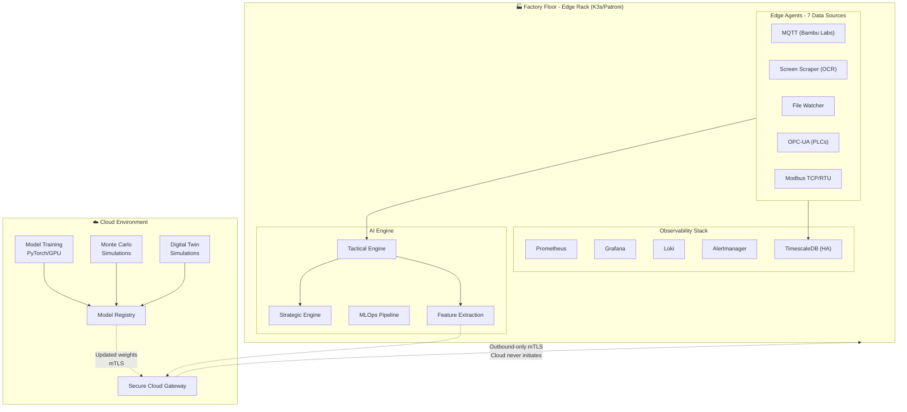

# OmniusGrid

<p align="center">
  <strong>Universal Manufacturing Data Feed Dashboard</strong><br>
  Production-grade IIoT platform with edge AI inference, cloud training, and comprehensive observability
</p>

<p align="center">
  
  
  
  
  
</p>

---

## Overview

OmniusGrid is a resilient manufacturing operations platform designed for Industry 4.0. It unifies data collection from diverse industrial equipment, provides real-time edge AI inference, and maintains secure cloud connectivity for model training and fleet-wide optimization.

### Key Capabilities

| Domain | Features |
|--------|----------|
| **Data Collection** | 7 industrial protocols (MQTT, OPC-UA, Modbus, Screen Scraping, File Watching) |
| **Edge AI** | <100ms inference loops, TorchScript models, automated model lifecycle |
| **Observability** | Prometheus metrics, Loki logs, Grafana dashboards, TimescaleDB |
| **Security** | mTLS device authentication, zero-trust networking, audit trails |
| **Operations** | K3s-orchestrated, Patroni HA, automatic disaster recovery |

---

## Architecture



---

## Quick Start

### Prerequisites

- Docker 24.0+ and Docker Compose
- 8GB RAM minimum (16GB recommended)
- 50GB available disk space

### Installation

```bash
# Clone repository
git clone https://github.com/SoundSafe-ai/Omnius-Grid.git
cd OmniusGrid

# Start all services
docker-compose up -d

# Verify service health
docker-compose ps

# Initialize database schema
docker-compose exec timescaledb psql -U omniusgrid -d omniusgrid \
  -f /docker-entrypoint-initdb.d/001_init.sql
docker-compose exec timescaledb psql -U omniusgrid -d omniusgrid \
  -f /docker-entrypoint-initdb.d/002_continuous_aggregates.sql
```

### Service Endpoints

| Service | URL | Credentials |
|---------|-----|-------------|
| Dashboard | http://localhost:3000 | - |
| API | http://localhost:8000 | Bearer token |
| API Docs | http://localhost:8000/docs | - |
| Grafana | http://localhost:3001 | `admin` / `omniusgrid_admin` |
| Prometheus | http://localhost:9090 | - |
| Alertmanager | http://localhost:9093 | - |
| Redpanda Console | http://localhost:9644 | - |

---

## Project Structure

```
OmniusGrid/
├── backend/                 # FastAPI application
│   └── app/
│       ├── api/            # REST endpoints
│       ├── services/       # Business logic (AI engines, MLOps)
│       ├── core/           # Configuration & security
│       ├── db/             # Database models
│       └── workers/        # Ingestion workers
├── edge-agent/            # Edge collector SDK
│   └── opsgrid_agent/
│       ├── collectors/     # Protocol implementations
│       └── buffer/         # SQLite store-and-forward
├── frontend/              # React dashboard
│   └── src/
│       ├── components/
│       └── pages/
├── database/              # Schema migrations
├── infra/                 # Deployment configs
│   ├── k8s/              # Kubernetes manifests
│   ├── prometheus/       # Alerting rules
│   ├── grafana/          # Dashboards
│   └── systemd/          # Service definitions
└── docs/                  # Architecture documentation
```

---

## API Reference

### Core Endpoints

| Method | Endpoint | Description |
|--------|----------|-------------|
| GET | `/api/v1/assets/` | List all manufacturing assets |
| GET | `/api/v1/assets/{id}` | Get asset details |
| GET | `/api/v1/telemetry/latest/{id}` | Latest telemetry data |
| POST | `/api/v1/alarms/{id}/acknowledge` | Acknowledge alarm |
| GET | `/api/v1/dashboard/oee` | Fleet OEE metrics |

### AI Engine Endpoints

| Method | Endpoint | Description |
|--------|----------|-------------|
| GET | `/api/v1/engines/tactical/status` | Edge inference status |
| POST | `/api/v1/engines/tactical/infer` | Run inference |
| GET | `/api/v1/engines/strategic/recommendations` | Optimization recommendations |
| POST | `/api/v1/engines/mlops/deploy/{version}` | Deploy model version |
| POST | `/api/v1/engines/mlops/rollback` | Rollback to previous model |

### Admin Endpoints

| Method | Endpoint | Description |
|--------|----------|-------------|
| POST | `/admin/collectors/{id}/restart` | Restart collector |
| POST | `/admin/assets/{id}/maintenance` | Set maintenance mode |
| GET | `/admin/system/status` | System health status |

---

## Features

### Data Collection

- **MQTT**: TLS-authenticated Bambu Labs printer integration
- **Screen Scraping**: OpenCV + Tesseract OCR for QIDI/SOVOL displays
- **File System**: ORCA Slicer G-code output monitoring
- **OPC-UA**: Industrial PLC communication
- **Modbus TCP/RTU**: VFD and legacy sensor integration
- **Store-and-Forward**: 24-hour local buffering for offline resilience

### AI/ML Pipeline

- **Edge Inference**: PyTorch TorchScript models for <100ms control loops
- **Cloud Training**: GPU-based training and Monte Carlo simulation
- **Data Thinning**: Feature vectors (not raw telemetry) transmitted to cloud
- **MLOps**: Automated model download, validation, hot-swap, and rollback
- **Two-Speed Architecture**: Tactical (real-time) + Strategic (macro-optimization)

### Operations Modes

- **Human-in-the-Loop**: Grafana dashboards, manual overrides, maintenance scheduling
- **Lights Out**: Automated health probes, HA failover, systemd watchdogs
- **Observability**: Prometheus metrics, Loki centralized logging, Alertmanager routing

### Enterprise Features

- **Schema Evolution**: Strict Pydantic contracts with Dead Letter Queue
- **Zero-Trust Security**: mTLS device provisioning with certificate revocation
- **Immutable Audit Trail**: Tamper-evident logging with cryptographic hash chaining
- **Disaster Recovery**: pgBackRest WAL archiving to S3 with point-in-time recovery

---

## Security Model

| Layer | Implementation |
|-------|----------------|
| Network | Purdue Model - Manufacturing zone isolated from enterprise/cloud |
| Device | mTLS mutual certificate authentication per device |
| Identity | Unique cryptographic identity per device |
| API | JWT Bearer token authentication |
| Audit | Hash-chained tamper-evident command logging |

---

## Documentation

- [Hybrid Architecture](docs/HYBRID_ARCHITECTURE.md) - Human-in-the-Loop + Lights Out modes
- [Gold Standard Architecture](docs/GOLD_STANDARD_ARCHITECTURE.md) - Edge AI + Cloud Training
- [Implementation Summary](docs/IMPLEMENTATION_SUMMARY.md) - Complete feature inventory

---

## License

Proprietary License - All rights reserved. Unauthorized use, reproduction, or distribution is prohibited.
