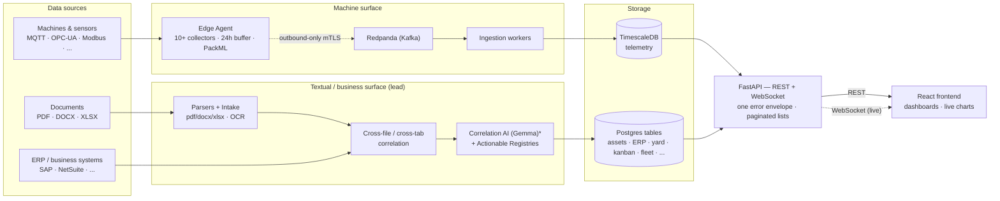
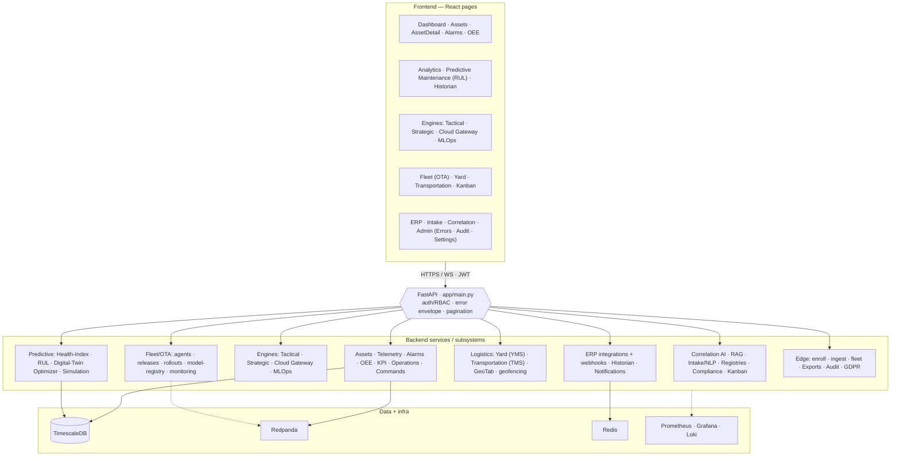
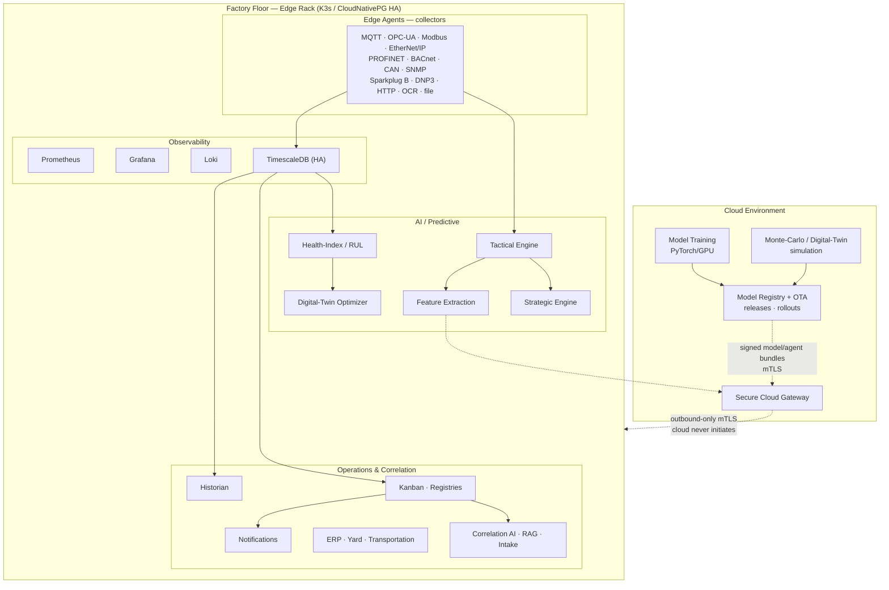
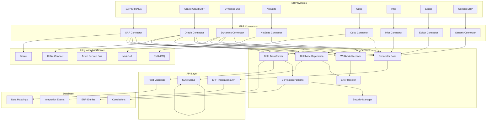
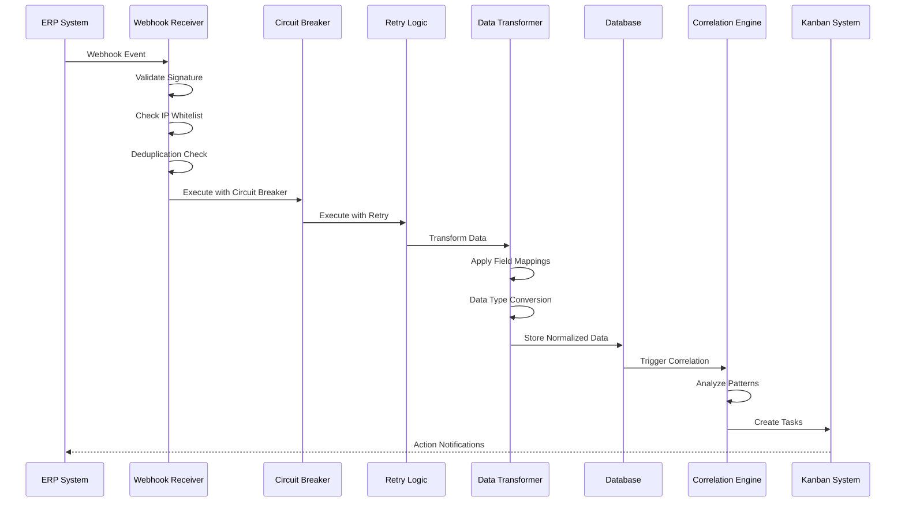

<p align="center">
  <picture>
    <source media="(prefers-color-scheme: dark)" srcset="docs/assets/brand/omniusgrid-lockup-dark.png">
    <source media="(prefers-color-scheme: light)" srcset="docs/assets/brand/omniusgrid-lockup-light.png">
    
  </picture>
</p>

<p align="center">
  <strong>Data Correlation for Industry 4.0</strong><br>
  Production-grade IIoT platform with edge AI inference, cloud training, and comprehensive observability
</p>

<p align="center">
  
  
  
  
  
</p>

---

## Quickstart

```bash
# 1. Create local env files from the templates
make env            # copies .env.example -> .env for root/backend/frontend/edge-agent

# 2. Start the stack (Redpanda, TimescaleDB, backend, frontend, observability)
make up             # docker-compose up -d;  add tracing with `make tracing`

# 3. Run the test suites
make test           # backend + edge (pytest) + frontend (vitest)
make e2e            # frontend Playwright smoke

# Other handy targets
make sdk            # regenerate the typed TS API client from the OpenAPI schema
make help           # list all targets
```

Migrations: `python backend/scripts/migrate.py` (Postgres; `--status`,
`--baseline`, `--rebaseline-drifted` for adopting existing databases).
Production deploys: see [docs/deployment/DEPLOYMENT.md](docs/deployment/DEPLOYMENT.md)
(compose-prod, Kubernetes, bare-metal edge, broker TLS).

Backend: http://localhost:8000 (`/docs` for the API). Frontend: http://localhost:9999.
Jaeger (with `make tracing`): http://localhost:16686. Copy and edit the `.env`
files for real credentials — never commit them.

---

## Overview

OmniusGrid is a resilient manufacturing operations platform designed for Industry 4.0. It correlates data from across the entire operation, unstructured business documents (spreadsheets, PDFs, images via the intake pipeline), ERP systems (13 connectors), industrial equipment on the factory floor (10 protocol collectors), audio/video sensors, fleet telematics (GeoTab), and yard and transportation logistics, into one queryable, cross-correlated picture. On top of that substrate it provides real-time edge AI inference, an NLP correlation assistant, compliance registries with RAG-backed document search, and secure cloud connectivity for model training and fleet-wide optimization.

**How we land and grow.** We start with a low-friction pilot — typically the intake pipeline, correlating a customer's existing spreadsheets, PDFs, and ERP records into a single queryable picture, so they see cross-correlated insight without touching a single machine. Once that proves value, we move into refinement and deployment, tuning the correlation to their operation and rolling it into production. From there the account expands beyond textual data intake onto the full data surface — factory-floor equipment (10 protocol collectors), audio/video sensors, fleet telematics, and real-time edge AI inference — turning a document-correlation pilot into the operation's central nervous system.

### Key Capabilities

| Domain | Features |
|--------|----------|
| **Data Collection** | 10 industrial protocol collectors (MQTT, OPC-UA, Modbus TCP/RTU, EtherNet/IP, PROFINET, BACnet, CAN bus, HTTP/REST, Screen Scraping/OCR, File Watching) |
| **Real-time Pipeline** | WebSocket broadcasting, subscription management, live telemetry/state/alarms |
| **Command Executor** | Queued commands with retries, timeouts, cancellation, emergency stop, Redpanda integration |
| **OEE Automation** | Automated OEE calculation from PackML states and telemetry part counting |
| **Edge AI** | <100ms inference loops, TorchScript models, automated model lifecycle, graceful fallback |
| **Observability** | Prometheus metrics, Loki logs, Grafana dashboards, TimescaleDB |
| **Security** | Agent enrollment with CA pinning, mTLS + proof-of-possession request signing, Redpanda broker mTLS, route-walk auth enforcement test, tamper-evident audit trails |
| **DevOps** | GitHub Actions CI/CD with **13 blocking gates** (tsc/eslint/vitest/Playwright, the full backend suite against a real TimescaleDB, migration-chain hygiene, supply-chain: pip-audit/npm-audit/Trivy, and four Kubernetes gates: manifest validation, NetworkPolicy simulation, kind smoke test, Calico policy-enforcement test), kustomize deploys with operator-gated platform stacks, Kubernetes base incl. workers + Redis + db-migrate Job, checksum-tracked SQL migration runner |
| **Operations** | K3s-orchestrated, CloudNativePG HA (auto-failover + PITR), KEDA lag-based worker autoscaling, automatic disaster recovery. The deploy applies the monitoring/autoscaling/HA-DB stacks itself, each gated on its operator's CRDs being present |
| **Logistics** | YMS/TMS with GeoTab telematics, detention billing, HOS compliance, dock-production sync, webhook processing |
| **Task Management** | Kanban board with task grouping, assignment, approval workflows |
| **Compliance** | Actionable registries (OSHA, ISO, internal), data correlation mapping, scoring |
| **Analytics** | Recharts integration with temperature trends, vibration analysis, OEE metrics, asset health distribution |

---

## Active Development & Team Progress

> **Snapshot: July 19, 2026.** Both remotes (`origin` = SoundSafe-ai, `backup` = SoundSafe-Dev)
> are in sync. **`main` was promoted from `hamad/converged-pre-main` on 2026-07-17**; the
> FS-141+ work described below has since landed on `hamad/converged-pre-main` and is **ahead of
> `main`**, so start new work from `hamad/converged-pre-main` until the next promotion.
> Reinstall deps after pulling (`pip install -r backend/requirements.txt` — `scipy` is new and
> `testcontainers` moved to `requirements-dev.txt`; `npm install` in `frontend/`). This maps
> in-flight work to owners so contributors can coordinate and avoid overlap. Branch tips move —
> treat this as a directory, not a record of exact commits.
>
> **`frontend/node_modules` is no longer tracked in git.** It was committed before `.gitignore`
> listed it, which made the ignore rule inert and every `npm install` produce thousands of
> spurious diffs. If `git status` still shows it after pulling, run `npm ci` in `frontend/`.

### Convergence branch — `hamad/converged-pre-main` (merge candidate)

The integration branch for the next `main`: it merges every workstream
(Hridyansh's OTA + tenant/RBAC hardening, Harsh's correlation-AI + MLOps +
mobile/kanban, Hudson's RAG compliance-doc pipeline) and carries the
**70-task hardening program** (fixed sprints FS-01..70, each sprint
code-reviewed) plus the FS-71..140 fixed-sprint batches. It was **promoted to
`main` on 2026-07-17** (main's tree now equals this branch); new work continues
to land here and is promoted to `main` periodically. Highlights:

- **Real mode is the default** — the frontend mock layer is opt-in
  (`VITE_USE_MOCK=true`); every API client has a real backend path, bridged by
  one prefix-gated snake↔camel transform seam instead of per-call converters.
- **Auth actually enforced** — all routers gated; a route-walking test fails CI
  by name on any route that answers anonymously; websocket auth rides
  `Sec-WebSocket-Protocol` (tokens out of query strings/access logs);
  `validate_settings` fail-fasts insecure production config (dev-token, open
  registration, missing secrets).
- **One schema, one migration path** — `backend/scripts/migrate.py`
  (checksum-tracked, idempotent, baseline/rebaseline flows) applies the full
  chain `001..042` on a clean Postgres for the first time in repo history;
  UUIDs are native on Postgres everywhere (dialect-aware `UUIDString`, with a
  guarded conversion migration for pre-existing databases); tests build their
  schema through the same runner (tenant-isolation RLS suite runs against the
  real chain).
- **Edge security chain complete** — enrollment with CA pinning, mTLS,
  proof-of-possession request signing with clock-skew recovery, quarantining
  store-and-forward buffer, and a Redpanda **mTLS listener** (broker certs
  issued by the same edge CA agents already trust; proven end-to-end incl.
  certless-client rejection).
- **Production deploy paths that work** — `docker-compose.prod.yml` (required
  secrets, one-shot migration service, nginx-served SPA with same-origin
  proxying), Kubernetes base with **all four workers + a db-migrate Job**
  (migrations baked into the backend image), CI deploys via
  `kustomize edit set image`, and blocking CI gates (tsc, eslint, pytest,
  vitest, builds — all at zero).
- **Sensor story finished** — audio/video collectors have real-capture config
  templates + cutover guide (`docs/edge/SENSOR_CAPTURE.md`); AssetDetail
  switches panes by `sensor_class` and renders live telemetry; the once-orphaned
  chart suite is wired (or deleted).
- **Product demo video** — Remotion compositions (4K + mobile 9:16) under
  `frontend/video/` (`npm run video:*`; renders are not committed).
- **Dependencies current, supply chain gated** — backend/edge Python pins
  jumped ~2 years to current (FastAPI 0.139, Pydantic 2.11, SQLAlchemy 2.0.51,
  aiokafka 0.14, cryptography 48; `pip-audit` 60 → 0 modulo one documented,
  fix-less advisory) and the frontend npm audit went 19 → 0 (vite 7, vitest 4,
  ts-eslint 8). The `supply-chain` CI job is now **blocking** (`pip-audit` +
  `npm audit --audit-level=high` + Trivy fs scan).

### Delivered since the 70-task program — FS-71..90 (Sprints L–P + real-DB pass)

The next batch is **done** and on this branch. (The original FS-71..82 plan was
re-scoped once a re-scan showed Hridyansh's branch had already built the
predictive-maintenance RUL and digital-twin optimizer — so those merged rather
than being rebuilt, preventing duplicate work.)

- **Integration merges landed.** `hridyansh/integration` — predictive-maintenance
  RUL (`/api/v1/rul`), digital-twin optimizer (`/api/v1/twin`), auth-session
  hardening + token rotation, RBAC route-roles across every router, durable
  command dispatch, tenant historian/retention (`/api/v1/historian`); its
  colliding migrations were renumbered to `034–038`. Plus the RAG compliance-doc
  pipeline (`/api/v1/rag`). Two previously-orphaned routers (model-monitoring,
  admin query-performance) are now mounted.
- **Supply-chain & runtime hardening.** `python-jose` → **PyJWT** (drops the
  `ecdsa` advisory and the last `pip-audit --ignore-vuln`); backend/frontend/RAG
  images run **non-root**; k8s **egress** allow-lists added; the Trivy filesystem
  scan is now **blocking** (with a curated `.trivyignore`).
- **API contract.** Every router mount documents its `401/403/404/422/429/500`
  responses (`app/core/responses.py`); a `Page[T]` pagination envelope on the
  assets + alarms lists; wider `response_model` coverage. The schemathesis
  contract gate is wired + green-capable but stays **advisory** pending one CI run.
- **Frontend.** `react-query` v3 → **`@tanstack/react-query` v5** (33 files); the
  digital-twin, RUL, and historian backends are wired into the UI.
- **Real-DB correctness.** The app was silently broken against a *migrations-built*
  Postgres (SQLite `create_all` hid it): ORM↔migration drift fixed — migrations
  `039/040` add missing `users.*` columns and rename 8 tables' `metadata` →
  `meta_data`, and `assets.workcell_id` is now required — plus a batch of
  endpoints that 500'd only on real Postgres repaired (nlp sessions, telemetry
  `meta_data`, yard/transportation naive-`utcnow()` vs `TIMESTAMPTZ`, graceful
  `503`s for redis/pg_stat-backed diagnostics).

### Delivered since — FS-91..140 (real-DB lock-in, observability, edge, contract, deploy)

The next batches are **done** and on this branch (and now on `main`). Theme of
the slice: eliminating *silent* failures — tests that skip, alerts that can't
fire, data quietly dropped, errors that only reach a log. Every fix ships with a
guard so the gap can't silently reopen.

- **Real-DB correctness, locked in (FS-91/92/93/96/97/114).** Schema-parity +
  endpoint/write smoke guards run against an ephemeral **testcontainers**
  TimescaleDB, and a new **blocking backend-realdb CI job** runs them on every
  `hamad/**` push (they had been silently skipping — `testcontainers` was never
  pinned; note the pin added here then *collided* with one in `requirements.txt`
  and made the whole job uninstallable until FS-141+ resolved it). A backend+edge timezone-aware sweep fixed naive-`utcnow()`-vs-
  `TIMESTAMPTZ` data-loss bugs (incl. an edge age-lag that read 0 forever and a
  coordinator that dropped readings).
- **Observability for the converged subsystems (FS-105/107/108/110).**
  `opsgrid_*` metrics for rul / twin / historian / notifications; a new
  `opsgrid_subsystems` **alert group gated by a promtool CI job** (nothing
  validated the alert rules before); correlation-id propagation onto the
  **WebSocket** path (it bypassed the HTTP middleware); and subsystem failures
  (rul notify, twin emit, notification delivery) wired into **error-triage**.
- **API contract (FS-102/103).** RFC-9457 **`application/problem+json`** on error
  responses (additive over the legacy envelope) + wider **Idempotency-Key**
  coverage across mutation surfaces.
- **Edge telemetry chain (FS-120/121/123).** Five silent data-loss bugs fixed:
  Sparkplug B aliased-DATA drop + rebirth/seq handling, SNMP Counter64 precision,
  and an edge-buffer retention bug that string-compared timestamps and wiped
  fresh rows. Edge suite 175 → 186 tests.
- **Audit & runtime security (FS-111/116).** Audit-log coverage for the new
  control-plane mutations (twin optimize, model reset, query-perf admin); and
  per-workload **k8s egress allow-lists** finishing the default-deny posture.
- **Offline demo depth (FS-135/137).** `make demo` one-shot (seed → serve the API
  against SQLite `dev.db`, dev-token auth) plus a **CI smoke** that seeds and
  hits the gap-area endpoints so the seeder can't silently rot.
- **Frontend real-mode depth (FS-126/127/130/131/132) + brand system.** Telemetry
  paging + range/zoom, pagination controls on every `Page[T]` list, WebSocket
  reconnect/backoff, the RUL / historian / digital-twin pages and notifications
  center, and the logo/wordmark brand system (sidebar + login headers).

Still deferred/flagged: the schemathesis gate flip (needs a green CI run); the
py3.11 DNP3 driver (upstream ships no compatible wheel); and the remaining
FS-91..140 backlog — SDK regen (FS-101/104), HPA/PDB + secrets/canary
(FS-113/115/117), edge enrollment/hot-reload/e2e harness (FS-122/124/125),
real-mode audit + loading states (FS-128/129), seeder profiles + continuous
aggregates + offline export (FS-133/134/136), and the signed-URL/geotab/ERP
security passes (FS-138/139/140). The 3 intake-lane test failures remain Harsh's.

### Delivered since — FS-141+ (release path, backups, and the guards that weren't guarding)

On `hamad/converged-pre-main`, ahead of `main`. The theme is the previous
slice's taken one level further: not just *silent failures*, but **guards that
reported success while testing nothing**, and **subsystems that had never once
worked against a production-shaped database**.

- **The blocking `backend-realdb` gate now passes — for the first time ever.**
  It had never installed: `requirements.txt` pinned
  `testcontainers[postgres]==4.14.2` while `requirements-dev.txt` pinned `3.7.1`
  *and* did `-r requirements.txt`, so `pip install -r requirements-dev.txt` — the
  exact command that job and the ci-cd backend job run — failed with
  `ResolutionImpossible`. **Backend dependencies were uninstallable in CI from
  2026-07-17.** Resolved forward onto 4.x; `testcontainers` also left
  `requirements.txt`, where a test-only dependency was being baked into the
  runtime image.
- **The audit trail was silently empty on every real deployment.** Two
  independent faults, both swallowed by the middleware's catch-all as
  `audit_log_failed`, so every request reported success while nothing was
  recorded: `audit_logs.ip_address` is `INET` in migrations but was `String(45)`
  in the ORM (every insert bound `::VARCHAR` and was rejected), and `audit_logs`
  is `FORCE ROW LEVEL SECURITY` while the middleware wrote through a session that
  never set `app.current_org_id`. **`FORCE` applies even to the table owner**, so
  no connecting role escaped it.
- **Endpoints that had never returned a success.** Yard trailer check-in 500'd on
  the same `FORCE`-RLS problem (all 18 yard routes moved to `get_tenant_db`,
  which also closes a tenant-trust hole — `organization_id` came from the request
  body). Five logistics call sites used the SQLAlchemy 1.x
  `func.case([...], else_=0)` signature and raised on first execution; one also
  counted *expired* insurance as valid, because `CASE` returns on first match.
  All five `/model-monitoring` endpoints 500'd because `scipy` was never declared,
  so the router fell back to `service = None`.
- **PackML state ingestion was dead.** Both statements in the ingestion worker's
  state path were f-strings passed bare to `session.execute()`; SQLAlchemy 2.x
  rejects a plain `str`, and the caller rolls back and re-raises — so *every*
  state message failed and no `packml_states` row was ever written, silently
  corrupting downtime/OEE history. The path had no test; it has four now.
- **Guards that were passing vacuously.** The real-DB endpoint smoke walked
  `app.routes` directly and so probed **2 GET routes instead of ~200** (fastapi
  ≥0.130 keeps `include_router()` results as lazy containers). The schema-parity
  guard only compared `id`/`*_id` columns for uuid-vs-text — structurally why the
  `ip_address` drift was invisible to it; widened to all columns, it immediately
  found three more. Both walks now share one definition in `tests/route_walk.py`.
- **Access control, both sides of the wire.** `AdminRoute` was implemented and
  exported but wired to no route, so all nine `/admin/*` pages sat behind
  `ProtectedRoute` alone. `GET /edge/fleet` — which backs `/admin/collectors` —
  required only an authenticated user *and* carried no `organization_id` filter,
  letting any tenant enumerate every organization's edge agents. Both fixed, with
  a guard test and a new policy-side assertion (the old admin inventory was a
  *regression lock*, not a policy check, and was shaped around the `/admin/`
  path prefix).
- **Webhooks fail closed.** ERP webhook signature verification returned `True`
  when no secret was configured — and its own test asserted that as intended
  behaviour ("open webhook"), which is why review never caught it. The
  route-auth walk exempts this route *on the grounds that it is HMAC-protected*,
  so the exemption was unearned. A second, currently-unreachable receiver
  returned `True` whenever the signature header was simply absent.
- **Real backups exist now.** Staging and production had **none**: the only
  pgBackRest CronJob lives in `legacy-patroni/`, which CI never applies, so every
  DR runbook restored from a repository nothing wrote to. pgBackRest cannot run in
  the deployed stack at all (`timescale/timescaledb:latest-pg15` ships no
  `pgbackrest` binary and no `archive_mode` is configured), so a nightly
  `pg_dump -Fc`-to-S3 CronJob landed as the working safety net, with an egress
  NetworkPolicy and **a restore drill in the blocking gate** — a backup nobody
  restores is not a backup. PITR via `timescaledb-ha` is the tracked next step;
  see [`docs/runbooks/database-backup-restore.md`](docs/runbooks/database-backup-restore.md).
- **The release path.** Both deploy jobs ran a single `kubectl apply -k`, which
  updates the Deployments and creates the migration Job together — so new pods
  began serving before migrations finished. Deploys now apply the Job alone, wait,
  then apply the rest. Every trigger naming `develop` was dead (that branch has
  never existed), which is why staging was never deployed and four
  `hridyansh/**` branches ran **zero CI**.
- **Repo hygiene, enforced.** The root `.dockerignore` existed only in a working
  tree, so CI built the backend image with `frontend/`, `backend/venv`, `.git`
  and `*.pem` in the build context. 19,048 `node_modules` files were untracked. A
  blocking `repo-hygiene` job now fails on any tracked dependency tree, build
  output, or key material.

Known-remaining endpoint failures against a real database are **other lanes** and
are tracked in an attributed `KNOWN_LANE_FAILURES` list in the endpoint smoke,
which asserts both directions so it cannot rot: kanban ×4 and the nlp intake
correlation query (Harsh), `/rag/documents` (Hudson). Also still open: the k8s
cluster has **no monitoring stack at all** — no Prometheus, Alertmanager, Grafana
or kube-state-metrics — so every alert rule and dashboard in `infra/prometheus`
and `infra/grafana` only runs under docker-compose, and backup/migration-failure
alerting is blocked on that decision. `HAMAD_IDE.pem` remains retrievable from
git history; see [`docs/runbooks/leaked-key-rotation.md`](docs/runbooks/leaked-key-rotation.md)
(rotation is the fix and is still outstanding; the history purge is deliberately
deferred because it would rewrite every collaborator's branch).

### Offline demo — `backend/scripts/seed_demo_data.py`

The whole platform demos with **no live edge, cloud, or external services**.
`seed_demo_data.py` seeds every page — assets, 14 days of correlated telemetry,
alarms, OEE, a fully-synced ERP integration, yard, transportation, geofencing,
kanban, operations, fleet OTA, MLOps model registry, compliance/registries,
notifications, error-triage, exports, and historian — idempotently. The only
thing that still needs its model is the Correlation-AI **inference** (a ready
`AnalysisSession` is seeded). See [`docs/DEMO.md`](docs/DEMO.md).

### Subsystem ownership — check here before starting work

| Area | Active owner(s) | Branches / notes |
|------|-----------------|-------|
| Correlation AI / NLP / intake / spreadsheet parsing | **Harsh** | `feature/gemma-correlation-ai`, `HARSH-CONTRIBUTION`. Coordinate before touching `correlation_ai_engine.py`, `nlp_correlation.py`, intake services. Owns the 3 failing intake tests + scenario-builder import drift, and the Gemma correlation model. |
| Mobile app / Kanban / demo API | **Harsh** | Merged; kanban/nlp files received mechanical-only fixes on the convergence branch (flagged in commit messages). |
| MLOps (model registry + training + monitoring) | **Harsh** | `model_registry` / `model_training_runs`; model-monitoring drift + performance tracking. |
| RAG / compliance doc pipeline (SeaweedFS/S3 + Gemma inference) | **Hudson** (htreinen) | `htreinen`, `feature/RAG-Compliance-Doc-Pipeline`. `/api/v1/rag`; containerization seam in `docs/RAG_CONTAINERIZATION.md`. His `origin` is the SoundSafe-Dev mirror. |
| Tenant isolation / RBAC / security hardening | **Hridyansh** | `hridyansh/tenant-isolation-middleware`. RLS enforced through the canonical `app.current_org_id` GUC everywhere (incl. ERP tables). |
| OTA / edge command dispatch / agent releases | **Hridyansh** | `hridyansh/edge-command-dispatch`, `hridyansh/edge-agent-retry-logic`. Rollout orchestrator + agent-side executor; `ota-rollout-worker` runs in compose + k8s. |
| ERP connector + integration / package layout | **Hridyansh** | `hridyansh/integration`, `hridyansh/integration-erp`, `hridyansh/package-renaming-fix`. |
| Edge platform, backend platform, frontend/UI, deploy/CI, schema, observability, docs | **Hamad** | `hamad/converged-pre-main` (integration → `main`). The convergence program + the FS fixed-sprints above. |
| *(ramp-up)* — under Harsh's lane | **Alex** | New contributor (joining the correlation/MLOps area under Harsh); not yet assigned a branch or task. |

> ⚠️ The pre-convergence feature branches are all merged into
> `hamad/converged-pre-main` and now into **`main`**. **Start new work from
> `main`** (or from your own active branch after merging `origin/main` into it),
> not from stale feature branches. A one-time `TEAM_UPDATE.md` heads-up was
> pushed onto each active dev branch (safe to delete once read).

## Architecture

### 1. End-to-end data flow

OmniusGrid's differentiator is correlating the **document / ERP** world with the
**machine** world. Textual/business data is the *lead* surface; machine telemetry
is the second. Both converge into one API that the frontend renders.



\* Correlation-AI **inference** needs the Gemma model. Everything else runs fully
offline — see [Offline demo](#offline-demo--backendscriptsseed_demo_datapy).

### 2. Component & subsystem map — how it's wired

Every frontend page talks to `app/main.py` (60+ routers behind one error envelope
+ JWT auth), which delegates to the services below, which read/write the stores.



### 3. Physical / deployment topology (offline-capable edge + cloud)



### 4. Production reliability & operations

The Kubernetes stack (`infrastructure/k8s/`) is built for multi-pod, no-single-
point-of-failure operation. Beyond the app Deployments, these are the enterprise
reliability layers (each with its own README):

| Concern | Implementation | Where |
|---------|----------------|-------|
| **Database HA** | 3-instance CloudNativePG — automatic failover, synchronous replication (RPO≈0), continuous WAL archiving to S3 for PITR, PgBouncer pooler | [`database-ha/`](infrastructure/k8s/database-ha/) |
| **Worker autoscaling** | KEDA scales ingestion / export / compliance workers on Redpanda consumer-group **lag** (export + compliance scale to zero when idle) | [`autoscaling/`](infrastructure/k8s/autoscaling/) |
| **Observability** | Prometheus + Alertmanager + kube-state-metrics + Grafana, in-cluster; canonical alert rules shared with docker-compose; a "Platform / Infra" dashboard for HA-DB / autoscaling / backups | [`monitoring/`](infrastructure/k8s/monitoring/) |
| **Distributed tracing** | otel-collector + Jaeger, now actually reachable: policies both directions, OTLP export wired on the API and all four workers, and probes on the collector's `health_check` extension. Previously deployed with NO NetworkPolicy in a default-deny namespace and no OTEL env on the backend — dead in Kubernetes AND in compose, with nothing erroring | [`otel-collector.yaml`](infrastructure/k8s/base/otel-collector.yaml) |
| **DR site** | `overlays/dr` — standby namespace, DR hostnames, cold-standby replicas. Makes the datacenter-outage runbook executable; data replication remains pgBackRest's job | [`overlays/dr/`](infrastructure/k8s/overlays/dr/) |
| **ERP connectors** | SAP, Oracle, Dynamics, NetSuite, Infor, Epicor, Odoo. Three of them could not be **imported** — SAP/Oracle needed `requests_oauthlib` and Dynamics needed `msal`, neither a declared dependency — so the factory resolved straight at an ImportError. All seven now load, authenticate over async OAuth2 client-credentials (NetSuite via OAuth 1.0a TBA), and paginate | [`erp_connectors/`](backend/app/services/erp_connectors/) |
| **User & role management** | Admin-gated user CRUD at `/api/v1/users`, an ordered role vocabulary with a CHECK constraint, last-admin guards, and audit rows written in the same transaction as the change. Only `GET /users` existed before, which is why the admin UI was hard-disabled | [`user_management.py`](backend/app/api/user_management.py) |
| **Server-side alarm rules** | Operators define thresholds (metric, comparator, duration, hysteresis, severity, target) that are evaluated against incoming telemetry in the ingestion path. Previously severity was whatever the edge agent sent and nothing evaluated telemetry at all, so a duration-based alarm could not be expressed | [`alarm_rules.py`](backend/app/services/alarm_rules.py) |
| **Worker health** | The four background workers serve `/metrics`, `/healthz`, `/readyz` on :9109 with **heartbeat-based** liveness, so a wedged consumer — process alive, loop dead — reports unhealthy and gets restarted. They previously exposed nothing: no probes were possible and Prometheus scraped nothing | [`workers/health_server.py`](backend/app/workers/health_server.py) |
| **Cache / job store** | Redis — rate limiting, cross-worker idempotency, async export job store. It previously appeared only as a NetworkPolicy destination with no Service behind it, so the always-on auth limiter 500'd every login when it was unreachable | [`base/redis-statefulset.yaml`](infrastructure/k8s/base/redis-statefulset.yaml) |
| **Object storage** | Generated exports & compliance reports go to SeaweedFS (S3) so a worker on one pod and the API on another share one bucket — fixes cross-pod download | [`base/object-store.yaml`](infrastructure/k8s/base/object-store.yaml) |
| **Secrets** | Sealed Secrets (encrypted, safe-in-git) **or** External Secrets Operator (Vault / AWS SM / GCP SM). Placeholder dev credentials are **enforced** out of both deployed environments — a blocking gate fails if one becomes reachable, or if the deploy stops filtering them | [`secrets/`](infrastructure/k8s/secrets/) |
| **CI safety** | **14 blocking gates** on every branch push. Backend: `backend-realdb` (schema parity, tenant isolation + RLS, timestamp defaults — against an ephemeral TimescaleDB, because RLS and server defaults are both no-ops on SQLite), `backend-full` (~830 tests), `backend-kafka-e2e` (container e2e in its own process), `migration-hygiene`. Kubernetes: `k8s-manifests` (build + kubeconform + placeholder-credential check), `netpol-simulate`, `k8s-smoke` (kind: real operator webhooks), `k8s-netpol` (kind + **Calico**: policies genuinely enforced, 19 allow/deny cases), `netpol-coverage` (every workload in a default-deny namespace has a policy in both directions — the gap that killed tracing). Plus `prometheus-rules` (lints `alerts.yml` + `slo_rules.yml`, checks **both** Prometheus configs, and runs the alert unit tests), `frontend-e2e-authenticated` (stands up Postgres + migrations + demo data + uvicorn and asserts the dashboard shows **non-zero** data — an element-visibility check would have passed against the FS-191 tenancy bug), `supply-chain`, `repo-hygiene`, frontend unit + e2e | `.github/workflows/quality-gates.yml` |
| **Load / failover testing** | Kafka ingestion load generator (drives KEDA scaling + DB writes) + a runbook for driving throughput and DB-failover-under-load | [`tests/load/`](tests/load/) |

### 5. Page → API wiring

How each frontend page is wired to the backend (primary endpoints; all under
`/api/v1`, JWT-gated, live updates over `/ws`):

| Frontend page | Backend endpoints / routers | Key services |
|---------------|-----------------------------|--------------|
| Dashboard | `dashboard`, `assets`, `alarms`, `oee`, `kpi` | oee_calculator, aggregators |
| Alarm Rules | `alarm-rules` | alarm_rules (evaluated in the ingestion path) |
| Admin → Users | `users` | user_management, audit |
| Assets / AssetDetail | `assets`, `telemetry`, `commands`, `health-index` | telemetry, command_executor |
| Alarms | `alarms` | alarm rules |
| OEE / Analytics | `oee`, `kpi`, `telemetry`, `operations` | oee_calculator |
| Predictive Maintenance | `rul`, `health-index` | rul, health_index |
| Historian | `historian` | historian / data_retention |
| Engines (Strategic/Tactical/Cloud/MLOps) | `engines`, `twin`, `simulation`, `models`, `model-monitoring` | strategic_engine, tactical_engine, twin_optimizer, simulation, mlops_pipeline |
| Fleet (OTA) | `fleet/agents`, `fleet/releases`, `fleet/rollouts`, `model-releases` | rollout_orchestrator, agent_signing |
| Yard (YMS) | `yard` | yard_management |
| Transportation (TMS) | `transportation`, `geotab`, `geofencing`, `maintenance`, `fleet` (health) | transportation_management, geotab_service, routing |
| Kanban | `kanban` | kanban / correlation task creation |
| ERP | `erp/integrations`, `erp/webhooks` | erp_connector_factory, erp_webhook_receiver |
| Intake / Correlation | `nlp`, `analysis-sessions`, `platform-correlation`, `rag` | correlation_ai_engine, rag_retriever, intake parsers |
| Notifications | `notifications` | notification_service |
| Admin — Error Triage | `admin/errors` | error_tracker |
| Admin — Audit / Settings | `audit`, `organizations`, `feature-flags`, `admin/query-performance` | audit_trail, feature_flags |

---

## Quick Start

### Prerequisites

- Docker 24.0+ and Docker Compose
- 8GB RAM minimum (16GB recommended)
- 50GB available disk space

### Installation

```bash
# Clone repository
git clone https://github.com/SoundSafe-ai/Omnius-Grid.git
cd Omnius-Grid

# Start backend services (recommended)
./start.sh

# This script:
# - Starts Redpanda, TimescaleDB, and Backend API
# - Waits for services to be healthy
# - Ensures backend is ready before frontend starts

# Then start the frontend
cd frontend && npm run dev
```

**Alternative: Start all services with Docker Compose**

```bash
# Start all services (including frontend in Docker)
docker-compose up -d

# Verify service health
docker-compose ps

# Initialize database schema (if needed)
docker-compose exec timescaledb psql -U omniusgrid -d omniusgrid \
  -f /docker-entrypoint-initdb.d/001_init.sql
docker-compose exec timescaledb psql -U omniusgrid -d omniusgrid \
  -f /docker-entrypoint-initdb.d/002_continuous_aggregates.sql
```

### Service Endpoints

| Service | URL | Credentials |
|---------|-----|-------------|
| Dashboard | http://localhost:9999 | Login with `dev` / any password (dev mode) |
| API | http://localhost:8000 | Bearer token (auto-generated in dev mode) |
| API Docs | http://localhost:8000/docs | - |
| Grafana | http://localhost:3001 | `admin` / `omniusgrid_admin` |
| Prometheus | http://localhost:9090 | - |
| Alertmanager | http://localhost:9093 | - |
| Redpanda Console | http://localhost:9644 | - |

### Development Mode Authentication

Development builds include an auth bypass, gated on BOTH sides:

- **Backend**: accepts `dev-token` as an admin Bearer token only while
  `ALLOW_DEV_TOKEN=true` (the dev default). Production startup **fails fast**
  if the flag is left on — the token is never valid in production.
- **Frontend**: logging in with username `dev` (any password) uses the bypass
  only in a dev build **and** with `VITE_DEV_MODE=true` set (see
  `frontend/.env.example`). Production bundles can never enable it.

For real-mode logins, register a user (dev only: `POST /api/v1/auth/register`,
gated by `ALLOW_OPEN_REGISTRATION`) or seed demo data (`make seed-demo`).

### Local Development Setup

For local development, the frontend should be run directly (not via Docker) to avoid native module issues:

```bash
# Start backend services only
docker-compose up -d timescaledb backend

# Start frontend separately
cd frontend
npm install
npm run dev -- --port 9999
```

**Important Configuration Notes:**
- Frontend runs on port 9999, backend on port 8000
- All API clients configured to use `http://localhost:8000` (see `frontend/src/api/client.ts`)
- WebSocket connections use `ws://localhost:8000/ws`
- CORS is configured to allow all origins for development
- Database models use String(36) for UUID columns to ensure PostgreSQL compatibility

### Demo Data & Mock API

The frontend includes a comprehensive mock API system for demonstration and development:

- **Machine-Specific Telemetry**: Each asset type provides realistic telemetry data
  - 3D Printers: Nozzle/bed temperature, print speed, progress, filament usage
  - Conveyor Systems: Speed, load, temperature, vibration, power consumption  
  - CNC Machines: Spindle RPM, feed rate, cutting force, position coordinates
- **Dynamic Data**: Values include realistic variation to simulate real-time monitoring
- **Asset Management**: 5 demo assets with different types and PackML states
- **Historical Data**: Machine-specific historical telemetry with proper variance patterns

To use mock data, the frontend API clients are configured with `USE_MOCK = true` in the respective API files.

### Demo Kanban Tasks

For development and demo purposes, the system includes a seed script to populate the Kanban board with realistic task cards. This should be run after initial database setup to ensure the Kanban board displays demo data until client/site integration.

**Run the demo task seed script:**

```bash
cd backend
python scripts/seed_demo_kanban.py
```

**Demo Tasks Include:**
- **In Progress**: Conveyor belt jam investigation, Hydraulic Press temperature alarm response
- **Triage**: CNC Machine preventive maintenance, Steel sheets material request
- **Backlog**: Quality inspections, safety checks, OEE analysis, firmware updates, operator training
- **Review**: Changeover tasks, vibration investigations
- **Done**: Load cell calibration

**Important:** This seed script should be run during initial setup and after any database reset. The demo tasks provide a realistic starting point for demonstrations and development until actual client/site data integration is implemented.

---

## FAQ

### Deployment Model

**Q: Do we deploy one instance per client, or one shared multi-tenant deployment?**

A: One shared multi-tenant deployment. The system uses a single docker-compose stack with logical tenant separation via `organization_id` columns in the database. All organizations share the same infrastructure (PostgreSQL, Redpanda, backend, frontend).

### Vendor Mapping

**Q: When a new vendor mapping is needed, is there tooling for that, or do we edit the file?**

A: Code-based configuration, not a separate tooling UI. Vendor state → PackML mappings are managed in `edge-agent/opsgrid_agent/packml.py`:
- Add common mappings to the `DEFAULT_MAPPINGS` dictionary (lines 150-230)
- For asset-specific overrides, use the `packml_config` JSONB field in the database's `asset_types` table
- Pass `custom_mappings` parameter when creating a mapper via `create_mapper_for_asset_type()`

No separate file editing workflow - it's either code for common equipment or database config for per-asset customization.

### Correlation AI Engine & Gemma 4 Fine-Tuning

**Q: The Correlation AI engine currently returns simulated analysis with confidence hardcoded to 0.85, model labeled "gemma-4-placeholder". How do you plan on fine tuning the Gemma 4 model, per organization or like a gradual ramp?**

A: The current plan is a **single shared model** fine-tuned on the synthetic dataset (499,986 scenarios across 47 domains). The training curriculum describes LoRA fine-tuning followed by full fine-tuning with DeepSpeed, with no per-organization approach specified. Given the synthetic training data, a universal model is the starting point. Per-organization fine-tuning could be added later if organizations have unique operational patterns that the shared model doesn't capture.

**Q: Is there any real customer data in the evaluation set, or is it synthetic?**

A: Entirely synthetic. The evaluation set is generated by `backend/scripts/generate_dataset_enhanced.py` using state space files from `backend/state_space/` (assets.json, errors.json, logistics.json, compliance.json, etc.). There's no real customer data - it's all rule-based generation with optional LLM enhancement for more realistic scenarios.

### Package Naming

**Q: The edge agent package directory is opsgrid_agent, but other imports from omniusgrid_agent. Is there a rename in flight? I want to make sure I follow the right convention going forward.**

A: No rename in flight - this is a bug. The correct convention is `opsgrid_agent`. Several files in `edge-agent/opsgrid_agent/collectors/` incorrectly import from `omniusgrid_agent` (opcua_collector.py, mqtt.py, coordinator.py, screen_scraper.py, file_watcher.py, modbus_collector.py). These should be changed to import from `opsgrid_agent` consistently. Use `opsgrid_agent` for any new code.

### Tenant Isolation

**Q: Kanban endpoints derive organization_id from the authenticated user, but assets.py and telemetry.py take it as a query parameter or skip it entirely. Is there a tenant isolation middleware or Postgres RLS policy I'm missing?**

A: Assets and telemetry derive organization ownership from the authenticated user, not from client input. The canonical dependencies are ``get_tenant_org_id`` and ``get_tenant_db`` (implemented in ``app/core/tenant.py`` and imported through ``app/middleware/tenant_isolation.py``). Tenant-scoped endpoints declare ``org_id: UUID = Depends(get_tenant_org_id)`` and ``db: AsyncSession = Depends(get_tenant_db)``; the session configures PostgreSQL RLS via ``app.current_org_id``. Application queries still include explicit ``organization_id`` predicates. Cross-tenant asset and telemetry requests return ``404``. Client-provided ``organization_id`` values do not control tenant scope.

---

## Project Structure

```
OmniusGrid/
├── backend/                 # FastAPI application
│   └── app/
│       ├── api/            # REST endpoints
│       ├── services/       # Business logic (AI engines, MLOps)
│       ├── core/           # Configuration & security
│       ├── db/             # Database models
│       └── workers/        # Ingestion workers
├── edge-agent/            # Edge collector SDK
│   └── opsgrid_agent/
│       ├── collectors/     # Protocol implementations
│       └── buffer/         # SQLite store-and-forward
├── frontend/              # React 18 + TypeScript dashboard
│   └── src/
│       ├── api/            # API clients (axios, WebSocket)
│       │   ├── auth.ts
│       │   ├── assets.ts
│       │   ├── alarms.ts
│       │   ├── telemetry.ts
│       │   ├── engines.ts
│       │   └── websocket.ts
│       ├── components/     # React components
│       │   ├── ui/         # Reusable UI primitives
│       │   │   ├── Button.tsx
│       │   │   ├── Card.tsx
│       │   │   ├── Input.tsx
│       │   │   ├── Select.tsx
│       │   │   ├── Badge.tsx
│       │   │   ├── Table.tsx
│       │   │   ├── Skeleton.tsx
│       │   │   └── ChartContainer.tsx
│       │   ├── common/     # Domain-specific components
│       │   │   ├── PackMLBadge.tsx
│       │   │   ├── SeverityBadge.tsx
│       │   │   ├── StatusIndicator.tsx
│       │   │   └── TimeAgo.tsx
│       │   ├── charts/     # Data visualization
│       │   │   └── RealtimeTelemetryChart.tsx
│       │   ├── commands/   # Command UI
│       │   │   └── CommandPanel.tsx
│       │   ├── kanban/     # Task management
│       │   │   ├── KanbanBoard.tsx
│       │   │   ├── KanbanColumn.tsx
│       │   │   ├── KanbanCard.tsx
│       │   │   ├── TaskDetailModal.tsx
│       │   │   └── CreateTaskModal.tsx
│       │   ├── fleet/      # Fleet tracking
│       │   │   ├── FleetTrackerMap.tsx
│       │   │   ├── GeoTabIntegration.tsx
│       │   │   ├── GeofencingPanel.tsx
│       │   │   ├── HealthSecurityPanel.tsx
│       │   │   ├── MaintenancePanel.tsx
│       │   │   └── PerformancePanel.tsx
│       │   └── layout/     # Layout components
│       │       ├── Layout.tsx
│       │       ├── Sidebar.tsx
│       │       ├── Header.tsx
│       │       └── ProtectedRoute.tsx
│       ├── hooks/          # Custom React hooks
│       │   ├── useAuth.ts
│       │   ├── useWebSocket.ts
│       │   ├── useTelemetry.ts
│       │   ├── useAlarms.ts
│       │   └── useAssets.ts
│       ├── pages/          # Page components
│       │   ├── auth/       # Login page
│       │   ├── dashboard/  # Dashboard
│       │   ├── assets/     # Asset management
│       │   ├── alarms/     # Alarm management
│       │   ├── oee/        # OEE analytics
│       │   ├── kanban/     # Kanban task management
│       │   │   └── Kanban.tsx
│       │   ├── registries/ # Actionable registries
│       │   │   └── Registries.tsx
│       │   ├── engines/    # AI Engine dashboards
│       │   │   ├── TacticalEngine.tsx
│       │   │   ├── StrategicEngine.tsx
│       │   │   ├── MLOpsPipeline.tsx
│       │   │   └── CloudGateway.tsx
│       │   ├── analytics/  # Operational analytics
│       │   ├── fleet/      # Fleet management
│       │   └── admin/      # Administration
│       ├── stores/         # Zustand state management
│       │   ├── authStore.ts
│       │   ├── kanbanStore.ts
│       │   ├── uiStore.ts
│       │   └── realtimeStore.ts
│       ├── types/          # TypeScript types
│       └── utils/          # Utilities
│           ├── formatters.ts
│           ├── constants.ts
│           └── helpers.ts
├── database/              # Schema migrations
├── infrastructure/        # Deployment configs
│   ├── k8s/              # Kubernetes manifests
│   │   ├── base/         # Base Kustomize layer
│   │   │   ├── namespace.yaml
│   │   │   ├── backend-deployment.yaml
│   │   │   ├── backend-service.yaml
│   │   │   ├── frontend-deployment.yaml
│   │   │   ├── timescaledb-statefulset.yaml
│   │   │   ├── redpanda-statefulset.yaml
│   │   │   ├── ingress.yaml
│   │   │   └── kustomization.yaml
│   │   └── overlays/     # Environment overlays
│   │       ├── production/
│   │       │   ├── kustomization.yaml
│   │       │   ├── backend-resources.yaml
│   │       │   ├── frontend-resources.yaml
│   │       │   └── hpa.yaml
│   │       └── staging/
│   │           ├── kustomization.yaml
│   │           └── backend-resources.yaml
│   ├── tls/              # Certificate configs
│   ├── prometheus/       # Alerting rules
│   ├── grafana/          # Dashboards
│   └── systemd/          # Service definitions
├── scripts/              # Utility scripts
│   └── generate-certs.sh # mTLS certificate generation
├── .github/              # GitHub Actions
│   └── workflows/
│       └── ci-cd.yml     # CI/CD pipeline
└── docs/                  # Architecture documentation
```

---

## API Reference

### Core Endpoints

| Method | Endpoint | Description |
|--------|----------|-------------|
| GET | `/api/v1/assets/` | List all manufacturing assets |
| GET | `/api/v1/assets/{id}` | Get asset details |
| GET | `/api/v1/telemetry/latest/{id}` | Latest telemetry data |
| POST | `/api/v1/alarms/{id}/acknowledge` | Acknowledge alarm |
| GET | `/api/v1/dashboard/oee` | Fleet OEE metrics |

### AI Engine Endpoints

| Method | Endpoint | Description |
|--------|----------|-------------|
| GET | `/api/v1/engines/tactical/status` | Edge inference status |
| POST | `/api/v1/engines/tactical/infer` | Run inference |
| GET | `/api/v1/engines/strategic/recommendations` | Optimization recommendations |
| POST | `/api/v1/engines/mlops/deploy/{version}` | Deploy model version |
| POST | `/api/v1/engines/mlops/rollback` | Rollback to previous model |

### Admin Endpoints

| Method | Endpoint | Description |
|--------|----------|-------------|
| GET | `/api/v1/auth/users` | Get organization users (paginated) |
| POST | `/admin/collectors/{id}/restart` | Restart collector |
| POST | `/admin/assets/{id}/maintenance` | Set maintenance mode |
| GET | `/admin/system/status` | System health status |

### Yard Management (YMS)

| Method | Endpoint | Description |
|--------|----------|-------------|
| POST | `/api/v1/yard/trailers/checkin` | Trailer yard entry |
| POST | `/api/v1/yard/trailers/{id}/checkout` | Trailer check-out with detention calc |
| GET | `/api/v1/yard/trailers` | Current yard inventory |
| POST | `/api/v1/yard/dock/doors/{id}/assign/{trailer_id}` | Assign trailer to dock |
| POST | `/api/v1/yard/dock/appointments` | Schedule dock appointment |
| GET | `/api/v1/yard/dwell-times` | Dwell time analytics |
| POST | `/api/v1/yard/moves` | Record yard jockey move |

### Transportation Management (TMS)

| Method | Endpoint | Description |
|--------|----------|-------------|
| POST | `/api/v1/transportation/carriers` | Create carrier profile |
| GET | `/api/v1/transportation/carriers/{id}/compliance` | DOT/CTPAT compliance summary |
| POST | `/api/v1/transportation/drivers` | Create driver with HOS tracking |
| GET | `/api/v1/transportation/drivers/{id}/hos` | Driver HOS compliance status |
| POST | `/api/v1/transportation/shipments` | Create shipment |
| POST | `/api/v1/transportation/shipments/{id}/dispatch` | Dispatch with compliance check |
| GET | `/api/v1/transportation/shipments/{id}/costs` | Calculate freight costs |
| POST | `/api/v1/transportation/routes` | Create optimized route |
| POST | `/api/v1/transportation/load-plans` | Create load plan |

### Logistics Correlation

| Method | Endpoint | Description |
|--------|----------|-------------|
| GET | `/api/v1/logistics/correlation-dashboard` | Cross-domain metrics |
| POST | `/api/v1/logistics/predict-detention` | ML detention risk prediction |
| GET | `/api/v1/logistics/dock-production-sync` | Production-dock alignment |
| POST | `/api/v1/logistics/load-quality` | Log defect with root cause |
| GET | `/api/v1/logistics/delivery-efficiency` | On-time delivery analytics |
| GET | `/api/v1/logistics/compliance/summary` | Logistics compliance summary |
| GET | `/api/v1/logistics/liability/costs` | Total liability tracking |

### GeoTab Integration

| Method | Endpoint | Description |
|--------|----------|-------------|
| GET | `/api/v1/geotab/devices` | List all GeoTab devices |
| GET | `/api/v1/geotab/devices/{id}/location` | Real-time GPS location |
| GET | `/api/v1/geotab/devices/{id}/trips` | Trip history |
| GET | `/api/v1/geotab/devices/{id}/diagnostics` | Vehicle diagnostics (DTC codes) |
| GET | `/api/v1/geotab/exceptions` | Rule violations (speeding, harsh braking) |
| GET | `/api/v1/geotab/fleet/summary` | Fleet-wide status overview |
| POST | `/api/v1/geotab/webhook` | Real-time GeoTab event webhook |

### Correlation AI Engine

| Method | Endpoint | Description |
|--------|----------|-------------|
| POST | `/api/v1/engines/correlation/analyze` | Run AI correlation analysis on scenario |
| GET | `/api/v1/engines/correlation/scenarios` | List generated correlation scenarios |
| POST | `/api/v1/engines/correlation/generate` | Generate synthetic scenarios for training |

### Correlation AI Integration with Registries and Kanban

The correlation AI engine integrates with the actionable registries and Kanban task management systems to automatically create tasks, registry items, and correlations based on AI analysis results.

**Integration Features:**
- **47 Operational Domain Registries**: Each of the 47 operational domains has a dedicated registry with compliance standards and default items
- **Automatic Task Creation**: AI analysis automatically creates Kanban tasks with appropriate priority based on risk score
- **Registry Item Generation**: Creates registry items for affected domains with severity levels and completion criteria
- **Data Correlation Mapping**: Links registry items to Kanban tasks for traceability and impact analysis
- **Alerting System Integration**: Sends alert notifications for high-risk scenarios (risk score > 50)

**Integration API Endpoints:**

| Method | Endpoint | Description |
|--------|----------|-------------|
| POST | `/api/v1/engines/correlation/integration/analyze` | Run correlation analysis and auto-integrate with registries/Kanban |
| POST | `/api/v1/engines/correlation/integration/initialize-registries` | Initialize all 47 domain registries for organization |
| GET | `/api/v1/engines/correlation/integration/registry-mapping` | Get domain to registry mapping configuration |
| GET | `/api/v1/engines/correlation/integration/task-type-mapping` | Get task type mapping for AI recommendations |
| POST | `/api/v1/engines/correlation/integration/test-integration` | Test integration with sample data |

**Registry Initialization Script:**

```bash
# Initialize registries for all organizations
python backend/scripts/initialize_correlation_registries.py

# Initialize registries for specific organization
python backend/scripts/initialize_correlation_registries.py <organization_id>
```

**Domain to Registry Mapping:**

Each of the 47 operational domains is mapped to a registry configuration with:
- Registry type (compliance or operational)
- Registry category (safety, quality, maintenance, logistics, etc.)
- Frequency requirements (daily, weekly, monthly, quarterly, etc.)
- Priority level (low, medium, high, critical)
- Compliance standards (ISO, OSHA, DOT, CTPAT, etc.)

**Kanban Task Type Mapping:**

AI-recommended tasks are mapped to Kanban task types:
- `custom` - General coordination and investigation tasks
- `maintenance_cm` - Corrective maintenance tasks
- `maintenance_pm` - Preventive maintenance tasks
- `production_job` - Production-related tasks
- `quality_inspection` - Quality inspection tasks
- `safety_check` - Safety-related tasks
- `alarm_response` - Alarm response tasks
- `command_execution` - Command execution tasks

**Integration Workflow:**

1. Correlation AI analyzes operational metrics and identifies anomalies
2. AI determines affected domains and calculates risk score
3. System automatically creates registry items for affected domains
4. Kanban tasks are created based on AI recommendations
5. Data correlations link registry items to tasks for traceability
6. Alert notifications sent for high-risk scenarios
7. Tasks tracked through Kanban board with progress updates
8. Risk scores updated as tasks are completed

### NLP Correlation AI Assistant

The NLP Correlation AI Assistant provides a natural language interface for interacting with the correlation AI engine, allowing users to ask questions about operational data, identify correlations, and receive actionable insights without needing to understand the underlying data structures.

**Features:**
- **Natural Language Queries**: Ask questions in plain English about production issues, logistics delays, maintenance needs, or compliance concerns
- **Real-time Analysis**: AI analyzes queries and determines relevant operational domains automatically
- **Risk Scoring**: Provides risk scores (0-100) with color-coded severity indicators (Critical: >75, High: >50, Medium: >25, Low: <25)
- **Domain Detection**: Automatically identifies relevant operational domains from the query context
- **Recommended Actions**: Suggests specific actions and Kanban tasks based on the analysis
- **Auto-Integration**: Optional automatic integration with Kanban task management
- **Conversation History**: Maintains context across multi-turn conversations

**NLP API Endpoints:**

| Method | Endpoint | Description |
|--------|----------|-------------|
| POST | `/api/v1/nlp/correlation/query` | Process natural language query to correlation AI |
| POST | `/api/v1/nlp/correlation/chat` | Chat interface for multi-turn conversations |

**Frontend Component:**

The CorrelationAIPane component (`/nlp`) provides:
- Chat interface with message history
- Auto-scroll to latest messages
- Risk score display with color-coded badges
- Domain analysis visualization
- Recommended actions with task details
- Auto-integrate toggle for Kanban integration
- Loading states during analysis

**Example Queries:**

- "What's causing the production delays on Cell-H?"
- "Analyze the logistics fleet detention issues"
- "Check for maintenance anomalies on equipment"
- "Review compliance violations for ISO 9001"
- "Identify correlations between warehouse bottlenecks and production OEE"

### Intake Inbox

The Intake Inbox provides a centralized location for uploading operational data (spreadsheets, reports, images) that the correlation AI can analyze to provide actionable insights. Users can upload files and query the AI for analysis, receiving risk assessments, domain correlations, and recommended actions.

**Features:**
- **Multi-Format Upload**: Supports spreadsheets (CSV, Excel), reports (PDF, Word), images (PNG, JPG), and documents (Text, Markdown)
- **Multi-Tab Workbook Support**: Parses **every tab** of an Excel workbook (not just the first sheet) and maps each tab to one of the 47 operational domains
- **Cross-Tab Correlation**: Builds cross-tab-linked correlation scenarios so the AI can discover correlations *between* tabs (e.g., a maintenance vibration spike correlated with a quality defect cluster on the same shift)
- **Document Structure Extraction**: Multi-page PDF and DOCX parsing with header hierarchy, table extraction, and text block analysis
- **Image Text Extraction**: Vision model integration (Google Gemini) for extracting text from images with metadata
- **Cross-File Correlation**: Link multiple intake items by shared keys (asset IDs, order numbers, dates) for cross-file analysis
- **Shared Key Detection**: Auto-detects shared keys from filenames, metadata, and content with normalization
- **Domain Mapping**: Maps document sections and image content to operational domains (PROD, LOG, MNT, QUA, SAF, etc.)
- **Scenario Builders**: Multiple modes (section, document, table, image, batch) for scenario generation
- **Processing Time Estimates**: Provides estimated processing time based on document type and size
- **Automatic Type Detection**: File type auto-detection based on extension
- **Data Processing**: Extracts and processes data from uploaded files for AI analysis
- **AI Analysis**: Correlation AI analyzes uploaded data and provides insights
- **Risk Assessment**: Calculates risk scores and identifies affected domains
- **Analysis Results**: Displays detailed analysis with risk scores, domains, and recommendations
- **Search & Filter**: Search items by title/description and filter by status
- **Status Tracking**: Track upload status (pending, analyzing, analyzed, error)

**Intake API Endpoints:**

| Method | Endpoint | Description |
|--------|----------|-------------|
| POST | `/api/v1/nlp/correlation/intake/upload` | Upload data file to Intake Inbox (parses all workbook tabs, PDFs, DOCX, images) |
| POST | `/api/v1/nlp/correlation/intake/analyze` | Analyze uploaded data with correlation AI (supports `mode=section\|document\|table\|image\|batch`) |
| POST | `/api/v1/nlp/correlation/intake/cross-correlate` | Correlate multiple intake items by shared keys |
| GET | `/api/v1/nlp/correlation/intake/list` | List intake items with pagination and filtering |
| GET | `/api/v1/nlp/correlation/intake/{id}` | Get specific intake item details |

**Frontend Page:**

The IntakeInbox page (`/intake`) provides:
- Drag-and-drop file upload interface
- File type selection with auto-detection
- Title and description fields for organization
- Upload progress indicator
- Intake items list with status badges
- Analysis trigger button
- Analysis results display with:
  - Risk score with color coding
  - Domain analysis
  - Detailed AI analysis text
  - Recommended actions
- Search functionality
- Status filter (all, pending, analyzed, error)

**Supported File Types:**

- **Spreadsheets**: CSV, XLSX, XLS
- **Reports**: PDF, DOCX, DOC
- **Images**: PNG, JPG, JPEG
- **Documents**: TXT, MD

**Analysis Workflow:**

1. User uploads file with title and description
2. System auto-detects file type and processes accordingly:
   - **Spreadsheets**: Parses every tab of the workbook
   - **PDFs**: Extracts pages, headers, tables, and text blocks
   - **DOCX**: Extracts heading hierarchy, sections, and tables
   - **Images**: Extracts text using vision model with metadata
3. Shared keys auto-detected from filename, metadata, and content
4. Document sections/image content mapped to operational domains
5. Status set to "pending" initially
6. User triggers AI analysis with mode selection (section/document/table/image/batch)
7. Scenarios built and analyzed by correlation AI
8. Status updated to "analyzed" with combined results
9. Results include peak risk score, all domains, structure counts, cross-domain link counts, and recommended actions

### Cross-Tab Workbook Correlation

The Intake Inbox understands **multi-tab workbooks/spreadsheets** end-to-end: it parses
every sheet, maps each tab to one of the 47 `DomainType` operational domains, and builds
`CorrelationScenario` objects that link tabs together so the AI can surface correlations
*across* domains within the same workbook. See the dedicated guide:
[`docs/CROSS_TAB_WORKBOOK_CORRELATION.md`](docs/CROSS_TAB_WORKBOOK_CORRELATION.md).

**How it works:**
1. **Multi-sheet parsing** — `pd.read_excel(..., sheet_name=None)` reads all tabs (CSV = single tab). Per-tab metadata (columns, dtypes, sample rows, summary) is stored on the intake item.
2. **Tab → domain mapping** (`backend/app/services/spreadsheet_domain_mapper.py`) — each tab is mapped by name (e.g. `Maintenance_Assets` → `MAINTENANCE`), with a column-keyword fallback. Unmappable tabs are flagged context-only.
3. **Scenario building** (`backend/app/services/spreadsheet_scenario_builder.py`) — rows are grouped into scenarios and pairwise `CrossDomainLink`s are created using a shared `interaction_key` (e.g. `asset_id`); anomaly severity from status columns sets `severity_impact`.
4. **Analysis** — every scenario runs through the correlation AI engine; results are aggregated (peak risk, union of domains/tasks/compliance) and persisted on the intake item.

**Scenario modes** (`mode` query param on `/intake/analyze`):

| Mode | Behavior | Use case |
|------|----------|----------|
| `section` (documents) | One scenario per document section | Fine-grained document analysis |
| `document` (documents) | One scenario for entire document | Document-level overview |
| `table` (documents/spreadsheets) | One scenario per table | Table-specific analysis |
| `image` (images) | One scenario per image | Per-image analysis |
| `batch` (images) | One scenario for all images | Batch image analysis |
| `window` (spreadsheets) | One scenario per shared `date`(+`shift`) window across all tabs | Cross-tab/cross-domain correlation discovery |
| `tab` (spreadsheets) | One scenario for the whole workbook; `active_domains` = all tabs | Fast, coarse overview |
| `row` (spreadsheets) | One scenario per row (capped) | Fine-grained, single-domain triage |

**Stress-test dataset:** A generator under `dataset_synthesis/` produces 100 companies × 10
fiscal years (1,000 multi-tab workbooks) with shared keys and clustered, co-timed anomalies,
plus OmniusGrid-native compatibility outputs (`CorrelationScenario` JSONL, long-format
telemetry, per-tab CSV). See `dataset_synthesis/README.md`.

### Intake Cross-Correlation Enhancement

The Intake Cross-Correlation enhancement extends the intake system to support comprehensive cross-correlation across various document types, including multi-page PDFs, DOCX documents, images, and multi-tab spreadsheets. This feature enables linking data across files by shared keys and running correlation AI analysis across domains.

**New Services:**

- **PDF Parser** (`backend/app/services/pdf_parser.py`): Extracts structure (pages, headers, tables, text blocks, metadata) from PDF files using `pdfplumber` and `PyPDF2`
- **DOCX Parser** (`backend/app/services/docx_parser.py`): Extracts heading hierarchy, sections, tables, and metadata from DOCX files using `python-docx`
- **Image Text Extractor** (`backend/app/services/image_text_extractor.py`): Extracts text from images using Google Gemini multimodal vision model
- **Shared Key Detector** (`backend/app/services/shared_key_detector.py`): Extracts and normalizes shared keys from text, filenames, metadata, and structured records
- **Document Domain Mapper** (`backend/app/services/document_domain_mapper.py`): Maps document sections to operational domains based on header, table content, and body text keyword matching
- **Image Domain Mapper** (`backend/app/services/image_domain_mapper.py`): Maps image text and metadata to domains with image-specific keywords
- **Document Scenario Builder** (`backend/app/services/document_scenario_builder.py`): Converts parsed document structures into CorrelationScenario objects (section, document, table modes)
- **Image Scenario Builder** (`backend/app/services/image_scenario_builder.py`): Converts image extractions into scenarios (image, batch modes)
- **Cross-File Scenario Builder** (`backend/app/services/cross_file_scenario_builder.py`): Builds scenarios linking multiple intake items/data sources by shared keys

**New API Endpoints:**

- `POST /api/v1/nlp/correlation/intake/cross-correlate`: Correlate arbitrary intake items by shared keys
- `POST /api/v1/nlp/sessions/{id}/correlate`: Correlate all session data sources by shared keys

**Database Schema Changes:**

Migration `021_intake_cross_correlation.sql` adds:
- `shared_keys` JSON column to `intake_items` and `session_data_sources`
- `structure_metadata` JSON column for document structure info
- `processing_time_seconds` INTEGER for actual processing time
- GIN indexes on `shared_keys` for fast lookups

**Configuration:**

New vision model configuration in `backend/app/core/config.py`:
- `VISION_MODEL_ENABLED`: Enable/disable image text extraction
- `VISION_MODEL_PROVIDER`: Vision model provider (gemini)
- `VISION_MODEL_NAME`: Model name (gemini-1.5-pro)
- `VISION_MAX_IMAGE_BYTES`: Max image size (10MB default)

**Dependencies:**

Added to `backend/requirements.txt`:
- `pdfplumber`: PDF structure extraction
- `PyPDF2`: PDF metadata extraction
- `python-docx`: DOCX parsing
- `Pillow`: Image processing
- `google-generativeai`: Gemini vision model

**Testing:**

Unit tests created in `backend/tests/`:
- `test_shared_key_detector.py`
- `test_document_domain_mapper.py`
- `test_image_domain_mapper.py`
- `test_document_scenario_builder.py`
- `test_image_scenario_builder.py`
- `test_cross_file_scenario_builder.py`

**Documentation:**

Comprehensive documentation in `docs/INTAKE_CROSS_CORRELATION.md` covering:
- Architecture overview
- API usage examples
- Shared key detection
- Domain mapping
- Scenario building modes
- Configuration
- Database migration
- Testing guidelines

### NLP Analysis Sessions

The NLP Analysis Sessions feature provides a comprehensive session-based interface for analyzing operational data with the correlation AI. Users can create sessions, add multiple data sources (from Intake Inbox or direct uploads), maintain conversation history, and receive context-aware insights based on their goals and preferences.

**Features:**
- **Session Management**: Create, save, resume, and delete analysis sessions
- **Auto-Generated Titles**: Session titles automatically generated from query context and domains
- **Multi-Source Data**: Combine multiple data sources (Intake Inbox items, uploaded files) in a single session
- **Full Chat History**: Search and view chat history across all sessions with session organization
- **Context-Aware AI**: Correlation AI uses session context (data sources, conversation history, user goals)
- **Real-Time Data Integration**: Pull in telemetry, alarms, Kanban tasks, and registries as context
- **User Context Panel**: Display user role, priorities, and active goals
- **Data Source Management**: Upload files directly or select from Intake Inbox via drag-drop, dialog, or sidebar picker

**Analysis Sessions API Endpoints:**

| Method | Endpoint | Description |
|--------|----------|-------------|
| POST | `/api/v1/nlp/sessions` | Create new analysis session |
| GET | `/api/v1/nlp/sessions` | List user's analysis sessions |
| GET | `/api/v1/nlp/sessions/{id}` | Get session details |
| PUT | `/api/v1/nlp/sessions/{id}` | Update session (title, description) |
| DELETE | `/api/v1/nlp/sessions/{id}` | Delete session |
| POST | `/api/v1/nlp/sessions/{id}/resume` | Resume a session |
| POST | `/api/v1/nlp/sessions/{id}/data/intake` | Add data from Intake Inbox |
| POST | `/api/v1/nlp/sessions/{id}/data/upload` | Upload new data to session (supports PDF, DOCX, images) |
| GET | `/api/v1/nlp/sessions/{id}/data` | List session data sources |
| DELETE | `/api/v1/nlp/sessions/{id}/data/{source_id}` | Remove data source |
| POST | `/api/v1/nlp/sessions/{id}/correlate` | Correlate all session data sources by shared keys |
| POST | `/api/v1/nlp/sessions/{id}/chat` | Send message in session context |
| GET | `/api/v1/nlp/sessions/{id}/messages` | Get session messages |
| POST | `/api/v1/nlp/sessions/{id}/generate-title` | Generate session title from context |
| GET | `/api/v1/nlp/sessions/chat/history` | Get full chat history across all sessions |
| GET | `/api/v1/nlp/sessions/chat/search` | Search/filter historical chats |
| GET | `/api/v1/nlp/sessions/{id}/context/telemetry` | Fetch relevant telemetry |
| GET | `/api/v1/nlp/sessions/{id}/context/alarms` | Fetch relevant alarms |
| GET | `/api/v1/nlp/sessions/{id}/context/kanban` | Fetch relevant Kanban tasks |
| GET | `/api/v1/nlp/sessions/{id}/context/registries` | Fetch relevant registry items |

**Frontend Components:**

The enhanced `/nlp` page provides a three-panel layout:

- **Left Sidebar**:
  - SessionList: Browse and manage analysis sessions with search
  - DataSourcesPanel: Upload files and manage session data sources
  - Drag-and-drop zone for file uploads
  - "Add from Intake" button for Intake Inbox selection

- **Center Panel**:
  - Chat interface with session-based conversation
  - Session header showing title and data source count
  - Message display with risk scores and domain badges
  - "Add Data" button for Intake Inbox dialog
  - "History" button for full chat history modal
  - Auto-integrate toggle

- **Right Sidebar**:
  - ContextPanel: Display user context (role, department, priorities)
  - Active goals with progress tracking
  - RealTimeDataPanel: View telemetry, alarms, Kanban, registries
  - Tabbed interface for different data types

**Data Source Integration:**

Three methods to add data to sessions:
1. **Drag-and-Drop**: Drop files directly into the DataSourcesPanel
2. **Selection Dialog**: Open IntakeSelectorDialog to browse and select from Intake Inbox
3. **Direct Upload**: Use file picker to upload new files

**Session Context:**

The correlation AI uses the following context when analyzing queries:
- **Data Sources**: All data sources added to the session (file names, types, processed data, shared keys, domains)
- **Conversation History**: Previous messages in the session (last 10 messages)
- **User Context**: User role, department, priorities (from context snapshot)
- **User Goals**: Active goals and targets (from goals snapshot)

**Session Cross-Correlation:**

Sessions support cross-file correlation across all data sources:
- **Auto-Detection**: Automatically detects shared keys across all session data sources
- **Manual Override**: Users can specify manual shared keys to force correlation
- **Correlation Groups**: Groups data sources by shared keys for cross-file analysis
- **Domain Aggregation**: Aggregates domains across all correlated sources
- **Risk Scoring**: Calculates peak risk score across correlation groups
- **AI Analysis**: Runs correlation AI on each correlation group
- **Results**: Returns correlation groups, cross-domain links, domains analyzed, and recommended actions

**Auto-Title Generation:**

Session titles are automatically generated based on:
- First few user queries in the session
- Extracted keywords and domain patterns
- Domain detection (LOGISTICS_FLEET, MAINTENANCE, PRODUCTION_OEE, QUALITY_CONTROL, SAFETY, COMPLIANCE)
- Title format: "{Domain} Analysis - {Keywords}" or "{Keywords} Analysis"

**Chat History:**

- Full chat history across all sessions
- Organized by session with session titles and dates
- Search by keyword across all messages
- Filter by session, date range, domain, risk score
- Export functionality

**Real-Time Data Integration:**

The RealTimeDataPanel provides context from:
- **Telemetry**: Relevant telemetry data based on session domains
- **Alarms**: Active alarms related to session topics
- **Kanban Tasks**: Relevant Kanban tasks for recommended actions
- **Registries**: Registry items for compliance context

**Session Persistence:**

- Sessions auto-save on every message
- Context snapshot saved at session creation
- Last accessed timestamp updated on each interaction
- Sessions can be archived or soft-deleted
- Configurable TTL for inactive session cleanup
- UUID handling: All session endpoints use string conversion for proper database comparison with String(36) columns

**Database Models:**

- `AnalysisSession`: Session metadata (title, description, status, context snapshot, goals snapshot)
- `SessionDataSource`: Data sources linked to sessions (source type, file name, data type, processed data)
- `SessionMessage`: Chat messages with session context (role, content, analysis, risk score, domains, actions)

**Analysis Workflow:**

1. User creates new session or resumes existing session
2. User adds data sources (upload files or select from Intake Inbox)
3. User sends natural language query
4. System builds context (data sources, conversation history, user context/goals)
5. Correlation AI analyzes query with full session context
6. AI returns insights with risk scores, domains, and recommended actions
7. Messages saved to session with context snapshot
8. Session title auto-generated after first few queries
9. User can view full chat history and search across sessions
10. Real-time data available in right sidebar for additional context

**Example Session Workflow:**

```
1. User clicks "New Session" button
2. Session created with default title
3. User uploads production report spreadsheet
4. User adds Intake Inbox item (detention analysis)
5. User asks: "Analyze production delays and detention costs"
6. AI analyzes with context from both data sources
7. AI provides insights correlating production issues with logistics delays
8. Session title auto-generated: "Logistics Fleet Analysis - Production, Detention"
9. User continues conversation with context maintained
10. User can view history, search, or resume session later
```

### Synthetic Data Generation

The correlation AI model uses a synthetic data generation pipeline to create training datasets with state space-based rule generation:

```bash
# Generate 10,000 scenarios using state space-based rules (no external API required)
cd backend
python scripts/generate_dataset.py 10000 dataset/training_data.jsonl

# Generate scenarios with LLM (Gemini Pro) for enhanced realism
python scripts/generate_dataset.py 10000 dataset/training_data.jsonl --use-llm --api-key YOUR_API_KEY

# Or set API key as environment variable
export GOOGLE_API_KEY=your_api_key
python scripts/generate_dataset.py 10000 dataset/training_data.jsonl --use-llm
```

**State Space-Based Generation:**
- Uses rule-based logic with actual state space data for realistic scenarios
- No external APIs required for default generation
- Generates contextual root causes, tasks, commands, and compliance implications
- Calculates risk scores based on domain criticality and link severity
- Multi-perspective root cause analysis with liability determination
- Enhanced narrative templates for LLM-quality output without external API

**State Space Files:**
- `backend/state_space/assets.json` - Industrial assets (printers, PLCs, chillers, GeoTab devices, IoT gateways, industrial robots)
- `backend/state_space/errors.json` - Error codes (Modbus, DTC, PackML states, alarm codes, security vulnerabilities, data anomalies, API errors)
- `backend/state_space/logistics.json` - Logistics entities (trailers, carriers, drivers, shipments, detention scenarios, yard bottlenecks, shop floor impacts, shipping/receiving)
- `backend/state_space/compliance.json` - Compliance standards (ISO, OSHA, DOT, CTPAT, FSMA, GDPR, CCPA)
- `backend/state_space/maintenance.json` - Maintenance operations (predictive indicators, preventive triggers, maintenance conflicts, escalation paths)
- `backend/state_space/safety.json` - Safety management (operational efficiency, security scenarios, safety incident causation, protocol violations)
- `backend/state_space/production_output.json` - Production scenarios (shop floor scenarios, production constraints, escalation paths, shift handover)
- `backend/state_space/client_yard_management.json` - Client yard scenarios (liability types, bottlenecks, root causes, dock status)

**Output Format:**
- JSONL format with system prompts, user inputs (DATA INGEST), and model outputs
- Ready for Gemma 4 fine-tuning
- Includes cross-domain correlation scenarios across 47 operational domains
- Realistic asset names, error codes, compliance standards, and API commands
- Comprehensive scenario coverage including:
  - Detention liability scenarios (driver vs client vs transport vs yard)
  - Shop floor operational scenarios (bottlenecks, equipment issues, material issues, staffing issues, quality issues)
  - Shipping/receiving scenarios (shipping delays, receiving bottlenecks, cross-docking issues)
  - Yard management bottleneck scenarios (dock congestion, gate delays, parking constraints)
  - Client yard management scenarios (liability types, receiving capacity, communication issues)
  - Preventative/predictive maintenance scenarios (predictive indicators, preventive triggers, maintenance conflicts)
  - Security/safety/operational efficiency scenarios (physical security, cyber security, safety incident causation)

### Correlation AI Training Dataset

The correlation AI model is trained on a comprehensive synthetic dataset of 499,986 scenarios (split into train/validation/test sets of 399,988/49,998/50,000). The dataset includes exhaustive state space variables across all operational domains, enabling the AI to provide detailed root cause analysis, risk scoring, and actionable recommendations with specific Kanban task creation and alerting system integration.

#### Dataset Statistics

- **Total Scenarios**: 499,986
- **Domain Coverage**: 47 operational domains (10,638 scenarios per domain)
- **Single/Multi-Domain Ratio**: 50/50 (249,993 single-domain, 249,993 multi-domain)
- **Severity Distribution**: Critical (20.1%), High (26.6%), Medium (26.6%), Low (26.7%)
- **Dataset Split**: 80% train, 10% validation, 10% test

#### Single-Domain Examples

**1. Logistics Fleet**
```
DATA INGEST:
/api/v1/logistics-fleet/metrics: {'category': 'appointment_adherence', 'item': '45%', 'value': 24.03, 'status': 'critical'}

**Correlation Analysis:** Logistics fleet issue detected: TRK-006 experiencing operational delays at DOCK-19. Dwell time exceeded threshold by 9.5 hours. Root cause analysis indicates Driver route deviation. Liability determination suggests Transport company scheduling error responsibility. Detention costs estimated at $20,000. Coordination required between transport management, yard operations, and receiving to resolve bottleneck. Yard utilization at 100%, appointment adherence at 85%.

**Risk Score:** 53.9/100

**Kanban Integration:**
- Creates 2 high-priority Kanban tasks: "Coordinate cross-domain response team" and "Investigate operational anomaly and root cause"
- Tasks auto-assigned to logistics operations team
- Triggers alert notification to yard manager and transport coordinator

**Alerting System:**
- Sends POST to /api/v1/notifications/alert with severity "critical"
- Notifies stakeholders: Transport Manager, Yard Operations Lead, Receiving Supervisor
- Sets escalation timer for 4-hour response window
```

**2. Maintenance**
```
DATA INGEST:
/api/v1/maintenance/metrics: {'category': 'work_order_status', 'item': 'Backlog', 'value': 99.81, 'status': 'critical'}

**Correlation Analysis:** Maintenance operations issue detected: Thermal imaging anomaly indicates equipment degradation on 0.1%. Predictive maintenance analysis suggests preventive maintenance window approaching. Resource coordination required. Vibration levels at 10mm/s (threshold: 5mm/s), temperature 200°C above normal. Estimated time to failure: 48 hours if not addressed. Maintenance backlog: 40 work orders, downtime cost: $7,500/hour. Technician availability: 3 technicians available.

**Risk Score:** 54.8/100

**Kanban Integration:**
- Creates high-priority Kanban task: "Implement corrective action plan"
- Task linked to equipment asset ID in CMMS
- Auto-schedules maintenance window based on 48-hour time-to-failure estimate
- Creates dependency: 3 technicians must be available

**Alerting System:**
- Sends POST to /api/v1/notifications/alert with equipment details
- Notifies: Maintenance Manager, Production Scheduler, Plant Manager
- Includes cost impact: $7,500/hour downtime cost
- Triggers automatic work order creation in CMMS via API
```

**3. Production OEE**
```
DATA INGEST:
/api/v1/production-oee/metrics: {'category': 'industrial_robots', 'item': 'AGV-002', 'value': 30.49, 'status': 'critical'}

**Correlation Analysis:** Production line degradation detected: asset Cell-H in Stopping state with ALM-004: Motor Overload. OEE metrics at 75% below threshold indicating equipment performance or scheduling inefficiency. Root cause analysis suggests Material handling equipment failure with 25% throughput reduction. Equipment cycle time increased by 10%, quality rate dropped to 95%. Maintenance intervention required within 24 hours to prevent production stop. Production loss: 200 units, scrap cost: $1,500.

**Risk Score:** 70.3/100

**Kanban Integration:**
- Creates medium-priority Kanban task: "Monitor recovery and verify resolution"
- Task assigned to production line supervisor
- Links to quality control for scrap cost tracking
- Creates subtask: Verify OEE metrics return to >85%

**Alerting System:**
- Sends POST to /api/v1/commands/execute to trigger equipment reset
- Notifies: Production Manager, Quality Manager, Maintenance Lead
- Includes production impact: 200 units lost, $1,500 scrap cost
- Sets 24-hour SLA for resolution
```

**4. Safety**
```
DATA INGEST:
/api/v1/safety/metrics: {'category': 'incident_location', 'item': 'Parking lot', 'value': 75.2, 'status': 'warning'}

**Correlation Analysis:** Security scenario detected: Insider threat detected affecting operations. Multi-factor analysis indicates security protocol enhancement required. Incident response team activation recommended. Security breach detected at 3 access points, 1 unauthorized access attempt logged. Data exposure: 1,000 records. Remediation time: 40 hours. Regulatory fine: $1,000,000. Contributing factors: 5 contributing factors identified. Corrective actions: 3 corrective actions recommended.

**Risk Score:** 73.0/100

**Kanban Integration:**
- Creates medium-priority Kanban task: "Monitor recovery and verify resolution"
- Task assigned to Security Operations Center
- Creates security incident ticket in incident management system
- Links to compliance tracking for regulatory fine monitoring

**Alerting System:**
- Sends GET to /api/v1/operations/status to check current security posture
- Notifies: CISO, HR Director, Legal Counsel, CEO
- Escalation: Immediate notification for insider threat
- Triggers audit trail logging for forensic investigation
```

**5. Quality Control**
```
DATA INGEST:
/api/v1/quality-control/metrics: {'category': 'process_variation', 'item': '15%', 'value': 12.29, 'status': 'critical'}

**Correlation Analysis:** Quality degradation alert: 4 quality gates failing product lines showing quality issues. First pass yield dropped to 94% (target: 98%+). Analysis indicates process variation or equipment calibration issue. CAPA (Corrective and Preventive Action) required per ISO 22000: Food Safety Management standards. 4 non-conformances logged. Inspection backlog: 2,000 units, inspection cycle time increased by 25%.

**Risk Score:** 50.0/100

**Kanban Integration:**
- Creates 2 Kanban tasks: "Monitor recovery and verify resolution" (medium) and "Implement corrective action plan" (high)
- High-priority task linked to CAPA workflow
- Creates quality hold on affected product lines
- Assigns to Quality Manager with Production Manager as stakeholder

**Alerting System:**
- Sends GET to /api/v1/metrics/current for continuous monitoring
- Notifies: Quality Manager, Production Manager, Compliance Officer
- Includes compliance reference: ISO 22000: Food Safety Management
- Triggers automatic quality hold in ERP system
```

#### Multi-Domain Examples

**1. Logistics + Production**
```
DATA INGEST:
/api/v1/logistics-fleet/metrics + /api/v1/production-oee/metrics

**Correlation Analysis:** Logistics delays with TRK-004 at DOCK-29 causing production line inefficiencies. Detention analysis identifies Yard equipment unavailability with Driver staff unavailable responsibility. Material starvation impacting production OEE. Production throughput reduced by 40%, 15 production orders delayed. Cross-domain coordination required between logistics, production planning, and yard management. Dwell time: 6 hours, detention cost: $5,000.

**Risk Score:** 58.5/100

**Kanban Integration:**
- Creates 3 high-priority Kanban tasks across domains:
  1. Logistics: "Coordinate cross-domain response team"
  2. Production: "Investigate operational anomaly and root cause"
  3. Yard: "Implement corrective action plan"
- Tasks linked with dependencies: Logistics task must complete before Production task
- Creates cross-domain Kanban board view for coordinated response

**Alerting System:**
- Sends POST to /api/v1/kanban/tasks to create remediation task
- Sends POST to /api/v1/commands/execute for immediate action
- Notifies across domains: Logistics Manager, Production Manager, Yard Manager
- Escalation to Plant Manager if not resolved in 2 hours
- Includes financial impact: $5,000 detention cost + production loss
```

**2. Logistics + Warehouse**
```
DATA INGEST:
/api/v1/logistics-fleet/metrics + /api/v1/warehouse-management/metrics

**Correlation Analysis:** Logistics-warehouse coordination failure: TRK-006 experiencing delays at DOCK-19 due to Driver route deviation. Receiving bottleneck in warehouse operations causing detention. Cross-functional process integration required. Warehouse receiving throughput degraded by 45%, dock utilization at 95%. 8 trailers queued for unloading. Detention accumulation: $100/hour.

**Risk Score:** 62.3/100

**Kanban Integration:**
- Creates coordinated Kanban tasks:
  1. Logistics: "Resolve trailer detention issue"
  2. Warehouse: "Clear receiving bottleneck"
  3. Cross-domain: "Optimize dock appointment scheduling"
- Tasks tracked on shared Kanban board for logistics-warehouse coordination
- Automatic reassignment based on real-time dock availability

**Alerting System:**
- Sends POST to /api/v1/notifications/alert with real-time queue status
- Notifies: Logistics Coordinator, Warehouse Manager, Dock Supervisor
- Includes cost accumulation: $100/hour detention cost
- Triggers automated appointment rescheduling when queue exceeds threshold
```

**3. Maintenance + Production**
```
DATA INGEST:
/api/v1/maintenance/metrics + /api/v1/production-oee/metrics

**Correlation Analysis:** Maintenance-production conflict: Scheduling conflicts causing production OEE degradation. Vibration analysis indicates equipment requiring maintenance. Coordination between maintenance and production scheduling required. Production stop risk: 6 hours if maintenance deferred. Equipment efficiency at 65%, quality rate dropping to 88%. OEE metrics at 60%. Maintenance backlog: 15 work orders, downtime cost: $2,000/hour.

**Risk Score:** 67.8/100

**Kanban Integration:**
- Creates 2 high-priority Kanban tasks:
  1. Maintenance: "Schedule preventive maintenance window"
  2. Production: "Adjust production schedule for maintenance"
- Tasks linked with time dependencies: Production schedule adjusts based on maintenance window
- Creates shared calendar view for maintenance-production coordination

**Alerting System:**
- Sends POST to /api/v1/commands/execute to execute schedule adjustment
- Notifies: Maintenance Manager, Production Scheduler, Plant Manager
- Includes cost impact: $2,000/hour if deferred beyond 6 hours
- Triggers automatic ERP work order for maintenance scheduling
```

**4. Compliance + Production**
```
DATA INGEST:
/api/v1/compliance-registries/metrics + /api/v1/production-oee/metrics

**Correlation Analysis:** Compliance violation for ISO 9001: Quality Management detected in production operations. Operational procedures not meeting regulatory requirements. Process re-engineering required. Audit findings: 5 findings, 3 areas non-compliant. Corrective action timeline: 30 days. Compliance status: Under Review, violation severity: Major Violation. Compliance score: 70/100 (passing: 85+). Production throughput reduced by 20% due to compliance restrictions.

**Risk Score:** 75.2/100

**Kanban Integration:**
- Creates coordinated Kanban tasks:
  1. Compliance: "Implement corrective action plan"
  2. Production: "Adjust processes for compliance"
  3. Quality: "Update quality documentation"
- Tasks linked to compliance audit timeline (30-day deadline)
- Creates compliance tracking board with production impact visibility

**Alerting System:**
- Sends POST to /api/v1/kanban/tasks to create remediation task
- Sends GET to /api/v1/metrics/current for compliance monitoring
- Notifies: Compliance Officer, Production Manager, Quality Manager
- Includes regulatory deadline: 30 days for corrective action
- Triggers automatic compliance reporting to regulatory body
```

**5. System Infrastructure + Multiple Domains**
```
DATA INGEST:
/api/v1/system-infrastructure/metrics + multiple domain metrics

**Correlation Analysis:** Infrastructure degradation affecting production, logistics, and compliance. Network latency or database performance issues causing downstream operational impacts. Database query response time increased by 500%, network latency averaging 100ms above baseline. System availability at 94% (target: 99.9%+). Error rate 2.1% (baseline: <0.1%). 8 services experiencing degraded performance.

**Risk Score:** 82.5/100

**Kanban Integration:**
- Creates 5 high-priority Kanban tasks across domains:
  1. IT: "Resolve network latency issue"
  2. Production: "Monitor production system availability"
  3. Logistics: "Verify logistics system connectivity"
  4. Compliance: "Ensure compliance system access"
  5. Cross-domain: "Coordinate infrastructure recovery"
- Tasks tracked on infrastructure incident board
- Automatic escalation based on system availability metrics

**Alerting System:**
- Sends POST to /api/v1/notifications/alert with severity "critical"
- Sends GET to /api/v1/operations/status for system health check
- Notifies: IT Director, Plant Manager, CIO, CEO
- Escalation: Immediate for critical infrastructure
- Triggers automatic failover to backup systems if availability < 95%
- Includes SLA breach notification: 99.9% target vs 94% actual
```

#### Kanban and Alerting Integration

The correlation AI model seamlessly integrates with OmniusGrid's Kanban task management and alerting systems:

- **Automatic Task Creation**: When risk score exceeds threshold (50+), AI automatically creates Kanban tasks with appropriate priority (high: >50, medium: 40-50, low: <40)
- **Cross-Domain Coordination**: Multi-domain scenarios create coordinated Kanban tasks across teams with dependency tracking
- **Alert Routing**: AI determines appropriate stakeholders based on domain, severity, and impact
- **API Command Execution**: Recommended actions include specific API endpoints for automated remediation
- **Progress Tracking**: Kanban board tracks task completion, allowing AI to update risk scores based on resolution status
- **Escalation Management**: Alert system includes escalation timers and automatic escalation to higher-level management
- **Cost Impact Tracking**: All scenarios include quantified financial impacts for prioritization and ROI analysis

### Kanban Task Management

| Method | Endpoint | Description |
|--------|----------|-------------|
| GET | `/api/v1/kanban/boards` | List all Kanban boards |
| POST | `/api/v1/kanban/boards` | Create new board |
| GET | `/api/v1/kanban/boards/{id}` | Get board details with columns and tasks |
| POST | `/api/v1/kanban/boards/{id}/tasks` | Create task on board |
| PUT | `/api/v1/kanban/tasks/{id}` | Update task details |
| PUT | `/api/v1/kanban/tasks/{id}/move` | Move task to different column |
| POST | `/api/v1/kanban/tasks/{id}/approve` | Approve task for execution |
| POST | `/api/v1/kanban/tasks/{id}/start` | Start task execution |
| POST | `/api/v1/kanban/tasks/{id}/complete` | Mark task as completed |
| DELETE | `/api/v1/kanban/tasks/{id}` | Delete task |
| GET | `/api/v1/auth/users` | Get organization users for assignment |

### Actionable Registries & Compliance

| Method | Endpoint | Description |
|--------|----------|-------------|
| GET | `/api/v1/registries` | List all actionable registries |
| POST | `/api/v1/registries` | Create new registry |
| GET | `/api/v1/registries/{id}` | Get registry details |
| PUT | `/api/v1/registries/{id}` | Update registry |
| DELETE | `/api/v1/registries/{id}` | Delete registry |
| GET | `/api/v1/registries/{id}/items` | List registry items |
| POST | `/api/v1/registries/{id}/items` | Create registry item |
| PUT | `/api/v1/registries/items/{id}` | Update registry item |
| DELETE | `/api/v1/registries/items/{id}` | Delete registry item |
| GET | `/api/v1/registries/{id}/compliance-score` | Calculate compliance score |
| GET | `/api/v1/registries/{id}/risk-score` | Calculate risk score |
| GET | `/api/v1/correlations` | List data correlations |
| POST | `/api/v1/correlations` | Create data correlation |
| GET | `/api/v1/correlations/{id}` | Get correlation details |
| PUT | `/api/v1/correlations/{id}` | Update correlation |
| DELETE | `/api/v1/correlations/{id}` | Delete correlation |

### Command Executor

| Method | Endpoint | Description |
|--------|----------|-------------|
| POST | `/api/v1/commands/submit` | Submit command to asset |
| GET | `/api/v1/commands/{command_id}/status` | Check command status |
| POST | `/api/v1/commands/{command_id}/cancel` | Cancel pending command |
| GET | `/api/v1/commands/asset/{asset_id}/history` | Asset command history |
| POST | `/api/v1/commands/asset/{asset_id}/emergency-stop` | Emergency stop asset |

### OEE (Overall Equipment Effectiveness)

| Method | Endpoint | Description |
|--------|----------|-------------|
| GET | `/api/v1/oee/current/{asset_id}` | Current OEE metrics (availability, performance, quality) |
| GET | `/api/v1/oee/historical/{asset_id}` | Historical OEE data with aggregation |
| GET | `/api/v1/oee/dashboard/summary` | Organization-wide OEE summary |
| GET | `/api/v1/oee/losses/{asset_id}` | OEE loss breakdown analysis |

### WebSocket Real-time API

| Event | Direction | Description |
|-------|-----------|-------------|
| `subscribe` | Client → Server | Subscribe to asset/org messages |
| `unsubscribe` | Client → Server | Unsubscribe from messages |
| `telemetry` | Server → Client | Real-time telemetry updates |
| `state_change` | Server → Client | PackML state transitions |
| `alarm` | Server → Client | Alarm notifications |
| `command_status` | Server → Client | Command execution updates |
| `ping/pong` | Bidirectional | Connection keepalive |

### Frontend Dashboard Routes

| Route | Description |
|-------|-------------|
| `/` | Main Dashboard |
| `/assets` | Asset Management |
| `/alarms` | Alarm Management |
| `/oee` | OEE Analytics |
| `/kanban` | **Kanban Board** - Task management with grouping, assignment, approval workflows |
| `/logistics/yard` | **Yard Management (YMS)** - Trailer tracking, dock doors, appointments |
| `/logistics/transportation` | **Transportation Management (TMS)** - Fleet, drivers, shipments, GeoTab |
| `/registries` | **Actionable Registries** - Compliance (OSHA, ISO), operational registries, data correlation |

---

## Features

### Data Collection

- **MQTT**: TLS-authenticated Bambu Labs printer integration
- **Screen Scraping**: OpenCV + Tesseract OCR for QIDI/SOVOL displays
- **File System**: ORCA Slicer G-code output monitoring
- **OPC-UA**: Industrial PLC communication
- **Modbus TCP/RTU**: VFD and legacy sensor integration
- **HTTP/REST**: Configurable polling of REST-based device and gateway endpoints (via httpx)
- **EtherNet/IP**: Allen-Bradley / Rockwell PLC tag reads (via `pylogix`)
- **PROFINET**: Siemens S7 data-block reads with typed field decoding (via `python-snap7`)
- **BACnet**: Building automation / HVAC object reads (via `BAC0`/`bacpypes`)
- **CAN bus**: Vehicle and machine controller frame capture with ID filtering (via `python-can`)
- **Store-and-Forward**: 24-hour local SQLite buffering for offline resilience

> The four industrial-fieldbus collectors (EtherNet/IP, PROFINET, BACnet, CAN bus) run their
> blocking driver I/O in worker threads and import their driver libraries lazily — a missing
> driver logs a clear error and disables only that collector rather than crashing the agent.
>
> All collectors are registered in the `UnifiedCollectorCoordinator` and selected per asset by
> `collector_type` (`ethernet_ip`, `profinet`, `bacnet`, `can_bus`, `http_rest`, plus the
> established `mqtt`/`opcua`/`modbus`/screen/file types). The newer `BaseCollector`-style
> collectors are bridged to the coordinator's message-callback contract by a thin adapter
> (`edge-agent/opsgrid_agent/collectors/adapter.py`), so their implementations stay driver-focused.

### AI/ML Pipeline

- **Edge Inference**: PyTorch TorchScript models for <100ms control loops
- **Cloud Training**: GPU-based training and Monte Carlo simulation
- **Data Thinning**: Feature vectors (not raw telemetry) transmitted to cloud
- **MLOps**: Automated model download, validation, hot-swap, and rollback
- **Two-Speed Architecture**: Tactical (real-time) + Strategic (macro-optimization)
- **Correlation AI Engine**: Cross-domain correlation analysis using Gemma 4 fine-tuned model
  - **Domain Interaction Component**: Pydantic-based schema validation for 5 operational domains (EDGE_AI_TELEMETRY, PRODUCTION_OEE, LOGISTICS_FLEET, COMPLIANCE_REGISTRIES, SYSTEM_INFRASTRUCTURE)
  - **Synthetic Data Generation**: LLM-powered scenario generation using Google Gemini Pro for realistic training data
  - **Fine-Tuning Dataset**: JSONL format with system prompts, user inputs (DATA INGEST), and model outputs
  - **Runtime Inference**: Real-time correlation analysis with root cause identification, risk scoring, and actionable recommendations

### Operations Modes

- **Human-in-the-Loop**: Grafana dashboards, manual overrides, maintenance scheduling
- **Lights Out**: Automated health probes, HA failover, systemd watchdogs
- **Observability**: Prometheus metrics, Loki centralized logging, Alertmanager routing

### Frontend Dashboard

- **Authentication**: JWT-based auth with role-based access control (RBAC)
- **Real-time Updates**: WebSocket integration for live telemetry and alarms
- **Responsive Design**: Mobile-first layout with collapsible sidebar
- **Enhanced Tooltips**: Comprehensive tooltip system across all pages
  - Radix UI-based tooltips with consistent positioning (side="top", align="start")
  - Non-redundant tooltips that provide additional context beyond visible text
  - Tooltips on all interactive elements (buttons, cards, tabs, badges, icons)
  - Page-specific tooltips: Dashboard (active alarms), Assets, Alarms, OEE, Kanban, Login
  - Engine pages: CloudGateway, MLOpsPipeline, StrategicEngine, TacticalEngine
  - Logistics pages: TransportationManagement (8 tabs), YardManagement (4 tabs)
  - Fleet pages: Overview cards and site items
  - Admin pages: User management actions
- **AI Engine Dashboards**:
  - Tactical Engine: Monitor <100ms edge inference with safety controls
  - Strategic Engine: Approve/reject cloud optimization recommendations
  - MLOps Pipeline: Model deployment, rollback, and version management
  - Cloud Gateway: Monitor cloud sync status and data egress
- **Operational Analytics**:
  - Asset Health: Predictive maintenance and health scoring
  - Telemetry Charts: Historical data visualization
  - Predictive Maintenance: Scheduling and planning tools
- **Fleet Management**:
  - Multi-site overview with OEE metrics
  - Organization hierarchy navigation
- **Logistics Management**:
  - **YMS (Yard Management)**: Trailer tracking, dock scheduling, detention/demurrage billing
  - **TMS (Transportation Management)**: Carrier management, shipment tracking, HOS compliance monitoring
  - **GeoTab Integration**: Real-time GPS tracking, vehicle diagnostics, driver behavior monitoring, trip history
  - **Dock-Production Sync**: Align truck arrivals with production readiness
  - **Load Quality Correlation**: Link shipping defects to manufacturing root causes
  - **Detention Risk Prediction**: ML-based prediction of detention events
  - **Fleet Telematics**: Live vehicle status, fuel monitoring, exception reporting (speeding, harsh braking)
- **Administration**:
  - **User Management**: Fully functional user management system with CRUD operations
    - Create new users with name, email, password, role assignment (Admin/Operator/Viewer)
    - Edit existing user details and permissions
    - Delete users with confirmation dialog
    - Role-based access control (RBAC) integration
    - Modal-based UI with form validation
    - Real-time user list updates via React Query cache invalidation
  - Collector configuration and restart controls
  - System health monitoring
  - Application settings and preferences
- **Task Management**:
  - **Kanban Board**: Drag-and-drop task management with multiple columns (Backlog, Triage, In Progress, Review, Done, Rejected)
  - **Task Grouping**: Tasks grouped by type (Production, Maintenance, Quality, Safety, Alarm, Command, Material, Changeover) with collapsible headers
  - **Task Assignment**: Dropdown to assign tasks to organization workers/teams with user avatars
  - **Approval Workflows**: Task approval/rejection with reason tracking
  - **Task Types**: Support for YMS, TMS, logistics, production, maintenance, safety, alarms, commands, materials, and changeovers
  - **Progress Tracking**: Progress bars, checklists, time logging, and due date management
  - **Delete Confirmation**: In-UI confirmation dialog for task deletion (no browser alerts)
  - **SQLite Compatibility**: Full UUID string support for local development without PostgreSQL
- **Compliance & Registries**:
  - **Actionable Registries**: Compliance registries (OSHA, ISO) and internal operational registries
  - **Registry Items**: Individual compliance items with severity levels, completion criteria, and verification methods
  - **Data Correlation**: Mapping and scoring relationships between tasks, assets, and registry items
  - **Compliance Scoring**: Automated compliance score calculation based on item completion
  - **Risk Scoring**: Risk assessment for registry items and correlations
  - **Frequency Tracking**: Periodic compliance requirements with due date management

### Enterprise Features

- **Schema Evolution**: Strict Pydantic contracts with Dead Letter Queue
- **Zero-Trust Security**: mTLS device provisioning with certificate revocation
- **Immutable Audit Trail**: Tamper-evident logging with cryptographic hash chaining
- **Disaster Recovery**: nightly logical backup (`pg_dump -Fc`) to S3 via the
  `db-backup` CronJob, verified by a restore drill in the blocking CI gate.
  **Point-in-time recovery is not yet operational** — the pgBackRest WAL-archiving
  config exists but the deployed database image ships no `pgbackrest` binary and
  no `archive_mode` is set, so treat pgBackRest instructions in the
  `docs/deployment/dr-*.md` runbooks as aspirational until that lands. See
  [`docs/runbooks/database-backup-restore.md`](docs/runbooks/database-backup-restore.md).
- **Enhanced API Documentation**: Comprehensive OpenAPI/Swagger documentation with detailed descriptions, authentication flows, error codes, and examples
- **Automated Recovery Scripts**: Shell scripts for TimescaleDB, Redpanda, and backend service recovery
- **Disaster Recovery Runbooks**: Detailed runbooks for TimescaleDB failure, Redpanda failure, backend crash, network partition, and data center outage scenarios with RTO/RPO targets
- **Rate Limiting**: API rate limiting with 100 req/min per user and 1000 req/min global limits using slowapi and Redis
- **API Key Authentication**: Secure API key management for external integrations with scope-based access control
- **RBAC Enforcement**: Role-based access control with Admin, Operator, and Viewer roles with granular permissions
- **CSRF Protection**: Cross-site request forgery protection middleware for state-changing operations
- **Session Management**: Enhanced session management with refresh, invalidation, and concurrent session limits (max 3)
- **Certificate Rotation**: Automated 90-day certificate rotation script with graceful service reload
- **Secrets Management**: File-based secrets management with Fernet encryption (AES-128) and key rotation
- **Security Headers**: Comprehensive security headers including CSP, HSTS, X-Frame-Options, and Permissions-Policy
- **GDPR Compliance**: Right to be forgotten, data portability, consent management, and data processing records
- **SOC 2 Compliance**: Vendor risk assessments, security asset management, and compliance reporting
- **ISO 27001 Compliance**: Asset inventory, classification, cryptography management, and access controls
- **Data Residency Controls**: USA data residency tagging and validation for compliance
- **Compliance Documentation**: Comprehensive documentation for GDPR, SOC 2, and ISO 27001 frameworks
- **Load Testing**: k6 load testing suite targeting 1000 concurrent users and 10k req/sec
- **Chaos Engineering**: Automated chaos engineering tests for MES-related failure scenarios

---

## Security Model

| Layer | Implementation |
|-------|----------------|
| Network | Purdue Model - Manufacturing zone isolated from enterprise/cloud |
| Device | mTLS mutual certificate authentication per device |
| Identity | Unique cryptographic identity per device |
| API | JWT Bearer token authentication |
| Audit | Hash-chained tamper-evident command logging |
| Secrets | No plaintext secrets in git — Sealed Secrets (encrypted) or External Secrets Operator (Vault / AWS SM / GCP SM); see [`infrastructure/k8s/secrets/`](infrastructure/k8s/secrets/) |
| Cluster network | Zero-trust: `default-deny-all` NetworkPolicy + per-workload allow-lists across every stack, with enforcement verified in CI on Calico (9 allow/deny cases); see [`infrastructure/k8s/NETWORK_SECURITY.md`](infrastructure/k8s/NETWORK_SECURITY.md) |
| Workloads | Containers run non-root with read-only root filesystem and all Linux capabilities dropped |

---

## ERP Integration

OmniusGrid provides comprehensive ERP integration capabilities, enabling seamless data flow between manufacturing operations and enterprise resource planning systems. The integration framework supports 8 major ERP platforms with real-time event processing, data transformation, and correlation with operational data.

### Supported ERP Platforms

| ERP Platform | API/Protocol | Key Entities | Authentication |
|--------------|--------------|--------------|----------------|
| **SAP** | S/4HANA OData API | Purchase Orders, Manufacturing Orders, Inventory, Vendors, Work Orders | OAuth2 |
| **Oracle** | Fusion Cloud REST API | Invoices, Shipments, Employees, Projects | OAuth2 |
| **Dynamics 365** | Dataverse API & Graph API | Invoices, Payments, Products, Sales Orders, Accounts, Projects | Azure AD (MSAL) |
| **NetSuite** | SuiteTalk REST API | Sales Orders, Inventory, Customers, Vendors | OAuth2 / Token |
| **Odoo** | REST API | Products, Partners, Sales Orders, Purchase Orders | API Key / OAuth2 |
| **Infor** | ION API | Purchase Orders, Invoices, Inventory | OAuth2 |
| **Epicor** | REST API | Jobs, Parts, Customers, Vendors | OAuth2 |
| **Generic** | Custom REST/SOAP | Custom entities | Configurable |

### ERP Integration Architecture



### Data Flow Architecture



### Core Infrastructure

**Base Framework** (`backend/app/services/erp_connector_base.py`)
- Abstract base class for all ERP connectors
- Authentication handling (OAuth2, API keys, certificates, basic auth)
- Rate limiting and retry logic with exponential backoff
- Circuit breaker pattern for fault tolerance
- Configuration validation
- Audit logging

**API Layer** (`backend/app/api/erp_integrations.py`)
- REST API endpoints for ERP integration management
- CRUD operations for integration configurations
- Field mapping management
- Sync status tracking
- Connection testing and manual sync triggers

**Database Schema** (`database/migrations/020_erp_integration_tables.sql`)
- `erp_integration_events` - Event tracking with deduplication
- `erp_data_mappings` - Field mapping configuration
- `erp_sync_status` - Sync status tracking
- `erp_entities` - Normalized ERP data storage
- `erp_correlations` - Correlation records
- Row-level security for multi-tenant isolation

### Core Services

**Webhook Receiver** (`erp_webhook_receiver.py`)
- HMAC signature verification
- IP whitelisting
- Timestamp validation (replay attack prevention)
- Event deduplication
- Event processor registration
- Webhook replay capability

**Database Replication** (`erp_database_replication.py`)
- Change Data Capture (CDC) integration
- Real-time replication of ERP tables
- Conflict resolution and deduplication
- Replication lag monitoring
- Soft delete handling

**Correlation Patterns** (`erp_correlation_patterns.py`)
- Purchase order anomaly detection
- Manufacturing order correlation with production data
- Supply chain risk analysis
- Defense manufacturing correlation (inventory + badge access)
- Smart factory correlation (defect rates + sensor anomalies)
- Registry item creation for operational domains

**Data Transformer** (`erp_data_transformer.py`)
- Field mapping engine
- Data type conversion
- SAP transformations (PO, MO, inventory, vendor, work order)
- Oracle transformations (invoice, shipment, employee, project)
- Dynamics transformations (invoice, payment, product, sales order, account, project)
- Status and priority mapping
- Data quality validation

**Error Handler** (`erp_error_handler.py`)
- Error categorization (transient vs permanent)
- Exponential backoff retry logic
- Dead letter queue for permanently failed events
- Alerting for permanent failures
- Dead letter queue management (retry, purge)

**Security Manager** (`erp_security.py`)
- Field-level encryption for sensitive fields
- Data masking in logs
- Audit logging for all ERP data access
- API key scoping for ERP operations
- Multi-tenant data isolation
- Data governance (classification, retention policies)

### ERP Connectors

**SAP Connector** (`sap_connector.py`)
- SAP S/4HANA OData API integration
- OAuth2 authentication
- Batch request handling
- Delta token support for incremental updates
- Event Mesh subscription for real-time events
- Entities: Purchase Orders, Manufacturing Orders, Inventory, Vendors, Work Orders

**Oracle Connector** (`oracle_connector.py`)
- Oracle Fusion Cloud REST API integration
- OAuth2 authentication
- Bulk data import support
- Webhook event subscriptions
- Entities: Invoices, Shipments, Employees, Projects

**Dynamics Connector** (`dynamics_connector.py`)
- Microsoft Dynamics 365 Dataverse API and Graph API
- Azure AD authentication with MSAL
- Power Automate webhook integration
- Entities: Invoices, Payments, Products, Sales Orders, Accounts, Contacts, Opportunities, Projects, Tasks

**Additional Connectors**
- `netsuite_connector.py` - NetSuite integration
- `odoo_connector.py` - Odoo integration
- `epicor_connector.py` - Epicor integration
- `infor_connector.py` - Infor integration

**Data Extraction & Correlation**
- `sap_data_extraction.py` - SAP-specific data extraction logic
- `oracle_data_extraction.py` - Oracle-specific data extraction logic
- `dynamics_data_extraction.py` - Dynamics-specific data extraction logic
- `sap_correlation_patterns.py` - SAP-specific correlation patterns
- `oracle_correlation_patterns.py` - Oracle-specific correlation patterns
- `dynamics_correlation_patterns.py` - Dynamics-specific correlation patterns
- `sap_webhook_integration.py` - SAP-specific webhook handling

### ERP Middleware

**Boomi Integration** (`boomi_integration.py`)
- Dell Boomi AtomSphere API integration
- Process deployment and management
- Process execution and monitoring
- Connector configuration
- Execution logs retrieval

**Kafka Connect Integration** (`kafka_connect_integration.py`)
- Kafka Connect source/sink connectors
- Real-time data streaming from ERP systems
- Schema registry integration
- Connector lifecycle management (create, delete, restart, pause, resume)

**Azure Service Bus Integration** (`azure_service_bus_integration.py`)
- Azure Service Bus queues and topics
- Message publishing and consumption
- Event-driven architecture support

**MuleSoft Integration** (`mulesoft_integration.py`)
- MuleSoft Anypoint Platform integration
- API management and orchestration

**RabbitMQ Integration** (`rabbitmq_integration.py`)
- RabbitMQ message broker integration
- Queue-based event processing

### ERP Integration API Endpoints

| Method | Endpoint | Description |
|--------|----------|-------------|
| POST | `/api/v1/erp/integrations` | Create ERP integration |
| GET | `/api/v1/erp/integrations` | List all ERP integrations |
| GET | `/api/v1/erp/integrations/{id}` | Get integration details |
| PUT | `/api/v1/erp/integrations/{id}` | Update integration |
| DELETE | `/api/v1/erp/integrations/{id}` | Delete integration |
| POST | `/api/v1/erp/integrations/{id}/test` | Test connection to ERP |
| POST | `/api/v1/erp/integrations/{id}/sync` | Trigger manual sync |
| GET | `/api/v1/erp/integrations/{id}/sync-status` | Get sync status |
| POST | `/api/v1/erp/integrations/{id}/mappings` | Create field mapping |
| GET | `/api/v1/erp/integrations/{id}/mappings` | List field mappings |
| PUT | `/api/v1/erp/integrations/{id}/mappings/{mapping_id}` | Update field mapping |
| DELETE | `/api/v1/erp/integrations/{id}/mappings/{mapping_id}` | Delete field mapping |

### Authentication Types

- **OAuth2** - Standard OAuth2 flow with client credentials
- **API Key** - API key-based authentication
- **Certificate** - Mutual TLS certificate authentication
- **Basic Auth** - Username/password authentication
- **Token** - Custom token-based authentication

### Key Features

- **Multi-tenant isolation** with row-level security
- **Real-time event processing** via webhooks and CDC
- **Data transformation** with field mappings
- **Correlation engine** for ERP + operational data
- **Comprehensive error handling** with retry logic
- **Security** with encryption, masking, and audit logging
- **Scalability** with rate limiting and circuit breakers
- **Middleware integration** for enterprise service buses

### ERP Correlation with Operational Data

The ERP integration system correlates ERP data with operational telemetry to provide comprehensive insights:

**Procurement Correlations**
- Purchase order delays vs production schedules
- Vendor performance vs quality metrics
- Material shortages vs inventory levels

**Manufacturing Correlations**
- Manufacturing orders vs production OEE
- Work orders vs maintenance schedules
- Material availability vs production throughput

**Financial Correlations**
- Invoice processing vs payment cycles
- Cost variances vs operational efficiency
- Budget utilization vs resource allocation

**Supply Chain Correlations**
- Shipment tracking vs logistics metrics
- Supplier performance vs delivery reliability
- Inventory levels vs demand forecasts

### Security & Compliance

**Data Protection**
- Field-level encryption for sensitive fields (credit cards, SSN, bank accounts)
- Data masking in logs and audit trails
- API key scoping for granular access control

**Audit Trail**
- All ERP data access logged to audit table
- User attribution for all operations
- IP address tracking
- Timestamp-based audit queries

**Multi-Tenant Isolation**
- Row-level security policies on all ERP tables
- Organization-based data segregation
- User context injection in all queries

**Data Governance**
- Data classification (public, internal, confidential, restricted)
- Retention policy enforcement
- Privacy compliance (GDPR, CCPA)

---

## Documentation

- [OmniusGrid Glossary](OMNIUSGRID_GLOSSARY.md) - Backend & Frontend combined terminology reference (400+ terms)
- [Intake Cross-Correlation](docs/INTAKE_CROSS_CORRELATION.md) - PDF/DOCX/image parsing, shared key detection, cross-file correlation
- [Correlation AI Engine](docs/CORRELATION_AI_ENGINE.md) - Cross-domain AI analysis, synthetic data generation, and Gemma 4 fine-tuning
- [Hybrid Architecture](HYBRID_ARCHITECTURE.md) - Human-in-the-Loop + Lights Out modes
- [Gold Standard Architecture](GOLD_STANDARD_ARCHITECTURE.md) - Edge AI + Cloud Training
- [Implementation Summary](IMPLEMENTATION_SUMMARY.md) - Complete feature inventory

**Infrastructure & operations**
- [Database migrations](database/migrations/README.md) - Runner rules (never edit or rename an applied migration), the 019 gap, grandfathered duplicate prefixes, demo-data gating
- [Kubernetes deployment](infrastructure/k8s/README.md) - Canonical k8s stack, required secrets, deploy flow
- [Database HA (CloudNativePG)](infrastructure/k8s/database-ha/README.md) - Auto-failover, PITR, cutover + failover runbook
- [Worker autoscaling (KEDA)](infrastructure/k8s/autoscaling/README.md) - Lag-based scaling, partition/threshold tuning
- [Observability stack](infrastructure/k8s/monitoring/) - Prometheus + Alertmanager + kube-state-metrics + Grafana
- [Secrets management](infrastructure/k8s/secrets/README.md) - Sealed Secrets + External Secrets Operator
- [Network & pod security](infrastructure/k8s/NETWORK_SECURITY.md) - Zero-trust model, policy audit findings, CI enforcement matrix
- [Load & failover testing](tests/load/README.md) - Ingestion load generator, autoscaling + DB-failover validation

---

## Brand

<p align="center">
  <picture>
    <source media="(prefers-color-scheme: dark)" srcset="docs/assets/brand/omniusgrid-mark-dark.png">
    <source media="(prefers-color-scheme: light)" srcset="docs/assets/brand/omniusgrid-mark-light.png">
    
  </picture>
</p>

The mark is a gear fused with an open ring — the machine and the data loop around
it. Full spec (canvases, paddings, radii, component metrics, tints) lives in
[`frontend/video/BRAND.md`](frontend/video/BRAND.md); the render-ready assets are in
[`docs/assets/brand/`](docs/assets/brand/).

**Typeface — native system faces only.** No licensed display fonts, so the product,
the docs and the collateral all render identically without shipping a webfont:

```
UI  : -apple-system, BlinkMacSystemFont, 'Segoe UI', 'Roboto', 'Oxygen',
      'Ubuntu', 'Cantarell', 'Fira Sans', 'Droid Sans', 'Helvetica Neue', sans-serif
Data: ui-monospace, 'SF Mono', Menlo, monospace
```

The wordmark uses that same UI stack — **Omnius** at weight 800, Grid at 400,
tracking −2 px (−5 px above 200 px). Data speaks monospace: file names, IDs and
line names (`material-forecast_q3.xlsx`, `SHP-2214`, `Line 3`) are never set in the
UI face.

**Colour — one accent.** Brand blue `#3b82f6` (deep `#2563eb` on light, soft
`#93c5fd` on dark). Green `#4ade80`/`#16a34a` is reserved for live streams and GO
scores, red `#ef4444` for risk — neither is ever decoration. If a layout needs a
second accent colour, the layout is wrong.

---

## License

Proprietary License - All rights reserved. Unauthorized use, reproduction, or distribution is prohibited.
