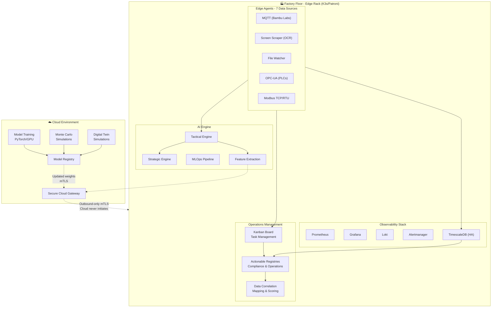

# OmniusGrid

<p align="center">
  <strong>Universal Manufacturing Data Feed Dashboard</strong><br>
  Production-grade IIoT platform with edge AI inference, cloud training, and comprehensive observability
</p>

<p align="center">
  
  
  
  
  
</p>

---

## Overview

OmniusGrid is a resilient manufacturing operations platform designed for Industry 4.0. It unifies data collection from diverse industrial equipment, provides real-time edge AI inference, and maintains secure cloud connectivity for model training and fleet-wide optimization.

### Key Capabilities

| Domain | Features |
|--------|----------|
| **Data Collection** | 7 industrial protocols (MQTT, OPC-UA, Modbus, Screen Scraping/OCR, File Watching) |
| **Real-time Pipeline** | WebSocket broadcasting, subscription management, live telemetry/state/alarms |
| **Command Executor** | Queued commands with retries, timeouts, cancellation, emergency stop, Redpanda integration |
| **OEE Automation** | Automated OEE calculation from PackML states and telemetry part counting |
| **Edge AI** | <100ms inference loops, TorchScript models, automated model lifecycle, graceful fallback |
| **Observability** | Prometheus metrics, Loki logs, Grafana dashboards, TimescaleDB |
| **Security** | mTLS device authentication, certificate generation, zero-trust networking, audit trails |
| **DevOps** | GitHub Actions CI/CD, Kubernetes manifests (staging/production), auto-scaling |
| **Operations** | K3s-orchestrated, Patroni HA, automatic disaster recovery |
| **Logistics** | YMS/TMS with GeoTab telematics, detention billing, HOS compliance, dock-production sync, webhook processing |
| **Task Management** | Kanban board with task grouping, assignment, approval workflows |
| **Compliance** | Actionable registries (OSHA, ISO, internal), data correlation mapping, scoring |
| **Analytics** | Recharts integration with temperature trends, vibration analysis, OEE metrics, asset health distribution |

---

## Architecture



---

## Quick Start

### Prerequisites

- Docker 24.0+ and Docker Compose
- 8GB RAM minimum (16GB recommended)
- 50GB available disk space

### Installation

```bash
# Clone repository
git clone https://github.com/SoundSafe-ai/Omnius-Grid.git
cd OmniusGrid

# Start backend services (recommended)
./start.sh

# This script:
# - Starts Redpanda, TimescaleDB, and Backend API
# - Waits for services to be healthy
# - Ensures backend is ready before frontend starts

# Then start the frontend
cd frontend && npm run dev
```

**Alternative: Start all services with Docker Compose**

```bash
# Start all services (including frontend in Docker)
docker-compose up -d

# Verify service health
docker-compose ps

# Initialize database schema (if needed)
docker-compose exec timescaledb psql -U omniusgrid -d omniusgrid \
  -f /docker-entrypoint-initdb.d/001_init.sql
docker-compose exec timescaledb psql -U omniusgrid -d omniusgrid \
  -f /docker-entrypoint-initdb.d/002_continuous_aggregates.sql
```

### Service Endpoints

| Service | URL | Credentials |
|---------|-----|-------------|
| Dashboard | http://localhost:9999 | - |
| API | http://localhost:8002 | Bearer token |
| API Docs | http://localhost:8002/docs | - |
| Grafana | http://localhost:3001 | `admin` / `omniusgrid_admin` |
| Prometheus | http://localhost:9090 | - |
| Alertmanager | http://localhost:9093 | - |
| Redpanda Console | http://localhost:9644 | - |

### Demo Data & Mock API

The frontend includes a comprehensive mock API system for demonstration and development:

- **Machine-Specific Telemetry**: Each asset type provides realistic telemetry data
  - 3D Printers: Nozzle/bed temperature, print speed, progress, filament usage
  - Conveyor Systems: Speed, load, temperature, vibration, power consumption  
  - CNC Machines: Spindle RPM, feed rate, cutting force, position coordinates
- **Dynamic Data**: Values include realistic variation to simulate real-time monitoring
- **Asset Management**: 5 demo assets with different types and PackML states
- **Historical Data**: Machine-specific historical telemetry with proper variance patterns

To use mock data, the frontend API clients are configured with `USE_MOCK = true` in the respective API files.

### Demo Kanban Tasks

For development and demo purposes, the system includes a seed script to populate the Kanban board with realistic task cards. This should be run after initial database setup to ensure the Kanban board displays demo data until client/site integration.

**Run the demo task seed script:**

```bash
cd backend
python scripts/seed_demo_kanban.py
```

**Demo Tasks Include:**
- **In Progress**: Conveyor belt jam investigation, Hydraulic Press temperature alarm response
- **Triage**: CNC Machine preventive maintenance, Steel sheets material request
- **Backlog**: Quality inspections, safety checks, OEE analysis, firmware updates, operator training
- **Review**: Changeover tasks, vibration investigations
- **Done**: Load cell calibration

**Important:** This seed script should be run during initial setup and after any database reset. The demo tasks provide a realistic starting point for demonstrations and development until actual client/site data integration is implemented.

---

## Project Structure

```
OmniusGrid/
├── backend/                 # FastAPI application
│   └── app/
│       ├── api/            # REST endpoints
│       ├── services/       # Business logic (AI engines, MLOps)
│       ├── core/           # Configuration & security
│       ├── db/             # Database models
│       └── workers/        # Ingestion workers
├── edge-agent/            # Edge collector SDK
│   └── opsgrid_agent/
│       ├── collectors/     # Protocol implementations
│       └── buffer/         # SQLite store-and-forward
├── frontend/              # React 18 + TypeScript dashboard
│   └── src/
│       ├── api/            # API clients (axios, WebSocket)
│       │   ├── auth.ts
│       │   ├── assets.ts
│       │   ├── alarms.ts
│       │   ├── telemetry.ts
│       │   ├── engines.ts
│       │   └── websocket.ts
│       ├── components/     # React components
│       │   ├── ui/         # Reusable UI primitives
│       │   │   ├── Button.tsx
│       │   │   ├── Card.tsx
│       │   │   ├── Input.tsx
│       │   │   ├── Select.tsx
│       │   │   ├── Badge.tsx
│       │   │   ├── Table.tsx
│       │   │   ├── Skeleton.tsx
│       │   │   └── ChartContainer.tsx
│       │   ├── common/     # Domain-specific components
│       │   │   ├── PackMLBadge.tsx
│       │   │   ├── SeverityBadge.tsx
│       │   │   ├── StatusIndicator.tsx
│       │   │   └── TimeAgo.tsx
│       │   ├── charts/     # Data visualization
│       │   │   └── RealtimeTelemetryChart.tsx
│       │   ├── commands/   # Command UI
│       │   │   └── CommandPanel.tsx
│       │   ├── kanban/     # Task management
│       │   │   ├── KanbanBoard.tsx
│       │   │   ├── KanbanColumn.tsx
│       │   │   ├── KanbanCard.tsx
│       │   │   ├── TaskDetailModal.tsx
│       │   │   └── CreateTaskModal.tsx
│       │   ├── fleet/      # Fleet tracking
│       │   │   ├── FleetTrackerMap.tsx
│       │   │   ├── GeoTabIntegration.tsx
│       │   │   ├── GeofencingPanel.tsx
│       │   │   ├── HealthSecurityPanel.tsx
│       │   │   ├── MaintenancePanel.tsx
│       │   │   └── PerformancePanel.tsx
│       │   └── layout/     # Layout components
│       │       ├── Layout.tsx
│       │       ├── Sidebar.tsx
│       │       ├── Header.tsx
│       │       └── ProtectedRoute.tsx
│       ├── hooks/          # Custom React hooks
│       │   ├── useAuth.ts
│       │   ├── useWebSocket.ts
│       │   ├── useTelemetry.ts
│       │   ├── useAlarms.ts
│       │   └── useAssets.ts
│       ├── pages/          # Page components
│       │   ├── auth/       # Login page
│       │   ├── dashboard/  # Dashboard
│       │   ├── assets/     # Asset management
│       │   ├── alarms/     # Alarm management
│       │   ├── oee/        # OEE analytics
│       │   ├── kanban/     # Kanban task management
│       │   │   └── Kanban.tsx
│       │   ├── registries/ # Actionable registries
│       │   │   └── Registries.tsx
│       │   ├── engines/    # AI Engine dashboards
│       │   │   ├── TacticalEngine.tsx
│       │   │   ├── StrategicEngine.tsx
│       │   │   ├── MLOpsPipeline.tsx
│       │   │   └── CloudGateway.tsx
│       │   ├── analytics/  # Operational analytics
│       │   ├── fleet/      # Fleet management
│       │   └── admin/      # Administration
│       ├── stores/         # Zustand state management
│       │   ├── authStore.ts
│       │   ├── kanbanStore.ts
│       │   ├── uiStore.ts
│       │   └── realtimeStore.ts
│       ├── types/          # TypeScript types
│       └── utils/          # Utilities
│           ├── formatters.ts
│           ├── constants.ts
│           └── helpers.ts
├── database/              # Schema migrations
├── infrastructure/        # Deployment configs
│   ├── k8s/              # Kubernetes manifests
│   │   ├── base/         # Base Kustomize layer
│   │   │   ├── namespace.yaml
│   │   │   ├── backend-deployment.yaml
│   │   │   ├── backend-service.yaml
│   │   │   ├── frontend-deployment.yaml
│   │   │   ├── timescaledb-statefulset.yaml
│   │   │   ├── redpanda-statefulset.yaml
│   │   │   ├── ingress.yaml
│   │   │   └── kustomization.yaml
│   │   └── overlays/     # Environment overlays
│   │       ├── production/
│   │       │   ├── kustomization.yaml
│   │       │   ├── backend-resources.yaml
│   │       │   ├── frontend-resources.yaml
│   │       │   └── hpa.yaml
│   │       └── staging/
│   │           ├── kustomization.yaml
│   │           └── backend-resources.yaml
│   ├── tls/              # Certificate configs
│   ├── prometheus/       # Alerting rules
│   ├── grafana/          # Dashboards
│   └── systemd/          # Service definitions
├── scripts/              # Utility scripts
│   └── generate-certs.sh # mTLS certificate generation
├── .github/              # GitHub Actions
│   └── workflows/
│       └── ci-cd.yml     # CI/CD pipeline
└── docs/                  # Architecture documentation
```

---

## API Reference

### Core Endpoints

| Method | Endpoint | Description |
|--------|----------|-------------|
| GET | `/api/v1/assets/` | List all manufacturing assets |
| GET | `/api/v1/assets/{id}` | Get asset details |
| GET | `/api/v1/telemetry/latest/{id}` | Latest telemetry data |
| POST | `/api/v1/alarms/{id}/acknowledge` | Acknowledge alarm |
| GET | `/api/v1/dashboard/oee` | Fleet OEE metrics |

### AI Engine Endpoints

| Method | Endpoint | Description |
|--------|----------|-------------|
| GET | `/api/v1/engines/tactical/status` | Edge inference status |
| POST | `/api/v1/engines/tactical/infer` | Run inference |
| GET | `/api/v1/engines/strategic/recommendations` | Optimization recommendations |
| POST | `/api/v1/engines/mlops/deploy/{version}` | Deploy model version |
| POST | `/api/v1/engines/mlops/rollback` | Rollback to previous model |

### Admin Endpoints

| Method | Endpoint | Description |
|--------|----------|-------------|
| GET | `/api/v1/auth/users` | Get organization users (paginated) |
| POST | `/admin/collectors/{id}/restart` | Restart collector |
| POST | `/admin/assets/{id}/maintenance` | Set maintenance mode |
| GET | `/admin/system/status` | System health status |

### Yard Management (YMS)

| Method | Endpoint | Description |
|--------|----------|-------------|
| POST | `/api/v1/yard/trailers/checkin` | Trailer yard entry |
| POST | `/api/v1/yard/trailers/{id}/checkout` | Trailer check-out with detention calc |
| GET | `/api/v1/yard/trailers` | Current yard inventory |
| POST | `/api/v1/yard/dock/doors/{id}/assign/{trailer_id}` | Assign trailer to dock |
| POST | `/api/v1/yard/dock/appointments` | Schedule dock appointment |
| GET | `/api/v1/yard/dwell-times` | Dwell time analytics |
| POST | `/api/v1/yard/moves` | Record yard jockey move |

### Transportation Management (TMS)

| Method | Endpoint | Description |
|--------|----------|-------------|
| POST | `/api/v1/transportation/carriers` | Create carrier profile |
| GET | `/api/v1/transportation/carriers/{id}/compliance` | DOT/CTPAT compliance summary |
| POST | `/api/v1/transportation/drivers` | Create driver with HOS tracking |
| GET | `/api/v1/transportation/drivers/{id}/hos` | Driver HOS compliance status |
| POST | `/api/v1/transportation/shipments` | Create shipment |
| POST | `/api/v1/transportation/shipments/{id}/dispatch` | Dispatch with compliance check |
| GET | `/api/v1/transportation/shipments/{id}/costs` | Calculate freight costs |
| POST | `/api/v1/transportation/routes` | Create optimized route |
| POST | `/api/v1/transportation/load-plans` | Create load plan |

### Logistics Correlation

| Method | Endpoint | Description |
|--------|----------|-------------|
| GET | `/api/v1/logistics/correlation-dashboard` | Cross-domain metrics |
| POST | `/api/v1/logistics/predict-detention` | ML detention risk prediction |
| GET | `/api/v1/logistics/dock-production-sync` | Production-dock alignment |
| POST | `/api/v1/logistics/load-quality` | Log defect with root cause |
| GET | `/api/v1/logistics/delivery-efficiency` | On-time delivery analytics |
| GET | `/api/v1/logistics/compliance/summary` | Logistics compliance summary |
| GET | `/api/v1/logistics/liability/costs` | Total liability tracking |

### GeoTab Integration

| Method | Endpoint | Description |
|--------|----------|-------------|
| GET | `/api/v1/geotab/devices` | List all GeoTab devices |
| GET | `/api/v1/geotab/devices/{id}/location` | Real-time GPS location |
| GET | `/api/v1/geotab/devices/{id}/trips` | Trip history |
| GET | `/api/v1/geotab/devices/{id}/diagnostics` | Vehicle diagnostics (DTC codes) |
| GET | `/api/v1/geotab/exceptions` | Rule violations (speeding, harsh braking) |
| GET | `/api/v1/geotab/fleet/summary` | Fleet-wide status overview |
| POST | `/api/v1/geotab/webhook` | Real-time GeoTab event webhook |

### Correlation AI Engine

| Method | Endpoint | Description |
|--------|----------|-------------|
| POST | `/api/v1/engines/correlation/analyze` | Run AI correlation analysis on scenario |
| GET | `/api/v1/engines/correlation/scenarios` | List generated correlation scenarios |
| POST | `/api/v1/engines/correlation/generate` | Generate synthetic scenarios for training |

### Correlation AI Integration with Registries and Kanban

The correlation AI engine integrates with the actionable registries and Kanban task management systems to automatically create tasks, registry items, and correlations based on AI analysis results.

**Integration Features:**
- **47 Operational Domain Registries**: Each of the 47 operational domains has a dedicated registry with compliance standards and default items
- **Automatic Task Creation**: AI analysis automatically creates Kanban tasks with appropriate priority based on risk score
- **Registry Item Generation**: Creates registry items for affected domains with severity levels and completion criteria
- **Data Correlation Mapping**: Links registry items to Kanban tasks for traceability and impact analysis
- **Alerting System Integration**: Sends alert notifications for high-risk scenarios (risk score > 50)

**Integration API Endpoints:**

| Method | Endpoint | Description |
|--------|----------|-------------|
| POST | `/api/v1/engines/correlation/integration/analyze` | Run correlation analysis and auto-integrate with registries/Kanban |
| POST | `/api/v1/engines/correlation/integration/initialize-registries` | Initialize all 47 domain registries for organization |
| GET | `/api/v1/engines/correlation/integration/registry-mapping` | Get domain to registry mapping configuration |
| GET | `/api/v1/engines/correlation/integration/task-type-mapping` | Get task type mapping for AI recommendations |
| POST | `/api/v1/engines/correlation/integration/test-integration` | Test integration with sample data |

**Registry Initialization Script:**

```bash
# Initialize registries for all organizations
python backend/scripts/initialize_correlation_registries.py

# Initialize registries for specific organization
python backend/scripts/initialize_correlation_registries.py <organization_id>
```

**Domain to Registry Mapping:**

Each of the 47 operational domains is mapped to a registry configuration with:
- Registry type (compliance or operational)
- Registry category (safety, quality, maintenance, logistics, etc.)
- Frequency requirements (daily, weekly, monthly, quarterly, etc.)
- Priority level (low, medium, high, critical)
- Compliance standards (ISO, OSHA, DOT, CTPAT, etc.)

**Kanban Task Type Mapping:**

AI-recommended tasks are mapped to Kanban task types:
- `custom` - General coordination and investigation tasks
- `maintenance_cm` - Corrective maintenance tasks
- `maintenance_pm` - Preventive maintenance tasks
- `production_job` - Production-related tasks
- `quality_inspection` - Quality inspection tasks
- `safety_check` - Safety-related tasks
- `alarm_response` - Alarm response tasks
- `command_execution` - Command execution tasks

**Integration Workflow:**

1. Correlation AI analyzes operational metrics and identifies anomalies
2. AI determines affected domains and calculates risk score
3. System automatically creates registry items for affected domains
4. Kanban tasks are created based on AI recommendations
5. Data correlations link registry items to tasks for traceability
6. Alert notifications sent for high-risk scenarios
7. Tasks tracked through Kanban board with progress updates
8. Risk scores updated as tasks are completed

### NLP Correlation AI Assistant

The NLP Correlation AI Assistant provides a natural language interface for interacting with the correlation AI engine, allowing users to ask questions about operational data, identify correlations, and receive actionable insights without needing to understand the underlying data structures.

**Features:**
- **Natural Language Queries**: Ask questions in plain English about production issues, logistics delays, maintenance needs, or compliance concerns
- **Real-time Analysis**: AI analyzes queries and determines relevant operational domains automatically
- **Risk Scoring**: Provides risk scores (0-100) with color-coded severity indicators (Critical: >75, High: >50, Medium: >25, Low: <25)
- **Domain Detection**: Automatically identifies relevant operational domains from the query context
- **Recommended Actions**: Suggests specific actions and Kanban tasks based on the analysis
- **Auto-Integration**: Optional automatic integration with Kanban task management
- **Conversation History**: Maintains context across multi-turn conversations

**NLP API Endpoints:**

| Method | Endpoint | Description |
|--------|----------|-------------|
| POST | `/api/v1/nlp/correlation/query` | Process natural language query to correlation AI |
| POST | `/api/v1/nlp/correlation/chat` | Chat interface for multi-turn conversations |

**Frontend Component:**

The CorrelationAIPane component (`/nlp`) provides:
- Chat interface with message history
- Auto-scroll to latest messages
- Risk score display with color-coded badges
- Domain analysis visualization
- Recommended actions with task details
- Auto-integrate toggle for Kanban integration
- Loading states during analysis

**Example Queries:**

- "What's causing the production delays on Cell-H?"
- "Analyze the logistics fleet detention issues"
- "Check for maintenance anomalies on equipment"
- "Review compliance violations for ISO 9001"
- "Identify correlations between warehouse bottlenecks and production OEE"

### Intake Inbox

The Intake Inbox provides a centralized location for uploading operational data (spreadsheets, reports, images) that the correlation AI can analyze to provide actionable insights. Users can upload files and query the AI for analysis, receiving risk assessments, domain correlations, and recommended actions.

**Features:**
- **Multi-Format Upload**: Supports spreadsheets (CSV, Excel), reports (PDF, Word), images (PNG, JPG), and documents (Text, Markdown)
- **Automatic Type Detection**: File type auto-detection based on extension
- **Data Processing**: Extracts and processes data from uploaded files for AI analysis
- **AI Analysis**: Correlation AI analyzes uploaded data and provides insights
- **Risk Assessment**: Calculates risk scores and identifies affected domains
- **Analysis Results**: Displays detailed analysis with risk scores, domains, and recommendations
- **Search & Filter**: Search items by title/description and filter by status
- **Status Tracking**: Track upload status (pending, analyzing, analyzed, error)

**Intake API Endpoints:**

| Method | Endpoint | Description |
|--------|----------|-------------|
| POST | `/api/v1/nlp/correlation/intake/upload` | Upload data file to Intake Inbox |
| POST | `/api/v1/nlp/correlation/intake/analyze` | Analyze uploaded data with correlation AI |
| GET | `/api/v1/nlp/correlation/intake/list` | List intake items with pagination and filtering |
| GET | `/api/v1/nlp/correlation/intake/{id}` | Get specific intake item details |

**Frontend Page:**

The IntakeInbox page (`/intake`) provides:
- Drag-and-drop file upload interface
- File type selection with auto-detection
- Title and description fields for organization
- Upload progress indicator
- Intake items list with status badges
- Analysis trigger button
- Analysis results display with:
  - Risk score with color coding
  - Domain analysis
  - Detailed AI analysis text
  - Recommended actions
- Search functionality
- Status filter (all, pending, analyzed, error)

**Supported File Types:**

- **Spreadsheets**: CSV, XLSX, XLS
- **Reports**: PDF, DOCX, DOC
- **Images**: PNG, JPG, JPEG
- **Documents**: TXT, MD

**Analysis Workflow:**

1. User uploads file with title and description
2. System auto-detects file type and processes data
3. Status set to "pending" initially
4. User triggers AI analysis
5. Correlation AI analyzes data and provides insights
6. Status updated to "analyzed" with results
7. Results include risk score, domains, analysis, and recommended actions

### NLP Analysis Sessions

The NLP Analysis Sessions feature provides a comprehensive session-based interface for analyzing operational data with the correlation AI. Users can create sessions, add multiple data sources (from Intake Inbox or direct uploads), maintain conversation history, and receive context-aware insights based on their goals and preferences.

**Features:**
- **Session Management**: Create, save, resume, and delete analysis sessions
- **Auto-Generated Titles**: Session titles automatically generated from query context and domains
- **Multi-Source Data**: Combine multiple data sources (Intake Inbox items, uploaded files) in a single session
- **Full Chat History**: Search and view chat history across all sessions with session organization
- **Context-Aware AI**: Correlation AI uses session context (data sources, conversation history, user goals)
- **Real-Time Data Integration**: Pull in telemetry, alarms, Kanban tasks, and registries as context
- **User Context Panel**: Display user role, priorities, and active goals
- **Data Source Management**: Upload files directly or select from Intake Inbox via drag-drop, dialog, or sidebar picker

**Analysis Sessions API Endpoints:**

| Method | Endpoint | Description |
|--------|----------|-------------|
| POST | `/api/v1/nlp/sessions` | Create new analysis session |
| GET | `/api/v1/nlp/sessions` | List user's analysis sessions |
| GET | `/api/v1/nlp/sessions/{id}` | Get session details |
| PUT | `/api/v1/nlp/sessions/{id}` | Update session (title, description) |
| DELETE | `/api/v1/nlp/sessions/{id}` | Delete session |
| POST | `/api/v1/nlp/sessions/{id}/resume` | Resume a session |
| POST | `/api/v1/nlp/sessions/{id}/data/intake` | Add data from Intake Inbox |
| POST | `/api/v1/nlp/sessions/{id}/data/upload` | Upload new data to session |
| GET | `/api/v1/nlp/sessions/{id}/data` | List session data sources |
| DELETE | `/api/v1/nlp/sessions/{id}/data/{source_id}` | Remove data source |
| POST | `/api/v1/nlp/sessions/{id}/chat` | Send message in session context |
| GET | `/api/v1/nlp/sessions/{id}/messages` | Get session messages |
| POST | `/api/v1/nlp/sessions/{id}/generate-title` | Generate session title from context |
| GET | `/api/v1/nlp/sessions/chat/history` | Get full chat history across all sessions |
| GET | `/api/v1/nlp/sessions/chat/search` | Search/filter historical chats |
| GET | `/api/v1/nlp/sessions/{id}/context/telemetry` | Fetch relevant telemetry |
| GET | `/api/v1/nlp/sessions/{id}/context/alarms` | Fetch relevant alarms |
| GET | `/api/v1/nlp/sessions/{id}/context/kanban` | Fetch relevant Kanban tasks |
| GET | `/api/v1/nlp/sessions/{id}/context/registries` | Fetch relevant registry items |

**Frontend Components:**

The enhanced `/nlp` page provides a three-panel layout:

- **Left Sidebar**:
  - SessionList: Browse and manage analysis sessions with search
  - DataSourcesPanel: Upload files and manage session data sources
  - Drag-and-drop zone for file uploads
  - "Add from Intake" button for Intake Inbox selection

- **Center Panel**:
  - Chat interface with session-based conversation
  - Session header showing title and data source count
  - Message display with risk scores and domain badges
  - "Add Data" button for Intake Inbox dialog
  - "History" button for full chat history modal
  - Auto-integrate toggle

- **Right Sidebar**:
  - ContextPanel: Display user context (role, department, priorities)
  - Active goals with progress tracking
  - RealTimeDataPanel: View telemetry, alarms, Kanban, registries
  - Tabbed interface for different data types

**Data Source Integration:**

Three methods to add data to sessions:
1. **Drag-and-Drop**: Drop files directly into the DataSourcesPanel
2. **Selection Dialog**: Open IntakeSelectorDialog to browse and select from Intake Inbox
3. **Direct Upload**: Use file picker to upload new files

**Session Context:**

The correlation AI uses the following context when analyzing queries:
- **Data Sources**: All data sources added to the session (file names, types, processed data)
- **Conversation History**: Previous messages in the session (last 10 messages)
- **User Context**: User role, department, priorities (from context snapshot)
- **User Goals**: Active goals and targets (from goals snapshot)

**Auto-Title Generation:**

Session titles are automatically generated based on:
- First few user queries in the session
- Extracted keywords and domain patterns
- Domain detection (LOGISTICS_FLEET, MAINTENANCE, PRODUCTION_OEE, QUALITY_CONTROL, SAFETY, COMPLIANCE)
- Title format: "{Domain} Analysis - {Keywords}" or "{Keywords} Analysis"

**Chat History:**

- Full chat history across all sessions
- Organized by session with session titles and dates
- Search by keyword across all messages
- Filter by session, date range, domain, risk score
- Export functionality

**Real-Time Data Integration:**

The RealTimeDataPanel provides context from:
- **Telemetry**: Relevant telemetry data based on session domains
- **Alarms**: Active alarms related to session topics
- **Kanban Tasks**: Relevant Kanban tasks for recommended actions
- **Registries**: Registry items for compliance context

**Session Persistence:**

- Sessions auto-save on every message
- Context snapshot saved at session creation
- Last accessed timestamp updated on each interaction
- Sessions can be archived or soft-deleted
- Configurable TTL for inactive session cleanup
- UUID handling: All session endpoints use string conversion for proper database comparison with String(36) columns

**Database Models:**

- `AnalysisSession`: Session metadata (title, description, status, context snapshot, goals snapshot)
- `SessionDataSource`: Data sources linked to sessions (source type, file name, data type, processed data)
- `SessionMessage`: Chat messages with session context (role, content, analysis, risk score, domains, actions)

**Analysis Workflow:**

1. User creates new session or resumes existing session
2. User adds data sources (upload files or select from Intake Inbox)
3. User sends natural language query
4. System builds context (data sources, conversation history, user context/goals)
5. Correlation AI analyzes query with full session context
6. AI returns insights with risk scores, domains, and recommended actions
7. Messages saved to session with context snapshot
8. Session title auto-generated after first few queries
9. User can view full chat history and search across sessions
10. Real-time data available in right sidebar for additional context

**Example Session Workflow:**

```
1. User clicks "New Session" button
2. Session created with default title
3. User uploads production report spreadsheet
4. User adds Intake Inbox item (detention analysis)
5. User asks: "Analyze production delays and detention costs"
6. AI analyzes with context from both data sources
7. AI provides insights correlating production issues with logistics delays
8. Session title auto-generated: "Logistics Fleet Analysis - Production, Detention"
9. User continues conversation with context maintained
10. User can view history, search, or resume session later
```

### Synthetic Data Generation

The correlation AI model uses a synthetic data generation pipeline to create training datasets with state space-based rule generation:

```bash
# Generate 10,000 scenarios using state space-based rules (no external API required)
cd backend
python scripts/generate_dataset.py 10000 dataset/training_data.jsonl

# Generate scenarios with LLM (Gemini Pro) for enhanced realism
python scripts/generate_dataset.py 10000 dataset/training_data.jsonl --use-llm --api-key YOUR_API_KEY

# Or set API key as environment variable
export GOOGLE_API_KEY=your_api_key
python scripts/generate_dataset.py 10000 dataset/training_data.jsonl --use-llm
```

**State Space-Based Generation:**
- Uses rule-based logic with actual state space data for realistic scenarios
- No external APIs required for default generation
- Generates contextual root causes, tasks, commands, and compliance implications
- Calculates risk scores based on domain criticality and link severity
- Multi-perspective root cause analysis with liability determination
- Enhanced narrative templates for LLM-quality output without external API

**State Space Files:**
- `backend/state_space/assets.json` - Industrial assets (printers, PLCs, chillers, GeoTab devices, IoT gateways, industrial robots)
- `backend/state_space/errors.json` - Error codes (Modbus, DTC, PackML states, alarm codes, security vulnerabilities, data anomalies, API errors)
- `backend/state_space/logistics.json` - Logistics entities (trailers, carriers, drivers, shipments, detention scenarios, yard bottlenecks, shop floor impacts, shipping/receiving)
- `backend/state_space/compliance.json` - Compliance standards (ISO, OSHA, DOT, CTPAT, FSMA, GDPR, CCPA)
- `backend/state_space/maintenance.json` - Maintenance operations (predictive indicators, preventive triggers, maintenance conflicts, escalation paths)
- `backend/state_space/safety.json` - Safety management (operational efficiency, security scenarios, safety incident causation, protocol violations)
- `backend/state_space/production_output.json` - Production scenarios (shop floor scenarios, production constraints, escalation paths, shift handover)
- `backend/state_space/client_yard_management.json` - Client yard scenarios (liability types, bottlenecks, root causes, dock status)

**Output Format:**
- JSONL format with system prompts, user inputs (DATA INGEST), and model outputs
- Ready for Gemma 4 fine-tuning
- Includes cross-domain correlation scenarios across 47 operational domains
- Realistic asset names, error codes, compliance standards, and API commands
- Comprehensive scenario coverage including:
  - Detention liability scenarios (driver vs client vs transport vs yard)
  - Shop floor operational scenarios (bottlenecks, equipment issues, material issues, staffing issues, quality issues)
  - Shipping/receiving scenarios (shipping delays, receiving bottlenecks, cross-docking issues)
  - Yard management bottleneck scenarios (dock congestion, gate delays, parking constraints)
  - Client yard management scenarios (liability types, receiving capacity, communication issues)
  - Preventative/predictive maintenance scenarios (predictive indicators, preventive triggers, maintenance conflicts)
  - Security/safety/operational efficiency scenarios (physical security, cyber security, safety incident causation)

### Correlation AI Training Dataset

The correlation AI model is trained on a comprehensive synthetic dataset of 499,986 scenarios (split into train/validation/test sets of 399,988/49,998/50,000). The dataset includes exhaustive state space variables across all operational domains, enabling the AI to provide detailed root cause analysis, risk scoring, and actionable recommendations with specific Kanban task creation and alerting system integration.

#### Dataset Statistics

- **Total Scenarios**: 499,986
- **Domain Coverage**: 47 operational domains (10,638 scenarios per domain)
- **Single/Multi-Domain Ratio**: 50/50 (249,993 single-domain, 249,993 multi-domain)
- **Severity Distribution**: Critical (20.1%), High (26.6%), Medium (26.6%), Low (26.7%)
- **Dataset Split**: 80% train, 10% validation, 10% test

#### Single-Domain Examples

**1. Logistics Fleet**
```
DATA INGEST:
/api/v1/logistics-fleet/metrics: {'category': 'appointment_adherence', 'item': '45%', 'value': 24.03, 'status': 'critical'}

**Correlation Analysis:** Logistics fleet issue detected: TRK-006 experiencing operational delays at DOCK-19. Dwell time exceeded threshold by 9.5 hours. Root cause analysis indicates Driver route deviation. Liability determination suggests Transport company scheduling error responsibility. Detention costs estimated at $20,000. Coordination required between transport management, yard operations, and receiving to resolve bottleneck. Yard utilization at 100%, appointment adherence at 85%.

**Risk Score:** 53.9/100

**Kanban Integration:**
- Creates 2 high-priority Kanban tasks: "Coordinate cross-domain response team" and "Investigate operational anomaly and root cause"
- Tasks auto-assigned to logistics operations team
- Triggers alert notification to yard manager and transport coordinator

**Alerting System:**
- Sends POST to /api/v1/notifications/alert with severity "critical"
- Notifies stakeholders: Transport Manager, Yard Operations Lead, Receiving Supervisor
- Sets escalation timer for 4-hour response window
```

**2. Maintenance**
```
DATA INGEST:
/api/v1/maintenance/metrics: {'category': 'work_order_status', 'item': 'Backlog', 'value': 99.81, 'status': 'critical'}

**Correlation Analysis:** Maintenance operations issue detected: Thermal imaging anomaly indicates equipment degradation on 0.1%. Predictive maintenance analysis suggests preventive maintenance window approaching. Resource coordination required. Vibration levels at 10mm/s (threshold: 5mm/s), temperature 200°C above normal. Estimated time to failure: 48 hours if not addressed. Maintenance backlog: 40 work orders, downtime cost: $7,500/hour. Technician availability: 3 technicians available.

**Risk Score:** 54.8/100

**Kanban Integration:**
- Creates high-priority Kanban task: "Implement corrective action plan"
- Task linked to equipment asset ID in CMMS
- Auto-schedules maintenance window based on 48-hour time-to-failure estimate
- Creates dependency: 3 technicians must be available

**Alerting System:**
- Sends POST to /api/v1/notifications/alert with equipment details
- Notifies: Maintenance Manager, Production Scheduler, Plant Manager
- Includes cost impact: $7,500/hour downtime cost
- Triggers automatic work order creation in CMMS via API
```

**3. Production OEE**
```
DATA INGEST:
/api/v1/production-oee/metrics: {'category': 'industrial_robots', 'item': 'AGV-002', 'value': 30.49, 'status': 'critical'}

**Correlation Analysis:** Production line degradation detected: asset Cell-H in Stopping state with ALM-004: Motor Overload. OEE metrics at 75% below threshold indicating equipment performance or scheduling inefficiency. Root cause analysis suggests Material handling equipment failure with 25% throughput reduction. Equipment cycle time increased by 10%, quality rate dropped to 95%. Maintenance intervention required within 24 hours to prevent production stop. Production loss: 200 units, scrap cost: $1,500.

**Risk Score:** 70.3/100

**Kanban Integration:**
- Creates medium-priority Kanban task: "Monitor recovery and verify resolution"
- Task assigned to production line supervisor
- Links to quality control for scrap cost tracking
- Creates subtask: Verify OEE metrics return to >85%

**Alerting System:**
- Sends POST to /api/v1/commands/execute to trigger equipment reset
- Notifies: Production Manager, Quality Manager, Maintenance Lead
- Includes production impact: 200 units lost, $1,500 scrap cost
- Sets 24-hour SLA for resolution
```

**4. Safety**
```
DATA INGEST:
/api/v1/safety/metrics: {'category': 'incident_location', 'item': 'Parking lot', 'value': 75.2, 'status': 'warning'}

**Correlation Analysis:** Security scenario detected: Insider threat detected affecting operations. Multi-factor analysis indicates security protocol enhancement required. Incident response team activation recommended. Security breach detected at 3 access points, 1 unauthorized access attempt logged. Data exposure: 1,000 records. Remediation time: 40 hours. Regulatory fine: $1,000,000. Contributing factors: 5 contributing factors identified. Corrective actions: 3 corrective actions recommended.

**Risk Score:** 73.0/100

**Kanban Integration:**
- Creates medium-priority Kanban task: "Monitor recovery and verify resolution"
- Task assigned to Security Operations Center
- Creates security incident ticket in incident management system
- Links to compliance tracking for regulatory fine monitoring

**Alerting System:**
- Sends GET to /api/v1/operations/status to check current security posture
- Notifies: CISO, HR Director, Legal Counsel, CEO
- Escalation: Immediate notification for insider threat
- Triggers audit trail logging for forensic investigation
```

**5. Quality Control**
```
DATA INGEST:
/api/v1/quality-control/metrics: {'category': 'process_variation', 'item': '15%', 'value': 12.29, 'status': 'critical'}

**Correlation Analysis:** Quality degradation alert: 4 quality gates failing product lines showing quality issues. First pass yield dropped to 94% (target: 98%+). Analysis indicates process variation or equipment calibration issue. CAPA (Corrective and Preventive Action) required per ISO 22000: Food Safety Management standards. 4 non-conformances logged. Inspection backlog: 2,000 units, inspection cycle time increased by 25%.

**Risk Score:** 50.0/100

**Kanban Integration:**
- Creates 2 Kanban tasks: "Monitor recovery and verify resolution" (medium) and "Implement corrective action plan" (high)
- High-priority task linked to CAPA workflow
- Creates quality hold on affected product lines
- Assigns to Quality Manager with Production Manager as stakeholder

**Alerting System:**
- Sends GET to /api/v1/metrics/current for continuous monitoring
- Notifies: Quality Manager, Production Manager, Compliance Officer
- Includes compliance reference: ISO 22000: Food Safety Management
- Triggers automatic quality hold in ERP system
```

#### Multi-Domain Examples

**1. Logistics + Production**
```
DATA INGEST:
/api/v1/logistics-fleet/metrics + /api/v1/production-oee/metrics

**Correlation Analysis:** Logistics delays with TRK-004 at DOCK-29 causing production line inefficiencies. Detention analysis identifies Yard equipment unavailability with Driver staff unavailable responsibility. Material starvation impacting production OEE. Production throughput reduced by 40%, 15 production orders delayed. Cross-domain coordination required between logistics, production planning, and yard management. Dwell time: 6 hours, detention cost: $5,000.

**Risk Score:** 58.5/100

**Kanban Integration:**
- Creates 3 high-priority Kanban tasks across domains:
  1. Logistics: "Coordinate cross-domain response team"
  2. Production: "Investigate operational anomaly and root cause"
  3. Yard: "Implement corrective action plan"
- Tasks linked with dependencies: Logistics task must complete before Production task
- Creates cross-domain Kanban board view for coordinated response

**Alerting System:**
- Sends POST to /api/v1/kanban/tasks to create remediation task
- Sends POST to /api/v1/commands/execute for immediate action
- Notifies across domains: Logistics Manager, Production Manager, Yard Manager
- Escalation to Plant Manager if not resolved in 2 hours
- Includes financial impact: $5,000 detention cost + production loss
```

**2. Logistics + Warehouse**
```
DATA INGEST:
/api/v1/logistics-fleet/metrics + /api/v1/warehouse-management/metrics

**Correlation Analysis:** Logistics-warehouse coordination failure: TRK-006 experiencing delays at DOCK-19 due to Driver route deviation. Receiving bottleneck in warehouse operations causing detention. Cross-functional process integration required. Warehouse receiving throughput degraded by 45%, dock utilization at 95%. 8 trailers queued for unloading. Detention accumulation: $100/hour.

**Risk Score:** 62.3/100

**Kanban Integration:**
- Creates coordinated Kanban tasks:
  1. Logistics: "Resolve trailer detention issue"
  2. Warehouse: "Clear receiving bottleneck"
  3. Cross-domain: "Optimize dock appointment scheduling"
- Tasks tracked on shared Kanban board for logistics-warehouse coordination
- Automatic reassignment based on real-time dock availability

**Alerting System:**
- Sends POST to /api/v1/notifications/alert with real-time queue status
- Notifies: Logistics Coordinator, Warehouse Manager, Dock Supervisor
- Includes cost accumulation: $100/hour detention cost
- Triggers automated appointment rescheduling when queue exceeds threshold
```

**3. Maintenance + Production**
```
DATA INGEST:
/api/v1/maintenance/metrics + /api/v1/production-oee/metrics

**Correlation Analysis:** Maintenance-production conflict: Scheduling conflicts causing production OEE degradation. Vibration analysis indicates equipment requiring maintenance. Coordination between maintenance and production scheduling required. Production stop risk: 6 hours if maintenance deferred. Equipment efficiency at 65%, quality rate dropping to 88%. OEE metrics at 60%. Maintenance backlog: 15 work orders, downtime cost: $2,000/hour.

**Risk Score:** 67.8/100

**Kanban Integration:**
- Creates 2 high-priority Kanban tasks:
  1. Maintenance: "Schedule preventive maintenance window"
  2. Production: "Adjust production schedule for maintenance"
- Tasks linked with time dependencies: Production schedule adjusts based on maintenance window
- Creates shared calendar view for maintenance-production coordination

**Alerting System:**
- Sends POST to /api/v1/commands/execute to execute schedule adjustment
- Notifies: Maintenance Manager, Production Scheduler, Plant Manager
- Includes cost impact: $2,000/hour if deferred beyond 6 hours
- Triggers automatic ERP work order for maintenance scheduling
```

**4. Compliance + Production**
```
DATA INGEST:
/api/v1/compliance-registries/metrics + /api/v1/production-oee/metrics

**Correlation Analysis:** Compliance violation for ISO 9001: Quality Management detected in production operations. Operational procedures not meeting regulatory requirements. Process re-engineering required. Audit findings: 5 findings, 3 areas non-compliant. Corrective action timeline: 30 days. Compliance status: Under Review, violation severity: Major Violation. Compliance score: 70/100 (passing: 85+). Production throughput reduced by 20% due to compliance restrictions.

**Risk Score:** 75.2/100

**Kanban Integration:**
- Creates coordinated Kanban tasks:
  1. Compliance: "Implement corrective action plan"
  2. Production: "Adjust processes for compliance"
  3. Quality: "Update quality documentation"
- Tasks linked to compliance audit timeline (30-day deadline)
- Creates compliance tracking board with production impact visibility

**Alerting System:**
- Sends POST to /api/v1/kanban/tasks to create remediation task
- Sends GET to /api/v1/metrics/current for compliance monitoring
- Notifies: Compliance Officer, Production Manager, Quality Manager
- Includes regulatory deadline: 30 days for corrective action
- Triggers automatic compliance reporting to regulatory body
```

**5. System Infrastructure + Multiple Domains**
```
DATA INGEST:
/api/v1/system-infrastructure/metrics + multiple domain metrics

**Correlation Analysis:** Infrastructure degradation affecting production, logistics, and compliance. Network latency or database performance issues causing downstream operational impacts. Database query response time increased by 500%, network latency averaging 100ms above baseline. System availability at 94% (target: 99.9%+). Error rate 2.1% (baseline: <0.1%). 8 services experiencing degraded performance.

**Risk Score:** 82.5/100

**Kanban Integration:**
- Creates 5 high-priority Kanban tasks across domains:
  1. IT: "Resolve network latency issue"
  2. Production: "Monitor production system availability"
  3. Logistics: "Verify logistics system connectivity"
  4. Compliance: "Ensure compliance system access"
  5. Cross-domain: "Coordinate infrastructure recovery"
- Tasks tracked on infrastructure incident board
- Automatic escalation based on system availability metrics

**Alerting System:**
- Sends POST to /api/v1/notifications/alert with severity "critical"
- Sends GET to /api/v1/operations/status for system health check
- Notifies: IT Director, Plant Manager, CIO, CEO
- Escalation: Immediate for critical infrastructure
- Triggers automatic failover to backup systems if availability < 95%
- Includes SLA breach notification: 99.9% target vs 94% actual
```

#### Kanban and Alerting Integration

The correlation AI model seamlessly integrates with OmniusGrid's Kanban task management and alerting systems:

- **Automatic Task Creation**: When risk score exceeds threshold (50+), AI automatically creates Kanban tasks with appropriate priority (high: >50, medium: 40-50, low: <40)
- **Cross-Domain Coordination**: Multi-domain scenarios create coordinated Kanban tasks across teams with dependency tracking
- **Alert Routing**: AI determines appropriate stakeholders based on domain, severity, and impact
- **API Command Execution**: Recommended actions include specific API endpoints for automated remediation
- **Progress Tracking**: Kanban board tracks task completion, allowing AI to update risk scores based on resolution status
- **Escalation Management**: Alert system includes escalation timers and automatic escalation to higher-level management
- **Cost Impact Tracking**: All scenarios include quantified financial impacts for prioritization and ROI analysis

### Kanban Task Management

| Method | Endpoint | Description |
|--------|----------|-------------|
| GET | `/api/v1/kanban/boards` | List all Kanban boards |
| POST | `/api/v1/kanban/boards` | Create new board |
| GET | `/api/v1/kanban/boards/{id}` | Get board details with columns and tasks |
| POST | `/api/v1/kanban/boards/{id}/tasks` | Create task on board |
| PUT | `/api/v1/kanban/tasks/{id}` | Update task details |
| PUT | `/api/v1/kanban/tasks/{id}/move` | Move task to different column |
| POST | `/api/v1/kanban/tasks/{id}/approve` | Approve task for execution |
| POST | `/api/v1/kanban/tasks/{id}/start` | Start task execution |
| POST | `/api/v1/kanban/tasks/{id}/complete` | Mark task as completed |
| DELETE | `/api/v1/kanban/tasks/{id}` | Delete task |
| GET | `/api/v1/auth/users` | Get organization users for assignment |

### Actionable Registries & Compliance

| Method | Endpoint | Description |
|--------|----------|-------------|
| GET | `/api/v1/registries` | List all actionable registries |
| POST | `/api/v1/registries` | Create new registry |
| GET | `/api/v1/registries/{id}` | Get registry details |
| PUT | `/api/v1/registries/{id}` | Update registry |
| DELETE | `/api/v1/registries/{id}` | Delete registry |
| GET | `/api/v1/registries/{id}/items` | List registry items |
| POST | `/api/v1/registries/{id}/items` | Create registry item |
| PUT | `/api/v1/registries/items/{id}` | Update registry item |
| DELETE | `/api/v1/registries/items/{id}` | Delete registry item |
| GET | `/api/v1/registries/{id}/compliance-score` | Calculate compliance score |
| GET | `/api/v1/registries/{id}/risk-score` | Calculate risk score |
| GET | `/api/v1/correlations` | List data correlations |
| POST | `/api/v1/correlations` | Create data correlation |
| GET | `/api/v1/correlations/{id}` | Get correlation details |
| PUT | `/api/v1/correlations/{id}` | Update correlation |
| DELETE | `/api/v1/correlations/{id}` | Delete correlation |

### Command Executor

| Method | Endpoint | Description |
|--------|----------|-------------|
| POST | `/api/v1/commands/submit` | Submit command to asset |
| GET | `/api/v1/commands/{command_id}/status` | Check command status |
| POST | `/api/v1/commands/{command_id}/cancel` | Cancel pending command |
| GET | `/api/v1/commands/asset/{asset_id}/history` | Asset command history |
| POST | `/api/v1/commands/asset/{asset_id}/emergency-stop` | Emergency stop asset |

### OEE (Overall Equipment Effectiveness)

| Method | Endpoint | Description |
|--------|----------|-------------|
| GET | `/api/v1/oee/current/{asset_id}` | Current OEE metrics (availability, performance, quality) |
| GET | `/api/v1/oee/historical/{asset_id}` | Historical OEE data with aggregation |
| GET | `/api/v1/oee/dashboard/summary` | Organization-wide OEE summary |
| GET | `/api/v1/oee/losses/{asset_id}` | OEE loss breakdown analysis |

### WebSocket Real-time API

| Event | Direction | Description |
|-------|-----------|-------------|
| `subscribe` | Client → Server | Subscribe to asset/org messages |
| `unsubscribe` | Client → Server | Unsubscribe from messages |
| `telemetry` | Server → Client | Real-time telemetry updates |
| `state_change` | Server → Client | PackML state transitions |
| `alarm` | Server → Client | Alarm notifications |
| `command_status` | Server → Client | Command execution updates |
| `ping/pong` | Bidirectional | Connection keepalive |

### Frontend Dashboard Routes

| Route | Description |
|-------|-------------|
| `/` | Main Dashboard |
| `/assets` | Asset Management |
| `/alarms` | Alarm Management |
| `/oee` | OEE Analytics |
| `/kanban` | **Kanban Board** - Task management with grouping, assignment, approval workflows |
| `/logistics/yard` | **Yard Management (YMS)** - Trailer tracking, dock doors, appointments |
| `/logistics/transportation` | **Transportation Management (TMS)** - Fleet, drivers, shipments, GeoTab |
| `/registries` | **Actionable Registries** - Compliance (OSHA, ISO), operational registries, data correlation |

---

## Features

### Data Collection

- **MQTT**: TLS-authenticated Bambu Labs printer integration
- **Screen Scraping**: OpenCV + Tesseract OCR for QIDI/SOVOL displays
- **File System**: ORCA Slicer G-code output monitoring
- **OPC-UA**: Industrial PLC communication
- **Modbus TCP/RTU**: VFD and legacy sensor integration
- **Store-and-Forward**: 24-hour local buffering for offline resilience

### AI/ML Pipeline

- **Edge Inference**: PyTorch TorchScript models for <100ms control loops
- **Cloud Training**: GPU-based training and Monte Carlo simulation
- **Data Thinning**: Feature vectors (not raw telemetry) transmitted to cloud
- **MLOps**: Automated model download, validation, hot-swap, and rollback
- **Two-Speed Architecture**: Tactical (real-time) + Strategic (macro-optimization)
- **Correlation AI Engine**: Cross-domain correlation analysis using Gemma 4 fine-tuned model
  - **Domain Interaction Component**: Pydantic-based schema validation for 5 operational domains (EDGE_AI_TELEMETRY, PRODUCTION_OEE, LOGISTICS_FLEET, COMPLIANCE_REGISTRIES, SYSTEM_INFRASTRUCTURE)
  - **Synthetic Data Generation**: LLM-powered scenario generation using Google Gemini Pro for realistic training data
  - **Fine-Tuning Dataset**: JSONL format with system prompts, user inputs (DATA INGEST), and model outputs
  - **Runtime Inference**: Real-time correlation analysis with root cause identification, risk scoring, and actionable recommendations

### Operations Modes

- **Human-in-the-Loop**: Grafana dashboards, manual overrides, maintenance scheduling
- **Lights Out**: Automated health probes, HA failover, systemd watchdogs
- **Observability**: Prometheus metrics, Loki centralized logging, Alertmanager routing

### Frontend Dashboard

- **Authentication**: JWT-based auth with role-based access control (RBAC)
- **Real-time Updates**: WebSocket integration for live telemetry and alarms
- **Responsive Design**: Mobile-first layout with collapsible sidebar
- **Enhanced Tooltips**: Comprehensive tooltip system across all pages
  - Radix UI-based tooltips with consistent positioning (side="top", align="start")
  - Non-redundant tooltips that provide additional context beyond visible text
  - Tooltips on all interactive elements (buttons, cards, tabs, badges, icons)
  - Page-specific tooltips: Dashboard (active alarms), Assets, Alarms, OEE, Kanban, Login
  - Engine pages: CloudGateway, MLOpsPipeline, StrategicEngine, TacticalEngine
  - Logistics pages: TransportationManagement (8 tabs), YardManagement (4 tabs)
  - Fleet pages: Overview cards and site items
  - Admin pages: User management actions
- **AI Engine Dashboards**:
  - Tactical Engine: Monitor <100ms edge inference with safety controls
  - Strategic Engine: Approve/reject cloud optimization recommendations
  - MLOps Pipeline: Model deployment, rollback, and version management
  - Cloud Gateway: Monitor cloud sync status and data egress
- **Operational Analytics**:
  - Asset Health: Predictive maintenance and health scoring
  - Telemetry Charts: Historical data visualization
  - Predictive Maintenance: Scheduling and planning tools
- **Fleet Management**:
  - Multi-site overview with OEE metrics
  - Organization hierarchy navigation
- **Logistics Management**:
  - **YMS (Yard Management)**: Trailer tracking, dock scheduling, detention/demurrage billing
  - **TMS (Transportation Management)**: Carrier management, shipment tracking, HOS compliance monitoring
  - **GeoTab Integration**: Real-time GPS tracking, vehicle diagnostics, driver behavior monitoring, trip history
  - **Dock-Production Sync**: Align truck arrivals with production readiness
  - **Load Quality Correlation**: Link shipping defects to manufacturing root causes
  - **Detention Risk Prediction**: ML-based prediction of detention events
  - **Fleet Telematics**: Live vehicle status, fuel monitoring, exception reporting (speeding, harsh braking)
- **Administration**:
  - **User Management**: Fully functional user management system with CRUD operations
    - Create new users with name, email, password, role assignment (Admin/Operator/Viewer)
    - Edit existing user details and permissions
    - Delete users with confirmation dialog
    - Role-based access control (RBAC) integration
    - Modal-based UI with form validation
    - Real-time user list updates via React Query cache invalidation
  - Collector configuration and restart controls
  - System health monitoring
  - Application settings and preferences
- **Task Management**:
  - **Kanban Board**: Drag-and-drop task management with multiple columns (Backlog, Triage, In Progress, Review, Done, Rejected)
  - **Task Grouping**: Tasks grouped by type (Production, Maintenance, Quality, Safety, Alarm, Command, Material, Changeover) with collapsible headers
  - **Task Assignment**: Dropdown to assign tasks to organization workers/teams with user avatars
  - **Approval Workflows**: Task approval/rejection with reason tracking
  - **Task Types**: Support for YMS, TMS, logistics, production, maintenance, safety, alarms, commands, materials, and changeovers
  - **Progress Tracking**: Progress bars, checklists, time logging, and due date management
  - **Delete Confirmation**: In-UI confirmation dialog for task deletion (no browser alerts)
  - **SQLite Compatibility**: Full UUID string support for local development without PostgreSQL
- **Compliance & Registries**:
  - **Actionable Registries**: Compliance registries (OSHA, ISO) and internal operational registries
  - **Registry Items**: Individual compliance items with severity levels, completion criteria, and verification methods
  - **Data Correlation**: Mapping and scoring relationships between tasks, assets, and registry items
  - **Compliance Scoring**: Automated compliance score calculation based on item completion
  - **Risk Scoring**: Risk assessment for registry items and correlations
  - **Frequency Tracking**: Periodic compliance requirements with due date management

### Enterprise Features

- **Schema Evolution**: Strict Pydantic contracts with Dead Letter Queue
- **Zero-Trust Security**: mTLS device provisioning with certificate revocation
- **Immutable Audit Trail**: Tamper-evident logging with cryptographic hash chaining
- **Disaster Recovery**: pgBackRest WAL archiving to S3 with point-in-time recovery

---

## Security Model

| Layer | Implementation |
|-------|----------------|
| Network | Purdue Model - Manufacturing zone isolated from enterprise/cloud |
| Device | mTLS mutual certificate authentication per device |
| Identity | Unique cryptographic identity per device |
| API | JWT Bearer token authentication |
| Audit | Hash-chained tamper-evident command logging |

---

## Documentation

- [OmniusGrid Glossary](OMNIUSGRID_GLOSSARY.md) - Backend & Frontend combined terminology reference (400+ terms)
- [Correlation AI Engine](docs/CORRELATION_AI_ENGINE.md) - Cross-domain AI analysis, synthetic data generation, and Gemma 4 fine-tuning
- [Hybrid Architecture](docs/HYBRID_ARCHITECTURE.md) - Human-in-the-Loop + Lights Out modes
- [Gold Standard Architecture](docs/GOLD_STANDARD_ARCHITECTURE.md) - Edge AI + Cloud Training
- [Implementation Summary](docs/IMPLEMENTATION_SUMMARY.md) - Complete feature inventory

---

## License

Proprietary License - All rights reserved. Unauthorized use, reproduction, or distribution is prohibited.
