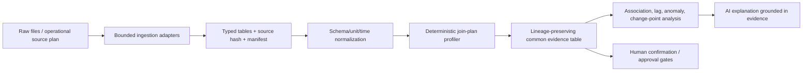

# Evidence-first correlation engine

## What it does

The correlation engine now treats a relationship as evidence that can be
reviewed, not as a statement generated by an LLM.

Every emitted match includes:

- typed source columns and stable source/table/row lineage;
- the exact composite key and join strategy used;
- matched and unmatched records;
- duplicate/cardinality, coverage, selectivity, and evidence-quality metrics;
- a proposed or confirmed approval state; and
- an explicit statement that evidence quality and association do not prove
  causation.

## Product/API flow

1. Upload through the existing Intake Inbox. Raw bytes go to the configured
   S3-compatible store when available; local development has an explicit inline
   fallback.
2. Select one multi-sheet workbook/archive or multiple Intake items in
   **Common Evidence Correlation**. For a large ZIP, call
   `POST /api/v1/correlation/evidence/intake/catalog` first and choose exact
   archive members; irrelevant ZIP children are then skipped before parsing.
   The UI calls `POST /api/v1/correlation/evidence/intake/analytics`.
3. Review the proposed keys, coverage/cardinality metrics, source/table/row
   lineage, and unmatched rows. Select the accepted relationship(s), reject
   unsuitable candidates, and confirm the resulting join scope.
4. Use `POST /api/v1/correlation/evidence/intake/jobs` for background work and
   poll `GET /api/v1/correlation/evidence/jobs/{job_id}` for progress/result.

The preview request accepts an optional `join_plan`, `join_plans`,
`confirm_join_plan`, `time_bucket_minutes`, `schema_mappings`,
`assumed_timezone`, and `include_operational_analytics`.

For multi-file work, the engine produces a pairwise evidence graph rather than
a denormalized mega-row. This prevents a one-to-many edge from duplicating
metrics from another edge and making aggregates look more certain than they
are.

The graph reports when its relationship cap excludes otherwise eligible table
pairs. A partial graph is a review condition, not a complete-company result;
narrow the table selection or explicitly confirm the needed relationships.

### Review and rollup rules

- A proposed preview is inspection-only. Operations Lead questions and
  briefings require an explicitly confirmed join plan (or confirmed graph).
- A user can choose an alternate proposed key set; the engine recomputes the
  plan identity, match metrics, cardinality warnings, and evidence quality
  from the edited keys instead of trusting a stale candidate score.
- Entity rollups are calculated within their original source table. A file or
  company total is never assigned to an asset, line, facility, or shift merely
  because that entity appears in the file.
- Answer responses expose a bounded map of the rows they actually cite, so an
  operator can inspect the cited evidence without receiving every raw row in
  the selected upload.

## Operations Lead questions

`POST /api/v1/correlation/operations/answer` builds deterministic evidence
first, then returns a cited answer for a natural-language operational question.
Supported question styles include:

- overview, plan/actual performance, throughput, and bottleneck review;
- downtime or line-stop investigation, without a root-cause claim;
- asset, line, and shift priorities (with no fake comparative ranking when
  only one entity exists);
- quality reconciliation, maintenance/service review, change/anomaly review,
  and a supervisor-approved next-shift checklist;
- safety/compliance, supply/logistics, and workforce-readiness facts.

Exact source values named in a question—such as `night shift` or `Line 6`—are
applied as a deterministic scope filter. If no exact value exists, the service
asks for clarification rather than silently answering over the full data set.
Pairwise correlation claims use only safe join edges. Source-specific safety,
logistics, and workforce facts may appear alongside them with their own
single-row lineage; they are never presented as correlated merely because they
were selected in the same packet.

Every answer returns a causation guardrail, data-freshness note, source/table/
row citations, and a pending-human-approval block. Historical data produces a
pattern-review draft, not live control guidance. Checklists and any operational
change require a supervisor approval.

## Input support

Built-in bounded parsing supports CSV, TSV/TAB, JSON/JSONL/NDJSON, XML,
XLS/XLSX/XLSM, ODS/XLSB (when their optional readers are installed),
Parquet/Arrow/Feather (when `pyarrow` is installed), and safe ZIP batches.
ZIP entries are checked for path traversal, encryption, expansion, compression
ratio, file size, and row/table bounds before individual structured children
are read.

PDF and DOCX embedded tables enter the same table contract. Images and scanned
documents require a deliberately registered OCR worker. Legacy `.doc` and
Numbers files require an approved conversion worker. The API advertises these
conditions rather than silently treating conversion/OCR as successful.

`GET /api/v1/correlation/evidence/capabilities` returns the live format and
connector capability manifest. `POST /api/v1/correlation/evidence/connectors/{connector}/plan`
creates a sanitized, non-networked plan for database, warehouse, ERP,
historian, and event-stream adapters. A deployment worker must implement the
actual credential-aware extraction after authorization; the API never opens a
customer connection or returns a supplied secret.

## Operational correctness

The engine maps conservative identifier aliases such as asset/machine/equipment,
facility/plant/site, and event dates/timestamps. It prefers a strong entity or
transaction anchor, then can add facility, line, shift, and an exact or bucketed
time value. Date/shift-only joins can be shown for review but are never
auto-previewed as safe.

Approved tenant vocabulary feedback can add deterministic value/entity aliases
and column aliases. Pending feedback does nothing. A manual plan records the
aliases it used, including a provenance fingerprint, so a match can be
reproduced later.

Long-form `metric + value + unit` records can be normalized to UTC plus safe
canonical units for temperature, length, mass, energy, and pressure. Ambiguous
or nonexistent local times, unknown units, conflicts, and incomplete records
remain visible in the data-quality output. Wide tables retain their original
values and receive mapping/unit-detection aids for a reviewer rather than
unsafe automatic interpretation.

Statistical diagnostics calculate bounded Pearson/Spearman association,
lead/lag screens, robust anomalies, and mean-shift change points only from
records that the evidence layer has already joined. Every diagnostic returns a
causal confidence of `0.0` and a guardrail: observational association is not
causation.

## Evaluation and action controls

The evaluation models support known-good expected matches, expected non-matches,
false-match regression tests, precision/recall/F1 gates, and lineage/input
quality reports. Relevant endpoints are:

- `POST /api/v1/correlation/evidence/evaluations/run`
- `POST /api/v1/correlation/evidence/evaluations/evidence`
- `GET /api/v1/correlation/evidence/quality/latest`
- `POST /api/v1/correlation/evidence/vocabulary`
- `POST /api/v1/correlation/evidence/vocabulary/{feedback_id}/review`
- `POST /api/v1/correlation/evidence/actions/assess`
- `POST /api/v1/correlation/evidence/actions/decide`

Action assessment fails closed. This service does not dispatch an operational
action; a separate domain integration must enforce authorization, idempotency,
and audit persistence before acting on an approved decision.

## Deployment requirements

For production scale, set up the S3-compatible document store and Redis. The
application uses object storage for raw evidence when available and Redis for
job state; local fallbacks are intended for development only. Move the
background executor into a dedicated worker process for high-volume ingestion.

The vocabulary, quality-monitor history, and approval service have
dependency-free in-process implementations today. Persist their Pydantic JSON
records in the product audit/event store before relying on them across multiple
application workers or restarts. Register only approved OCR, legacy-conversion,
and external-source workers with least-privilege credential references.
