# OmniusGrid Data Flow Documentation

## Overview

This document describes the data flow across the OmniusGrid system, from edge data collection to cloud processing and user visualization.

## File Intake and Correlation Flow

Uploaded CSV, Excel, PDF, DOCX, and image files follow a separate intake path before
they contribute to cross-domain analysis.

```text
Upload
  ↓
Intake item and metadata
  ↓
Parser
  ↓
Domain and shared-key detection
  ↓
Correlation scenario builder
  ↓
Correlation engine
  ↓
Analysis session
```

1. **Upload and intake** — The intake API records the file name, type, owner,
   metadata, and processed data for the uploaded item.
2. **Parse** — The file-type parser produces structured spreadsheet rows, tables,
   document text, and metadata as applicable.
3. **Detect domains and shared keys** — The system identifies operational domains
   (for example Production, Maintenance, Quality, and Logistics) and keys such as
   asset IDs, serial numbers, work orders, purchase orders, and dates.
4. **Build correlation scenarios** — Sources sharing keys form scenarios containing
   active domains, operational metrics, interaction keys, and cross-domain links.
5. **Run correlation and present results** — The correlation engine produces findings,
   risk scores, and detected relationships, which are collected in an analysis session
   with the contributing source files.

## Telemetry Data Flow

### End-to-End Flow

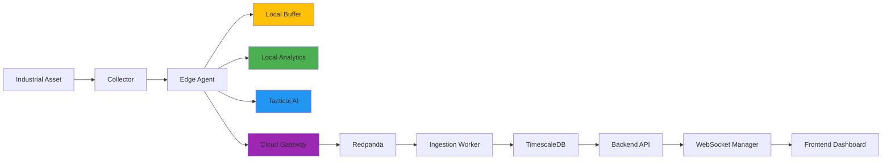

### Detailed Sequence

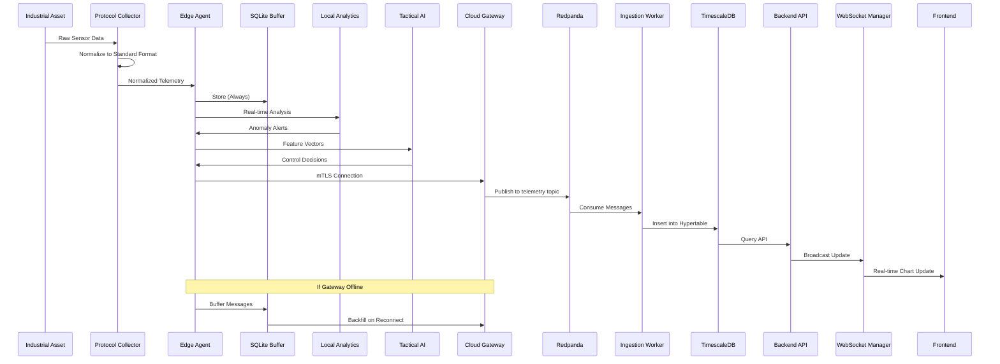

### Data Format

#### Collector to Edge Agent
```json
{
  "timestamp_edge": "2026-05-25T12:00:00Z",
  "asset_id": "asset-001",
  "topic": "telemetry",
  "payload": {
    "temp_nozzle": 245.5,
    "temp_bed": 60.2,
    "print_speed": 50.0,
    "packml_state": "Execute"
  },
  "sequence_num": 1716633600000
}
```

#### Edge Agent to Cloud Gateway
```json
{
  "timestamp_edge": "2026-05-25T12:00:00Z",
  "timestamp_cloud": "2026-05-25T12:00:01Z",
  "asset_id": "asset-001",
  "organization_id": "org-001",
  "agent_id": "edge-001",
  "feature_vector": [0.85, 0.32, 0.91, 0.45],
  "packml_state": "Execute",
  "sequence_num": 1716633600000,
  "backfilled": false
}
```

#### Cloud Gateway to Redpanda
```json
{
  "key": "asset-001",
  "value": {
    "timestamp": "2026-05-25T12:00:01Z",
    "asset_id": "asset-001",
    "organization_id": "org-001",
    "metrics": {
      "temp_nozzle": 245.5,
      "temp_bed": 60.2
    },
    "packml_state": "Execute"
  },
  "headers": {
    "organization_id": "org-001",
    "agent_id": "edge-001"
  }
}
```

#### Ingestion Worker to TimescaleDB
```sql
INSERT INTO telemetry (time, asset_id, metric_name, value, unit, packml_state, sequence_num)
VALUES 
  ('2026-05-25T12:00:01Z', 'asset-001', 'temp_nozzle', 245.5, '°C', 'Execute', 1716633600000),
  ('2026-05-25T12:00:01Z', 'asset-001', 'temp_bed', 60.2, '°C', 'Execute', 1716633600000);
```

## Command Data Flow

### End-to-End Flow

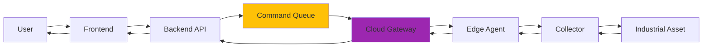

### Detailed Sequence

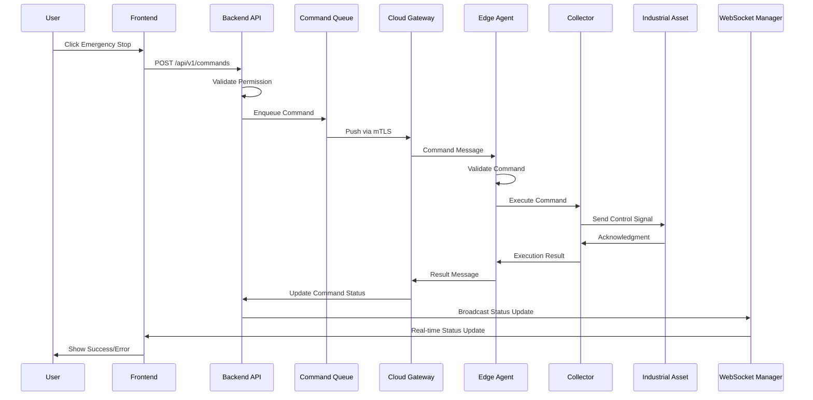

### Command Format

#### Frontend to Backend API
```json
{
  "asset_id": "asset-001",
  "command_type": "emergency_stop",
  "parameters": {},
  "priority": "critical",
  "timeout_seconds": 30
}
```

#### Backend API to Command Queue
```json
{
  "command_id": "cmd-001",
  "asset_id": "asset-001",
  "organization_id": "org-001",
  "command_type": "emergency_stop",
  "parameters": {},
  "priority": "critical",
  "status": "queued",
  "created_at": "2026-05-25T12:00:00Z",
  "timeout_seconds": 30,
  "retry_count": 0
}
```

#### Cloud Gateway to Edge Agent
```json
{
  "command_id": "cmd-001",
  "asset_id": "asset-001",
  "command_type": "emergency_stop",
  "parameters": {},
  "priority": "critical",
  "issued_at": "2026-05-25T12:00:00Z",
  "timeout_seconds": 30
}
```

#### Edge Agent to Collector
```json
{
  "command_id": "cmd-001",
  "command_type": "emergency_stop",
  "parameters": {},
  "timestamp": "2026-05-25T12:00:01Z"
}
```

## AI Inference Data Flow

### Tactical AI (Edge)

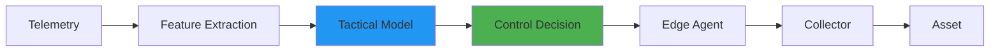

### Strategic AI (Cloud)

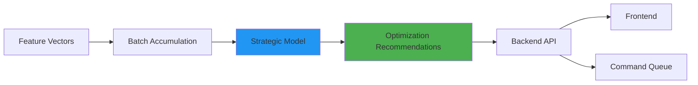

### Correlation AI (Cross-Domain)

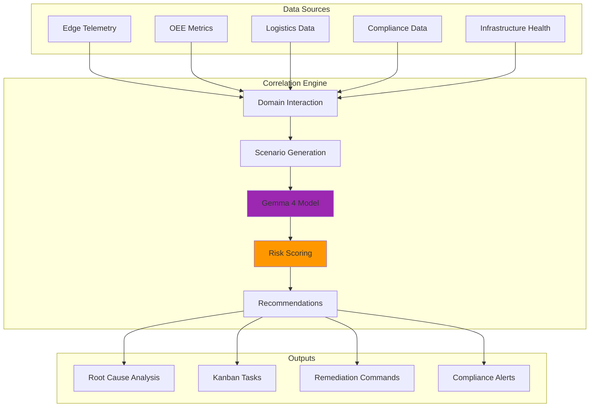

## Alarm Data Flow

### Alarm Generation Flow

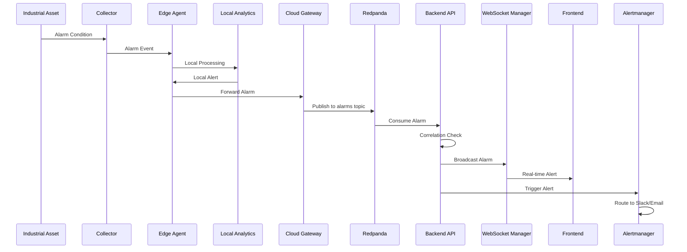

### Alarm Format

```json
{
  "alarm_id": "alarm-001",
  "asset_id": "asset-001",
  "organization_id": "org-001",
  "alarm_type": "temperature_high",
  "severity": "critical",
  "message": "Nozzle temperature exceeded threshold",
  "value": 260.5,
  "threshold": 250.0,
  "timestamp": "2026-05-25T12:00:00Z",
  "acknowledged": false,
  "acknowledged_by": null,
  "acknowledged_at": null,
  "resolved": false,
  "resolved_at": null
}
```

## OEE Calculation Data Flow

### Real-time OEE (Edge)

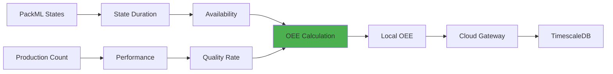

### Historical OEE (Cloud)

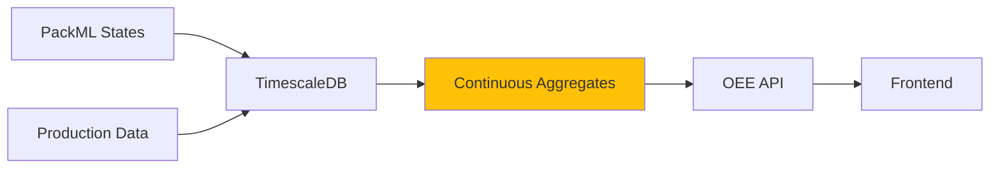

## Data Retention Flow

### Tiered Storage

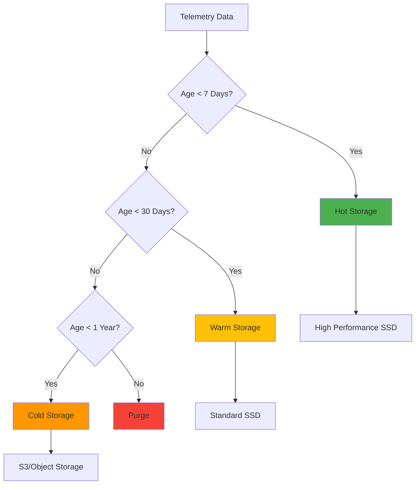

### Compression Flow

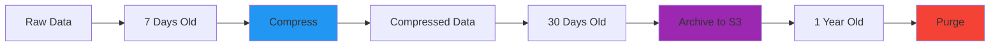

## WebSocket Data Flow

### Connection Flow

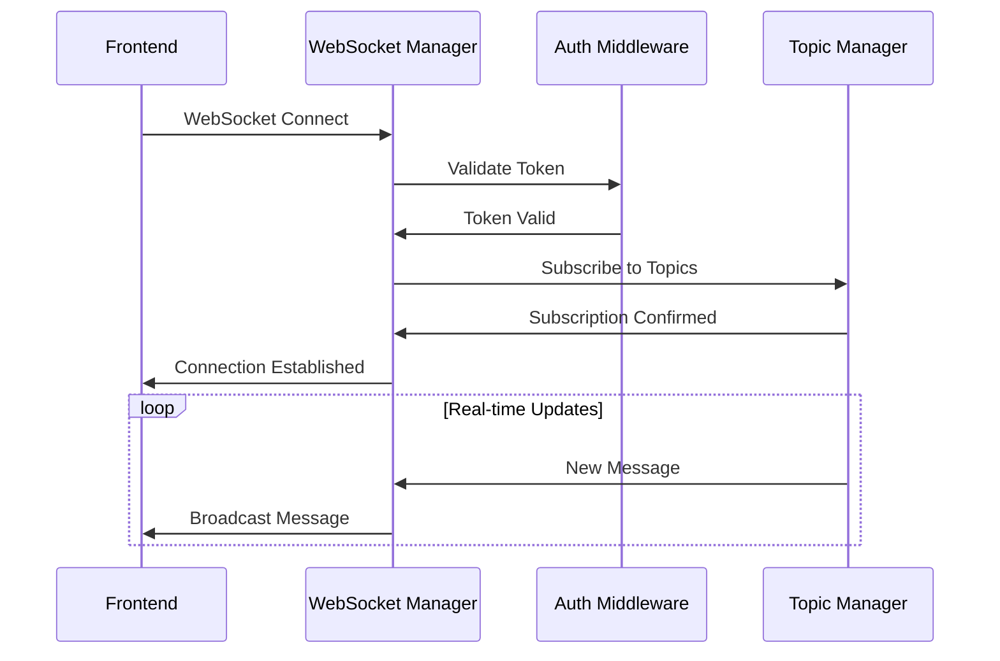

### Subscription Topics

- `telemetry/{asset_id}` - Real-time telemetry for specific asset
- `alarms/{organization_id}` - Alarms for organization
- `commands/{asset_id}` - Command status updates
- `oee/{workcell_id}` - OEE updates for workcell
- `connection_status` - Connection status updates

## Data Synchronization Flow

### Edge to Cloud Sync

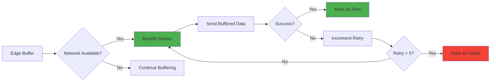

### Cloud to Edge Sync

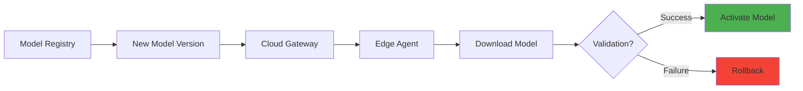

## Data Quality Flow

### Validation Pipeline

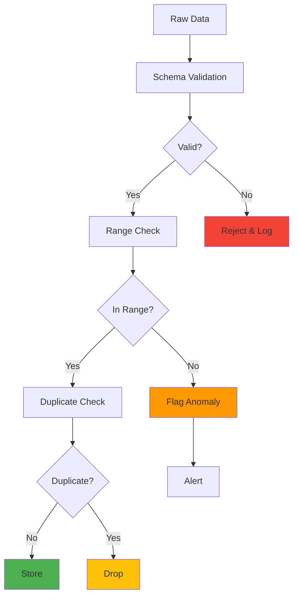

## Compliance Data Flow

### Audit Trail

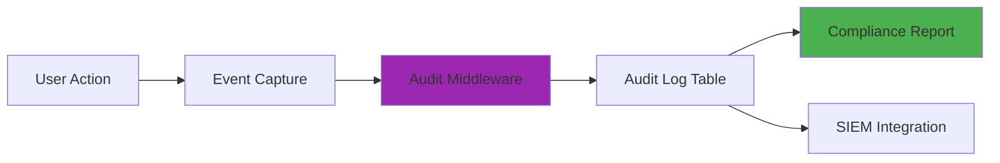

### Data Subject Request (GDPR)

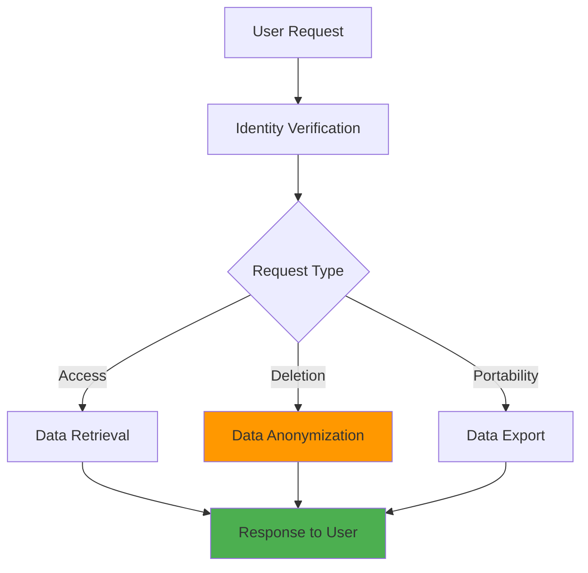

## Performance Metrics Flow

### Metrics Collection

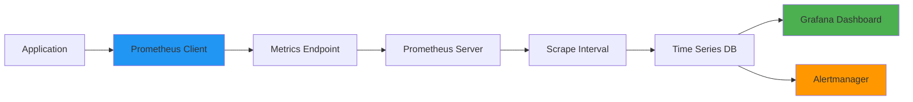

### Metric Types

- **Counter**: Monotonically increasing values (request count, error count)
- **Gauge**: Values that go up and down (memory usage, active connections)
- **Histogram**: Distribution of values (request latency)
- **Summary**: Similar to histogram with quantiles (response time)

---

**Document Version:** 1.0  
**Last Updated:** 2026-05-25  
**Component:** Data Flow Documentation
