# OmniusGrid Data Flow Documentation

## Overview

This document describes the data flow across the OmniusGrid system. OmniusGrid's
differentiator is correlating the **document / ERP** world with the **machine**
world, so the flows are ordered accordingly:

1. **Textual / business surface (lead).** Documents (PDF / DOCX / XLSX / images)
   and ERP systems flow through parsers and the intake pipeline, get linked by
   shared keys into cross-file / cross-tab correlation scenarios, and are scored
   by the Correlation AI (Gemma) into actionable registries, Kanban tasks, and
   notifications.
2. **Machine surface.** Machines and sensors are read by the Edge Agent
   (10+ protocol collectors, a 24h store-and-forward buffer, PackML
   normalization), pushed outbound-only over mTLS to Redpanda, consumed by
   ingestion workers, and landed in TimescaleDB.
3. **Convergence.** Both surfaces meet at the FastAPI backend (REST + WebSocket,
   one error envelope, paginated lists), which the React frontend renders.

The Correlation-AI **inference** step needs the Gemma model; everything else —
including the fully-correlated offline demo seeded by
`backend/scripts/seed_demo_data.py` (see [`../DEMO.md`](../DEMO.md)) — runs with
no live edge, cloud, or external services.

The sections below start with the textual/ERP-first flows and the predictive /
historian / notification subsystems, then cover the machine telemetry, command,
alarm, OEE, and retention flows.

## Document / ERP Intake → Correlation Flow

Textual and business data is the lead surface. Documents and ERP records are
parsed, linked by shared keys (asset IDs, order/PO numbers, dates), assembled
into cross-file / cross-tab correlation scenarios, and scored by the Correlation
AI — which emits actionable registry items, Kanban tasks, and notifications.

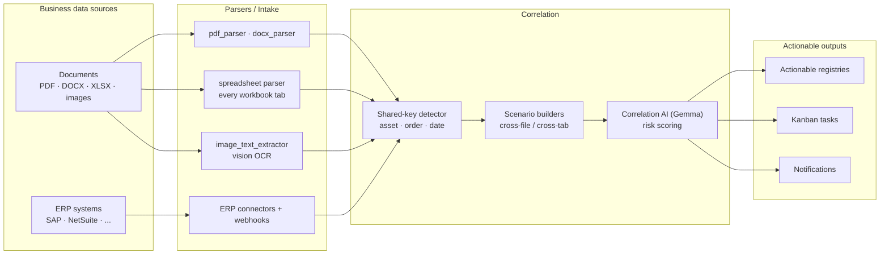

**Endpoints:** `/api/v1/nlp/correlation/intake/*` (upload, analyze,
cross-correlate), `/api/v1/nlp/sessions/*` (analysis sessions),
`/api/v1/erp/integrations` + `/api/v1/erp/webhooks`,
`/api/v1/platform-correlation`, `/api/v1/registries`, `/api/v1/kanban`.

## Predictive Maintenance & Digital-Twin Flow

Machine telemetry feeds a health index, which feeds a remaining-useful-life
(RUL) estimate. The digital-twin optimizer runs recommendations over the
simulation engine; because they can drive machine changes, recommendations are
**approval-gated** before they become commands or work orders.

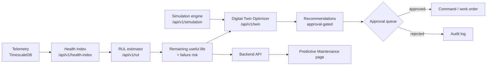

## Historian Query & Retention Flow

The historian serves tenant-scoped time-series history with per-tenant retention
policies (hot / warm / cold tiers, continuous aggregates, compression, and
purge).

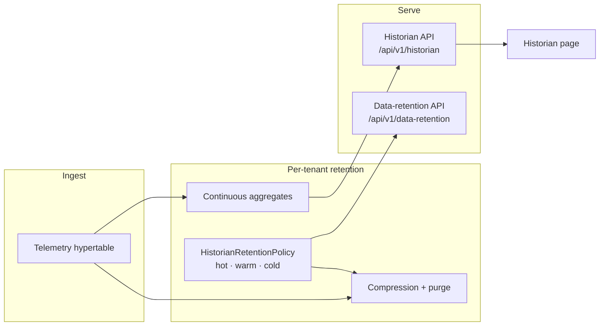

## Notifications Dispatch Flow

The notifications center matches events (by severity and domain) against tenant
subscriptions and dispatches over webhook, email, or Slack, recording every
attempt in a delivery log.

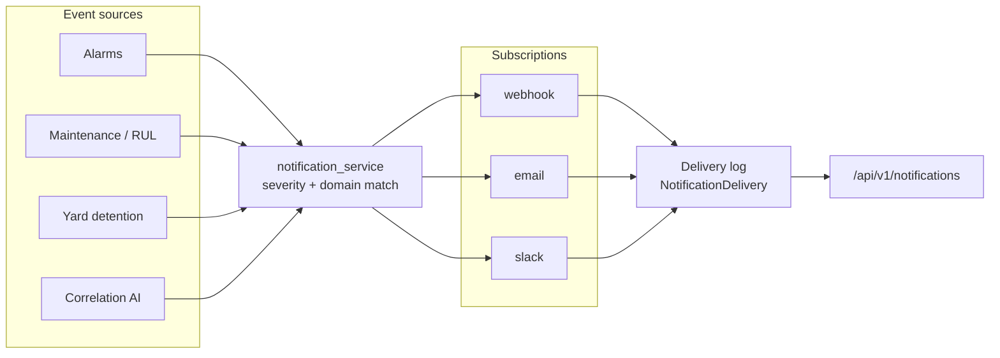

## Telemetry Data Flow

### End-to-End Flow

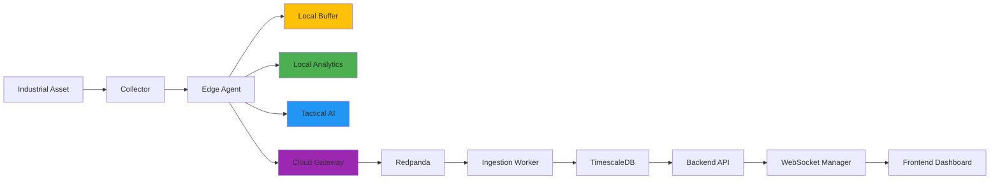

### Detailed Sequence

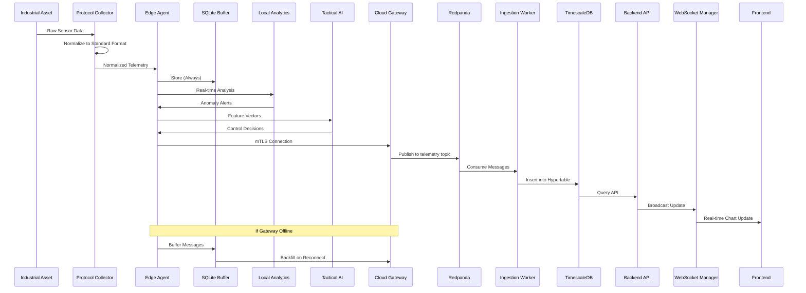

### Data Format

#### Collector to Edge Agent
```json
{
  "timestamp_edge": "2026-05-25T12:00:00Z",
  "asset_id": "asset-001",
  "topic": "telemetry",
  "payload": {
    "temp_nozzle": 245.5,
    "temp_bed": 60.2,
    "print_speed": 50.0,
    "packml_state": "Execute"
  },
  "sequence_num": 1716633600000
}
```

#### Edge Agent to Cloud Gateway
```json
{
  "timestamp_edge": "2026-05-25T12:00:00Z",
  "timestamp_cloud": "2026-05-25T12:00:01Z",
  "asset_id": "asset-001",
  "organization_id": "org-001",
  "agent_id": "edge-001",
  "feature_vector": [0.85, 0.32, 0.91, 0.45],
  "packml_state": "Execute",
  "sequence_num": 1716633600000,
  "backfilled": false
}
```

#### Cloud Gateway to Redpanda
```json
{
  "key": "asset-001",
  "value": {
    "timestamp": "2026-05-25T12:00:01Z",
    "asset_id": "asset-001",
    "organization_id": "org-001",
    "metrics": {
      "temp_nozzle": 245.5,
      "temp_bed": 60.2
    },
    "packml_state": "Execute"
  },
  "headers": {
    "organization_id": "org-001",
    "agent_id": "edge-001"
  }
}
```

#### Ingestion Worker to TimescaleDB
```sql
INSERT INTO telemetry (time, asset_id, metric_name, value, unit, packml_state, sequence_num)
VALUES 
  ('2026-05-25T12:00:01Z', 'asset-001', 'temp_nozzle', 245.5, '°C', 'Execute', 1716633600000),
  ('2026-05-25T12:00:01Z', 'asset-001', 'temp_bed', 60.2, '°C', 'Execute', 1716633600000);
```

## Command Data Flow

### End-to-End Flow

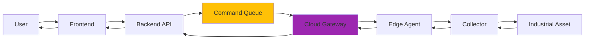

### Detailed Sequence

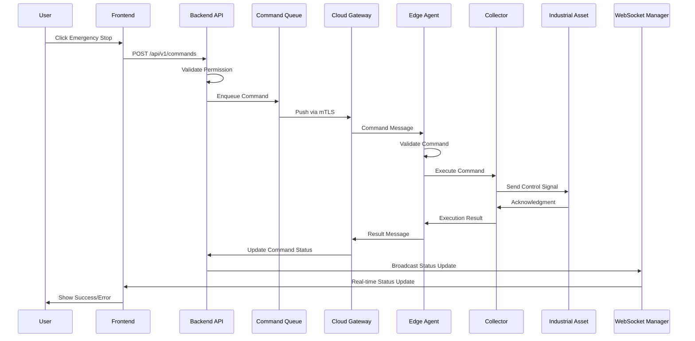

### Command Format

#### Frontend to Backend API
```json
{
  "asset_id": "asset-001",
  "command_type": "emergency_stop",
  "parameters": {},
  "priority": "critical",
  "timeout_seconds": 30
}
```

#### Backend API to Command Queue
```json
{
  "command_id": "cmd-001",
  "asset_id": "asset-001",
  "organization_id": "org-001",
  "command_type": "emergency_stop",
  "parameters": {},
  "priority": "critical",
  "status": "queued",
  "created_at": "2026-05-25T12:00:00Z",
  "timeout_seconds": 30,
  "retry_count": 0
}
```

#### Cloud Gateway to Edge Agent
```json
{
  "command_id": "cmd-001",
  "asset_id": "asset-001",
  "command_type": "emergency_stop",
  "parameters": {},
  "priority": "critical",
  "issued_at": "2026-05-25T12:00:00Z",
  "timeout_seconds": 30
}
```

#### Edge Agent to Collector
```json
{
  "command_id": "cmd-001",
  "command_type": "emergency_stop",
  "parameters": {},
  "timestamp": "2026-05-25T12:00:01Z"
}
```

## AI Inference Data Flow

### Tactical AI (Edge)

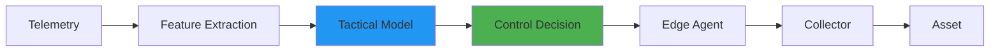

### Strategic AI (Cloud)

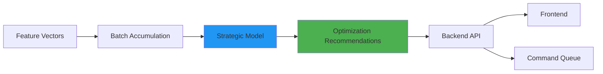

### Correlation AI (Cross-Domain)

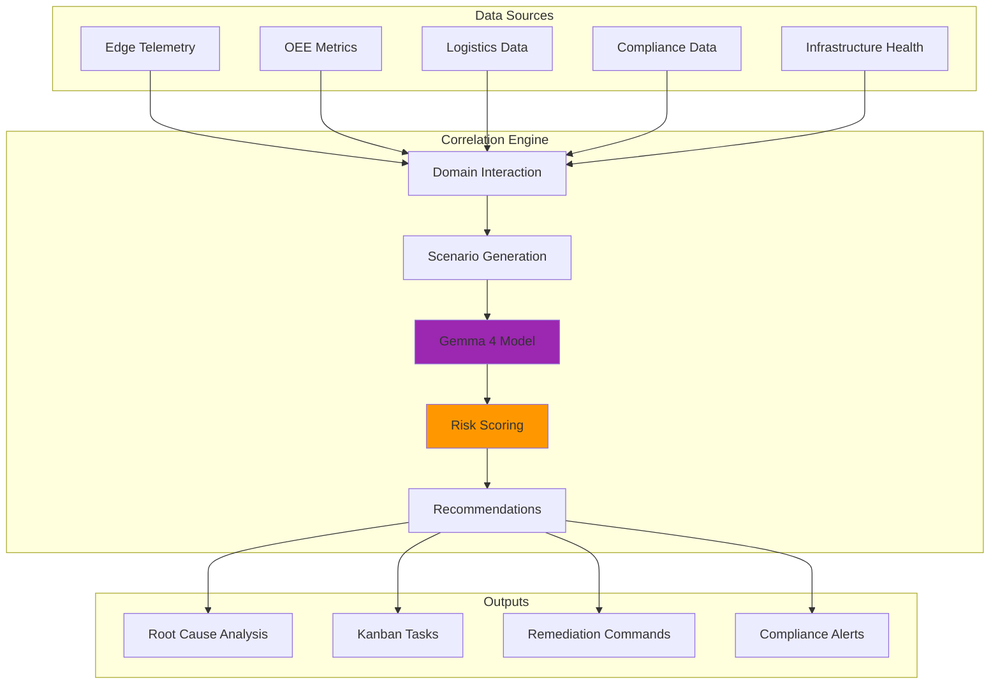

## Alarm Data Flow

### Alarm Generation Flow

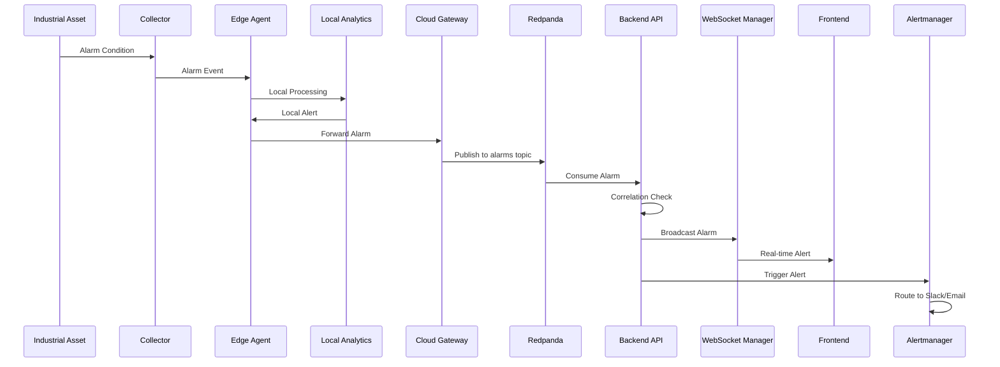

### Alarm Format

```json
{
  "alarm_id": "alarm-001",
  "asset_id": "asset-001",
  "organization_id": "org-001",
  "alarm_type": "temperature_high",
  "severity": "critical",
  "message": "Nozzle temperature exceeded threshold",
  "value": 260.5,
  "threshold": 250.0,
  "timestamp": "2026-05-25T12:00:00Z",
  "acknowledged": false,
  "acknowledged_by": null,
  "acknowledged_at": null,
  "resolved": false,
  "resolved_at": null
}
```

## OEE Calculation Data Flow

### Real-time OEE (Edge)

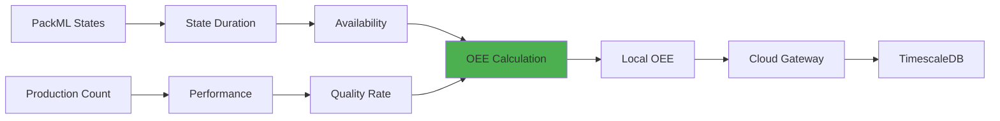

### Historical OEE (Cloud)

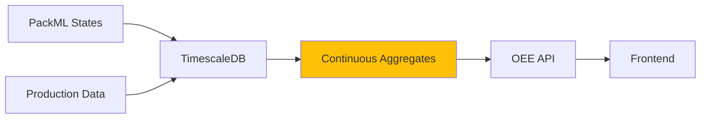

## Data Retention Flow

### Tiered Storage

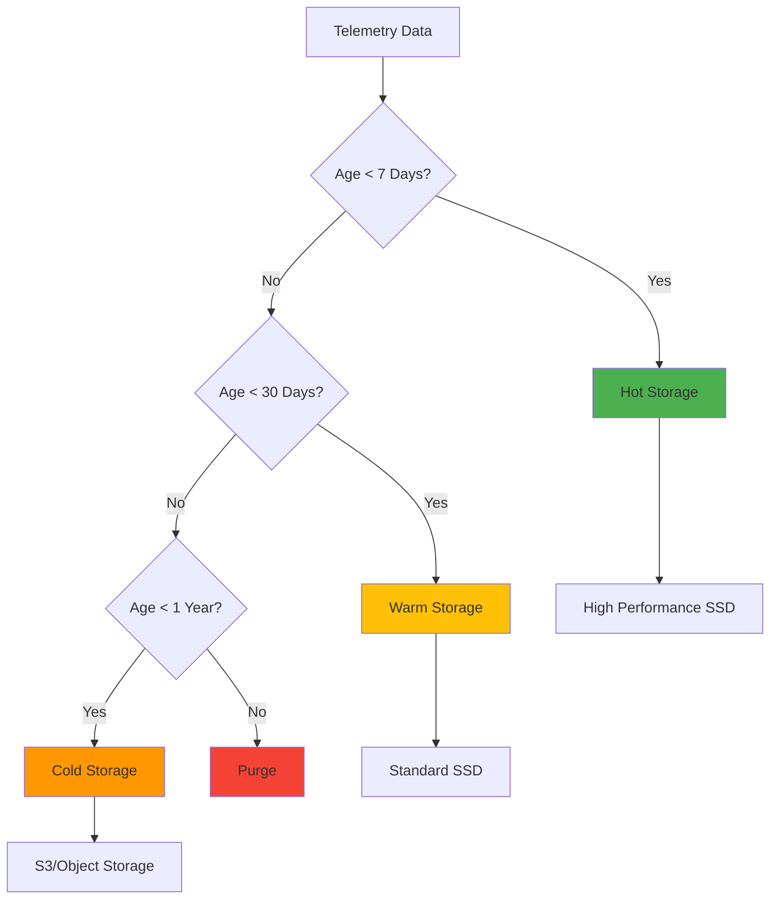

### Compression Flow

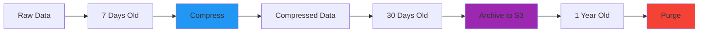

## WebSocket Data Flow

### Connection Flow

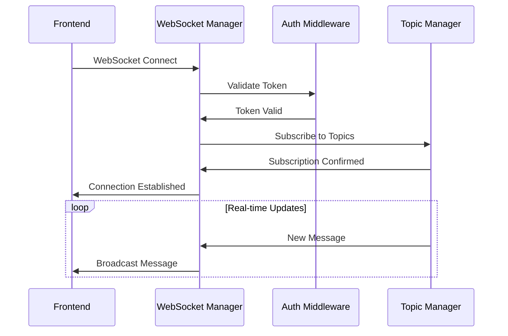

### Subscription Topics

- `telemetry/{asset_id}` - Real-time telemetry for specific asset
- `alarms/{organization_id}` - Alarms for organization
- `commands/{asset_id}` - Command status updates
- `oee/{workcell_id}` - OEE updates for workcell
- `connection_status` - Connection status updates

## Data Synchronization Flow

### Edge to Cloud Sync

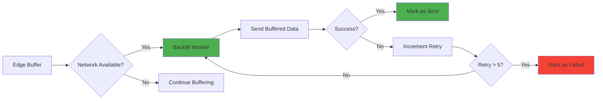

### Cloud to Edge Sync

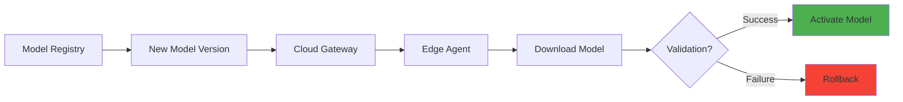

## Data Quality Flow

### Validation Pipeline

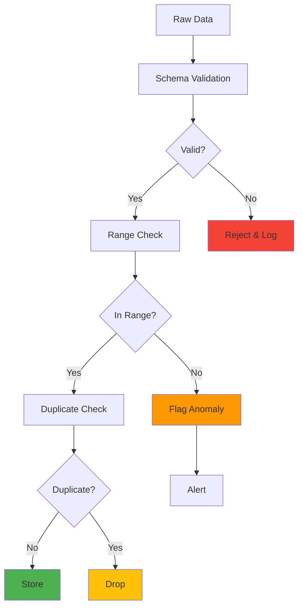

## Compliance Data Flow

### Audit Trail

```mermaid
graph LR
    A[User Action] --> B[Event Capture]
    B --> C[Audit Middleware]
    C --> D[Audit Log Table]
    D --> E[Compliance Report]
    D --> F[SIEM Integration]
    
    style C fill:#9C27B0
    style E fill:#4CAF50
```

### Data Subject Request (GDPR)

```mermaid
graph TB
    A[User Request] --> B[Identity Verification]
    B --> C{Request Type}
    C -->|Access| D[Data Retrieval]
    C -->|Deletion| E[Data Anonymization]
    C -->|Portability| F[Data Export]
    D --> G[Response to User]
    E --> G
    F --> G
    
    style E fill:#FF9800
    style G fill:#4CAF50
```

## Performance Metrics Flow

### Metrics Collection

```mermaid
graph LR
    A[Application] --> B[Prometheus Client]
    B --> C[Metrics Endpoint]
    C --> D[Prometheus Server]
    D --> E[Scrape Interval]
    E --> F[Time Series DB]
    F --> G[Grafana Dashboard]
    F --> H[Alertmanager]
    
    style B fill:#2196F3
    style G fill:#4CAF50
    style H fill:#FF9800
```

### Metric Types

- **Counter**: Monotonically increasing values (request count, error count)
- **Gauge**: Values that go up and down (memory usage, active connections)
- **Histogram**: Distribution of values (request latency)
- **Summary**: Similar to histogram with quantiles (response time)

---

**Document Version:** 1.1  
**Last Updated:** 2026-07-17  
**Component:** Data Flow Documentation
