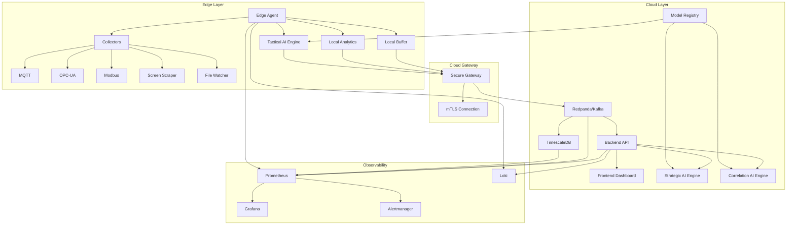
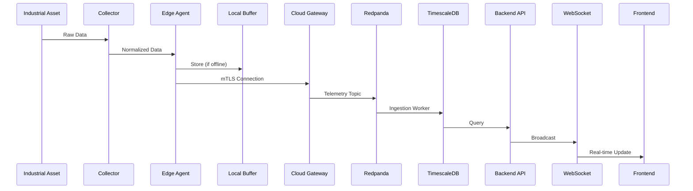
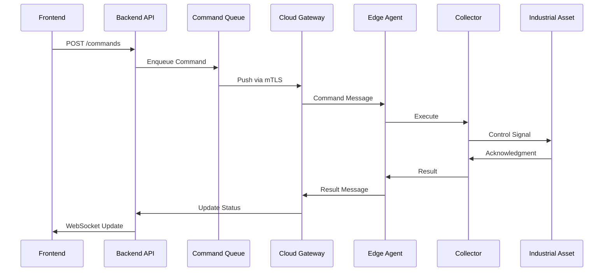
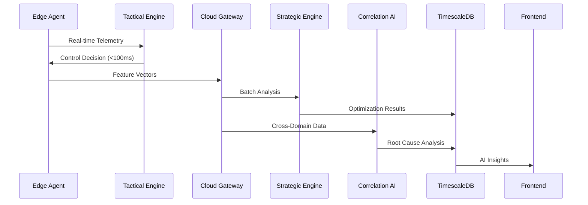
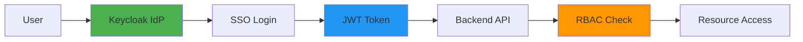
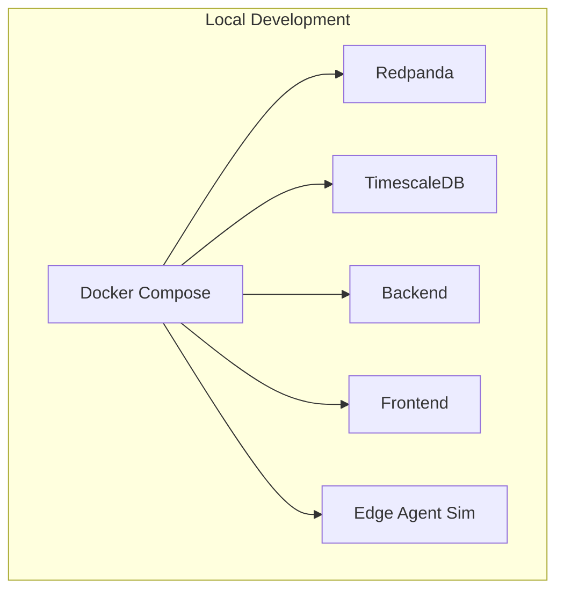
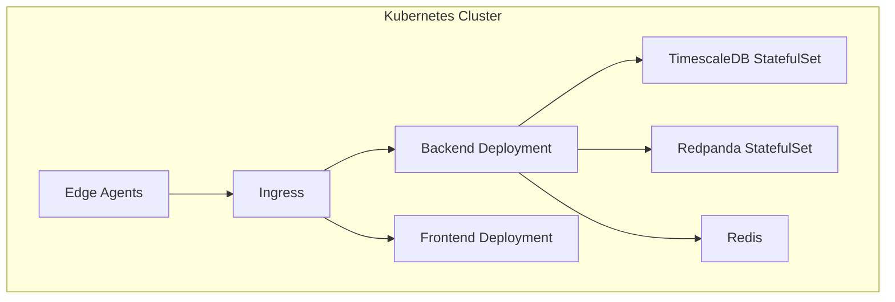
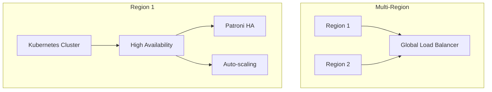

# OmniusGrid System Architecture

## Overview

OmniusGrid is a production-grade IIoT platform implementing a two-speed brain architecture: edge inference for tactical decisions (<100ms latency) and cloud training for strategic optimization (seconds to minutes latency).

## High-Level Architecture

## Component Details

### Edge Layer

#### Edge Agent
- **Purpose**: Coordinates collectors, buffering, and upstream communication
- **Technologies**: Python, asyncio, aiokafka, aiosqlite
- **Key Features**:
  - Multi-protocol data collection
  - Store-and-forward buffering (24h retention)
  - PackML state normalization
  - Local analytics and anomaly detection
  - Tactical AI inference (<100ms)

#### Collectors
- **MQTT**: Bambu 3D printers, generic IoT devices
- **OPC-UA**: Industrial PLCs, SCADA systems
- **Modbus**: Industrial sensors, actuators
- **Screen Scraper**: Legacy systems without APIs
- **File Watcher**: Log files, CSV exports
- **HTTP/REST**: Modern APIs (planned)
- **EtherNet/IP**: Rockwell Automation (planned)
- **Profinet**: Siemens automation (planned)
- **BACnet**: Building automation (planned)
- **CAN Bus**: Vehicle telematics (planned)

#### Local Analytics
- **OEE Calculation**: Real-time Overall Equipment Effectiveness
- **Anomaly Detection**: Statistical Z-score analysis
- **Trend Analysis**: Moving averages, rate of change
- **Local Alerting**: Rule-based triggers, edge response

### Cloud Gateway

#### Secure Gateway
- **Purpose**: Outbound-only mTLS connection from edge to cloud
- **Security**: Zero-trust networking, mutual TLS
- **Data Thinning**: Feature vectors and discrete events only
- **Fallback**: Store-and-forward during outages

### Cloud Layer

#### Message Broker (Redpanda)
- **Purpose**: Kafka-compatible streaming platform
- **Topics**: telemetry, commands, alarms, correlation
- **Features**: High throughput, low latency, durability

#### Database (TimescaleDB)
- **Purpose**: Time-series data storage with PostgreSQL compatibility
- **Features**: Hypertables, compression, continuous aggregates
- **Retention**: Hot (7 days), Warm (30 days), Cold (1 year)

#### Backend API (FastAPI)
- **Purpose**: RESTful API for all operations
- **Features**: JWT auth, WebSocket, rate limiting, audit logging
- **Endpoints**: Assets, telemetry, alarms, commands, OEE, Kanban, AI engines

#### Frontend Dashboard (React)
- **Purpose**: User interface for monitoring and control
- **Technologies**: React 18, TypeScript, Zustand, React Query, TailwindCSS
- **Features**: Real-time charts, asset management, Kanban boards, AI insights

#### AI Engines
- **Tactical Engine**: Edge deployment, real-time control
- **Strategic Engine**: Cloud deployment, optimization
- **Correlation AI Engine**: Cross-domain root cause analysis (Gemma 4)

#### Model Registry
- **Purpose**: Model versioning and deployment
- **Features**: Model validation, A/B testing, rollback
- **MLOps**: Automated training, deployment, monitoring

### Observability Stack

#### Prometheus
- **Purpose**: Metrics collection and storage
- **Scrape Targets**: All services, edge agents
- **Features**: Multi-dimensional data, query language (PromQL)

#### Grafana
- **Purpose**: Visualization and dashboards
- **Features**: Real-time dashboards, alerting, plugins
- **Data Sources**: Prometheus, Loki, TimescaleDB

#### Loki
- **Purpose**: Log aggregation
- **Features**: Log streaming, full-text search, labels
- **Integration**: Promtail log collector

#### Alertmanager
- **Purpose**: Alert routing and management
- **Features**: Alert grouping, silencing, routing
- **Integrations**: Slack, email, PagerDuty

## Data Flow

### Telemetry Flow

### Command Flow

### AI Inference Flow

## Security Architecture

### Authentication & Authorization

### Network Security

- **mTLS**: Mutual TLS for edge-cloud communication
- **Zero Trust**: No implicit trust, verify every request
- **Network Segmentation**: Separate zones for edge, cloud, observability
- **Firewall Rules**: Whitelist only necessary ports
- **Secrets Management**: HashiCorp Vault for secrets

### Data Security

- **Encryption at Rest**: All data encrypted (AES-256)
- **Encryption in Transit**: TLS 1.3 for all connections
- **Tenant Isolation**: Row-level security in database
- **Audit Logging**: All access logged and monitored
- **Data Residency**: Compliance-based data location

## Deployment Architecture

### Development

### Staging

### Production

## Scalability Architecture

### Horizontal Scaling

- **Backend**: Kubernetes HPA based on CPU/memory
- **Frontend**: CDN with edge caching
- **Edge Agents**: Auto-scaling based on asset count
- **Database**: Patroni for PostgreSQL HA

### Vertical Scaling

- **Tactical AI**: GPU acceleration for inference
- **Strategic AI**: Distributed training across GPUs
- **TimescaleDB**: Partitioning by time and organization

### Caching Strategy

- **Redis**: Session storage, query caching
- **CDN**: Static assets, frontend bundles
- **Browser**: Local storage for UI state
- **Edge**: Local analytics cache

## Disaster Recovery

### Backup Strategy

- **Database**: pgBackRest with incremental backups
- **Configuration**: Git version control
- **Models**: Model registry with versioning
- **Logs**: Loki with long-term storage

### Recovery Procedures

- **RTO**: 1 hour for critical systems
- **RPO**: 5 minutes for data loss
- **Failover**: Automatic for HA components
- **Drill**: Monthly disaster recovery tests

## Performance Architecture

### Latency Targets

- **Edge Inference**: <100ms
- **Cloud Inference**: <1s
- **API Response**: <200ms (p95)
- **WebSocket**: <50ms message delivery
- **Database Query**: <100ms (p95)

### Throughput Targets

- **Telemetry Ingestion**: 100k events/sec
- **Command Execution**: 1k commands/sec
- **API Requests**: 10k requests/sec
- **WebSocket Connections**: 10k concurrent

### Resource Allocation

- **Edge Agent**: 2 CPU, 4GB RAM
- **Backend Pod**: 1 CPU, 2GB RAM (scales to 10)
- **Frontend Pod**: 0.5 CPU, 1GB RAM (scales to 20)
- **Database**: 8 CPU, 32GB RAM (scales to 64)

## Monitoring Architecture

### Metrics

- **System Metrics**: CPU, memory, disk, network
- **Application Metrics**: Request rate, error rate, latency
- **Business Metrics**: OEE, asset uptime, anomaly count
- **AI Metrics**: Model accuracy, drift, latency

### Logging

- **Structured Logs**: JSON format with context
- **Log Levels**: DEBUG, INFO, WARNING, ERROR, CRITICAL
- **Correlation IDs**: Trace requests across services
- **Sensitive Data**: Redacted from logs

### Tracing

- **Distributed Tracing**: Jaeger/Tempo
- **Span Context**: Propagated across services
- **Performance Analysis**: Identify bottlenecks
- **Error Tracking**: Root cause analysis

## Compliance Architecture

### SOC 2

- **Security**: Access controls, encryption, monitoring
- **Availability**: HA, DR, monitoring
- **Processing Integrity**: Data validation, audit trails
- **Confidentiality**: Data classification, access controls
- **Privacy**: GDPR compliance, data subject rights

### GDPR

- **Data Mapping**: Inventory of personal data
- **Consent Management**: User consent tracking
- **Data Subject Rights**: Access, deletion, portability
- **Data Breach**: Notification procedures
- **DPIA**: Data protection impact assessments

### ISO 27001

- **ISMS**: Information security management system
- **Risk Management**: Risk assessment and treatment
- **Asset Management**: Asset inventory and classification
- **Access Control**: Role-based access control
- **Compliance**: Regular audits and assessments

## Technology Stack Summary

| Layer | Technology | Purpose |
|-------|-----------|---------|
| Edge | Python, asyncio | Edge agent runtime |
| Collectors | paho-mqtt, pymodbus, opcua | Protocol support |
| Database | TimescaleDB | Time-series storage |
| Message Broker | Redpanda | Streaming platform |
| Backend | FastAPI, SQLAlchemy | REST API |
| Frontend | React, TypeScript, Zustand | User interface |
| Charts | Recharts, Plotly.js | Data visualization |
| Auth | Keycloak, JWT | Identity management |
| Monitoring | Prometheus, Grafana, Loki | Observability |
| Infrastructure | Kubernetes, Docker | Container orchestration |
| CI/CD | GitHub Actions | Automation |
| Secrets | HashiCorp Vault | Secret management |
| AI | PyTorch, Gemma 4 | Machine learning |

---

**Document Version:** 1.0  
**Last Updated:** 2026-05-25  
**Component:** System Architecture
