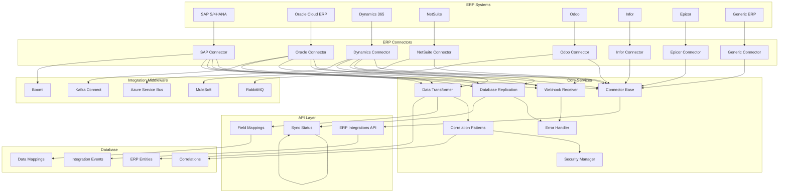
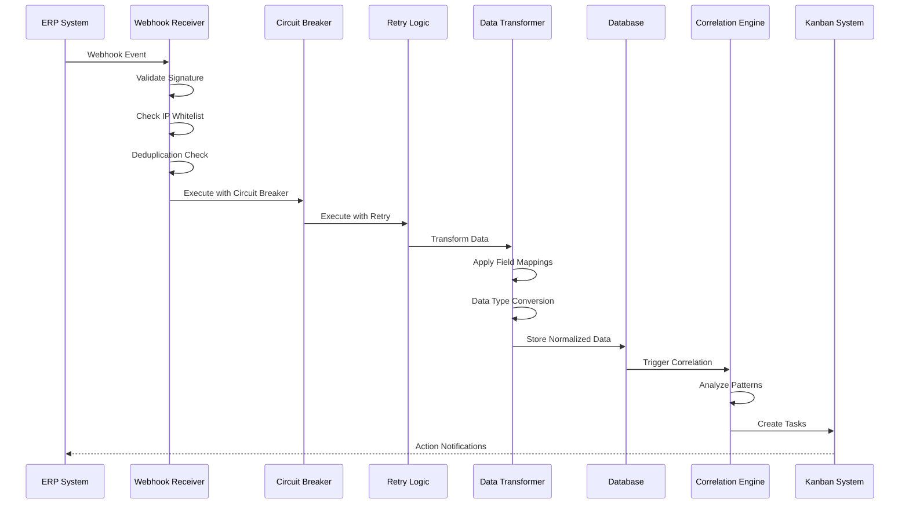

# ERP integration — architecture and reference

The platform-level reference for the ERP slice: the eight supported vendors, the middleware
between them, the endpoints, and how ERP data is correlated with operational data.

**Moved out of `README.md` on 2026-08-02.** It sat 1,000 lines below a section with almost
the same name (*"ERP integrations — 8 connectors, and how to work on them"*), so the README
answered the same question twice, in two places, at two levels of detail.

The split now is by QUESTION rather than by topic:

| You want to | Read |
|---|---|
| work on a connector today, without credentials | [`docs/erp/README.md`](README.md) |
| know what the platform supports and how it is wired | this file |
| set up a specific vendor's sandbox | [`dynamics-dataverse-setup.md`](dynamics-dataverse-setup.md), [`webhooks-vendor-setup.md`](webhooks-vendor-setup.md) |
| validate a connector with no ERP at all | [`validating-connectors-without-an-erp.md`](validating-connectors-without-an-erp.md) |

---

OmniusGrid provides comprehensive ERP integration capabilities, enabling seamless data flow between manufacturing operations and enterprise resource planning systems. The integration framework supports 8 major ERP platforms with real-time event processing, data transformation, and correlation with operational data.

### Supported ERP Platforms

| ERP Platform | API/Protocol | Key Entities | Authentication |
|--------------|--------------|--------------|----------------|
| **SAP** | S/4HANA OData API | Purchase Orders, Manufacturing Orders, Inventory, Vendors, Work Orders | OAuth2 |
| **Oracle** | Fusion Cloud REST API | Invoices, Shipments, Employees, Projects | OAuth2 |
| **Dynamics 365** | Dataverse API & Graph API | Invoices, Payments, Products, Sales Orders, Accounts, Projects | Azure AD (MSAL) |
| **NetSuite** | SuiteTalk REST API | Sales Orders, Inventory, Customers, Vendors | OAuth2 / Token |
| **Odoo** | REST API | Products, Partners, Sales Orders, Purchase Orders | API Key / OAuth2 |
| **Infor** | ION API | Purchase Orders, Invoices, Inventory | OAuth2 |
| **Epicor** | REST API | Jobs, Parts, Customers, Vendors | OAuth2 |
| **Generic** | Custom REST/SOAP | Custom entities | Configurable |

### ERP Integration Architecture

### Data Flow Architecture

### Core Infrastructure

**Base Framework** (`backend/app/services/erp_connector_base.py`)
- Abstract base class for all ERP connectors
- Authentication handling (OAuth2, API keys, certificates, basic auth)
- Rate limiting and retry logic with exponential backoff
- Circuit breaker pattern for fault tolerance
- Configuration validation
- Audit logging

**API Layer** (`backend/app/api/erp_integrations.py`)
- REST API endpoints for ERP integration management
- CRUD operations for integration configurations
- Field mapping management
- Sync status tracking
- Connection testing and manual sync triggers

**Database Schema** (`database/migrations/020_erp_integration_tables.sql`)
- `erp_integration_events` - Event tracking with deduplication
- `erp_data_mappings` - Field mapping configuration
- `erp_sync_status` - Sync status tracking
- `erp_entities` - Normalized ERP data storage
- `erp_correlations` - Correlation records
- Row-level security for multi-tenant isolation

### Core Services

**Webhook Receiver** (`erp_webhook_receiver.py`)
- HMAC signature verification
- IP whitelisting
- Timestamp validation (replay attack prevention)
- Event deduplication
- Event processor registration
- Webhook replay capability

**Database Replication** (`erp_database_replication.py`)
- Change Data Capture (CDC) integration
- Real-time replication of ERP tables
- Conflict resolution and deduplication
- Replication lag monitoring
- Soft delete handling

**Correlation Patterns** (`erp_correlation_patterns.py`)
- Purchase order anomaly detection
- Manufacturing order correlation with production data
- Supply chain risk analysis
- Defense manufacturing correlation (inventory + badge access)
- Smart factory correlation (defect rates + sensor anomalies)
- Registry item creation for operational domains

**Data Transformer** (`erp_data_transformer.py`)
- Field mapping engine
- Data type conversion
- SAP transformations (PO, MO, inventory, vendor, work order)
- Oracle transformations (invoice, shipment, employee, project)
- Dynamics transformations (invoice, payment, product, sales order, account, project)
- Status and priority mapping
- Data quality validation

**Error Handler** (`erp_error_handler.py`)
- Error categorization (transient vs permanent)
- Exponential backoff retry logic
- Dead letter queue for permanently failed events
- Alerting for permanent failures
- Dead letter queue management (retry, purge)

**Security Manager** (`erp_security.py`)
- Field-level encryption for sensitive fields
- Data masking in logs
- Audit logging for all ERP data access
- API key scoping for ERP operations
- Multi-tenant data isolation
- Data governance (classification, retention policies)

### ERP Connectors

**SAP Connector** (`sap_connector.py`)
- SAP S/4HANA OData API integration
- OAuth2 authentication
- Batch request handling
- Delta token support for incremental updates
- Event Mesh subscription for real-time events
- Entities: Purchase Orders, Manufacturing Orders, Inventory, Vendors, Work Orders

**Oracle Connector** (`oracle_connector.py`)
- Oracle Fusion Cloud REST API integration
- OAuth2 authentication
- Bulk data import support
- Webhook event subscriptions
- Entities: Invoices, Shipments, Employees, Projects

**Dynamics Connector** (`dynamics_connector.py`)
- Microsoft Dynamics 365 Dataverse API and Graph API
- Azure AD authentication with MSAL
- Power Automate webhook integration
- Entities: Invoices, Payments, Products, Sales Orders, Accounts, Contacts, Opportunities, Projects, Tasks

**Additional Connectors**
- `netsuite_connector.py` + `netsuite_auth.py` - NetSuite integration (TBA auth is separate)
- `odoo_connector.py` - Odoo integration (JSON-RPC)
- `epicor_connector.py` - Epicor integration
- `infor_connector.py` - Infor integration
- `intuit_connector.py` + `intuit_qbo.py` - Intuit QuickBooks, the eighth connector
- `oauth2.py` - the shared OAuth2 / refresh-rotation machinery these depend on

**Data Extraction & Correlation**
- `sap_data_extraction.py` - SAP-specific data extraction logic
- `sap_batch.py` - SAP OData `$batch` request assembly
- `oracle_data_extraction.py` - Oracle-specific data extraction logic
- `dynamics_data_extraction.py` - Dynamics-specific data extraction logic
- `oracle_correlation_patterns.py` - Oracle-specific correlation patterns
- `dynamics_correlation_patterns.py` - Dynamics-specific correlation patterns
- `sap_webhook_integration.py` - SAP-specific webhook handling

There is **no sap_correlation_patterns.py**. This listing claimed one for years; SAP
correlation runs through the generic `app/services/erp_correlation_patterns.py`, and the
per-vendor pattern modules exist only for Oracle and Dynamics.

### ERP Middleware

**Boomi Integration** (`boomi_integration.py`)
- Dell Boomi AtomSphere API integration
- Process deployment and management
- Process execution and monitoring
- Connector configuration
- Execution logs retrieval

**Kafka Connect Integration** (`kafka_connect_integration.py`)
- Kafka Connect source/sink connectors
- Real-time data streaming from ERP systems
- Schema registry integration
- Connector lifecycle management (create, delete, restart, pause, resume)

**Azure Service Bus Integration** (`azure_service_bus_integration.py`)
- Azure Service Bus queues and topics
- Message publishing and consumption
- Event-driven architecture support

**MuleSoft Integration** (`mulesoft_integration.py`)
- MuleSoft Anypoint Platform integration
- API management and orchestration

**RabbitMQ Integration** (`rabbitmq_integration.py`)
- RabbitMQ message broker integration
- Queue-based event processing

### ERP Integration API Endpoints

| Method | Endpoint | Description |
|--------|----------|-------------|
| POST | `/api/v1/erp/integrations` | Create ERP integration |
| GET | `/api/v1/erp/integrations` | List all ERP integrations |
| GET | `/api/v1/erp/integrations/{id}` | Get integration details |
| PUT | `/api/v1/erp/integrations/{id}` | Update integration |
| DELETE | `/api/v1/erp/integrations/{id}` | Delete integration |
| POST | `/api/v1/erp/integrations/{id}/test` | Test connection to ERP |
| POST | `/api/v1/erp/integrations/{id}/sync` | Trigger manual sync |
| GET | `/api/v1/erp/integrations/{id}/sync-status` | Get sync status |
| POST | `/api/v1/erp/integrations/{id}/mappings` | Create field mapping |
| GET | `/api/v1/erp/integrations/{id}/mappings` | List field mappings |
| PUT | `/api/v1/erp/integrations/{id}/mappings/{mapping_id}` | Update field mapping |
| DELETE | `/api/v1/erp/integrations/{id}/mappings/{mapping_id}` | Delete field mapping |

### Authentication Types

- **OAuth2** - Standard OAuth2 flow with client credentials
- **API Key** - API key-based authentication
- **Certificate** - Mutual TLS certificate authentication
- **Basic Auth** - Username/password authentication
- **Token** - Custom token-based authentication

### Key Features

- **Multi-tenant isolation** with row-level security
- **Real-time event processing** via webhooks and CDC
- **Data transformation** with field mappings
- **Correlation engine** for ERP + operational data
- **Comprehensive error handling** with retry logic
- **Security** with encryption, masking, and audit logging
- **Scalability** with rate limiting and circuit breakers
- **Middleware integration** for enterprise service buses

### ERP Correlation with Operational Data

The ERP integration system correlates ERP data with operational telemetry to provide comprehensive insights:

**Procurement Correlations**
- Purchase order delays vs production schedules
- Vendor performance vs quality metrics
- Material shortages vs inventory levels

**Manufacturing Correlations**
- Manufacturing orders vs production OEE
- Work orders vs maintenance schedules
- Material availability vs production throughput

**Financial Correlations**
- Invoice processing vs payment cycles
- Cost variances vs operational efficiency
- Budget utilization vs resource allocation

**Supply Chain Correlations**
- Shipment tracking vs logistics metrics
- Supplier performance vs delivery reliability
- Inventory levels vs demand forecasts

### Security & Compliance

**Data Protection**
- Field-level encryption for sensitive fields (credit cards, SSN, bank accounts)
- Data masking in logs and audit trails
- API key scoping for granular access control

**Audit Trail**
- All ERP data access logged to audit table
- User attribution for all operations
- IP address tracking
- Timestamp-based audit queries

**Multi-Tenant Isolation**
- Row-level security policies on all ERP tables
- Organization-based data segregation
- User context injection in all queries

**Data Governance**
- Data classification (public, internal, confidential, restricted)
- Retention policy enforcement
- Privacy compliance (GDPR, CCPA)

---

